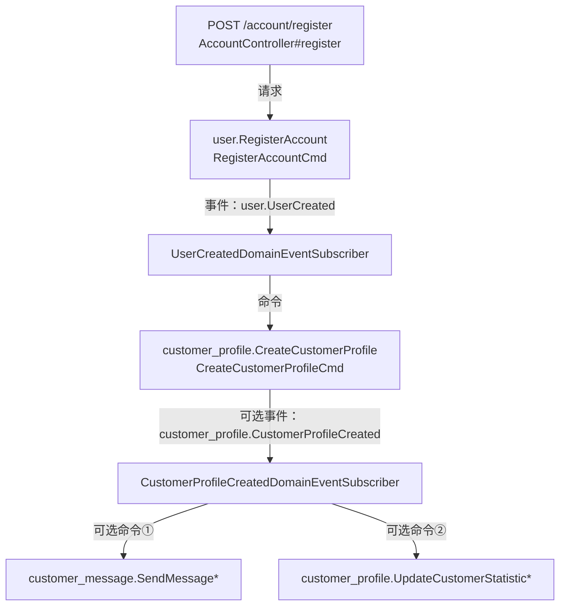

# Account Registration Flow

- 请求：`POST /account/register`
  - 控制器：`adapter.portal.api.AccountController#register`
  - 入口校验：`CaptchaValid` 分布式请求（`CaptchaValid.Request(id, input)`）
  - 唯一性校验：
    - `@UniqueUserEmail` ✅ → `user.CheckEmailExists`
    - `@UniqueNickname` ❌（缺失，需补充昵称唯一性校验）

- 命令：`user.RegisterAccount`
  - Handler：`RegisterAccountCmd`
  - 聚合：`UserFactory.Payload` → `User`
  - 单元工作：`Mediator.uow.save()` 持久化聚合根
  - 结果：触发 `user.UserCreated` 领域事件

- 事件：`user.UserCreated`
  - 发布：`User.onCreate`
  - 订阅：`UserCreatedDomainEventSubscriber`
  - 后续命令：`customer_profile.CreateCustomerProfile`（传递 `userid`, `nickName`, `email`）

- 命令：`customer_profile.CreateCustomerProfile`
  - Handler：`CreateCustomerProfileCmd`
  - 聚合：`CustomerProfileFactory.Payload` → `CustomerProfile`
  - 建议：在 `CustomerProfile` 创建时发布 `customer_profile.CustomerProfileCreated`，用于后续扩展（欢迎消息、统计初始化等）

- 事件（可选扩展）：`customer_profile.CustomerProfileCreated`
  - 发布：待在 `CustomerProfile` 聚合中增加
  - 订阅建议：
    1. `customer_message.SendMessage` 推送欢迎消息
    2. `customer_profile.UpdateCustomerStatistic` 初始化统计
    3. 其他上下游命令视需求补充

## 完整流程图（请求 → 命令 → 事件 → 命令）

> 带 `*` 的命令表示目前设计中已有定义，但具体订阅逻辑尚待实现。
