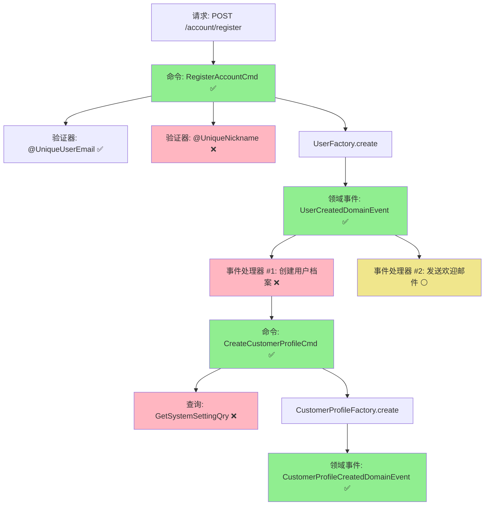

# DDD 事件驱动需求文档编写指南

> 从 easylive-java 传统三层架构需求到 DDD 事件驱动模式设计的完整流程

## 📌 文档编写流程

### 第一步：深度分析 easylive-java 已有需求实现

#### 1.1 从请求入口开始分析

**分析路径**：`Controller → Service → Mapper → AOP切面`

**关注要点**：
- ✅ **Controller 层**
  - 请求路径和 HTTP 方法
  - 请求参数（必填/可选、验证注解）
  - 响应结构
  - 异常处理

- ✅ **Service 层**
  - 业务逻辑流程
  - 数据校验规则（邮箱唯一性、昵称唯一性等）
  - 外部依赖调用（Redis、其他 Service）
  - 事务边界（`@Transactional`）

- ✅ **Mapper 层**
  - 数据库表结构
  - 聚合根边界识别
  - 关联查询分析

- ✅ **AOP 切面**
  - 全局拦截器（如 `@GlobalInterceptor`）
  - 权限校验
  - 日志记录

**分析工具**：
```bash
# 搜索相关文件
find easylive-java -name "*Controller.java"
find easylive-java -name "*Service*.java"

# 查看具体实现
cat easylive-java/.../AccountController.java
cat easylive-java/.../UserInfoServiceImpl.java
```

---

### 第二步：分析 only-danmuku design 中已有的命令/事件设计

#### 2.1 检查聚合设计文件

**检查路径**：
```
design/aggregate/
├── user/_gen.json                    # User 聚合的命令/事件/查询
├── customer_profile/_gen.json        # CustomerProfile 聚合
├── video/_gen.json                   # Video 聚合
└── ... (其他聚合)
```

**检查内容**：
- ✅ 已定义的命令 (`cmd` 节点)
- ✅ 已定义的领域事件 (`de` 节点)
- ✅ 已定义的查询 (`qry` 节点)

**示例命令**：
```bash
# 查看 User 聚合设计
cat design/aggregate/user/_gen.json | jq '.cmd'
cat design/aggregate/user/_gen.json | jq '.de'
cat design/aggregate/user/_gen.json | jq '.qry'
```

#### 2.2 检查 extra 扩展设计

**检查路径**：
```
design/extra/
├── account_user_count_gen.json       # 额外查询
├── admin_interact_gen.json
└── ... (其他扩展)
```

---

### 第三步：将传统三层架构解析为 DDD 事件驱动模式

#### 3.1 识别聚合根和聚合边界

| 传统实体 | DDD 聚合根 | 职责边界 |
|---------|-----------|---------|
| `UserInfo` | `User` + `CustomerProfile` | User: 认证信息<br>CustomerProfile: 档案和统计 |
| `VideoInfo` | `Video` + `VideoFile` | Video: 元数据<br>VideoFile: 文件信息 |
| `VideoComment` | `VideoComment` | 评论聚合根 |

#### 3.2 提取业务流程中的命令

**规则**：
- 写操作 → 命令 (Command)
- 读操作 → 查询 (Query)

**示例**：
```java
// Service 层代码
userInfoService.register(email, nickName, password);
```
↓ 转换为
```kotlin
// DDD 命令
Mediator.commands.send(
    RegisterAccountCmd.Request(email, nickName, password)
)
```

#### 3.3 识别领域事件

**识别时机**：
- 聚合根状态发生重要变化时
- 需要触发后续业务流程时
- 需要记录审计日志时

**示例**：
```java
// 传统代码：直接在 Service 中创建用户档案
userInfo = new UserInfo();
userInfo.setTotalCoinCount(10);
userInfoMapper.insert(userInfo);
```
↓ 转换为
```kotlin
// DDD 事件驱动
User.onCreate() → 发布 UserCreatedDomainEvent
  → UserCreatedDomainEventHandler 监听
    → 发送 CreateCustomerProfileCmd
      → 创建 CustomerProfile 聚合根
```

#### 3.4 绘制事件流图

**格式要求**：
1. **ASCII 流程图**（用于文本查看）
2. **Mermaid 流程图**（用于渲染可视化）

---

### 第四步：整理完整流程文档

#### 4.1 文档结构模板（精简版）

```markdown
# {功能名称}流程设计文档

> 基于 easylive-java 项目需求，按照 DDD 事件驱动模式设计

## 📋 业务需求概述
{1-2 句话简要描述业务场景}

---

## 📊 完整流程图

### ASCII 流程图
\```
{ASCII 格式的流程图}
\```

### Mermaid 流程图
\```mermaid
{Mermaid 代码}
\```

**图例说明**：
- 🔵 蓝色：请求入口
- 🟢 绿色：已存在的设计（✅ 可直接使用）
- 🔴 红色：缺失的设计（❌ 需实现）
- 🟡 黄色：可选扩展（⚪）

---

## 📦 设计元素清单

### ✅ 已存在的设计

#### 命令 (Commands)
| 命令 | 描述 | 状态 | 位置 |
|------|------|------|------|
| ... | ... | ✅ | `design/aggregate/.../` |

#### 领域事件 (Domain Events)
| 事件 | 描述 | 触发时机 | 状态 | 位置 |
|------|------|----------|------|------|
| ... | ... | ... | ✅ | `design/aggregate/.../` |

#### 查询 (Queries)
| 查询 | 描述 | 状态 | 位置 |
|------|------|------|------|
| ... | ... | ✅ | `design/aggregate/.../` |

---

### ❌ 缺失的设计清单

#### 需要补充的命令
| 序号 | 命令名称 | 描述 | 建议位置 | 优先级 |
|-----|---------|------|----------|-------|
| 1 | ... | ... | `design/extra/xxx_gen.json` | P0 |

#### 需要补充的领域事件
| 序号 | 事件名称 | 描述 | 触发时机 | 建议位置 | 优先级 |
|-----|---------|------|----------|----------|-------|
| 1 | ... | ... | ... | `design/extra/xxx_gen.json` | P0 |

#### 需要补充的查询
| 序号 | 查询名称 | 描述 | 返回值 | 建议位置 | 优先级 |
|-----|---------|------|--------|----------|-------|
| 1 | ... | ... | ... | `design/extra/xxx_gen.json` | P0 |

#### 需要补充的验证器
| 序号 | 验证器名称 | 描述 | 依赖查询 | 实现路径 | 优先级 |
|-----|-----------|------|----------|----------|-------|
| 1 | ... | ... | ... | `application/.../validater/` | P0 |

#### 需要补充的事件处理器
| 序号 | 处理器名称 | 监听事件 | 触发命令 | 实现路径 | 优先级 |
|-----|-----------|----------|----------|----------|-------|
| 1 | ... | ... | ... | `adapter/.../events/` | P0 |

**优先级说明**：
- **P0**：核心功能，必须实现
- **P1**：重要功能，建议实现
- **P2**：可选功能，后续扩展

---

**文档版本**：v1.0
**创建时间**：{日期}
**维护者**：开发团队
```

**说明**：
- ✅ **保留**：业务概述、完整流程图（两种格式）、设计元素清单、缺失设计清单
- ❌ **移除**：实现步骤、测试用例、验收标准（减少工作量和 token 使用）
- 📝 **重点**：完整流程图 + 缺失设计清单

#### 4.2 完整流程图格式

##### 格式 1：ASCII 流程图

```
┌─────────────────────────────────────────────────┐
│ 请求：POST /account/register                     │
│ Payload: { email, nickName, password }          │
└────────────────────┬────────────────────────────┘
                     ↓
┌─────────────────────────────────────────────────┐
│ 命令：RegisterAccountCmd ✅                      │
│ ├─ 验证器：@UniqueUserEmail ✅                   ���
│ ├─ 验证器：@UniqueNickname ❌                    │
│ └─ UserFactory.create()                         │
└────────────────────┬────────────────────────────┘
                     ↓
┌─────────────────────────────────────────────────┐
│ 领域事件：UserCreatedDomainEvent ✅              │
│ { userId, email, nickName }                     │
└────────────────────┬────────────────────────────┘
                     ↓
        ┌────────────┴────────────┐
        ↓                         ↓
┌──────────────────┐    ┌──────────────────┐
│ 事件处理器 #1    │    │ 事件处理器 #2    │
│ 创建用户档案      │    │ 发送欢迎邮件      │
└──────┬───────────┘    └──────────────────┘
       ↓
┌─────────────────────────────────────────────────┐
│ 命令：CreateCustomerProfileCmd ✅                │
│ ├─ 查询系统设置 GetSystemSettingQry ❌           │
│ └─ CustomerProfileFactory.create()             │
└────────────────────┬────────────────────────────┘
                     ↓
┌─────────────────────────────────────────────────┐
│ 领域事件：CustomerProfileCreatedDomainEvent ✅   │
└─────────────────────────────────────────────────┘
```

##### 格式 2：Mermaid 流程图



**图例说明**：
- 🟢 绿色：已存在的设计（✅）
- 🔴 粉色：缺失的设计（❌）
- 🟡 黄色：可选扩展（⚪）

---

#### 4.3 缺失设计补充清单模板

```markdown
## ❌ 缺失的设计清单

### 需要补充的命令 (Commands)

| 序号 | 命令名称 | 描述 | 建议位置 | 优先级 |
|-----|---------|------|----------|-------|
| 1   | `XxxCmd` | 描述 | `design/extra/xxx_gen.json` | P0 |

### 需要补充的领域事件 (Domain Events)

| 序号 | 事件名称 | 描述 | 触发时机 | 建议位置 | 优先级 |
|-----|---------|------|----------|----------|-------|
| 1   | `XxxDomainEvent` | 描述 | 时机 | `design/extra/xxx_gen.json` | P0 |

### 需要补充的查询 (Queries)

| 序号 | 查询名称 | 描述 | 返回值 | 建议位置 | 优先级 |
|-----|---------|------|--------|----------|-------|
| 1   | `GetXxxQry` | 描述 | 类型 | `design/extra/xxx_gen.json` | P0 |

### 需要补充的验证器 (Validators)

| 序号 | 验证器名称 | 描述 | 依赖查询 | 实现路径 | 优先级 |
|-----|-----------|------|----------|----------|-------|
| 1   | `@XxxValidator` | 描述 | `XxxQry` | `application/.../validater/` | P0 |

### 需要补充的事件处理器 (Event Handlers)

| 序号 | 处理器名称 | 监听事件 | 触发命令 | 实现路径 | 优先级 |
|-----|-----------|----------|----------|----------|-------|
| 1   | `XxxEventHandler` | `XxxEvent` | `XxxCmd` | `adapter/.../events/` | P0 |

### 优先级说明
- **P0**：核心功能，必须实现
- **P1**：重要功能，建议实现
- **P2**：可选功能，后续扩展
```

---

## 📁 文档输出规范

### 文件命名规范

```
design/requirements/
├── {功能模块}_{操作}_flow.md        # 主流程文档
├── {功能模块}_{操作}_missing.json   # 缺失设计的 JSON 定义（可选）
└── README.md                         # 本指南文档
```

**示例**：
```
design/requirements/
├── user_register_flow.md             # 用户���册流程
├── user_login_flow.md                # 用户登录流程
├── video_upload_flow.md              # 视频上传流程
└── README.md
```

---

## 🔧 工具和命令

### 分析 easylive-java 项目

```bash
# 1. 搜索控制器
find easylive-java -name "*Controller.java" | grep -v test

# 2. 搜索服务实现
find easylive-java -name "*ServiceImpl.java"

# 3. 搜索特定功能
grep -r "register" easylive-java/easylive-web/src/main/java

# 4. 查看数据库表结构
cat easylive-java/.../UserInfo.java
```

### 分析 only-danmuku design

```bash
# 1. 查看所有聚合
ls design/aggregate/

# 2. 查看特定聚合的设计
cat design/aggregate/user/_gen.json | jq '.'

# 3. 提取所有命令
cat design/aggregate/user/_gen.json | jq '.cmd[].name'

# 4. 提取所有事件
cat design/aggregate/user/_gen.json | jq '.de[].name'

# 5. 提取所有查询
cat design/aggregate/user/_gen.json | jq '.qry[].name'
```

### 生成代码

```bash
# 1. 运行代码生成
./gradlew codegen

# 2. 生成 Jimmer DTO
./gradlew :only-danmuku-application:kspKotlin

# 3. 完整构建
./gradlew build
```

---

## ✅ 检查清单

### 需求分析阶段
- [ ] Controller 层的请求��径和参数已分析
- [ ] Service 层的业务逻辑已梳理
- [ ] Mapper 层的数据库表结构已理解
- [ ] AOP 切面的拦截逻辑已了解

### 设计映射阶段
- [ ] 已检查 design/aggregate/ 中的相关聚合
- [ ] 已检查 design/extra/ 中的扩展定义
- [ ] 已识别缺失的命令、事件、查询
- [ ] 已完成传统架构到 DDD 的映射

### 文档编写阶段
- [ ] 业务需求概述已编写
- [ ] ASCII 流程图已绘制
- [ ] Mermaid 流程图已编写
- [ ] 设计元素清单已整理
- [ ] 缺失设计清单已列出（重点）
- [ ] 实现步骤已编写
- [ ] 测试用例已提供
- [ ] 验收标准已定义

### 文档质量检查
- [ ] 业务需求概述已编写（1-2 句话）
- [ ] ASCII 流程图已绘制（重点）
- [ ] Mermaid 流程图已编写（重点）
- [ ] 已存在设计清单已整理
- [ ] 缺失设计清单已列出（重点）
- [ ] 缺失设计有明确优先级（重点）
- [ ] 状态标记正确（✅ ❌ ⚪）
- [ ] 文件路径引用准确
- [ ] Markdown 格式正确

---

## 📚 参考资料

### 📝 模板文件
- [\_TEMPLATE.md](./_TEMPLATE.md) - 精简版需求文档模板（复制使用）

### 📋 完整示例
- [user_register_flow.md](./user_register_flow.md) - 用户注册流程（包含完整的流程图和缺失设计清单）

### 🚀 快速开始

1. **复制模板**
   ```bash
   cp design/requirements/_TEMPLATE.md design/requirements/{功能}_flow.md
   ```

2. **填充内容**
   - 业务需求概述（1-2 句话）
   - ASCII 流程图
   - Mermaid 流程图
   - 已存在设计清单
   - 缺失设计清单（重点）

3. **生成缺失设计**
   ```bash
   # 在 design/extra/ 新增 JSON 文件
   # 运行代码生成
   ./gradlew codegen
   ```

---

## 🎯 文档核心价值

根据需求，文档的**核心价值**是：

### ✅ **1. 完整流程图**（两种格式）

- **ASCII 流程图**：文本友好，适合代码审查和文档查看
- **Mermaid 流程图**：可视化渲染，适合团队分享和演示

### ✅ **2. 缺失设计清单**

清晰列出需要补充的：
- 命令 (Commands)
- 领域事件 (Domain Events)
- 查询 (Queries)
- 验证器 (Validators)
- 事件处理器 (Event Handlers)

每项都有**优先级**和**建议位置**，方便后续实现。

---

**文档版本**：v1.0
**创建时间**：2025-10-22
**维护者**：开发团队
