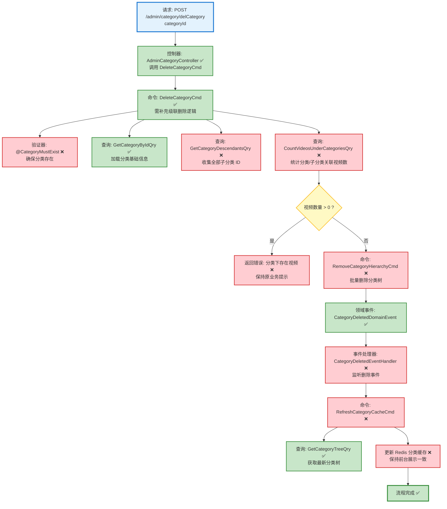

# 分类删除流程设计文档

> 基于 easylive-java 项目需求，按照 DDD 事件驱动模式设计

## 📋 业务需求概述
管理员删除视频分类时，需要先确认该分类及其子分类未绑定任何视频，执行级联删除，并刷新分类缓存以保证前台展示一致。

---

## 📊 完整流程图

### ASCII 流程图
```
┌──────────────────────────────────────────────────────────┐
│ 请求：POST /admin/category/delCategory                    │
│ Payload: { "categoryId": 102 }                           │
└────────────────────────────┬─────────────────────────────┘
                             ↓
┌──────────────────────────────────────────────────────────┐
│ 控制器：AdminCategoryController#delCategory ✅            │
│ Mediator.commands.send(DeleteCategoryCmd)                │
└────────────────────────────┬─────────────────────────────┘
                             ↓
┌──────────────────────────────────────────────────────────┐
│ 命令：DeleteCategoryCmd ✅（需补充级联逻辑）               │
│ 1. 分类存在性检查 @CategoryMustExist ❌（依赖 GetCategoryByIdQry ⚪） │
│ 2. 收集全部子分类 ID GetCategoryDescendantsQry ❌        │
│ 3. 统计分类/子分类关联视频 CountVideosUnderCategories ❌ │
│    ├─ 有视频 → 抛 KnownException 并返回错误              │
│    └─ 无视频 → 继续                                      │
│ 4. 执行级联删除分类树 RemoveCategoryHierarchy ❌         │
│ 5. 发布 CategoryDeletedDomainEvent ✅                    │
└────────────────────────────┬─────────────────────────────┘
                             ↓
┌──────────────────────────────────────────────────────────┐
│ 领域事件：CategoryDeletedDomainEvent ✅                   │
└────────────────────────────┬─────────────────────────────┘
                             ↓
┌──────────────────────────────────────────────────────────┐
│ 事件处理器：CategoryDeletedEventHandler ❌                │
│ → 命令：RefreshCategoryCacheCmd ❌                        │
│    刷新 Redis 分类树缓存                                 │
└──────────────────────────────────────────────────────────┘
```

### 场景 #1：分类可安全删除
```
DeleteCategoryCmd 请求
    ├─ GetCategoryDescendantsQry ❌ → 收集全部子分类 ID
    ├─ CountVideosUnderCategoriesQry ❌ → 返回 0 → 允许删除
    └─ RemoveCategoryHierarchyCmd ❌ → 递归删除分类树
          ↳ 发布 CategoryDeletedDomainEvent ✅ → 刷新缓存
```

### 场景 #2：存在关联视频
```
DeleteCategoryCmd 请求
    ├─ CountVideosUnderCategoriesQry ❌ → 返回 >0
    └─ 抛出 KnownException("分类下有视频信息，无法删除") → 终止流程
```

### 场景 #3：分类不存在
```
DeleteCategoryCmd 请求
    ├─ @CategoryMustExist ❌ / GetCategoryByIdQry ⚪ → 未找到分类
    └─ 抛出 KnownException("分类不存在") → 控制器返回错误
```

### Mermaid 流程图


**图例说明**：
- 🔵 蓝色：请求入口
- 🟢 绿色：已存在的设计（✅ 可直接使用）
- 🔴 红色：缺失的设计（❌ 需实现）
- 🟡 黄色：条件判断 / 可选分支（⚪）

---

## 📦 设计元素清单

### ✅ 已存在的设计

#### 命令 (Commands)
| 命令 | 描述 | 状态 | 位置 |
|------|------|------|------|
| `DeleteCategoryCmd` | 删除分类；当前仅阻止直接子分类/视频，缺少级联逻辑 | ✅ 已定义 | `only-danmuku/only-danmuku-application/src/main/kotlin/edu/only4/danmuku/application/commands/category/DeleteCategoryCmd.kt:18` |

#### 领域事件 (Domain Events)
| 事件 | 描述 | 触发时机 | 状态 | 位置 |
|------|------|----------|------|------|
| `CategoryDeletedDomainEvent` | 分类删除后发布事件，供缓存刷新使用 | ✅ 已定义 | `only-danmuku/only-danmuku-domain/src/main/kotlin/edu/only4/danmuku/domain/aggregates/category/events/CategoryDeletedDomainEvent.kt:19` |

#### 查询 (Queries)
| 查询 | 描述 | 状态 | 位置 |
|------|------|------|------|
| `GetCategoryTreeQry` | 获取整棵分类树（用于缓存刷新） | ✅ 已定义 | `only-danmuku/only-danmuku-application/src/main/kotlin/edu/only4/danmuku/application/queries/category/GetCategoryTreeQry.kt:12` |
| `GetCategoryByIdQry` | 根据 ID 获取分类；当前为空载荷 | ⚪ 待完善 | `only-danmuku/only-danmuku-application/src/main/kotlin/edu/only4/danmuku/application/queries/category/GetCategoryByIdQry.kt:12` |
| `GetSubCategoriesQry` | 生成文件但缺少参数/返回，无法直接使用 | ⚪ 待完善 | `only-danmuku/only-danmuku-application/src/main/kotlin/edu/only4/danmuku/application/queries/category/GetSubCategoriesQry.kt:12` |
| `GetVideosByCategoryQry` | 按分类拉取视频列表，缺少统计能力 | ⚪ 待完善 | `only-danmuku/only-danmuku-application/src/main/kotlin/edu/only4/danmuku/application/queries/video/GetVideosByCategoryQry.kt:12` |

---

## ❌ 缺失的设计清单

### 需要补充的命令 (Commands)
| 序号 | 命令名称 | 描述 | 建议位置 | 优先级 |
|-----|---------|------|----------|-------|
| 1 | `RefreshCategoryCacheCmd` | 监听分类变更后重建 Redis 分类树 | `design/extra/category_cache_gen.json` | P0 |
| 2 | `RemoveCategoryHierarchyCmd` | 根据根分类 ID 删除整棵分类树（子分类递归删除） | `design/aggregate/category/_gen.json` | P0 |

### 需要补充的领域事件 (Domain Events)
| 序号 | 事件名称 | 描述 | 触发时机 | 建议位置 | 优先级 |
|-----|---------|------|----------|----------|-------|
| 1 | `CategoryHierarchyRemovedDomainEvent` | 分类及其子节点被删除，仅当需要告知其他上下游（如统计、搜索索引）时触发 | `design/aggregate/category/_gen.json` | P1 |

### 需要补充的查询 (Queries)
| 序号 | 查询名称 | 描述 | 返回值 | 建议位置 | 优先级 |
|-----|---------|------|--------|----------|-------|
| 1 | `GetCategoryDescendantsQry` | 根据分类 ID 返回所有后代节点 ID | `List<Long>` | `design/aggregate/category/_gen.json` | P0 |
| 2 | `CountVideosUnderCategoriesQry` | 统计给定分类及其子分类下的视频数量 | `Long` | `design/aggregate/video/_gen.json` 或 `design/extra/video_guard_gen.json` | P0 |

### 需要补充的验证器 (Validators)
| 序号 | 验证器名称 | 描述 | 依赖查询 | 实现路径 | 优先级 |
|-----|-----------|------|----------|----------|-------|
| 1 | `@CategoryMustExist` | 确保待删除分类存在（否则返回 404/业务错误） | `GetCategoryByIdQry` | `only-danmuku-application/.../validator/` | P0 |
| 2 | `@CategoryDeletionAllowed` | 校验分类及子分类下无视频引用 | `CountVideosUnderCategoriesQry` | `only-danmuku-application/.../validator/` | P0 |

### 需要补充的事件处理器 (Event Handlers)
| 序号 | 处理器名称 | 监听事件 | 触发命令 | 实现路径 | 优先级 |
|-----|-----------|----------|----------|----------|-------|
| 1 | `CategoryDeletedEventHandler` | `CategoryDeletedDomainEvent` | `RefreshCategoryCacheCmd` | `only-danmuku-adapter/.../events/CategoryDeletedEventHandler.kt` | P0 |
| 2 | `CategoryHierarchyRemovedEventHandler` | `CategoryHierarchyRemovedDomainEvent` | （可选）通知搜索/推荐等系统 | `only-danmuku-adapter/.../events/CategoryHierarchyRemovedEventHandler.kt` | P1 |

**优先级说明**：
- **P0**：核心能力，必须补齐
- **P1**：重要功能，建议跟进
- **P2**：可选增强，后续迭代

---

## 🔑 关键业务规则
- **视频绑定校验**：删除前必须确认分类及其所有子分类下没有视频引用，原系统通过 `VideoInfoQuery.setCategoryIdOrPCategoryId` + `videoInfoService.findCountByParam` 实现（`easylive-java/easylive-common/src/main/java/com/easylive/service/impl/CategoryInfoServiceImpl.java:306`）。DDD 设计需要等价的计数查询与验证器。
- **级联删除**：原系统一次调用会删除目标分类与直接子分类（`CategoryInfoQuery.setCategoryIdOrPCategoryId` + `categoryInfoMapper.deleteByParam`，同文件 `:318` 起），DDD 命令需要支持递归删除整棵分类树，而不是简单阻止有子节点的删除。
- **缓存刷新**：成功删除后需刷新 Redis 分类缓存（`save2Redis()`，同文件 `:325`），DDD 侧应通过 `CategoryDeletedDomainEvent` → `CategoryDeletedEventHandler` → `RefreshCategoryCacheCmd` 完成。
- **错误提示一致**：当存在视频绑定时需返回“分类下有视频信息，无法删除”类的业务异常，保持与原接口一致的用户体验。

---

## 🛠️ 控制器与命令示例
```kotlin
@PostMapping("/delCategory")
fun adminCategoryDel(@RequestBody @Validated request: AdminCategoryDel.Request): AdminCategoryDel.Response {
    Mediator.commands.send(
        DeleteCategoryCmd.Request(
            categoryId = request.categoryId
        )
    )
    return AdminCategoryDel.Response()
}
```
> 控制器入口位于 `only-danmuku/only-danmuku-adapter/src/main/kotlin/edu/only4/danmuku/adapter/portal/api/AdminCategoryController.kt:88`。

```kotlin
override fun exec(request: Request): Response {
    val childCategories = Mediator.repositories.find(
        SCategory.predicate { schema -> schema.parentId eq request.categoryId }
    )
    if (childCategories.isNotEmpty()) {
        throw KnownException("该分类下存在子分类，无法删除")
    }

    val videosUsingCategory = Mediator.repositories.find(
        SVideo.predicate { schema -> schema.categoryId eq request.categoryId }
    )
    if (videosUsingCategory.isNotEmpty()) {
        throw KnownException("该分类下存在关联视频，无法删除")
    }

    Mediator.repositories.remove(SCategory.predicateById(request.categoryId))
    Mediator.uow.save()
    return Response()
}
```
> 现有命令仅阻止直接子分类或视频存在的情况，未覆盖级联删除与视频父分类校验（`only-danmuku/only-danmuku-application/src/main/kotlin/edu/only4/danmuku/application/commands/category/DeleteCategoryCmd.kt:18`）。

---

## 📂 传统架构参考
- 控制器入口：`easylive-java/easylive-admin/src/main/java/com/easylive/admin/controller/CategoryController.java:100`
- 服务实现：`easylive-java/easylive-common/src/main/java/com/easylive/service/impl/CategoryInfoServiceImpl.java:306`

---

**文档版本**：v1.0  
**创建时间**：2025-10-22  
**维护者**：开发团队
