# 分类删除流程设计文档

> 基于 easylive-java 项目需求，按照 DDD 事件驱动模式设计

## 📋 业务需求概述
管理员删除视频分类时，需要先确认该分类及其子分类未绑定任何视频，执行级联删除，并刷新分类缓存以保证前台展示一致。

---

## 📊 完整流程图

### ASCII 流程图
```
┌──────────────────────────────────────────────────────────┐
│ 请求：POST /admin/category/delCategory                    │
│ Payload: { "categoryId": 102 }                           │
└────────────────────────────┬─────────────────────────────┘
                             ↓
┌──────────────────────────────────────────────────────────┐
│ 控制器：AdminCategoryController#delCategory ✅            │
│ Mediator.commands.send(DeleteCategoryCmd)                │
└────────────────────────────┬─────────────────────────────┘
                             ↓
┌──────────────────────────────────────────────────────────┐
│ 命令：DeleteCategoryCmd ✅（需补充级联逻辑）               │
│ 1. 触发验证器                                              │
│    ├─ @CategoryMustExist ❌（依赖查询，校验分类存在）       │
│    └─ @CategoryDeletionAllowed ❌（依赖查询，校验无视频引用）│
│ 2. 命令通过仓储加载要删除的分类聚合及其子节点             │
│ 3. 执行级联删除分类树 RemoveCategoryHierarchy ❌            │
│ 4. 发布 CategoryDeletedDomainEvent ✅                    │
└────────────────────────────┬─────────────────────────────┘
                             ↓
┌──────────────────────────────────────────────────────────┐
│ 领域事件：CategoryDeletedDomainEvent ✅                   │
└────────────────────────────┬─────────────────────────────┘
                             ↓
┌──────────────────────────────────────────────────────────┐
│ 事件处理器：CategoryDeletedEventSubscriber ✅                │
│ → 命令：RefreshCategoryCacheCmd ⚪                        │
│    刷新 Redis 分类树缓存                                 │
└──────────────────────────────────────────────────────────┘
```

### 场景 #1：分类可安全删除
```
DeleteCategoryCmd 请求
    ├─ 校验器确认分类存在、分类树无视频引用
    ├─ 命令通过仓储加载分类聚合并执行级联删除
    └─ 发布 CategoryDeletedDomainEvent ✅ → 刷新缓存
```

### 场景 #2：存在关联视频
```
DeleteCategoryCmd 请求
    ├─ @CategoryDeletionAllowed（依赖查询） → 返回有视频
    └─ 抛 KnownException("分类下有视频信息，无法删除")
```

### 场景 #3：分类不存在
```
DeleteCategoryCmd 请求
    ├─ @CategoryMustExist 校验失败 → 分类不存在
    └─ 抛 KnownException("分类不存在")
```

### Mermaid 流程图

```mermaid
graph TD
    A["请求: POST /admin/category/delCategory<br/>categoryId"] --> B["控制器: AdminCategoryController ✅<br/>调用 DeleteCategoryCmd"]
    B --> C["命令: DeleteCategoryCmd ✅<br/>需补充级联删除逻辑"]
    C --> C1["验证器: @CategoryMustExist ❌<br/>依赖 GetCategoryByIdQry ⚪"]
    C --> C2["验证器: @CategoryDeletionAllowed ✅<br/>依赖 CountVideosUnderCategoriesQry ✅"]
    C --> C3["仓储: 删除分类聚合及子节点 ❌"]
    C3 --> G["领域事件: CategoryDeletedDomainEvent ✅"]
    G --> H["事件处理器: CategoryDeletedEventHandler ❌<br/>监听删除事件"]
    H --> I["命令: RefreshCategoryCacheCmd ❌"]
    I --> I1["查询: GetCategoryTreeQry ✅<br/>获取最新分类树"]
    I --> I2["更新 Redis 分类缓存 ❌<br/>保持前台展示一致"]
    I2 --> J["流程完成 ✅"]

    style A fill:#E3F2FD,stroke:#1976D2,stroke-width:3px
    style B fill:#C8E6C9,stroke:#388E3C,stroke-width:2px
    style C fill:#C8E6C9,stroke:#388E3C,stroke-width:2px
    style C2 fill:#C8E6C9,stroke:#388E3C,stroke-width:2px
    style G fill:#C8E6C9,stroke:#388E3C,stroke-width:2px
    style I1 fill:#C8E6C9,stroke:#388E3C,stroke-width:2px
    style J fill:#C8E6C9,stroke:#388E3C,stroke-width:3px

    style C1 fill:#FFCDD2,stroke:#D32F2F,stroke-width:2px
    style C3 fill:#FFCDD2,stroke:#D32F2F,stroke-width:2px
    style H fill:#FFCDD2,stroke:#D32F2F,stroke-width:2px
    style I fill:#FFCDD2,stroke:#D32F2F,stroke-width:2px
    style I2 fill:#FFCDD2,stroke:#D32F2F,stroke-width:2px
```


**图例说明**：
- 🔵 蓝色：请求入口
- 🟢 绿色：已存在的设计（✅ 可直接使用）
- 🔴 红色：缺失的设计（❌ 需实现）
- 🟡 黄色：条件判断 / 可选分支（⚪）

---

## 📦 设计元素清单

### ✅ 已存在的设计

#### 命令 (Commands)
| 命令 | 描述 | 状态 | 位置 |
|------|------|------|------|
| `DeleteCategoryCmd` | 删除分类；当前仅阻止直接子分类/视频，缺少级联逻辑 | ✅ 已定义 | `only-danmuku/only-danmuku-application/src/main/kotlin/edu/only4/danmuku/application/commands/category/DeleteCategoryCmd.kt:18` |

#### 领域事件 (Domain Events)
| 事件 | 描述 | 触发时机 | 状态 | 位置 |
|------|------|----------|------|------|
| `CategoryDeletedDomainEvent` | 分类删除后发布事件，供缓存刷新使用 | ✅ 已定义 | `only-danmuku/only-danmuku-domain/src/main/kotlin/edu/only4/danmuku/domain/aggregates/category/events/CategoryDeletedDomainEvent.kt:19` |

#### 查询 (Queries)
| 查询 | 描述 | 状态 | 位置 |
|------|------|------|------|
| `GetCategoryTreeQry` | 获取整棵分类树（用于缓存刷新等） | ✅ 已定义 | `only-danmuku/only-danmuku-application/src/main/kotlin/edu/only4/danmuku/application/queries/category/GetCategoryTreeQry.kt:12` |
| `GetCategoryByIdQry` | 根据 ID 获取分类（供校验器使用） | ⚪ 待完善 | `only-danmuku/only-danmuku-application/src/main/kotlin/edu/only4/danmuku/application/queries/category/GetCategoryByIdQry.kt:12` |

---

## ❌ 缺失的设计清单

### 需要补充的命令 (Commands)
| 序号 | 命令名称 | 描述 | 建议位置 | 优先级  |
|-----|---------|------|----------|------|
| 1 | `RefreshCategoryCacheCmd` | 监听分类变更后重建 Redis 分类树 | `design/extra/category_cache_gen.json` | P2 |

### 需要补充的查询 (Queries)
| 序号 | 查询名称                            | 描述                | 返回值    | 建议位置                                                                                                                                                                                                                                                               | 优先级 |
|----|---------------------------------|-------------------|--------|--------------------------------------------------------------------------------------------------------------------------------------------------------------------------------------------------------------------------------------------------------------------|-----|
| 1  | `CountVideosUnderCategoriesQry` | 统计给定分类及其子分类下的视频数量 | `Long` | 已实现：`only-danmuku-application/src/main/kotlin/edu/only4/danmuku/application/queries/video/CountVideosUnderCategoriesQry.kt`；处理器：`only-danmuku-adapter/src/main/kotlin/edu/only4/danmuku/adapter/application/queries/video/CountVideosUnderCategoriesQryHandler.kt` | ✅   |

### 需要补充的验证器 (Validators)
| 序号 | 验证器名称                      | 描述                       | 依赖查询                            | 实现路径                                                                                                          | 优先级 |
|----|----------------------------|--------------------------|---------------------------------|---------------------------------------------------------------------------------------------------------------|-----|
| 1  | `@CategoryMustExist`       | 确保待删除分类存在（否则返回 404/业务错误） | `CategoryExistsByIdQry`         | `only-danmuku-application/src/main/kotlin/edu/only4/danmuku/application/validater/CategoryMustExist.kt`       | ✅   |
| 2  | `@CategoryDeletionAllowed` | 校验分类及子分类下无视频引用           | `CountVideosUnderCategoriesQry` | `only-danmuku-application/src/main/kotlin/edu/only4/danmuku/application/validater/CategoryDeletionAllowed.kt` | ✅   |

**优先级说明**：
- **P0**：核心能力，必须补齐
- **P1**：重要功能，建议跟进
- **P2**：可选增强，后续迭代

---

## 🔑 关键业务规则

- **视频绑定校验**：删除前必须确认分类及其所有子分类下没有视频引用，原系统通过
  `VideoInfoQuery.setCategoryIdOrPCategoryId` + `videoInfoService.findCountByParam` 实现（
  `easylive-java/easylive-common/src/main/java/com/easylive/service/impl/CategoryInfoServiceImpl.java:306`）。DDD 实现通过
  `@CategoryDeletionAllowed` 验证器（依赖 `CountVideosUnderCategoriesQry`）完成。
- **级联删除**：原系统一次调用会删除目标分类与直接子分类（`CategoryInfoQuery.setCategoryIdOrPCategoryId` + `categoryInfoMapper.deleteByParam`，同文件 `:318` 起），DDD 命令需要支持递归删除整棵分类树，而不是简单阻止有子节点的删除。
- **缓存刷新**：成功删除后需刷新 Redis 分类缓存（`save2Redis()`，同文件 `:325`），DDD 侧应通过 `CategoryDeletedDomainEvent` → `CategoryDeletedEventHandler` → `RefreshCategoryCacheCmd` 完成。
- **错误提示一致**：当存在视频绑定时需返回“分类下有视频信息，无法删除”类的业务异常，保持与原接口一致的用户体验。

---

## 🛠️ 控制器与命令示例
```kotlin
@PostMapping("/delCategory")
fun adminCategoryDel(@RequestBody @Validated request: AdminCategoryDel.Request): AdminCategoryDel.Response {
    Mediator.commands.send(
        DeleteCategoryCmd.Request(
            categoryId = request.categoryId
        )
    )
    return AdminCategoryDel.Response()
}
```

> 控制器入口位于
`only-danmuku-adapter/src/main/kotlin/edu/only4/danmuku/adapter/portal/api/AdminCategoryController.kt:94`。

```kotlin
override fun exec(request: Request): Response {
    // 假设 @CategoryMustExist 已确认分类存在
    val category = Mediator.repositories.findFirst(
        SCategory.predicateById(request.categoryId)
    ).getOrNull() ?: throw KnownException("分类不存在：${request.categoryId}")

    // 业务验证由验证器完成；命令只负责删除聚合及其子节点
    Mediator.repositories.remove(SCategory.predicate { schema ->
        schema.id eq category.id
    })

    Mediator.uow.save()
    return Response()
}
```
> 现有命令仅阻止直接子分类或视频存在的情况，未覆盖级联删除与视频父分类校验（`only-danmuku/only-danmuku-application/src/main/kotlin/edu/only4/danmuku/application/commands/category/DeleteCategoryCmd.kt:18`）。

---

## 📂 传统架构参考
- 控制器入口：`easylive-java/easylive-admin/src/main/java/com/easylive/admin/controller/CategoryController.java:100`
- 服务实现：`easylive-java/easylive-common/src/main/java/com/easylive/service/impl/CategoryInfoServiceImpl.java:306`

---

**文档版本**：v1.2  
**创建时间**：2025-10-22  
**维护者**：开发团队  
**近期变更**：实现 @CategoryMustExist、@CategoryDeletionAllowed 验证器；删除控制器预检描述；保留命令侧校验与级联删除设计。
