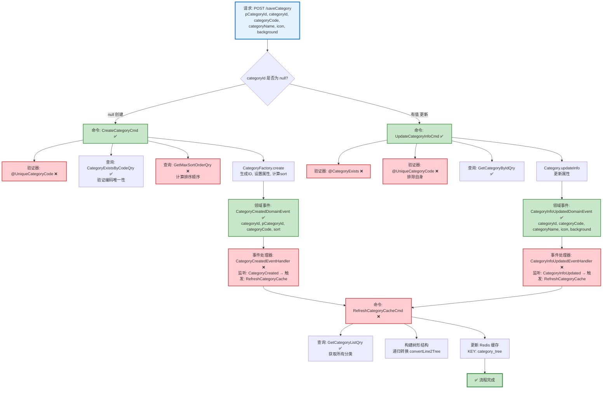

# 分类保存流程设计文档

> 基于 easylive-java 项目需求，按照 DDD 事件驱动模式设计

## 📋 业务需求概述

管理员创建或更新视频分类，系统验证分类编码唯一性、自动处理排序顺序、更新缓存，支持树形结构展示。

---

## 📊 完整流程图

### ASCII 流程图

```
┌─────────────────────────────────────────────────────────────────┐
│ 请求：POST /saveCategory                                         │
│ Payload:                                                        │
│ {                                                               │
│   "pCategoryId": 0,           // 父分类ID，0表示顶级分类         │
│   "categoryId": null,         // null=创建, 有值=更新            │
│   "categoryCode": "tech",                                       │
│   "categoryName": "科技",                                        │
│   "icon": "icon.png",                                           │
│   "background": "bg.png"                                        │
│ }                                                               │
└────────────────────────────┬────────────────────────────────────┘
                             ↓
                    ┌────────┴────────┐
                    │ categoryId?     │
                    └────┬───────┬────┘
                         ↓       ↓
              null (创建)         有值 (更新)
                         ↓                  ↓
┌─────────────────────────────────────────────────────────────────┐
│ 分支 #1: 创建分类                                                │
└─────────────────────────────────────────────────────────────────┘
┌─────────────────────────────────────────────────────────────────┐
│ 命令：CreateCategoryCmd                                          │
│ 状态：✅ 已定义 (design/aggregate/category/_gen.json:5)         │
│                                                                 │
│ 命令参数：                                                       │
│   - pCategoryId: Int                                            │
│   - categoryCode: String                                        │
│   - categoryName: String                                        │
│   - icon: String                                                │
│   - background: String                                          │
│                                                                 │
│ 验证器：                                                         │
│   └─ @UniqueCategoryCode ❌ (验证分类编码唯一性)                 │
│                                                                 │
│ 处理逻辑：                                                       │
│   1. 查询分类编码是否存在 CategoryExistsByCodeQry ✅             │
│      - 如果存在 → 抛出异常 "分类编码已存在"                       │
│   2. 计算排序顺序:                                               │
│      - 查询同级分类最大排序 GetMaxSortOrderQry ❌                │
│      - sort = maxSort + 1                                       │
│   3. CategoryFactory.create()                                   │
│      ├─ 生成 categoryId (自增ID)                                │
│      ├─ 设置 pCategoryId, categoryCode, categoryName           │
│      ├─ 设置 icon, background                                   │
│      └─ 设置 sort (自动计算)                                     │
│   4. Category.onCreate()                                        │
│   5. Mediator.uow.save()                                        │
└────────────────────────────┬────────────────────────────────────┘
                             ↓
┌─────────────────────────────────────────────────────────────────┐
│ 领域事件：CategoryCreatedDomainEvent                             │
│ 状态：✅ 已定义 (design/aggregate/category/_gen.json:25)        │
│                                                                 │
│ 事件载荷：                                                       │
│ {                                                               │
│   "categoryId": 123,                                            │
│   "pCategoryId": 0,                                             │
│   "categoryCode": "tech",                                       │
│   "categoryName": "科技",                                        │
│   "sort": 1                                                     │
│ }                                                               │
└────────────────────────────┬────────────────────────────────────┘
                             ↓
┌─────────────────────────────────────────────────────────────────┐
│ 事件处理器：CategoryCreatedEventHandler ❌                       │
│ 监听事件：CategoryCreatedDomainEvent                             │
│ 触发命令：RefreshCategoryCacheCmd ❌                             │
│ 实现路径：adapter/.../events/CategoryCreatedEventHandler.kt    │
└────────────────────────────┬────────────────────────────────────┘
                             ↓
┌─────────────────────────────────────────────────────────────────┐
│ 命令：RefreshCategoryCacheCmd ❌                                 │
│ 状态：缺失 (需新增到 design/extra/category_cache_gen.json)      │
│                                                                 │
│ 处理逻辑：                                                       │
│   1. 查询所有分类 GetCategoryListQry ✅                          │
│   2. 构建树形结构 (递归转换)                                     │
│   3. 更新 Redis 缓存                                             │
│      - KEY: Constants.REDIS_KEY_SYS_SETTING_CATEGORY            │
│      - VALUE: List<CategoryInfo> (树形结构)                     │
└─────────────────────────────────────────────────────────────────┘
                             ↓
                      ✅ 创建流程完成

┌─────────────────────────────────────────────────────────────────┐
│ 分支 #2: 更新分类                                                │
└─────────────────────────────────────────────────────────────────┘
┌─────────────────────────────────────────────────────────────────┐
│ 命令：UpdateCategoryInfoCmd                                      │
│ 状态：✅ 已定义 (design/aggregate/category/_gen.json:13)        │
│                                                                 │
│ 命令参数：                                                       │
│   - categoryId: Int                                             │
│   - pCategoryId: Int                                            │
│   - categoryCode: String                                        │
│   - categoryName: String                                        │
│   - icon: String                                                │
│   - background: String                                          │
│                                                                 │
│ 验证器：                                                         │
│   ├─ @CategoryExists ❌ (验证分类存在)                           │
│   └─ @UniqueCategoryCode ❌ (排除自身的唯一性检查)               │
│                                                                 │
│ 处理逻辑：                                                       │
│   1. 查询分类 GetCategoryByIdQry ✅                              │
│   2. 验证分类编码唯一性 (排除自身)                               │
│      - CategoryExistsByCodeQry ✅                               │
│      - 如果存在且 id != categoryId → 抛出异常                    │
│   3. Category.updateInfo(...)                                   │
│      ├─ 更新 pCategoryId, categoryCode, categoryName           │
│      └─ 更新 icon, background                                   │
│   4. Mediator.uow.save()                                        │
└────────────────────────────┬────────────────────────────────────┘
                             ↓
┌─────────────────────────────────────────────────────────────────┐
│ 领域事件：CategoryInfoUpdatedDomainEvent                         │
│ 状态：✅ 已定义 (design/aggregate/category/_gen.json:34)        │
│                                                                 │
│ 事件载荷：                                                       │
│ {                                                               │
│   "categoryId": 123,                                            │
│   "pCategoryId": 0,                                             │
│   "categoryCode": "tech",                                       │
│   "categoryName": "科技与创新",  // 更新后的名称                 │
│   "icon": "new-icon.png",                                       │
│   "background": "new-bg.png"                                    │
│ }                                                               │
└────────────────────────────┬────────────────────────────────────┘
                             ↓
┌─────────────────────────────────────────────────────────────────┐
│ 事件处理器：CategoryInfoUpdatedEventHandler ❌                   │
│ 监听事件：CategoryInfoUpdatedDomainEvent                         │
│ 触发命令：RefreshCategoryCacheCmd ❌                             │
│ 实现路径：adapter/.../events/CategoryInfoUpdatedEventHandler.kt│
└────────────────────────────┬────────────────────────────────────┘
                             ↓
┌─────────────────────────────────────────────────────────────────┐
│ 命令：RefreshCategoryCacheCmd ❌                                 │
│ (同创建分支)                                                     │
└─────────────────────────────────────────────────────────────────┘
                             ↓
                      ✅ 更新流程完成
```

---

### Mermaid 可视化流程图



**图例说明**：
- 🔵 蓝色：请求入口
- 🟢 绿色：已存在的设计（✅ 可直接使用）
- 🔴 红色：缺失的设计（❌ 需实现）

---

## 📦 设计元素清单

### ✅ 已存在的设计

#### 命令 (Commands)

| 命令 | 描述 | 状态 | 位置 |
|------|------|------|------|
| `CreateCategoryCmd` | 创建分类 | ✅ 已定义 | `design/aggregate/category/_gen.json:5` |
| `UpdateCategoryInfoCmd` | 更新分类信息 | ✅ 已定义 | `design/aggregate/category/_gen.json:13` |
| `UpdateCategorySortOrderCmd` | 更新分类排序 | ✅ 已定义 | `design/aggregate/category/_gen.json:21` |
| `DeleteCategoryCmd` | 删除分类 | ✅ 已定义 | `design/aggregate/category/_gen.json:29` |

#### 领域事件 (Domain Events)

| 事件 | 描述 | 触发时机 | 状态 | 位置 |
|------|------|----------|------|------|
| `CategoryCreatedDomainEvent` | 分类已创建 | 分类创建后 | ✅ 已定义 | `design/aggregate/category/_gen.json:25` |
| `CategoryInfoUpdatedDomainEvent` | 分类信息已更新 | 分类信息更新后 | ✅ 已定义 | `design/aggregate/category/_gen.json:34` |
| `CategorySortOrderUpdatedDomainEvent` | 分类排序已更新 | 排序更新后 | ✅ 已定义 | `design/aggregate/category/_gen.json:43` |
| `CategoryDeletedDomainEvent` | 分类已删除 | 分类删除后 | ✅ 已定义 | `design/aggregate/category/_gen.json:52` |

#### 查询 (Queries)

| 查询 | 描述 | 状态 | 位置 |
|------|------|------|------|
| `CategoryExistsByCodeQry` | 检查分类编码是否存在 | ✅ 已定义 | `design/aggregate/category/_gen.json:61` |
| `GetCategoryListQry` | 获取分类列表 | ✅ 已定义 | `design/aggregate/category/_gen.json:69` |
| `GetCategoryTreeQry` | 获取分类树 | ✅ 已定义 | `design/aggregate/category/_gen.json:77` |
| `GetCategoryByIdQry` | 根据ID获取分类 | ✅ 已定义 | `design/aggregate/category/_gen.json:85` |

---

### ❌ 缺失的设计清单

#### 需要补充的命令

| 序号 | 命令名称 | 描述 | 建议位置 | 优先级 |
|-----|---------|------|----------|-------|
| 1 | `RefreshCategoryCacheCmd` | 刷新分类缓存（构建树形结构并更新Redis） | `design/extra/category_cache_gen.json` | P0 |

**JSON 定义**（需新增到 `design/extra/category_cache_gen.json`）：
```json
{
  "cmd": [
    {
      "package": "category",
      "name": "RefreshCategoryCache",
      "desc": "刷新分类缓存"
    }
  ]
}
```

#### 需要补充的领域事件

| 序号 | 事件名称 | 描述 | 触发时机 | 建议位置 | 优先级 |
|-----|---------|------|----------|----------|-------|
| 1 | `CategoryCacheRefreshedDomainEvent` | 分类缓存已刷新 | Redis缓存更新后 | `design/extra/category_cache_gen.json` | P1 |

**JSON 定义**（需新增到 `design/extra/category_cache_gen.json`）：
```json
{
  "de": [
    {
      "package": "category",
      "name": "CategoryCacheRefreshed",
      "desc": "分类缓存已刷新",
      "aggregates": ["Category"],
      "entity": "Category",
      "persist": false
    }
  ]
}
```

#### 需要补充的查询

| 序号 | 查询名称 | 描述 | 返回值 | 建议位置 | 优先级 |
|-----|---------|------|--------|----------|-------|
| 1 | `GetMaxSortOrderQry` | 获取同级分类的最大排序值 | `{ maxSort: Int }` | `design/extra/category_sort_gen.json` | P0 |
| 2 | `CheckCategoryHasVideosQry` | 检查分类下是否存在视频 | `{ hasVideos: Boolean, count: Int }` | `design/extra/category_validation_gen.json` | P1 |

**JSON 定义**（需新增到 `design/extra/category_sort_gen.json`）：
```json
{
  "qry": [
    {
      "package": "category",
      "name": "GetMaxSortOrder",
      "desc": "获取同级分类的最大排序值"
    }
  ]
}
```

**JSON 定义**（需新增到 `design/extra/category_validation_gen.json`）：
```json
{
  "qry": [
    {
      "package": "category",
      "name": "CheckCategoryHasVideos",
      "desc": "检查分类下是否存在视频"
    }
  ]
}
```

#### 需要补充的验证器

| 序号 | 验证器名称 | 描述 | 依赖查询 | 实现路径 | 优先级 |
|-----|-----------|------|----------|----------|-------|
| 1 | `@UniqueCategoryCode` | 验证分类编码唯一性 | `CategoryExistsByCodeQry` | `application/.../validater/UniqueCategoryCode.kt` | P0 |
| 2 | `@CategoryExists` | 验证分类存在 | `GetCategoryByIdQry` | `application/.../validater/CategoryExists.kt` | P0 |
| 3 | `@CategoryHasNoVideos` | 验证分类下无视频（删除时使用） | `CheckCategoryHasVideosQry` | `application/.../validater/CategoryHasNoVideos.kt` | P1 |

#### 需要补充的事件处理器

| 序号 | 处理器名称 | 监听事件 | 触发命令 | 实现路径 | 优先级 |
|-----|-----------|----------|----------|----------|-------|
| 1 | `CategoryCreatedEventHandler` | `CategoryCreatedDomainEvent` | `RefreshCategoryCacheCmd` | `adapter/.../events/CategoryCreatedEventHandler.kt` | P0 |
| 2 | `CategoryInfoUpdatedEventHandler` | `CategoryInfoUpdatedDomainEvent` | `RefreshCategoryCacheCmd` | `adapter/.../events/CategoryInfoUpdatedEventHandler.kt` | P0 |
| 3 | `CategorySortOrderUpdatedEventHandler` | `CategorySortOrderUpdatedDomainEvent` | `RefreshCategoryCacheCmd` | `adapter/.../events/CategorySortOrderUpdatedEventHandler.kt` | P1 |
| 4 | `CategoryDeletedEventHandler` | `CategoryDeletedDomainEvent` | `RefreshCategoryCacheCmd` | `adapter/.../events/CategoryDeletedEventHandler.kt` | P0 |

**优先级说明**：
- **P0**：核心功能，必须实现
- **P1**：重要功能，建议实现
- **P2**：可选功能，后续扩展

---

## 🔑 关键业务规则

### 1. 分类编码唯一性
- 创建时：分类编码必须全局唯一
- 更新时：分类编码必须全局唯一（排除自身）
- **验证逻辑**：`CategoryExistsByCodeQry` + 排除自身ID检查

### 2. 排序自动计算
- 创建分类时，自动计算排序值：`sort = 同级分类最大sort + 1`
- **查询逻辑**：`GetMaxSortOrderQry(pCategoryId)` 获取同级最大排序值
- 如果同级无分类，sort = 1

### 3. 树形结构
- **父子关系**：通过 `pCategoryId` 建立层级关系
  - `pCategoryId = 0`：顶级分类
  - `pCategoryId > 0`：子分类
- **树形构建**：递归算法 `convertLine2Tree()`
  ```kotlin
  fun convertLine2Tree(categoryList: List<Category>): List<Category> {
      val categoryMap = categoryList.associateBy { it.categoryId }
      val rootCategories = mutableListOf<Category>()

      categoryList.forEach { category ->
          if (category.pCategoryId == 0) {
              rootCategories.add(category)
          } else {
              val parent = categoryMap[category.pCategoryId]
              parent?.children?.add(category)
          }
      }

      return rootCategories
  }
  ```

### 4. 缓存同步
- **触发时机**：分类创建、更新、删除、排序变更后
- **缓存内容**：完整的树形结构 `List<CategoryInfo>`
- **缓存位置**：Redis - `Constants.REDIS_KEY_SYS_SETTING_CATEGORY`
- **一致性保证**：通过领域事件触发缓存刷新

### 5. 删除验证
- **前置条件**：分类下不能有视频
- **验证逻辑**：`CheckCategoryHasVideosQry` 检查关联视频数量
- **错误提示**：如果存在视频，抛出异常 "分类下存在视频，无法删除"

---

## 📊 Controller 层路由示例

```kotlin
@PostMapping("/saveCategory")
fun saveCategory(
    @RequestBody @Validated request: SaveCategoryRequest
): Response {
    // 根据 categoryId 判断创建或更新
    if (request.categoryId == null) {
        // 创建分类
        Mediator.commands.send(
            CreateCategoryCmd.Request(
                pCategoryId = request.pCategoryId,
                categoryCode = request.categoryCode,
                categoryName = request.categoryName,
                icon = request.icon,
                background = request.background
            )
        )
    } else {
        // 更新分类
        Mediator.commands.send(
            UpdateCategoryInfoCmd.Request(
                categoryId = request.categoryId,
                pCategoryId = request.pCategoryId,
                categoryCode = request.categoryCode,
                categoryName = request.categoryName,
                icon = request.icon,
                background = request.background
            )
        )
    }

    return Response()
}
```

---

## 📌 设计优势

### **双命令模式的优势**

相比单一 `SaveCategoryCmd` 的设计：

1. **意图明确**：
   - `CreateCategoryCmd` vs `UpdateCategoryInfoCmd`
   - 命令名称即业务含义，无需查文档

2. **类型安全**：
   - `CreateCategoryCmd` - categoryId 不需要（系统自动生成）
   - `UpdateCategoryInfoCmd` - categoryId 必填（验证存在性）

3. **单一职责**：
   - 每个 CommandHandler 只处理一种操作
   - 验证规则独立：创建验证唯一性，更新验证存在性+唯一性

4. **易于扩展**：
   - 新增排序变更 → `UpdateCategorySortOrderCmd`
   - 新增删除操作 → `DeleteCategoryCmd`
   - 不影响已有代码，符合开闭原则

5. **符合 DDD**：
   - 命令即领域语言（Ubiquitous Language）
   - 业务专家一眼能看懂系统在做什么

---

**文档版本**：v1.0
**创建时间**：2025-10-22
**维护者**：开发团队
