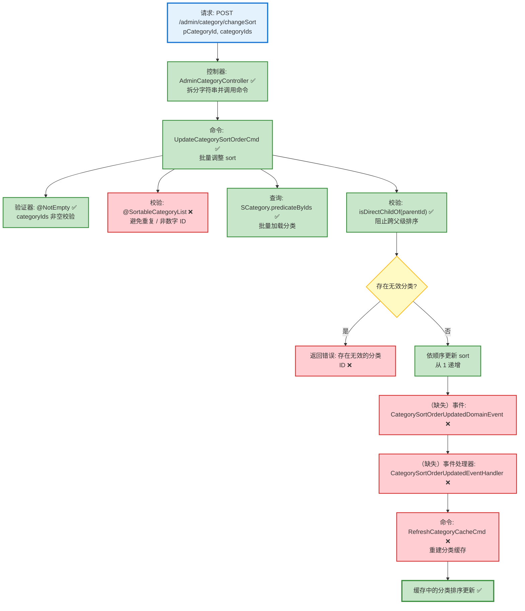

# 分类排序调整流程设计文档

> 基于 easylive-java 项目需求，按照 DDD 事件驱动模式设计

## 📋 业务需求概述
管理员重新排序某个父分类下的子分类列表，需要按照前端拖拽后的顺序批量更新排序号，并同步刷新分类缓存，确保前台展示顺序一致。

---

## 📊 完整流程图

### ASCII 流程图
```
┌──────────────────────────────────────────────────────────┐
│ 请求：POST /admin/category/changeSort                     │
│ Payload: {                                                │
│   "pCategoryId": 12,                                      │
│   "categoryIds": "101,102,103" // 逗号分隔 ID 顺序        │
│ }                                                         │
└────────────────────────────┬─────────────────────────────┘
                             ↓
┌──────────────────────────────────────────────────────────┐
│ 控制器：AdminCategoryController#changeSort ✅             │
│ 1. 按逗号拆分 categoryIds → List<Long>                   │
│ 2. Mediator.commands.send(UpdateCategorySortOrderCmd)     │
└────────────────────────────┬─────────────────────────────┘
                             ↓
┌──────────────────────────────────────────────────────────┐
│ 命令：UpdateCategorySortOrderCmd ✅（待补充事件）          │
│ 1. 校验 ID 列表非空 @NotEmpty ✅                          │
│ 2. 查询子分类集合（一次批量查询）                         │
│    └─ 若存在缺失 ID → KnownException                     │
│ 3. 校验所有分类均属于 parentId                            │
│    └─ 失败 → KnownException("仅允许调整同一父分类...")    │
│ 4. 按请求顺序重置 sort，从 1 开始递增                     │
│ 5. 保存变更 Mediator.uow.save()                           │
│ 6. ✅（缺失）发布 CategorySortOrderUpdatedDomainEvent     │
└────────────────────────────┬─────────────────────────────┘
                             ↓
┌──────────────────────────────────────────────────────────┐
│ （缺失）事件处理链                                        │
│ CategorySortOrderUpdatedDomainEvent ❌                     │
│  → CategorySortOrderUpdatedEventHandler ❌                │
│     → RefreshCategoryCacheCmd ❌                         │
│        → 重建分类树并写入 Redis                          │
└──────────────────────────────────────────────────────────┘
```

### 场景 #1：排序成功
```
Admin 请求 → UpdateCategorySortOrderCmd
    ├─ 所有分类存在且 parentId 匹配
    ├─ sort 重排为 [1,2,3,...]
    └─ 发布排序更新事件 → 刷新缓存（缺失）
```

### 场景 #2：存在无效分类 ID
```
Admin 请求 → UpdateCategorySortOrderCmd
    ├─ Mediator.repositories.find(...) 返回数量 < 列表大小
    └─ 抛 KnownException("存在无效的分类ID，无法完成排序")
```

### 场景 #3：跨父级排序
```
Admin 请求 → UpdateCategorySortOrderCmd
    ├─ 任一分类 isDirectChildOf(parentId) == false
    └─ 抛 KnownException("仅允许调整同一父分类下的子分类顺序")
```

### Mermaid 流程图


**图例说明**：
- 🔵 蓝色：请求入口
- 🟢 绿色：已存在的设计（✅ 可直接使用）
- 🔴 红色：缺失的设计（❌ 需实现）
- 🟡 黄色：条件判断 / 可选分支（⚪）

---

## 📦 设计元素清单

### ✅ 已存在的设计

#### 命令 (Commands)
| 命令 | 描述 | 状态 | 位置 |
|------|------|------|------|
| `UpdateCategorySortOrderCmd` | 更新分类排序，校验父子关系并重排 sort | ✅ 已定义 | `only-danmuku/only-danmuku-application/src/main/kotlin/edu/only4/danmuku/application/commands/category/UpdateCategorySortOrderCmd.kt:18` |

#### 领域事件 (Domain Events)
| 事件 | 描述 | 触发时机 | 状态 | 位置 |
|------|------|----------|------|------|
| `CategorySortOrderUpdatedDomainEvent` | 分类排序更新后用于后续处理 | ⚪ 定义未使用 | `only-danmuku/only-danmuku-domain/src/main/kotlin/edu/only4/danmuku/domain/aggregates/category/events/CategorySortOrderUpdatedDomainEvent.kt:19` |

#### 查询 (Queries)
| 查询 | 描述 | 状态 | 位置 |
|------|------|------|------|
| `GetCategoryTreeQry` | 获取分类树（刷新缓存所需） | ✅ 已定义 | `only-danmuku/only-danmuku-application/src/main/kotlin/edu/only4/danmuku/application/queries/category/GetCategoryTreeQry.kt:12` |

---

### ❌ 缺失的设计清单

#### 需要补充的命令 (Commands)
| 序号 | 命令名称 | 描述 | 建议位置 | 优先级 |
|-----|---------|------|----------|-------|
| 1 | `RefreshCategoryCacheCmd` | 刷新分类缓存（构建树并写入 Redis） | `design/extra/category_cache_gen.json` | P0 |

#### 需要补充的领域事件 (Domain Events)
| 序号 | 事件名称 | 描述 | 触发时机 | 建议位置 | 优先级 |
|-----|---------|------|----------|----------|-------|
| 1 | `CategorySortOrderUpdatedDomainEvent` | 排序调整后发布事件（需从命令触发） | `design/aggregate/category/_gen.json` | P0 |

#### 需要补充的查询 (Queries)
| 序号 | 查询名称 | 描述 | 返回值 | 建议位置 | 优先级 |
|-----|---------|------|--------|----------|-------|
| 1 | `GetCategoryDescendantsQry` | 返回父分类下所有层级子分类 ID（用于校验/同步） | `List<Long>` | `design/aggregate/category/_gen.json` | P1 |

#### 需要补充的验证器 (Validators)
| 序号 | 验证器名称 | 描述 | 依赖查询 | 实现路径 | 优先级 |
|-----|-----------|------|----------|----------|-------|
| 1 | `@SortableCategoryList` | 校验 categoryIds 字符串仅包含数字且无重复 | `n/a` | `only-danmuku-application/.../validator/` | P1 |

#### 需要补充的事件处理器 (Event Handlers)
| 序号 | 处理器名称 | 监听事件 | 触发命令 | 实现路径 | 优先级 |
|-----|-----------|----------|----------|----------|-------|
| 1 | `CategorySortOrderUpdatedEventHandler` | `CategorySortOrderUpdatedDomainEvent` | `RefreshCategoryCacheCmd` | `only-danmuku-adapter/.../events/CategorySortOrderUpdatedEventHandler.kt` | P0 |

**优先级说明**：
- **P0**：核心能力，必须补齐
- **P1**：重要功能，建议跟进
- **P2**：可选增强，后续迭代

---

## 🔑 关键业务规则
- **排序顺序来源**：前端传入的 `categoryIds` 代表最终顺序，后端需按顺序重写 `sort`；原实现 `++sort` 会让首个子分类从 `2` 开始（`easylive-java/easylive-common/src/main/java/com/easylive/service/impl/CategoryInfoServiceImpl.java:347`），需要确认是否 Bug 并在 DDD 实现中修正。
- **父子约束**：只能调整同一父分类下的子分类；DDD 命令已校验，但传统实现未防御，需要在前端或命令层加验证。
- **缓存同步**：排序更新后必须刷新 Redis 分类树（`save2Redis()`，同文件 `:373`）；DDD 模式应通过领域事件 + `RefreshCategoryCacheCmd` 实现。
- **异常提示一致**：无效分类或跨父级排序时需返回清晰错误，确保与旧系统体验一致。

---

## 🛠️ 控制器与命令示例
```kotlin
@PostMapping("/changeSort")
fun adminCategoryChangeSort(@RequestBody @Validated request: AdminCategoryChangeSort.Request): AdminCategoryChangeSort.Response {
    val categoryIdList = request.categoryIds.split(",")
        .map { it.trim().toLong() }

    Mediator.commands.send(
        UpdateCategorySortOrderCmd.Request(
            parentId = request.pCategoryId.toLong(),
            categoryIds = categoryIdList
        )
    )
    return AdminCategoryChangeSort.Response()
}
```
> 控制器入口：`only-danmuku/only-danmuku-adapter/src/main/kotlin/edu/only4/danmuku/adapter/portal/api/AdminCategoryController.kt:105`

```kotlin
override fun exec(request: Request): Response {
    val categories = Mediator.repositories.find(
        SCategory.predicateByIds(request.categoryIds)
    )
    if (categories.size != request.categoryIds.toSet().size) {
        throw KnownException("存在无效的分类ID，无法完成排序")
    }
    val invalidParent = categories.any { !it.isDirectChildOf(request.parentId) }
    if (invalidParent) {
        throw KnownException("仅允许调整同一父分类下的子分类顺序")
    }
    val byId = categories.associateBy { it.id }
    var sortNo = 1
    request.categoryIds.forEach { id ->
        val category = byId[id] ?: throw KnownException("分类不存在：$id")
        category.sort = sortNo.toByte()
        sortNo += 1
    }
    Mediator.uow.save()
    // ❌ 缺少：发布 CategorySortOrderUpdatedDomainEvent / 刷新缓存
    return Response()
}
```
> 命令实现：`only-danmuku/only-danmuku-application/src/main/kotlin/edu/only4/danmuku/application/commands/category/UpdateCategorySortOrderCmd.kt:18`

---

## 📂 传统架构参考
- 控制器：`easylive-java/easylive-admin/src/main/java/com/easylive/admin/controller/CategoryController.java:116`
- 服务实现：`easylive-java/easylive-common/src/main/java/com/easylive/service/impl/CategoryInfoServiceImpl.java:340`
- Mapper 批量排序：`easylive-java/easylive-common/src/main/resources/com/easylive/mappers/CategoryInfoMapper.xml:400`

---

**文档版本**：v1.0  
**创建时间**：2025-10-22  
**维护者**：开发团队

