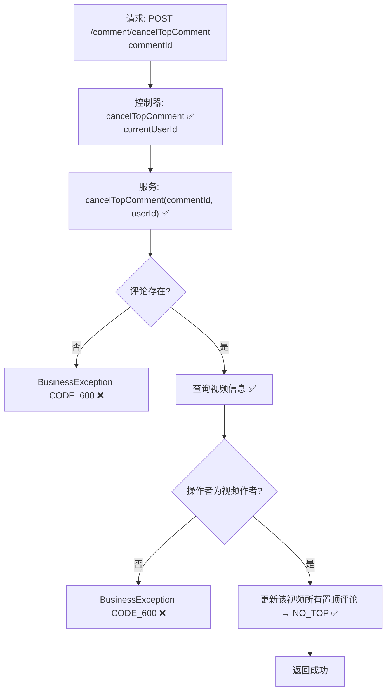

# 视频评论取消置顶流程设计文档

> 基于 easylive-java 项目需求，按照 DDD 事件驱动模式设计

## 📋 业务需求概述
视频作者（或具有管理权限的用户）取消已置顶的评论，将其恢复为普通评论状态，同时确保该视频下不存在仍标记为置顶的评论记录。

---

## 📊 完整流程图

### ASCII 流程图
```
┌──────────────────────────────────────────────────────────┐
│ 请求：POST /comment/cancelTopComment                      │
│ Payload: { "commentId": 345678 }                          │
└────────────────────────────┬─────────────────────────────┘
                             ↓
┌──────────────────────────────────────────────────────────┐
│ 控制器：VideoCommentController#cancelTopComment ✅         │
│ 1. Token → currentUserId                                  │
│ 2. 调用 videoCommentService.cancelTopComment(commentId, userId) │
└────────────────────────────┬─────────────────────────────┘
                             ↓
┌──────────────────────────────────────────────────────────┐
│ 服务：VideoCommentServiceImpl#cancelTopComment ✅          │
│ 1. 查询评论信息                                            │
│ 2. 查询视频信息                                            │
│ 3. 校验 userId == videoOwnerId                            │
│ 4. 构造 VideoComment(topType = NO_TOP)                     │
│ 5. 创建查询条件：videoId + topType = TOP                  │
│ 6. updateByParam → 将该视频所有置顶评论状态置为 NO_TOP     │
└──────────────────────────────────────────────────────────┘
```

### 场景
1. **视频作者取消置顶**：操作成功，视频下所有置顶评论恢复为普通状态。
2. **越权操作**：操作者不是视频作者 → 抛 BusinessException CODE_600。
3. **评论/视频不存在**：抛 BusinessException CODE_600。

### Mermaid 流程图


---

## 📦 设计元素清单

### ✅ 已存在的设计
- 控制器：`VideoCommentController#cancelTopComment`（`easylive-java/.../VideoCommentController.java:241`）
- 服务：`VideoCommentServiceImpl#cancelTopComment`（`easylive-java/.../VideoCommentServiceImpl.java:388`）
- 枚举：`CommentTopTypeEnum`（置顶 / 非置顶状态）

### ❌ 缺失的 DDD 能力

| 类型 | 缺失项 | 描述 | 建议位置 | 优先级 |
|------|--------|------|----------|-------|
| 命令 | `CancelTopVideoCommentCmd` | 实现取消置顶逻辑（含权限校验） | `design/aggregate/video_comment/_gen.json` | P0 |
| 命令 | `TopVideoCommentCmd` 对应取消 | `TopVideoCommentCmd` 应调用 `CancelTopVideoCommentCmd` (或内部逻辑合并) | 同上 | P0 |
| 验证器 | `@VideoCommentOwner` | 校验该评论属于目标视频，并验证视频作者 | `only-danmuku-application/.../validator/` | P0 |
| 查询 | `GetVideoCommentDetailQry` | 返回评论及视频信息，供命令权限校验 | `design/aggregate/video_comment/_gen.json` | P0 |
| 事件 | `VideoCommentTopChangedDomainEvent` | 置顶状态变化后通知下游刷新 | 同上 | P1 |
| 事件处理器 | `VideoCommentTopChangedEventHandler` | 刷新缓存、推送播放端更新 | `only-danmuku-adapter/.../events/VideoCommentTopChangedEventHandler.kt` | P1 |

---

## 🔑 关键业务规则
- **归属校验**：仅视频作者可取消置顶；管理员可在后台调用另一接口。
- **置顶唯一**：取消时将该视频所有置顶评论状态重置为 NO_TOP；保证一致性。
- **幂等性**：重复取消应安全返回（即使当前无置顶评论）。
- **缓存刷新**：取消置顶后需刷新前端缓存；建议通过事件驱动实现。
- **审计记录**：可记录取消置顶操作，用于运营日志。

---

## 🧾 控制器与服务示例
```java
@RequestMapping("/cancelTopComment")
@GlobalInterceptor(checkLogin = true)
public ResponseVO cancelTopComment(@NotNull Integer commentId) {
    TokenUserInfoDto tokenUserInfoDto = getTokenUserInfoDto();
    videoCommentService.cancelTopComment(commentId, tokenUserInfoDto.getUserId());
    return getSuccessResponseVO(null);
}
```
> 参考：`easylive-java/easylive-web/src/main/java/com/easylive/web/controller/VideoCommentController.java:241`

```java
public void cancelTopComment(Integer commentId, String userId) {
    VideoComment dbVideoComment = videoCommentMapper.selectByCommentId(commentId);
    if (dbVideoComment == null) throw new BusinessException(ResponseCodeEnum.CODE_600);
    VideoInfo videoInfo = videoInfoMapper.selectByVideoId(dbVideoComment.getVideoId());
    if (videoInfo == null) throw new BusinessException(ResponseCodeEnum.CODE_600);
    if (!videoInfo.getUserId().equals(userId)) throw new BusinessException(ResponseCodeEnum.CODE_600);

    VideoComment videoComment = new VideoComment();
    videoComment.setTopType(CommentTopTypeEnum.NO_TOP.getType());

    VideoCommentQuery videoCommentQuery = new VideoCommentQuery();
    videoCommentQuery.setVideoId(dbVideoComment.getVideoId());
    videoCommentQuery.setTopType(CommentTopTypeEnum.TOP.getType());

    videoCommentMapper.updateByParam(videoComment, videoCommentQuery);
}
```
> 参考：`easylive-java/easylive-common/src/main/java/com/easylive/service/impl/VideoCommentServiceImpl.java:388`

---

## 📂 传统架构参考
- 控制器：`easylive-java/easylive-web/src/main/java/com/easylive/web/controller/VideoCommentController.java:241`
- 服务实现：`easylive-java/easylive-common/src/main/java/com/easylive/service/impl/VideoCommentServiceImpl.java:388`

---

**文档版本**：v1.0  
**创建时间**：2025-10-22  
**维护者**：开发团队

