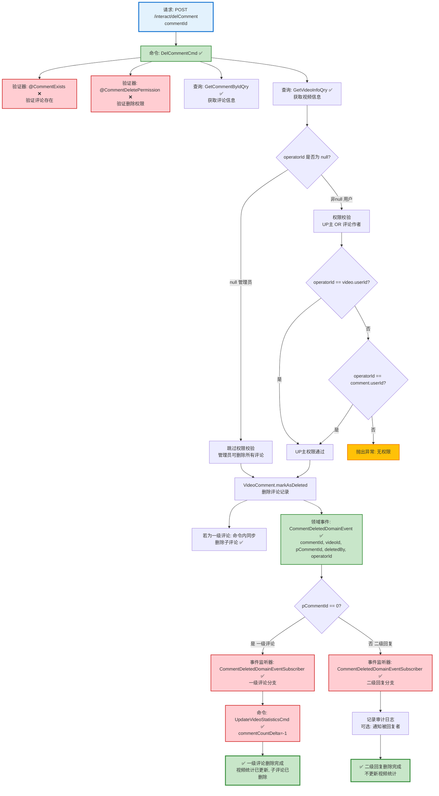

# 评论删除流程设计文档

> 基于 easylive-java 项目需求，按照 DDD 事件驱动模式设计

## 📋 业务需求概述

管理员或用户删除视频评论，系统验证评论存在性、权限（管理员可删除所有、UP主可删除自己视频的评论、用户可删除自己发表的评论），删除评论记录，一级评论需更新视频评论统计并级联删除所有二级回复。

---

## 📊 完整流程图

### ASCII 流程图

```
┌─────────────────────────────────────────────────────────────────┐
│ 请求：POST /interact/delComment                                  │
│ Payload:                                                        │
│ {                                                               │
│   "commentId": 123456                                           │
│ }                                                               │
│                                                                 │
│ 场景：                                                           │
│   - 管理员删除违规评论（管理后台）                                │
│   - UP主删除自己视频的评论（用户端）                               │
│   - 用户删除自己发表的评论（用户端）                               │
└────────────────────────────┬────────────────────────────────────┘
                             ↓
┌─────────────────────────────────────────────────────────────────┐
│ 命令：DelCommentCmd                                              │
│ 状态：✅ 已定义 (design/aggregate/video_comment/_gen.json:10)   │
│                                                                 │
│ 命令参数：                                                       │
│   - commentId: Int                                              │
│   - operatorId: String? (可选，用于权限校验)                     │
│                                                                 │
│ 验证器：                                                         │
│   ├─ @CommentExists ✅ (验证评论存在，依赖 CommentExistsByIdQry) │
│   └─ @CommentDeletePermission ✅ (验证删除权限)                  │
│                                                                 │
│ 处理逻辑：                                                       │
│   1. 查询评论信息 GetCommentByIdQry ✅                           │
│      - 如果不存在 → 抛出异常 "评论不存在"                         │
│   2. 权限校验 (如果 operatorId 不为 null):                       │
│      - 检查 operatorId == comment.videoOwnerId (UP主)           │
│      - 或 operatorId == comment.userId (评论作者)               │
│      - 如果都不匹配 → 抛出异常 "无权限删除该评论"                  │
│      - 管理员操作时 operatorId = null，跳过权限校验               │
│   3. VideoComment.markAsDeleted()                               │
│      - 删除评论记录                                              │
│      - 若为一级评论，命令内部同步删除全部二级回复                │
│   4. Mediator.uow.save()                                        │
└────────────────────────────┬────────────────────────────────────┘
                             ↓
┌─────────────────────────────────────────────────────────────────┐
│ 领域事件：CommentDeletedDomainEvent                              │
│ 状态：✅ 已定义 (design/aggregate/video_comment/_gen.json:52)   │
│                                                                 │
│ 事件载荷：                                                       │
│ {                                                               │
│   "commentId": 123456,                                          │
│   "videoId": "V123456789",                                      │
│   "pCommentId": 0,           // 0=一级评论, >0=二级回复          │
│   "deletedBy": "admin" | "uploader" | "author",  // 删除者类型   │
│   "operatorId": "U001" | null,                                  │
│   "deleteTime": 1729267200                                      │
│ }                                                               │
└────────────────────────────┬────────────────────────────────────┘
                             ↓
                    ┌────────┴────────┐
                    │ pCommentId?     │
                    └────┬───────┬────┘
                         ↓       ↓
              0 (一级评论)          >0 (二级回复)
                         ↓                  ↓
┌─────────────────────────────────────────────────────────────────┐
│ 分支 #1: 一级评论删除                                            │
└─────────────────────────────────────────────────────────────────┘
┌─────────────────────────────────────────────────────────────────┐
│ 事件监听器：CommentDeletedDomainEventSubscriber ✅              │
│ 监听事件：CommentDeletedDomainEvent (pCommentId == 0)           │
│ 触发命令：                                                       │
│   1. UpdateVideoStatisticsCmd ✅ (更新视频评论数 -1)             │
│   2. （DelCommentCmd 已在命令内同步清理所有子评论）               │
│ 实现路径：only-danmuku-application/src/main/kotlin/edu/only4/danmuku/application/subscribers/domain/video_comment/CommentDeletedDomainEventSubscriber.kt │
└────────────────────────────┬────────────────────────────────────┘
                             ↓
        ┌────────────────────┴────────────────────┐
        ↓                                         ↓
┌─────────────────────────────────────────────────────────────────┐
│ 命令：UpdateVideoStatisticsCmd ✅                                │
│ 状态：已实现                                                     │
│                                                                 │
│ 命令参数：                                                       │
│   - videoId: Long                                               │
│   - commentCountDelta: Int (可正可负，命令内部防止出现负值)        │
│   - 其余增量字段在需要时填写                                     │
│                                                                 │
│ 处理逻辑：                                                       │
│   1. 加载视频聚合 (SVideo)                                       │
│   2. 根据增量更新各统计字段，最小值为 0                         │
│   3. 持久化修改并返回最新统计                                   │
└─────────────────────────────────────────────────────────────────┘

                             ↓
                      ✅ 一级评论删除完成

┌─────────────────────────────────────────────────────────────────┐
│ 分支 #2: 二级回复删除                                            │
└─────────────────────────────────────────────────────────────────┘
┌─────────────────────────────────────────────────────────────────┐
│ 事件监听器：CommentDeletedDomainEventSubscriber ✅              │
│ 监听事件：CommentDeletedDomainEvent (pCommentId > 0)            │
│ 触发命令：无 (二级回复删除不更新视频统计，不级联删除)             │
│ 处理逻辑：                                                       │
│   - 记录审计日志                                                 │
│   - 可选：通知被回复者 (您收到的回复已被删除)                     │
└─────────────────────────────────────────────────────────────────┘
                             ↓
                      ✅ 二级回复删除完成
```

---

### Mermaid 可视化流程图



**图例说明**：
- 🔵 蓝色：请求入口
- 🟢 绿色：已存在的设计（✅ 可直接使用）
- 🔴 红色：缺失的设计（❌ 需实现）
- 🟡 黄色：异常分支

---

## 📦 设计元素清单

### ✅ 已存在的设计

#### 命令 (Commands)

| 命令 | 描述 | 状态 | 位置 |
|------|------|------|------|
| `DelCommentCmd` | 删除评论 | ✅ 已定义 | `design/aggregate/video_comment/_gen.json:10` |
| `PostCommentCmd` | 发表评论 | ✅ 已定义 | `design/aggregate/video_comment/_gen.json:5` |
| `ReplyCommentCmd` | 回复评论 | ✅ 已定义 | `design/aggregate/video_comment/_gen.json:35` |

#### 领域事件 (Domain Events)

| 事件 | 描述 | 触发时机 | 状态 | 位置 |
|------|------|----------|------|------|
| `CommentDeletedDomainEvent` | 评论已删除 | 评论删除后 | ✅ 已定义 | `design/aggregate/video_comment/_gen.json:52` |
| `CommentPostedDomainEvent` | 评论已发表 | 评论发表后 | ✅ 已定义 | `design/aggregate/video_comment/_gen.json:42` |

#### 查询 (Queries)

| 查询 | 描述 | 状态 | 位置 |
|------|------|------|------|
| `GetCommentByIdQry` | 根据ID获取评论 | ✅ 已定义 | `design/aggregate/video_comment/_gen.json:119` |
| `GetCommentRepliesQry` | 获取评论回复列表 | ✅ 已定义 | `design/aggregate/video_comment/_gen.json:124` |
| `GetVideoInfoQry` | 获取视频信息 | ✅ 已定义 | `design/aggregate/video/_gen.json:94` |

---

### ❌ 缺失的设计清单

#### 需要补充的命令

| 序号 | 命令名称 | 描述 | 建议位置 | 优先级 |
|-----|---------|------|----------|-------|
| 1 | `UpdateVideoStatisticsCmd` | 更新视频统计信息（点赞/收藏/投币/评论数） | `design/extra/video_statistics_gen.json` | P0 |

**JSON 定义**（需新增到 `design/extra/video_statistics_gen.json`）：
```json
{
  "cmd": [
    {
      "package": "video",
      "name": "UpdateVideoStatistics",
      "desc": "更新视频统计信息"
    }
  ]
}
```

#### 需要补充的领域事件

| 序号 | 事件名称 | 描述 | 触发时机 | 建议位置 | 优先级 |
|-----|---------|------|----------|----------|-------|
| 1 | `VideoStatisticsUpdatedDomainEvent` | 视频统计信息已更新 | 视频统计更新后 | `design/extra/video_statistics_gen.json` | P1 |

**JSON 定义**（需新增到 `design/extra/video_statistics_gen.json`）：
```json
{
  "de": [
    {
      "package": "video",
      "name": "VideoStatisticsUpdated",
      "desc": "视频统计信息已更新",
      "aggregates": ["Video"],
      "entity": "Video",
      "persist": true
    }
  ]
}
```

#### 需要补充的验证器

| 序号 | 验证器名称                      | 描述                   | 依赖查询                                           | 实现路径                                                   | 优先级 |
|----|----------------------------|----------------------|------------------------------------------------|--------------------------------------------------------|-----|
| 1  | `@CommentExists`           | 验证评论存在               | `CommentExistsByIdQry`                         | `application/.../validater/CommentExists.kt`           | ✅   |
| 2  | `@CommentDeletePermission` | 验证删除权限（管理员/UP主/评论作者） | `CommentExistsByIdQry`<br/>`GetCommentByIdQry` | `application/.../validater/CommentDeletePermission.kt` | ✅   |

#### ✅ 已存在的事件监听器

| 序号 | 监听器名称                                 | 监听事件                        | 触发命令                              | 实现路径                                                                                                                                             |
|----|---------------------------------------|-----------------------------|-----------------------------------|--------------------------------------------------------------------------------------------------------------------------------------------------|
| 1  | `CommentDeletedDomainEventSubscriber` | `CommentDeletedDomainEvent` | `UpdateVideoStatisticsCmd`（仅一级评论） | `only-danmuku-application/src/main/kotlin/edu/only4/danmuku/application/subscribers/domain/video_comment/CommentDeletedDomainEventSubscriber.kt` |

**优先级说明**：
- **P0**：核心功能，必须实现
- **P1**：重要功能，建议实现
- **P2**：可选功能，后续扩展

---

## 🔑 关键业务规则

### 1. 三级权限控制
- **管理员删除**：
  - `operatorId = null`
  - 可删除任何评论，无需权限校验
  - 用于处理违规内容

- **UP主删除**：
  - `operatorId = 当前用户ID`
  - 可删除自己视频的所有评论
  - 权限校验：`operatorId == video.userId`

- **评论作者删除**：
  - `operatorId = 当前用户ID`
  - 只能删除自己发表的评论
  - 权限校验：`operatorId == comment.userId`

**权限校验逻辑**：
```kotlin
fun hasDeletePermission(operatorId: String?, comment: VideoComment, video: Video): Boolean {
    // 管理员模式
    if (operatorId == null) return true

    // UP主 或 评论作者
    return operatorId == video.userId || operatorId == comment.userId
}
```

### 2. 一级评论 vs 二级回复的删除差异

| 特性         | 一级评论 (`pCommentId = 0`)                  | 二级回复 (`pCommentId > 0`) |
|------------|------------------------------------------|-------------------------|
| **更新视频统计** | ✅ 需要更新 `comment_count -1`                | ❌ 不更新统计                 |
| **级联删除**   | ✅ 删除所有子评论                                | ❌ 不级联删除                 |
| **事件处理**   | 触发 `UpdateVideoStatisticsCmd`；子评论已在命令内删除 | 仅记录日志                   |

**判断逻辑**：
```kotlin
if (comment.parentId == 0L) {
    // 一级评论：命令内直接删除所有子评论
    Mediator.repositories.remove(
        SVideoComment.predicate { schema ->
            schema.parentId eq comment.id
        }
    )
}
Mediator.repositories.remove(SVideoComment.predicateById(comment.id))
Mediator.uow.save()
```

### 3. 级联删除子评论

**场景**：删除一级评论时，需同时删除所有二级回复

**实现方式**：在 `DelCommentCmd` 中直接使用仓储一次性删除 `parentId = commentId` 的所有评论记录，避免额外命令和事件链路。

**SQL 示例**（easylive-java 实现）：
```sql
DELETE FROM video_comment
WHERE p_comment_id = #{commentId}
```

### 4. 统计更新规则

**何时更新视频评论统计**：
- ✅ 删除一级评论 → `comment_count -1`
- ❌ 删除二级回复 → 不更新统计

**原因**：
- 视频的 `comment_count` 只统计一级评论数量
- 二级回复被视为一级评论的附属内容
- 符合 easylive-java 的设计（`VideoCommentServiceImpl.deleteComment:345-347`）

### 5. 审计日志

**记录内容**：
- 删除时间：`deleteTime`
- 删除者类型：`deletedBy = "admin" | "uploader" | "author"`
- 操作者ID：`operatorId`
- 被删除评论信息：`commentId, videoId, pCommentId, content`
- 评论层级：`pCommentId == 0 ? "一级评论" : "二级回复"`

**用途**：
- 管理员操作追溯
- 纠纷处理证据
- 数据恢复依据（如果使用软删除）

---

## 📊 Controller 层实现示例

### 管理后台删除

```kotlin
@RestController
@RequestMapping("/admin/interact")
class AdminInteractController {

    @PostMapping("/delComment")
    fun delComment(
        @RequestParam @NotNull commentId: Int
    ): Response {
        // 管理员删除：operatorId = null，无权限限制
        Mediator.commands.send(
            DelCommentCmd.Request(
                commentId = commentId,
                operatorId = null  // 管理员标识
            )
        )
        return Response()
    }
}
```

### 用户端删除

```kotlin
@RestController
@RequestMapping("/api/comment")
class UserCommentController {

    @PostMapping("/delete")
    fun deleteComment(
        @RequestParam @NotNull commentId: Int
    ): Response {
        val currentUserId = LoginHelper.getUserId()!!

        // 用户删除：需验证权限（UP主 或 评论作者）
        Mediator.commands.send(
            DelCommentCmd.Request(
                commentId = commentId,
                operatorId = currentUserId
            )
        )
        return Response()
    }
}
```

---

## 📌 设计优势

### **三级权限 + 双分支处理**

1. **灵活的权限控制**：
   - 单一命令支持三种删除场景（管理员/UP主/评论作者）
   - 通过 `operatorId` 参数优雅实现权限分离

2. **智能级联删除**：
   - 一级评论删除 → 自动清理所有子评论
   - 二级回复删除 → 独立删除，不影响父评论

3. **精准统计更新**：
   - 只有一级评论删除才更新视频统计
   - 避免统计数据错误

4. **事件驱动设计**：
   - 通过事件处理器解耦删除逻辑和后续操作
   - 统计更新、级联删除、日志记录分离

---

## 🔄 删除流程对比表

| 删除场景 | 权限要求 | 更新统计 | 级联删除 | 事件处理 |
|---------|---------|---------|---------|---------|
| **管理员删除一级评论** | `operatorId = null` | ✅ `comment_count -1` | ✅ 删除所有子评论 | 2个命令 |
| **管理员删除二级回复** | `operatorId = null` | ❌ 不更新 | ❌ 不级联 | 仅日志 |
| **UP主删除一级评论** | `operatorId == video.userId` | ✅ `comment_count -1` | ✅ 删除所有子评论 | 2个命令 |
| **UP主删除二级回复** | `operatorId == video.userId` | ❌ 不更新 | ❌ 不级联 | 仅日志 |
| **作者删除自己的一级评论** | `operatorId == comment.userId` | ✅ `comment_count -1` | ✅ 删除所有子评论 | 2个命令 |
| **作者删除自己的二级回复** | `operatorId == comment.userId` | ❌ 不更新 | ❌ 不级联 | 仅日志 |

---

## 🧩 扩展设计：批量删除评论

如果需要批量删除违规评论（例如删除某个用户的所有评论），可以新增 `BatchDeleteCommentsCmd`：

```kotlin
@PostMapping("/batchDelComments")
fun batchDelComments(
    @RequestParam userId: String?,
    @RequestParam videoId: String?
): Response {
    Mediator.commands.send(
        BatchDeleteCommentsCmd.Request(
            userId = userId,      // 删除某用户的所有评论
            videoId = videoId,    // 删除某视频的所有评论
            operatorId = null     // 管理员操作
        )
    )
    return Response()
}
```

**批量删除注意事项**：
- 需统计一级评论数量，批量更新视频 `comment_count`
- 使用事务保证原子性
- 记录批量操作审计日志

---

**文档版本**：v1.0
**创建时间**：2025-10-22
**维护者**：开发团队
