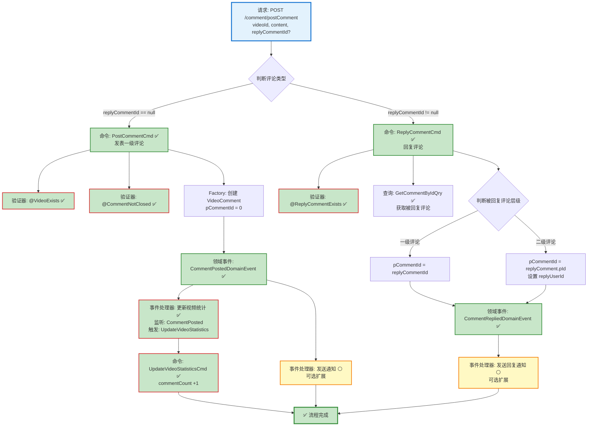

# 视频评论发表流程设计文档

> 基于 easylive-java 项目需求，按照 DDD 事件驱动模式设计

## 📋 业务需求概述

用户可以对视频发表评论或回复其他用户的评论，支持文本内容和可选图片附件。评论分为一级评论（顶级评论）和二级评论（回复），发表成功后更新视频评论统计并记录用户消息。

---

## 📊 完整流程图

### ASCII 流程图

```
┌─────────────────────────────────────────────────────────────────┐
│ 请求：POST /comment/postComment                                  │
│ Payload:                                                        │
│ {                                                               │
│   "videoId": "V001",         // 视频ID                          │
│   "replyCommentId": 123,     // 被回复的评论ID (可选)            │
│   "content": "精彩的视频!",   // 评论内容 (最大500字符)           │
│   "imgPath": "/img/001.jpg"  // 图片路径 (可选,最大50字符)       │
│ }                                                               │
│                                                                 │
│ 说明：                                                           │
│ - @RecordUserMessage(messageType = COMMENT) 自动记录用户消息    │
│ - 当前用户信息（userId, nickName, avatar）从 Token 获取         │
│ - replyCommentId 为 null 表示发表一级评论                        │
│ - replyCommentId 非 null 表示回复某条评论（二级评论）            │
└────────────────────────────┬────────────────────────────────────┘
                             ↓
┌─────────────────────────────────────────────────────────────────┐
│ 命令：PostCommentCmd ✅ / ReplyCommentCmd ✅                      │
│ 状态：✅ 已定义 (design/aggregate/video_comment/_gen.json)      │
│                                                                 │
│ 请求参数：                                                       │
│   - userId: String (评论者ID，从 Token 获取)                    │
│   - nickName: String (评论者昵称，从 Token 获取)                │
│   - avatar: String (评论者头像，从 Token 获取)                  │
│   - videoId: String (视频ID)                                   │
│   - content: String (评论内容，最大500字符)                      │
│   - imgPath: String? (图片路径，可选，最大50字符)                │
│   - replyCommentId: Int? (被回复评论ID，可选)                   │
│                                                                 │
│ 验证器：                                                         │
│   ├─ @VideoExists ✅ (验证视频是否存在)                          │
│   ├─ @CommentNotClosed ✅ (验证视频评论区未关闭)                 │
│   ├─ @ReplyCommentExists ✅ (验证被回复评论存在且属于该视频)      │
│   └─ @NotEmpty, @Size (内容长度验证) ✅                         │
│                                                                 │
│ 处理逻辑分支：                                                   │
│   ┌─ replyCommentId == null → 发表一级评论                      │
│   │    1. 创建 VideoComment 聚合根 (pCommentId = 0)            │
│   │    2. Factory.create(userId, videoId, content, imgPath)    │
│   │    3. Mediator.uow.save(videoComment)                      │
│   │                                                             │
│   └─ replyCommentId != null → 回复评论                          │
│        1. 查询被回复的评论 (replyComment)                        │
│        2. 判断被回复评论的层级：                                  │
│           - 如果是一级评论 (pCommentId == 0)                     │
│             → 创建二级评论 (pCommentId = replyCommentId)        │
│           - 如果是二级评论 (pCommentId != 0)                     │
│             → 创建二级评论 (pCommentId = replyComment.pId)      │
│             → 设置 replyUserId, replyNickName, replyAvatar     │
│        3. Factory.create(...) 创建回复评论                      │
│        4. Mediator.uow.save(videoComment)                      │
└────────────────────────────┬────────────────────────────────────┘
                             ↓
┌─────────────────────────────────────────────────────────────────┐
│ 领域事件：CommentPostedDomainEvent ✅ / CommentRepliedDE ✅      │
│ 状态：✅ 已定义 (design/aggregate/video_comment/_gen.json)      │
│                                                                 │
│ 事件载荷 (CommentPostedDomainEvent)：                           │
│ {                                                               │
│   "commentId": 789,          // 评论ID                          │
│   "videoId": "V001",         // 视频ID                          │
│   "userId": "U001",          // 评论者ID                        │
│   "content": "精彩的视频!",   // 评论内容                         │
│   "pCommentId": 0,           // 父评论ID (0表示一级评论)         │
│   "postTime": 1729267200     // 发表时间 (秒级时间戳)            │
│ }                                                               │
│                                                                 │
│ 事件载荷 (CommentRepliedDomainEvent)：                          │
│ {                                                               │
│   "commentId": 790,          // 回复评论ID                      │
│   "videoId": "V001",         // 视频ID                          │
│   "pCommentId": 789,         // 父评论ID                        │
│   "replyUserId": "U002",     // 被回复用户ID                    │
│   "userId": "U001",          // 回复者ID                        │
│   "content": "感谢分享!",     // 回复内容                         │
│   "postTime": 1729267250     // 发表时间                        │
│ }                                                               │
└────────────────────────────┬────────────────────────────────────┘
                             ↓
        ┌────────────────────┴────────────────────┐
        ↓                                         ↓
┌──────────────────────────┐          ┌──────────────────────────┐
│ 事件监听器 #1 ✅          │          │ 事件监听器 #2 ⚪          │
│ 监听: CommentPostedDE    │          │ 监听: CommentPostedDE    │
│ 触发: 更新视频评论统计     │          │ 触发: 发送评论通知        │
│                          │          │                          │
│ UpdateVideoStatistics    │          │ SendCommentNotification  │
│ Cmd (commentCount +1)    │          │ Cmd (可选)               │
└──────┬───────────────────┘          └──────────────────────────┘
       ↓
┌─────────────────────────────────────────────────────────────────┐
│ 命令：UpdateVideoStatisticsCmd ✅                                │
│ 状态：已实现                                                     │
│                                                                 │
│ 请求参数：                                                       │
│   - videoId: Long                                              │
│   - commentCountDelta: Int (+1)                                │
│                                                                 │
│ 处理逻辑：                                                       │
│   1. 通过仓储加载 Video 聚合                                      │
│   2. 调用 video.applyStatisticsDelta(commentCountDelta=+1)     │
│   3. Mediator.uow.save()                                       │
└─────────────────────────────────────────────────────────────────┘
                             ↓
                      ✅ 流程完成

说明：
- ✅ 核心命令和事件已存在
- ❌ 需补充验证器、统计更新命令、事件处理器
- 双分支流程：一级评论 vs 二级回复
- 仅一级评论更新视频评论统计（二级回复不更新）
```

### Mermaid 可视化流程图



**图例说明**：
- 🔵 蓝色：请求入口
- 🟢 绿色：已存在的设计（✅ 可直接使用）
- 🔴 红色：缺失的设计（❌ 需实现）
- 🟡 黄色：可选扩展（⚪）

---

## 📦 设计元素清单

### ✅ 已存在的设计

#### 命令 (Commands)

| 命令 | 描述 | 状态 | 位置 |
|------|------|------|------|
| `PostCommentCmd` | 发表评论 | ✅ 已定义 | `design/aggregate/video_comment/_gen.json:5-7` |
| `ReplyCommentCmd` | 回复评论 | ✅ 已定义 | `design/aggregate/video_comment/_gen.json:35-37` |
| `DelCommentCmd` | 删除评论 | ✅ 已定义 | `design/aggregate/video_comment/_gen.json:10-12` |

#### 领域事件 (Domain Events)

| 事件 | 描述 | 触发时机 | 状态 | 位置 |
|------|------|----------|------|------|
| `CommentPostedDomainEvent` | 评论已发表 | 一级评论创建后 | ✅ 已定义 | `design/aggregate/video_comment/_gen.json:42-48` |
| `CommentRepliedDomainEvent` | 评论已回复 | 二级回复创建后 | ✅ 已定义 | `design/aggregate/video_comment/_gen.json:102-108` |

#### 查询 (Queries)

| 查询 | 描述 | 状态 | 位置 |
|------|------|------|------|
| `GetCommentByIdQry` | 根据ID获取评论 | ✅ 已定义 | `design/aggregate/video_comment/_gen.json:119-122` |

---

### ❌ 缺失的设计清单

#### 需要补充的领域事件

| 序号 | 事件名称 | 描述 | 触发时机 | 建议位置 | 优先级 |
|-----|---------|------|----------|----------|-------|
| 1 | `VideoStatisticsUpdatedDomainEvent` | 视频统计信息已更新 | Video 统计字段更新后 | `design/extra/video_statistics_gen.json` | P0 |

**JSON 定义**（需新增到 `design/extra/video_statistics_gen.json`）：
```json
{
  "de": [
    {
      "package": "video",
      "name": "VideoStatisticsUpdated",
      "desc": "视频统计信息已更新",
      "aggregates": ["Video"],
      "entity": "Video",
      "persist": true
    }
  ]
}
```

#### 需要补充的验证器

| 序号 | 验证器名称                 | 描述              | 依赖查询                | 实现路径                                                                                                     | 优先级 |
|----|-----------------------|-----------------|---------------------|----------------------------------------------------------------------------------------------------------|-----|
| 1  | `@VideoExists`        | 验证视频是否存在        | `GetVideoInfoQry`   | `only-danmuku-application/src/main/kotlin/edu/only4/danmuku/application/validater/VideoExists.kt`        | ✅   |
| 2  | `@CommentNotClosed`   | 验证视频评论区未关闭      | `GetVideoInfoQry`   | `only-danmuku-application/src/main/kotlin/edu/only4/danmuku/application/validater/CommentNotClosed.kt`   | ✅   |
| 3  | `@ReplyCommentExists` | 验证被回复评论存在且属于该视频 | `GetCommentByIdQry` | `only-danmuku-application/src/main/kotlin/edu/only4/danmuku/application/validater/ReplyCommentExists.kt` | ✅   |

#### 需要补充的事件处理器

| 序号 | 监听器名称                                | 监听事件                       | 触发命令                                                                                                           | 实现路径                                                                                                                                            | 优先级 |
|----|--------------------------------------|----------------------------|----------------------------------------------------------------------------------------------------------------|-------------------------------------------------------------------------------------------------------------------------------------------------|-----|
| 1  | `CommentPostedDomainEventSubscriber` | `CommentPostedDomainEvent` | `UpdateVideoStatisticsCmd` (commentCount +1) `SendCommentNotificationCmd` (可选) `SendReplyNotificationCmd` (可选) | `only-danmuku-application/src/main/kotlin/edu/only4/danmuku/application/subscribers/domain/video_comment/CommentPostedDomainEventSubscriber.kt` | ✅   |

**优先级说明**：
- **P0**：核心功能，必须实现
- **P1**：重要功能，建议实现
- **P2**：可选功能，后续扩展

---

## 🔍 easylive-java 原始实现分析

### Controller 层

**文件**: `easylive-java/easylive-web/src/main/java/com/easylive/web/controller/VideoCommentController.java:169-207`

```java
@RequestMapping("/postComment")
@GlobalInterceptor(checkLogin = true)
@RecordUserMessage(messageType = MessageTypeEnum.COMMENT)
public ResponseVO postComment(@NotEmpty String videoId,
                              Integer replyCommentId,
                              @NotEmpty @Size(max = 500) String content,
                              @Size(max = 50) String imgPath) {

    // 获取当前登录用户的信息，用于评论的发布
    TokenUserInfoDto tokenUserInfoDto = getTokenUserInfoDto();

    // 创建一个VideoComment对象，用于封装即将发布的评论信息
    VideoComment comment = new VideoComment();

    // 设置评论的用户ID，来源于当前登录用户的Token信息
    comment.setUserId(tokenUserInfoDto.getUserId());

    // 设置评论用户的头像，来源于当前登录用户的Token信息
    comment.setAvatar(tokenUserInfoDto.getAvatar());

    // 设置评论用户的昵称，来源于当前登录用户的Token信息
    comment.setNickName(tokenUserInfoDto.getNickName());

    // 设置评论所属视频的ID，由接口参数传入
    comment.setVideoId(videoId);

    // 设置评论内容，由接口参数传入
    comment.setContent(content);

    // 设置评论附带的图片路径，由接口参数传入
    comment.setImgPath(imgPath);

    // 调用视频评论服务，执行评论发布操作
    // 参数 comment 是包含评论信息的对象
    // 参数 replyCommentId 是被回复的评论ID（如果是回复则存在）
    videoCommentService.postComment(comment, replyCommentId);

    // 返回成功响应，携带发布的评论数据给前端
    return getSuccessResponseVO(comment);
}
```

**关键点**：
- ✅ `@GlobalInterceptor(checkLogin = true)` 强制登录校验
- ✅ `@RecordUserMessage(messageType = COMMENT)` 自动记录用户消息（AOP切面）
- ✅ 从 Token 获取用户信息（userId, nickName, avatar）
- ✅ 参数验证：`@NotEmpty` videoId/content，`@Size(max=500)` content，`@Size(max=50)` imgPath
- ✅ replyCommentId 可选（null = 发表一级评论，非null = 回复评论）

### Service 层

**文件**: `easylive-java/easylive-common/src/main/java/com/easylive/service/impl/VideoCommentServiceImpl.java:254-307`

```java
@Override
@Transactional(rollbackFor = Exception.class)
public void postComment(VideoComment comment, Integer replyCommentId) {

    // 查询视频信息，确保评论的视频存在
    VideoInfo videoInfo = videoInfoMapper.selectByVideoId(comment.getVideoId());
    if (videoInfo == null) {
        // 如果视频不存在，抛出业务异常，错误码为CODE_600（信息已经存在）
        throw new BusinessException(ResponseCodeEnum.CODE_600);
    }

    // 检查视频是否关闭了评论功能
    if (videoInfo.getInteraction() != null && videoInfo.getInteraction().contains(Constants.ZERO.toString())) {
        // 如果视频的互动设置中包含"0"，表示UP主已关闭评论区
        throw new BusinessException("UP主已关闭评论区");
    }

    // 判断是否是回复其他评论的情况
    if (replyCommentId != null) {
        // 根据回复评论ID获取被回复的评论对象
        VideoComment replyComment = getVideoCommentByCommentId(replyCommentId);
        // 如果被回复的评论不存在或不属于当前视频，抛出异常
        if (replyComment == null || !replyComment.getVideoId().equals(comment.getVideoId())) {
            throw new BusinessException(ResponseCodeEnum.CODE_600);
        }

        // 如果被回复的是顶级评论，则将当前评论设为该顶级评论的子评论
        if (replyComment.getpCommentId() == 0) {
            comment.setpCommentId(replyComment.getCommentId());
        } else {
            // 如果被回复的是子评论，则继承其父评论ID，并设置被回复用户信息
            comment.setpCommentId(replyComment.getpCommentId());
            comment.setReplyUserId(replyComment.getUserId());
        }

        // 获取被回复用户的用户信息，用于填充回复人昵称和头像
        UserInfo userInfo = userInfoMapper.selectByUserId(replyComment.getUserId());
        comment.setReplyNickName(userInfo.getNickName());
        comment.setReplyAvatar(userInfo.getAvatar());
    } else {
        // 如果不是回复其他评论，则设置为顶级评论（pCommentId=0）
        comment.setpCommentId(0);
    }

    // 设置评论发表时间为当前时间
    comment.setPostTime(new Date());
    comment.setVideoUserId(videoInfo.getUserId());

    // 将新的评论插入到数据库中
    this.videoCommentMapper.insert(comment);

    // 如果是顶级评论，更新视频的评论总数
    if (comment.getpCommentId() == 0) {
        // 调用视频信息Mapper，增加对应视频的评论数计数器
        this.videoInfoMapper.updateCountInfo(comment.getVideoId(), UserActionTypeEnum.VIDEO_COMMENT.getField(), 1);
    }
}
```

**关键业务规则**：

1. ✅ **视频存在性验证** (line 257-261)
   ```java
   VideoInfo videoInfo = videoInfoMapper.selectByVideoId(comment.getVideoId());
   if (videoInfo == null) {
       throw new BusinessException(ResponseCodeEnum.CODE_600);
   }
   ```

2. ✅ **评论区关闭检查** (line 264-267)
   ```java
   if (videoInfo.getInteraction() != null && videoInfo.getInteraction().contains(Constants.ZERO.toString())) {
       throw new BusinessException("UP主已关闭评论区");
   }
   ```

3. ✅ **回复评论层级处理** (line 270-291)
   - 回复一级评论：`pCommentId = replyCommentId`
   - 回复二级评论：`pCommentId = replyComment.pCommentId`，并设置 `replyUserId`, `replyNickName`, `replyAvatar`

4. ✅ **统计更新规则** (line 304-307)
   - **仅一级评论**更新视频评论统计 (`commentCount +1`)
   - **二级回复**不更新视频统计（避免重复计数）

### 数据库表结构

**表**: `video_comment`

| 字段 | 类型 | 说明 |
|------|------|------|
| `comment_id` | INT | 评论ID (主键，自增) |
| `p_comment_id` | INT | 父评论ID (0表示一级评论) |
| `video_id` | VARCHAR | 视频ID |
| `user_id` | VARCHAR | 评论者ID |
| `nick_name` | VARCHAR | 评论者昵称 |
| `avatar` | VARCHAR | 评论者头像 |
| `reply_user_id` | VARCHAR | 被回复用户ID (仅二级评论) |
| `reply_nick_name` | VARCHAR | 被回复用户昵称 (仅二级评论) |
| `reply_avatar` | VARCHAR | 被回复用户头像 (仅二级评论) |
| `content` | TEXT | 评论内容 (最大500字符) |
| `img_path` | VARCHAR | 图片路径 (可选，最大50字符) |
| `post_time` | DATETIME | 发表时间 |
| `video_user_id` | VARCHAR | 视频UP主ID |
| `like_count` | INT | 点赞数 |
| `hate_count` | INT | 点踩数 |
| `top_type` | INT | 置顶状态 (0=未置顶, 1=已置顶) |

**评论层级**：
- **一级评论**：`pCommentId = 0`
- **二级回复**：`pCommentId = 一级评论的commentId`

**注意**：easylive-java 只支持两级评论结构（一级评论 + 二级回复），不支持更深层级。

---

## 🎯 DDD 事件驱动模式映射

### 聚合根识别

| 传统实体 | DDD 聚合根 | 职责边界 |
|---------|-----------|---------|
| `VideoComment` | `VideoComment` | 管理评论内容、回复关系、点赞点踩统计 |
| `VideoInfo` (统计字段) | `Video` | 管理视频元数据和统计信息 (commentCount) |

### 命令映射

| 传统方法调用 | DDD 命令 |
|------------|---------|
| `videoCommentService.postComment(comment, null)` | `Mediator.commands.send(PostCommentCmd.Request(...))` |
| `videoCommentService.postComment(comment, replyCommentId)` | `Mediator.commands.send(ReplyCommentCmd.Request(...))` |

### 聚合根方法

```kotlin
// VideoComment 聚合根方法
class VideoComment : Aggregate {
    var commentId: Int = 0
    var pCommentId: Int = 0  // 0 = 一级评论，非0 = 二级回复
    var videoId: String = ""
    var userId: String = ""
    var content: String = ""
    var postTime: Long = 0

    companion object {
        /**
         * 创建一级评论
         */
        fun createTopLevelComment(
            videoId: String,
            userId: String,
            nickName: String,
            avatar: String,
            content: String,
            imgPath: String?
        ): VideoComment {
            val comment = VideoComment().apply {
                this.videoId = videoId
                this.userId = userId
                this.nickName = nickName
                this.avatar = avatar
                this.content = content
                this.imgPath = imgPath
                this.pCommentId = 0  // 一级评论
                this.postTime = System.currentTimeMillis() / 1000
            }

            // 发布领域事件
            comment.publishDomainEvent(
                CommentPostedDomainEvent(
                    commentId = comment.commentId,
                    videoId = videoId,
                    userId = userId,
                    content = content,
                    pCommentId = 0,
                    postTime = comment.postTime
                )
            )

            return comment
        }

        /**
         * 创建二级回复
         */
        fun createReply(
            videoId: String,
            userId: String,
            nickName: String,
            avatar: String,
            content: String,
            imgPath: String?,
            pCommentId: Int,
            replyUserId: String?,
            replyNickName: String?,
            replyAvatar: String?
        ): VideoComment {
            val comment = VideoComment().apply {
                this.videoId = videoId
                this.userId = userId
                this.nickName = nickName
                this.avatar = avatar
                this.content = content
                this.imgPath = imgPath
                this.pCommentId = pCommentId  // 继承父评论ID
                this.replyUserId = replyUserId
                this.replyNickName = replyNickName
                this.replyAvatar = replyAvatar
                this.postTime = System.currentTimeMillis() / 1000
            }

            // 发布领域事件
            comment.publishDomainEvent(
                CommentRepliedDomainEvent(
                    commentId = comment.commentId,
                    videoId = videoId,
                    pCommentId = pCommentId,
                    replyUserId = replyUserId,
                    userId = userId,
                    content = content,
                    postTime = comment.postTime
                )
            )

            return comment
        }
    }
}
```

---

## 💻 实现示例

### 验证器实现

#### @VideoExists 验证器

```kotlin
package edu.only4.danmuku.application.commands.video_comment.validater

import edu.only4.common.cap4k.ddd.Mediator
import edu.only4.danmuku.application.queries.video.GetVideoInfoQry
import jakarta.validation.Constraint
import jakarta.validation.ConstraintValidator
import jakarta.validation.ConstraintValidatorContext
import jakarta.validation.Payload
import kotlin.reflect.KClass

/**
 * 验证视频是否存在
 */
@Target(AnnotationTarget.FIELD)
@Retention(AnnotationRetention.RUNTIME)
@Constraint(validatedBy = [VideoExists.Validator::class])
annotation class VideoExists(
    val message: String = "视频不存在",
    val groups: Array<KClass<*>> = [],
    val payload: Array<KClass<out Payload>> = []
) {
    class Validator : ConstraintValidator<VideoExists, String> {
        override fun isValid(value: String?, context: ConstraintValidatorContext): Boolean {
            if (value.isNullOrBlank()) return true

            val result = Mediator.queries.send(
                GetVideoInfoQry.Request(videoId = value)
            )
            return result.video != null
        }
    }
}
```

#### @CommentNotClosed 验证器

```kotlin
package edu.only4.danmuku.application.commands.video_comment.validater

import edu.only4.common.cap4k.ddd.Mediator
import edu.only4.danmuku.application.queries.video.GetVideoInfoQry
import jakarta.validation.Constraint
import jakarta.validation.ConstraintValidator
import jakarta.validation.ConstraintValidatorContext
import jakarta.validation.Payload
import kotlin.reflect.KClass

/**
 * 验证视频评论区未关闭
 */
@Target(AnnotationTarget.FIELD)
@Retention(AnnotationRetention.RUNTIME)
@Constraint(validatedBy = [CommentNotClosed.Validator::class])
annotation class CommentNotClosed(
    val message: String = "UP主已关闭评论区",
    val groups: Array<KClass<*>> = [],
    val payload: Array<KClass<out Payload>> = []
) {
    class Validator : ConstraintValidator<CommentNotClosed, String> {
        override fun isValid(value: String?, context: ConstraintValidatorContext): Boolean {
            if (value.isNullOrBlank()) return true

            val result = Mediator.queries.send(
                GetVideoInfoQry.Request(videoId = value)
            )

            // 检查 interaction 字段是否包含 "0" (0=关闭评论)
            val interaction = result.video?.interaction ?: return true
            return !interaction.contains("0")
        }
    }
}
```

#### @ReplyCommentExists 验证器

```kotlin
package edu.only4.danmuku.application.commands.video_comment.validater

import edu.only4.common.cap4k.ddd.Mediator
import edu.only4.danmuku.application.queries.video_comment.GetCommentByIdQry
import jakarta.validation.Constraint
import jakarta.validation.ConstraintValidator
import jakarta.validation.ConstraintValidatorContext
import jakarta.validation.Payload
import kotlin.reflect.KClass

/**
 * 验证被回复评论存在且属于该视频
 */
@Target(AnnotationTarget.CLASS)
@Retention(AnnotationRetention.RUNTIME)
@Constraint(validatedBy = [ReplyCommentExists.Validator::class])
annotation class ReplyCommentExists(
    val message: String = "被回复的评论不存在或不属于该视频",
    val groups: Array<KClass<*>> = [],
    val payload: Array<KClass<out Payload>> = [],
    val videoIdField: String = "videoId",
    val replyCommentIdField: String = "replyCommentId"
) {
    class Validator : ConstraintValidator<ReplyCommentExists, Any> {
        private lateinit var videoIdField: String
        private lateinit var replyCommentIdField: String

        override fun initialize(constraintAnnotation: ReplyCommentExists) {
            this.videoIdField = constraintAnnotation.videoIdField
            this.replyCommentIdField = constraintAnnotation.replyCommentIdField
        }

        override fun isValid(value: Any?, context: ConstraintValidatorContext): Boolean {
            if (value == null) return true

            val clazz = value::class.java
            val videoId = clazz.getDeclaredField(videoIdField).apply { isAccessible = true }.get(value) as? String
            val replyCommentId = clazz.getDeclaredField(replyCommentIdField).apply { isAccessible = true }.get(value) as? Int

            // 如果 replyCommentId 为 null，说明是一级评论，无需验证
            if (replyCommentId == null) return true

            val result = Mediator.queries.send(
                GetCommentByIdQry.Request(commentId = replyCommentId)
            )

            // 验证评论存在且属于该视频
            return result.comment != null && result.comment.videoId == videoId
        }
    }
}
```

### 命令处理器实现

#### PostCommentCmd.Handler

```kotlin
package edu.only4.danmuku.application.commands.video_comment

import edu.only4.common.cap4k.ddd.Mediator
import edu.only4.common.cap4k.ddd.application.Command
import edu.only4.common.cap4k.ddd.application.RequestParam
import edu.only4.danmuku.application.commands.video_comment.validater.CommentNotClosed
import edu.only4.danmuku.application.commands.video_comment.validater.VideoExists
import edu.only4.danmuku.domain.aggregates.video_comment.VideoComment
import jakarta.validation.constraints.NotBlank
import jakarta.validation.constraints.Size
import org.springframework.stereotype.Service

object PostCommentCmd {
    @Service
    class Handler : Command<Request, Response> {
        override fun exec(request: Request): Response {
            // 创建一级评论
            val comment = VideoComment.createTopLevelComment(
                videoId = request.videoId,
                userId = request.userId,
                nickName = request.nickName,
                avatar = request.avatar,
                content = request.content,
                imgPath = request.imgPath
            )

            // 保存聚合根（会自动发布 CommentPostedDomainEvent）
            Mediator.uow.save(comment)

            return Response(
                commentId = comment.commentId,
                postTime = comment.postTime
            )
        }
    }

    data class Request(
        @field:NotBlank(message = "用户ID不能为空")
        val userId: String,

        @field:NotBlank(message = "昵称不能为空")
        val nickName: String,

        @field:NotBlank(message = "头像不能为空")
        val avatar: String,

        @field:NotBlank(message = "视频ID不能为空")
        @field:VideoExists
        @field:CommentNotClosed
        val videoId: String,

        @field:NotBlank(message = "评论内容不能为空")
        @field:Size(max = 500, message = "评论内容最多500字符")
        val content: String,

        @field:Size(max = 50, message = "图片路径最多50字符")
        val imgPath: String? = null
    ) : RequestParam<Response>

    data class Response(
        val commentId: Int,
        val postTime: Long
    )
}
```

#### ReplyCommentCmd.Handler

```kotlin
package edu.only4.danmuku.application.commands.video_comment

import edu.only4.common.cap4k.ddd.Mediator
import edu.only4.common.cap4k.ddd.application.Command
import edu.only4.common.cap4k.ddd.application.RequestParam
import edu.only4.danmuku.application.commands.video_comment.validater.CommentNotClosed
import edu.only4.danmuku.application.commands.video_comment.validater.ReplyCommentExists
import edu.only4.danmuku.application.commands.video_comment.validater.VideoExists
import edu.only4.danmuku.application.queries.video_comment.GetCommentByIdQry
import edu.only4.danmuku.domain.aggregates.video_comment.VideoComment
import jakarta.validation.constraints.NotBlank
import jakarta.validation.constraints.NotNull
import jakarta.validation.constraints.Size
import org.springframework.stereotype.Service

object ReplyCommentCmd {
    @Service
    class Handler : Command<Request, Response> {
        override fun exec(request: Request): Response {
            // 查询被回复的评论
            val replyCommentResult = Mediator.queries.send(
                GetCommentByIdQry.Request(commentId = request.replyCommentId)
            )
            val replyComment = replyCommentResult.comment ?: throw IllegalArgumentException("被回复的评论不存在")

            // 判断被回复评论的层级，计算 pCommentId
            val pCommentId: Int
            val replyUserId: String?
            val replyNickName: String?
            val replyAvatar: String?

            if (replyComment.pCommentId == 0) {
                // 回复一级评论
                pCommentId = replyComment.commentId
                replyUserId = null
                replyNickName = null
                replyAvatar = null
            } else {
                // 回复二级评论
                pCommentId = replyComment.pCommentId
                replyUserId = replyComment.userId
                replyNickName = replyComment.nickName
                replyAvatar = replyComment.avatar
            }

            // 创建二级回复
            val comment = VideoComment.createReply(
                videoId = request.videoId,
                userId = request.userId,
                nickName = request.nickName,
                avatar = request.avatar,
                content = request.content,
                imgPath = request.imgPath,
                pCommentId = pCommentId,
                replyUserId = replyUserId,
                replyNickName = replyNickName,
                replyAvatar = replyAvatar
            )

            // 保存聚合根（会自动发布 CommentRepliedDomainEvent）
            Mediator.uow.save(comment)

            return Response(
                commentId = comment.commentId,
                postTime = comment.postTime
            )
        }
    }

    @ReplyCommentExists(videoIdField = "videoId", replyCommentIdField = "replyCommentId")
    data class Request(
        @field:NotBlank(message = "用户ID不能为空")
        val userId: String,

        @field:NotBlank(message = "昵称不能为空")
        val nickName: String,

        @field:NotBlank(message = "头像不能为空")
        val avatar: String,

        @field:NotBlank(message = "视频ID不能为空")
        @field:VideoExists
        @field:CommentNotClosed
        val videoId: String,

        @field:NotNull(message = "被回复评论ID不能为空")
        val replyCommentId: Int,

        @field:NotBlank(message = "评论内容不能为空")
        @field:Size(max = 500, message = "评论内容最多500字符")
        val content: String,

        @field:Size(max = 50, message = "图片路径最多50字符")
        val imgPath: String? = null
    ) : RequestParam<Response>

    data class Response(
        val commentId: Int,
        val postTime: Long
    )
}
```

### 事件处理器实现

```kotlin
package edu.only4.danmuku.adapter.application.events.video_comment

import edu.only4.common.cap4k.ddd.Mediator
import edu.only4.common.cap4k.ddd.domain.DomainEvent
import edu.only4.common.cap4k.ddd.domain.DomainEventHandler
import edu.only4.danmuku.application.commands.video.UpdateVideoStatisticsCmd
import edu.only4.danmuku.domain.aggregates.video_comment.CommentPostedDomainEvent
import org.springframework.stereotype.Component

/**
 * 评论发表事件处理器 - 更新视频统计
 */
@Component
class CommentPostedToUpdateVideoStatisticsHandler : DomainEventHandler<CommentPostedDomainEvent> {
    override fun handle(event: CommentPostedDomainEvent) {
        // 仅一级评论更新视频评论统计
        if (event.pCommentId == 0) {
            Mediator.commands.send(
                UpdateVideoStatisticsCmd.Request(
                    videoId = event.videoId,
                    commentCountDelta = 1
                )
            )
        }
    }

    override fun listenTo(): List<Class<out DomainEvent>> {
        return listOf(CommentPostedDomainEvent::class.java)
    }
}
```

### Controller 实现

```kotlin
package edu.only4.danmuku.adapter.portal.api

import edu.only4.common.cap4k.ddd.Mediator
import edu.only4.danmuku.application.commands.video_comment.PostCommentCmd
import edu.only4.danmuku.application.commands.video_comment.ReplyCommentCmd
import org.springframework.web.bind.annotation.*

/**
 * 视频评论 API
 */
@RestController
@RequestMapping("/comment")
class VideoCommentController {

    /**
     * 发表评论
     */
    @PostMapping("/postComment")
    fun postComment(@RequestBody request: PostCommentRequest): PostCommentResponse {
        val (userId, nickName, avatar) = getCurrentUser() // 从认证上下文获取

        val result = if (request.replyCommentId == null) {
            // 发表一级评论
            Mediator.commands.send(
                PostCommentCmd.Request(
                    userId = userId,
                    nickName = nickName,
                    avatar = avatar,
                    videoId = request.videoId,
                    content = request.content,
                    imgPath = request.imgPath
                )
            )
        } else {
            // 回复评论
            Mediator.commands.send(
                ReplyCommentCmd.Request(
                    userId = userId,
                    nickName = nickName,
                    avatar = avatar,
                    videoId = request.videoId,
                    replyCommentId = request.replyCommentId,
                    content = request.content,
                    imgPath = request.imgPath
                )
            )
        }

        return PostCommentResponse(
            commentId = result.commentId,
            postTime = result.postTime
        )
    }

    private fun getCurrentUser(): Triple<String, String, String> {
        // TODO: 从 Spring Security Context 或 Token 中获取
        throw NotImplementedError("需要实现认证机制")
    }
}

data class PostCommentRequest(
    val videoId: String,
    val replyCommentId: Int? = null,
    val content: String,
    val imgPath: String? = null
)

data class PostCommentResponse(
    val commentId: Int,
    val postTime: Long
)
```

---

## 📝 补充说明

### 1. 评论层级设计

**两级结构**：
- **一级评论**（顶级评论）：`pCommentId = 0`
- **二级回复**：`pCommentId = 一级评论的commentId`

**回复逻辑**：
- 回复一级评论 → 创建二级回复，`pCommentId = 一级评论ID`
- 回复二级评论 → 创建二级回复，`pCommentId = 被回复评论的pCommentId`（继承父ID）

**为什么不支持三级以上**：
- 简化数据结构和查询逻辑
- 避免无限嵌套导致的性能问题
- 符合大多数社交平台的评论设计（如微博、B站）

### 2. 统计更新规则

| 操作 | 更新视频 commentCount |
|------|----------------------|
| 发表一级评论 | ✅ +1 |
| 回复一级评论 | ❌ 不更新 |
| 回复二级评论 | ❌ 不更新 |

**原因**：
- 避免重复计数（二级回复不单独计入视频评论数）
- 视频评论数 = 一级评论总数
- 回复数可通过查询 `pCommentId` 统计

### 3. 业务规则

| 规则 | 说明 |
|------|------|
| **视频存在性** | 评论前验证视频存在 |
| **评论区开放** | 检查 `video.interaction` 不包含 "0" |
| **内容长度** | content 最大 500 字符，imgPath 最大 50 字符 |
| **回复验证** | 被回复评论必须存在且属于该视频 |
| **用户信息** | 自动从 Token 获取 userId, nickName, avatar |
| **发表时间** | 服务端生成当前时间戳 |
| **消息记录** | 通过 `@RecordUserMessage` AOP 自动记录 |

### 4. 与删除评论的对比

| 特性 | 发表评论 | 删除评论 |
|------|---------|---------|
| **统计更新** | 仅一级评论 +1 | 仅一级评论 -1 |
| **级联操作** | 无 | 删除一级评论级联删除所有二级回复 |
| **权限控制** | 无（任何登录用户可评论） | 三级权限（admin/UP主/评论作者） |
| **消息记录** | ✅ `@RecordUserMessage` | ❌ 无 |

### 5. 性能优化

**查询优化**：
```kotlin
// ❌ 低效：每次评论都查询 Video
val video = Mediator.queries.send(GetVideoInfoQry.Request(videoId))

// ✅ 高效：验证器中查询，命令处理器复用结果
@VideoExists
@CommentNotClosed
val videoId: String
```

**批量查询子评论**：
```kotlin
// 查询一级评论时，使用 JOIN 或 IN 查询预加载所有二级回复
SELECT * FROM video_comment
WHERE video_id = ? AND p_comment_id = 0
ORDER BY like_count DESC, comment_id DESC

-- 然后批量查询二级回复
SELECT * FROM video_comment
WHERE p_comment_id IN (?, ?, ?)
ORDER BY post_time ASC
```

---

**文档版本**：v1.0
**创建时间**：2025-10-22
**维护者**：开发团队
