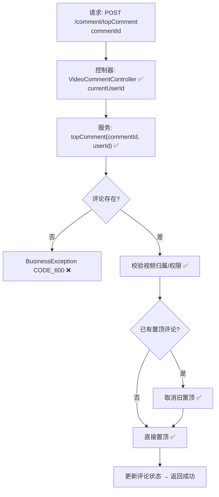

# 视频评论置顶流程设计文档

> 基于 easylive-java 项目需求，按照 DDD 事件驱动模式设计

## 📋 业务需求概述
视频作者（或管理员）对某条评论进行置顶操作，使其在评论列表中优先展示。系统需校验评论存在性、确认评论属于目标视频，并验证操作者对该视频拥有管理权限。若系列中已有其他置顶评论，应取消原置顶后再设置新的置顶。

---

## 📊 完整流程图

### ASCII 流程图
```
┌──────────────────────────────────────────────────────────┐
│ 请求：POST /comment/topComment                            │
│ Payload: { "commentId": 345678 }                          │
└────────────────────────────┬─────────────────────────────┘
                             ↓
┌──────────────────────────────────────────────────────────┐
│ 控制器：VideoCommentController#topComment ✅               │
│ 1. Token → currentUserId                                  │
│ 2. videoCommentService.topComment(commentId, userId)      │
└────────────────────────────┬─────────────────────────────┘
                             ↓
┌──────────────────────────────────────────────────────────┐
│ 服务：VideoCommentService.topComment ✅                    │
│ 1. 查询评论信息 → 获取 videoId & 作者信息                 │
│ 2. 验证 userId 是否为视频作者（或管理员）                 │
│ 3. 如果该视频已有置顶评论 → 先取消                        │
│ 4. 更新 comment.topType = TOP                             │
│ 5. 记录操作（可选：系统消息/日志）                        │
└──────────────────────────────────────────────────────────┘
```

### 场景
1. **作者置顶自己的视频评论**：操作成功，原置顶评论（如有）被取消，新评论置顶。
2. **越权置顶**：操作者不是视频作者，抛出业务异常（CODE_600）。
3. **评论不存在或已删除**：查询返回空，抛出业务异常（CODE_600）。

### Mermaid 流程图


---

## 📦 设计元素清单

### ✅ 已存在的设计
- 控制器：`VideoCommentController#topComment`（`easylive-java/.../VideoCommentController.java:227`）
- 服务接口：`VideoCommentService#topComment` & `cancelTopComment`（具体实现需查看 service）
- DDD 聚合：
  - `VideoComment` 聚合未显示，但相关命令/事件可在 `video_comment` 设计中查找  
  - `CommentTopTypeEnum` 枚举表示置顶状态  
  - 命令（需补充）：`TopVideoCommentCmd`、`CancelTopVideoCommentCmd`（假设存在或需添加）
- 现有流程使用传统 service 操作，未使用事件驱动。

---

## ❌ 缺失的设计清单

| 类型 | 缺失项 | 描述 | 建议位置 | 优先级 |
|------|--------|------|----------|-------|
| 命令 | `TopVideoCommentCmd` | 根据 commentId 设置置顶，并处理原置顶评论 | `design/aggregate/video_comment/_gen.json` | P0 |
| 命令 | `CancelTopVideoCommentCmd` | 取消置顶（用于已有置顶的情况） | 同上 | P0 |
| 验证器 | `@VideoCommentOwner` | 校验评论归属视频，并验证视频作者 | `only-danmuku-application/.../validator/` | P0 |
| 查询 | `GetVideoCommentDetailQry` | 根据 commentId 返回详情（含 videoId、作者） | `design/aggregate/video_comment/_gen.json` | P0 |
| 事件 | `VideoCommentTopChangedDomainEvent` | 置顶变更后通知前端刷新或记录日志 | `design/aggregate/video_comment/_gen.json` | P1 |
| 事件处理器 | `VideoCommentTopChangedEventHandler` | 刷新缓存、推送通知 | `only-danmuku-adapter/.../events/VideoCommentTopChangedEventHandler.kt` | P1 |

---

## 🔑 关键业务规则
- **权限**：只有视频作者或具备管理权限的用户可置顶评论。
- **唯一性**：每个视频最多只有一条置顶评论，置顶新评论时需取消旧的。
- **状态维护**：`VideoComment` 中应通过枚举或布尔字段表示置顶状态；取消置顶时恢复为普通状态。
- **展示同步**：置顶变更后应刷新客户端评论列表缓存（事件驱动）。
- **审计**：建议记录置顶操作日志（操作者、目标评论、时间）。

---

## 🧾 控制器与命令示例
```java
@RequestMapping("/topComment")
@GlobalInterceptor(checkLogin = true)
public ResponseVO topComment(@NotNull Integer commentId) {
    TokenUserInfoDto tokenUserInfoDto = getTokenUserInfoDto();
    videoCommentService.topComment(commentId, tokenUserInfoDto.getUserId());
    return getSuccessResponseVO(null);
}
```
> 参考：`easylive-java/easylive-web/src/main/java/com/easylive/web/controller/VideoCommentController.java:227`

```kotlin
// DDD 命令建议实现
val comment = Mediator.repositories.findFirst(
    SVideoComment.predicateById(request.commentId),
    persist = false
).getOrNull() ?: throw KnownException("评论不存在：${request.commentId}")
val video = comment.video ?: throw KnownException("评论无视频关联")
if (video.customerId != request.userId) {
    throw KnownException("无权置顶该评论")
}
video.updateTopComment(comment)
Mediator.uow.save()
```

---

## 📂 传统架构参考
- 控制器：`easylive-java/easylive-web/src/main/java/com/easylive/web/controller/VideoCommentController.java:227`
- 相关枚举：`CommentTopTypeEnum`
- 服务实现（需结合 `VideoCommentServiceImpl` 查看具体细节）

---

**文档版本**：v1.0  
**创建时间**：2025-10-22  
**维护者**：开发团队

