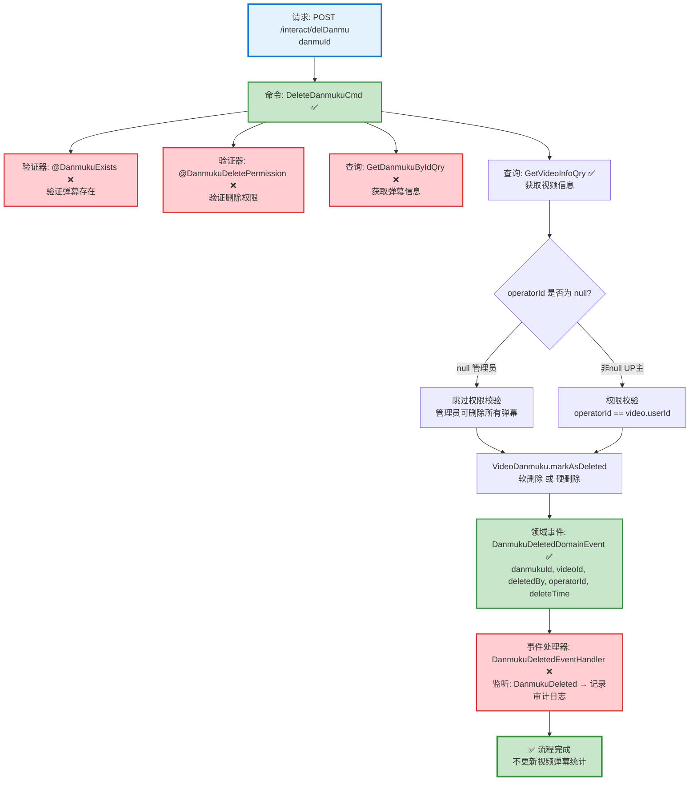

# 弹幕删除流程设计文档

> 基于 easylive-java 项目需求，按照 DDD 事件驱动模式设计

## 📋 业务需求概述

管理员删除违规弹幕，系统验证弹幕存在性、权限（管理员可删除所有，UP主只能删除自己视频的弹幕），删除弹幕记录，不更新视频弹幕统计（管理删除不影响统计）。

---

## 📊 完整流程图

### ASCII 流程图

```
┌─────────────────────────────────────────────────────────────────┐
│ 请求：POST /interact/delDanmu                                    │
│ Payload:                                                        │
│ {                                                               │
│   "danmuId": 123456                                             │
│ }                                                               │
│                                                                 │
│ 场景：                                                           │
│   - 管理员删除违规弹幕（管理后台）                                │
│   - UP主删除自己视频的弹幕（用户端）                               │
└────────────────────────────┬────────────────────────────────────┘
                             ↓
┌─────────────────────────────────────────────────────────────────┐
│ 命令：DeleteDanmukuCmd                                           │
│ 状态：✅ 已定义 (design/aggregate/video_danmuku/_gen.json:10)   │
│                                                                 │
│ 命令参数：                                                       │
│   - danmuId: Long                                               │
│   - operatorId: Long? (可选，用于UP主权限校验)                   │
│                                                                 │
│ 验证器：                                                         │
│   ├─ @DanmukuExists ✅ (验证弹幕存在)                            │
│   └─ @DanmukuDeletePermission ✅ (验证删除权限)                  │
│                                                                 │
│ 处理逻辑：                                                       │
│   1. 查询弹幕信息 GetDanmukuByIdQry ❌                            │
│      - 如果不存在 → 抛出异常 "弹幕不存在"                         │
│   2. 查询视频信息 GetVideoInfoQry ✅                             │
│      - 验证视频存在性                                            │
│   3. 权限校验 (如果 operatorId 不为 null):                       │
│      - 检查 operatorId == video.userId                          │
│      - 如果不匹配 → 抛出异常 "无权限删除该弹幕"                    │
│      - 管理员操作时 operatorId = null，跳过权限校验               │
│   4. VideoDanmuku.markAsDeleted()                               │
│      - 软删除：设置 status = DELETED                             │
│      - 或硬删除：直接从数据库移除                                 │
│   5. Mediator.uow.save()                                        │
└────────────────────────────┬────────────────────────────────────┘
                             ↓
┌─────────────────────────────────────────────────────────────────┐
│ 领域事件：DanmukuDeletedDomainEvent                              │
│ 状态：✅ 已定义 (design/aggregate/video_danmuku/_gen.json:37)   │
│                                                                 │
│ 事件载荷：                                                       │
│ {                                                               │
│   "danmukuId": 123456,                                          │
│   "videoId": "V123456789",                                      │
│   "deletedBy": "admin" | "uploader",  // 删除者类型              │
│   "operatorId": "U001" | null,        // 操作者ID                │
│   "deleteTime": 1729267200                                      │
│ }                                                               │
└────────────────────────────┬────────────────────────────────────┘
                             ↓
┌─────────────────────────────────────────────────────────────────┐
│ 事件处理器：DanmukuDeletedEventHandler ❌                        │
│ 监听事件：DanmukuDeletedDomainEvent                              │
│ 触发命令：无 (管理删除不更新统计)                                 │
│ 实现路径：adapter/.../events/DanmukuDeletedEventHandler.kt     │
│                                                                 │
│ 处理逻辑：                                                       │
│   - 记录审计日志 (管理操作日志)                                   │
│   - 可选：通知视频UP主 (弹幕被管理员删除)                          │
│   - 不更新视频弹幕统计 (与用户自然删除不同)                        │
└─────────────────────────────────────────────────────────────────┘
                             ↓
                      ✅ 删除流程完成
```

---

### Mermaid 可视化流程图



**图例说明**：
- 🔵 蓝色：请求入口
- 🟢 绿色：已存在的设计（✅ 可直接使用）
- 🔴 红色：缺失的设计（❌ 需实现）

---

## 📦 设计元素清单

### ✅ 已存在的设计

#### 命令 (Commands)

| 命令 | 描述 | 状态 | 位置 |
|------|------|------|------|
| `DeleteDanmukuCmd` | 删除弹幕 | ✅ 已定义 | `design/aggregate/video_danmuku/_gen.json:10` |
| `BatchDeleteDanmukuCmd` | 批量删除弹幕 | ✅ 已定义 | `design/aggregate/video_danmuku/_gen.json:15` |

#### 领域事件 (Domain Events)

| 事件 | 描述 | 触发时机 | 状态 | 位置 |
|------|------|----------|------|------|
| `DanmukuDeletedDomainEvent` | 弹幕已删除 | 弹幕删除后 | ✅ 已定义 | `design/aggregate/video_danmuku/_gen.json:37` |
| `DanmukuBatchDeletedDomainEvent` | 弹幕已批量删除 | 批量删除弹幕后 | ✅ 已定义 | `design/aggregate/video_danmuku/_gen.json:47` |

#### 查询 (Queries)

| 查询 | 描述 | 状态 | 位置 |
|------|------|------|------|
| `GetVideoInfoQry` | 获取视频信息 | ✅ 已定义 | `design/aggregate/video/_gen.json:94` |
| `GetDanmukuListQry` | 获取弹幕列表 | ✅ 已定义 | `design/aggregate/video_danmuku/_gen.json:59` |

---

### ❌ 缺失的设计清单

#### 需要补充的查询

| 序号 | 查询名称 | 描述 | 返回值 | 建议位置 | 优先级 |
|-----|---------|------|--------|----------|-------|
| 1 | `GetDanmukuByIdQry` | 根据ID获取弹幕 | `{ danmukuId, videoId, customerId, content, postTime, fileId }` | `design/extra/danmuku_query_gen.json` | P0 |

> 当前命令通过仓储直接校验弹幕存在性，若后续需要读模型复用，再考虑补充该查询。

**JSON 定义**（需新增到 `design/extra/danmuku_query_gen.json`）：
```json
{
  "qry": [
    {
      "package": "video_danmuku",
      "name": "GetDanmukuById",
      "desc": "根据ID获取弹幕"
    }
  ]
}
```

#### 需要补充的验证器

| 序号 | 验证器名称                      | 描述              | 实现路径                                                                                                          | 状态 |
|----|----------------------------|-----------------|---------------------------------------------------------------------------------------------------------------|----|
| 1  | `@DanmukuExists`           | 验证弹幕存在          | `only-danmuku-application/src/main/kotlin/edu/only4/danmuku/application/validater/DanmukuExists.kt`           | ✅  |
| 2  | `@DanmukuDeletePermission` | 验证删除权限（UP主或管理员） | `only-danmuku-application/src/main/kotlin/edu/only4/danmuku/application/validater/DanmukuDeletePermission.kt` | ✅  |

#### 需要补充的事件处理器

| 序号 | 处理器名称 | 监听事件 | 触发命令 | 实现路径 | 优先级 |
|-----|-----------|----------|----------|----------|-------|
| 1 | `DanmukuDeletedEventHandler` | `DanmukuDeletedDomainEvent` | 无（仅记录日志） | `adapter/.../events/DanmukuDeletedEventHandler.kt` | P1 |

**优先级说明**：
- **P0**：核心功能，必须实现
- **P1**：重要功能，建议实现
- **P2**：可选功能，后续扩展

---

## 🔑 关键业务规则

### 1. 删除权限控制
- **管理员删除**（管理后台）：
  - `operatorId = null`
  - 可删除任何弹幕，无需权限校验
  - 用于处理违规内容

- **UP主删除**（用户端）：
  - `operatorId = 当前用户ID`
  - 只能删除自己视频的弹幕
  - 权限校验：`operatorId == video.userId`
  - 校验失败 → 抛出异常 "无权限删除该弹幕"

### 2. 删除与统计的关系
- **管理删除**：不更新视频弹幕统计
  - 原因：违规弹幕删除不应影响视频数据
  - 实现：事件处理器不触发统计更新命令

- **用户删除**（如果有此场景）：需更新统计
  - 发送 `UpdateVideoStatisticsCmd`
  - 弹幕数 -1

**注意**：根据 easylive-java 的实现（`VideoDanmuServiceImpl.deleteDanmu:246`），当前删除操作**不更新统计**，这是合理的设计，因为：
- 管理删除是内容审核行为，不应影响视频真实数据
- 用户一般不能删除自己发送的弹幕（只有UP主和管理员可删除）

### 3. 软删除 vs 硬删除
**推荐：软删除**
- 设置 `status = DELETED` 或 `isDeleted = true`
- 保留数据用于审计和追溯
- 查询时过滤已删除记录

**硬删除**（easylive-java 当前实现）：
- 直接从数据库移除记录
- 实现简单，但无法追溯
- 适用于隐私合规要求

### 4. 弹幕存在性校验
- **查询顺序**：
  1. 根据 `danmuId` 查询弹幕 → `GetDanmukuByIdQry`
  2. 根据 `videoId` 查询视频 → `GetVideoInfoQry`
  3. 验证两者都存在

- **校验失败**：抛出 `CODE_600` 异常（数据不存在）

### 5. 审计日志
- **记录内容**：
  - 删除时间：`deleteTime`
  - 删除者类型：`deletedBy = "admin" | "uploader"`
  - 操作者ID：`operatorId`
  - 被删除弹幕信息：`danmukuId, videoId, content`

- **用途**：
  - 管理员操作追溯
  - 纠纷处理证据
  - 数据恢复依据

---

## 📊 Controller 层实现示例

### 管理后台删除

```kotlin
@RestController
@RequestMapping("/admin/interact")
class AdminInteractController {

    @PostMapping("/delDanmu")
    fun delDanmu(
        @RequestParam @NotNull danmuId: Int
    ): Response {
        // 管理员删除：operatorId = null，无权限限制
        Mediator.commands.send(
            DeleteDanmukuCmd.Request(
                danmuId = danmuId,
                operatorId = null  // 管理员标识
            )
        )
        return Response()
    }
}
```

### 用户端删除（UP主删除自己视频的弹幕）

```kotlin
@RestController
@RequestMapping("/api/interact")
class UserInteractController {

    @PostMapping("/delDanmu")
    fun delDanmu(
        @RequestParam @NotNull danmuId: Int
    ): Response {
        val currentUserId = LoginHelper.getUserId()!!

        // UP主删除：需验证权限
        Mediator.commands.send(
            DeleteDanmukuCmd.Request(
                danmuId = danmuId,
                operatorId = currentUserId  // 当前用户ID
            )
        )
        return Response()
    }
}
```

---

## 📌 设计优势

### **权限分离设计**

通过 `operatorId` 参数区分管理员和UP主删除：

1. **灵活的权限控制**：
   - `operatorId = null` → 管理员模式（无限制）
   - `operatorId = userId` → UP主模式（需校验权限）

2. **单一命令多场景**：
   - 一个 `DeleteDanmukuCmd` 支持两种删除场景
   - 避免创建 `AdminDeleteDanmukuCmd` 和 `UploaderDeleteDanmukuCmd`

3. **审计追溯**：
   - 事件载荷中记录 `deletedBy` 和 `operatorId`
   - 清晰区分删除来源

4. **符合 DDD**：
   - 权限校验通过验证器实现（`@DanmukuDeletePermission`）
   - 业务规则封装在聚合方法中（`markAsDeleted()`）

---

## 🔄 对比：用户删除弹幕 vs 管理删除弹幕

| 特性 | 用户删除（如果支持） | 管理删除（当前需求） |
|------|---------------------|---------------------|
| **权限** | 只能删除自己发送的弹幕 | 可删除任何弹幕 |
| **统计更新** | 需要更新视频弹幕数 -1 | 不更新统计 |
| **事件处理** | 触发 `UpdateVideoStatisticsCmd` | 仅记录审计日志 |
| **场景** | 用户撤回/编辑弹幕 | 违规内容处理 |
| **operatorId** | `customerId`（发送者） | `null`（管理员）或 `userId`（UP主） |

**当前需求**：管理删除弹幕（管理后台 + UP主端）

---

## 🧩 扩展设计：批量删除弹幕

如果需要批量删除违规弹幕（例如删除某个用户的所有弹幕），可使用已定义的 `BatchDeleteDanmukuCmd`：

```kotlin
@PostMapping("/batchDelDanmu")
fun batchDelDanmu(
    @RequestParam customerId: String?,
    @RequestParam videoId: String?
): Response {
    Mediator.commands.send(
        BatchDeleteDanmukuCmd.Request(
            customerId = customerId,  // 删除某用户的所有弹幕
            videoId = videoId,        // 删除某视频的所有弹幕
            operatorId = null         // 管理员操作
        )
    )
    return Response()
}
```

**批量删除事件**：
- 触发 `DanmukuBatchDeletedDomainEvent`
- 事件处理器：记录批量操作日志，可选通知用户

---

**文档版本**：v1.1  
**创建时间**：2025-10-22  
**维护者**：开发团队  
**近期变更**：补充 @DanmukuExists、@DanmukuDeletePermission 校验器并同步命令参数说明。
