# 用户侧弹幕删除流程设计文档

> 基于 easylive-java 用户中心需求，按照 DDD 事件驱动模式设计

## 📋 业务需求概述
视频作者在个人中心删除自己视频下的弹幕，需要校验弹幕与视频存在性、确认操作者确为该视频的 UP 主，并在删除后维持数据一致性（弹幕记录、统计、搜索结果、审计信息）。

---

## 📊 完整流程图

### ASCII 流程图
```
┌──────────────────────────────────────────────────────────┐
│ 请求：POST /ucenter/delDanmu                              │
│ Payload: { "danmuId": 123456 }                            │
└────────────────────────────┬─────────────────────────────┘
                             ↓
┌──────────────────────────────────────────────────────────┐
│ 控制器：UCenterInteractController#delDanmu ✅              │
│ 1. 从 Token 获取当前用户 userId                          │
│ 2. videoDanmuService.deleteDanmu(userId, danmuId)         │
└────────────────────────────┬─────────────────────────────┘
                             ↓
┌──────────────────────────────────────────────────────────┐
│ 服务：VideoDanmuServiceImpl#deleteDanmu ✅                │
│ 1. 根据 danmuId 查询弹幕（不存在 → CODE_600）              │
│ 2. 根据 videoId 查询视频（不存在 → CODE_600）             │
│ 3. 当 userId != null 时，校验 video.userId == userId       │
│    └─ 不匹配 → CODE_600（无权限）                         │
│ 4. 删除弹幕（video_danmu.deleteByDanmuId）                │
│ 5. ❌ 未更新弹幕计数、未同步 ES、未记录审计               │
└──────────────────────────────────────────────────────────┘
```

### 场景 #1：UP 主删除自己的弹幕
```
用户登录 → delDanmu
    ├─ 校验弹幕 / 视频存在
    ├─ 校验 video.userId == currentUserId
    └─ 删除弹幕记录，响应成功 (200)
```

### 场景 #2：越权删除
```
请求者不是视频作者 → 校验失败
    └─ 抛出 BusinessException CODE_600
```

### 场景 #3：弹幕不存在
```
selectByDanmuId(danmuId) == null
    └─ 抛出 BusinessException CODE_600
```

### Mermaid 流程图

```mermaid
graph TD
    A["请求: POST /ucenter/delDanmu<br/>danmuId"] --> B["控制器: UCenterInteractController ✅<br/>获取 currentUserId"]
    B --> C["服务: VideoDanmuServiceImpl.deleteDanmu ✅"]

    C --> C1{"弹幕存在?"}
    C1 -->|否| C2["BusinessException CODE_600 ❌"]
    C1 -->|是| C3["查询视频 ✅"]
    C3 --> C4{"video.userId == currentUserId?"}
    C4 -->|否| C5["BusinessException CODE_600 ❌"]
    C4 -->|是| C6["deleteByDanmuId ✅"]
    C6 --> C7["完成响应（未更新计数/ES） ⚪"]

    style A fill:#E3F2FD,stroke:#1976D2,stroke-width:3px
    style B fill:#C8E6C9,stroke:#388E3C,stroke-width:2px
    style C fill:#C8E6C9,stroke:#388E3C,stroke-width:2px
    style C6 fill:#C8E6C9,stroke:#388E3C,stroke-width:2px
    style C7 fill:#FFF9C4,stroke:#FBC02D,stroke-width:2px
    style C2 fill:#FFCDD2,stroke:#D32F2F,stroke-width:2px
    style C5 fill:#FFCDD2,stroke:#D32F2F,stroke-width:2px
```


---

## 📦 设计元素清单

### ✅ 已存在的设计

#### 命令 (Commands)
| 命令 | 描述 | 状态 | 位置 |
|------|------|------|------|
| `DeleteDanmukuCmd` | 删除弹幕 | ✅ 已定义 | `design/aggregate/video_danmuku/_gen.json:10` |
| `BatchDeleteDanmukuCmd` | 批量删除弹幕 | ✅ 已定义 | `design/aggregate/video_danmuku/_gen.json:15` |

#### 领域事件 (Domain Events)
| 事件 | 描述 | 触发时机 | 状态 | 位置 |
|------|------|----------|------|------|
| `DanmukuDeletedDomainEvent` | 弹幕被删除 | ⚪ 定义未触发 | `design/aggregate/video_danmuku/_gen.json:37` |

#### 查询 (Queries)
| 查询 | 描述 | 状态 | 位置 |
|------|------|------|------|
| `GetDanmukuPageQry` | 按视频作者分页获取弹幕 | ✅ 已定义 | `only-danmuku/only-danmuku-application/src/main/kotlin/edu/only4/danmuku/application/queries/video_danmuku/GetDanmukuPageQry.kt` |
| `SearchVideosQry` | 查询作者视频列表 | ✅ 已定义 | `only-danmuku/only-danmuku-application/src/main/kotlin/edu/only4/danmuku/application/queries/video/SearchVideosQry.kt` |

---

## ❌ 缺失的设计清单

#### 需要补充的命令 (Commands)
| 序号 | 命令名称 | 描述 | 建议位置 | 优先级 |
|-----|---------|------|----------|-------|
| 1 | `DeleteDanmukuCmd` 参数扩展 | 增加 `operatorId`，在命令层完成权限校验 | `design/aggregate/video_danmuku/_gen.json` | P0 |
| 2 | `SyncDanmukuMetricsCmd` | 删除后同步弹幕计数、ES 索引 | `design/extra/video_danmuku_gen.json` | P1 |

#### 需要补充的领域事件 (Domain Events)
| 序号 | 事件名称 | 描述 | 触发时机 | 建议位置 | 优先级 |
|-----|---------|------|----------|----------|-------|
| 1 | `DanmukuDeletedDomainEvent` | 删除弹幕后由聚合发布，驱动后续清理 | `design/aggregate/video_danmuku/_gen.json` | P0 |

#### 需要补充的查询 (Queries)
| 序号 | 查询名称 | 描述 | 返回值 | 建议位置 | 优先级 |
|-----|---------|------|--------|----------|-------|
| 1 | `GetDanmukuByIdQry` | 根据弹幕 ID 获取详情（含视频/作者） | `DanmukuDetail` | `design/aggregate/video_danmuku/_gen.json` | P0 |

#### 需要补充的验证器 (Validators)
| 序号 | 验证器名称 | 描述 | 依赖查询 | 实现路径 | 优先级 |
|-----|-----------|------|----------|----------|-------|
| 1 | `@DanmukuExists` | 校验弹幕存在性 | `GetDanmukuByIdQry` | `only-danmuku-application/.../validator/` | P0 |
| 2 | `@DanmukuDeletePermission` | 校验操作者与视频作者一致 | `GetDanmukuByIdQry` | `only-danmuku-application/.../validator/` | P0 |

#### 需要补充的事件处理器 (Event Handlers)
| 序号 | 处理器名称 | 监听事件 | 触发命令 | 实现路径 | 优先级 |
|-----|-----------|----------|----------|----------|-------|
| 1 | `DanmukuDeletedEventHandler` | `DanmukuDeletedDomainEvent` | `SyncDanmukuMetricsCmd`、审计日志写入 | `only-danmuku-adapter/.../events/DanmukuDeletedEventHandler.kt` | P0 |

**优先级说明**：
- **P0**：保证用户侧删除安全、合规所必需
- **P1**：建议尽快补齐的同步/统计能力
- **P2**：可选增强能力

---

## 🔑 关键业务规则
- **权限限制**：仅视频作者可删除弹幕；管理员另有后台接口。命令需要 `operatorId` 来校验 `video.userId`。
- **数据一致性**：删除后需考虑更新弹幕数量、搜索索引或缓存（现有实现未处理）。
- **异常提示**：若弹幕或视频不存在，统一返回 CODE_600；越权操作同样返回 CODE_600。
- **审计追踪**：建议在事件处理中记录删除原因（违规、人工调试等）以满足运营与风控需求。
- **幂等性**：同一弹幕重复删除应安全返回。可通过软删标记或幂等校验实现。

---

## 🧾 控制器与命令示例
```java
// 用户端控制器（传统实现）
@RequestMapping("/delDanmu")
@GlobalInterceptor(checkLogin = true)
public ResponseVO delDanmu(@NotNull Integer danmuId) {
    TokenUserInfoDto tokenUserInfoDto = getTokenUserInfoDto();
    videoDanmuService.deleteDanmu(tokenUserInfoDto.getUserId(), danmuId);
    return getSuccessResponseVO(null);
}
```
> 参考：`easylive-java/easylive-web/src/main/java/com/easylive/web/controller/UCenterInteractController.java:154`

```kotlin
// DDD 控制器（当前实现缺少 operatorId）
@PostMapping("/delDanmu")
fun delDanmu(@RequestBody @Validated request: UCenterDelDanmu.Request): UCenterDelDanmu.Response {
    Mediator.commands.send(
        DeleteDanmukuCmd.Request(
            danmukuId = request.danmuId.toLong()
        )
    )
    return UCenterDelDanmu.Response()
}
```
> 参考：`only-danmuku/only-danmuku-adapter/src/main/kotlin/edu/only4/danmuku/adapter/portal/api/UCenterInteractController.kt:158`

```kotlin
// 命令处理器（缺少权限校验与事件触发）
val danmuku = Mediator.repositories.findFirst(
    SVideoDanmuku.predicateById(request.danmukuId),
    persist = false
).getOrNull() ?: throw KnownException("弹幕不存在：${request.danmukuId}")

Mediator.repositories.remove(SVideoDanmuku.predicateById(danmuku.id))
Mediator.uow.save()
```
> 参考：`only-danmuku/only-danmuku-application/src/main/kotlin/edu/only4/danmuku/application/commands/video_danmuku/DeleteDanmukuCmd.kt:18`

---

## 📂 传统架构参考
- 控制器：`easylive-java/easylive-web/src/main/java/com/easylive/web/controller/UCenterInteractController.java:154`
- 服务实现：`easylive-java/easylive-common/src/main/java/com/easylive/service/impl/VideoDanmuServiceImpl.java:225`
- Mapper 删除：`easylive-java/easylive-common/src/main/resources/com/easylive/mappers/VideoDanmuMapper.xml:419`

---

**文档版本**：v1.0  
**创建时间**：2025-10-22  
**维护者**：开发团队

