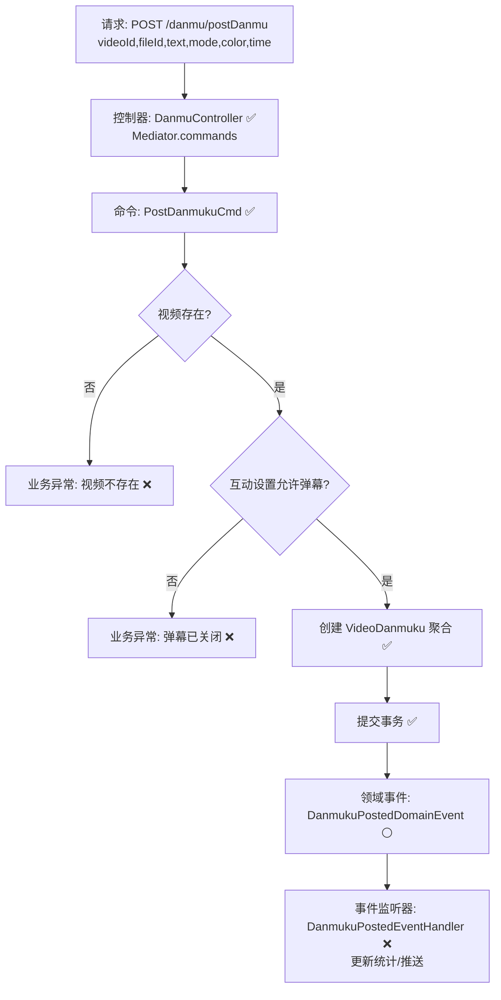

# 视频弹幕发送流程设计文档

> 基于 easylive-java 用户端需求，按照 DDD 事件驱动模式设计

## 📋 业务需求概述
登录用户在播放视频时发送弹幕，需验证视频存在、弹幕功能未关闭，并校验弹幕内容（文本长度、颜色、时间点等），最终写入弹幕表并同步前台展示。

---

## 📊 完整流程图

### ASCII 流程图
```
┌──────────────────────────────────────────────────────────┐
│ 请求：POST /danmu/postDanmu                               │
│ Payload: {                                                │
│   "videoId": "V123",                                      │
│   "fileId": "F001",                                       │
│   "text": "这是弹幕",                                      │
│   "mode": 1,                                              │
│   "color": "#FFFFFF",                                     │
│   "time": 12                                              │
│ }                                                         │
└────────────────────────────┬─────────────────────────────┘
                             ↓
┌──────────────────────────────────────────────────────────┐
│ 控制器：DanmuController#danmukuPost ✅                    │
│ 1. Token → currentUserId                                  │
│ 2. Mediator.commands.send(PostDanmukuCmd.Request)         │
└────────────────────────────┬─────────────────────────────┘
                             ↓
┌──────────────────────────────────────────────────────────┐
│ 命令：PostDanmukuCmd ✅                                     │
│ 验证：                                                      │
│   - @VideoExists                                            │
│   - @CommentNotClosed / @DanmukuInteractionAllowed ✅        │
│   - 文本/颜色等格式校验 ✅                                  │
│ 流程：                                                      │
│   1. 校验视频、互动设置                                     │
│   2. 创建 VideoDanmuku 聚合（factory）                      │
│   3. Mediator.uow.save()                                    │
└────────────────────────────┬─────────────────────────────┘
                             ↓
┌──────────────────────────────────────────────────────────┐
│ 领域事件：DanmukuPostedDomainEvent ⚪                       │
│ → 驱动更新统计、推送弹幕、审计等能力                       │
└──────────────────────────────────────────────────────────┘
```

### 场景
1. **正常发送**：视频存在且未关闭弹幕 → 弹幕后端记录成功。
2. **视频关闭弹幕**：`interaction` 包含 `0` → 抛出 “UP主已关闭弹幕”。
3. **视频不存在 / 评论不存在**：抛 `CODE_600`。

### Mermaid 流程图


---

## 📦 设计元素清单

### ✅ 已存在的设计

- 控制器：`DanmuController#danmukuPost` 使用 Mediator 调用命令（`only-danmuku-adapter/.../DanmuController.kt`）
- 命令：`PostDanmukuCmd`（`only-danmuku-application/.../commands/video_danmuku/PostDanmukuCmd.kt`）
- 聚合：`VideoDanmuku` 工厂负责创建并持久化弹幕实体
- 校验器：`@VideoExists`、`@DanmukuInteractionAllowed`、`@DanmukuTextFormat` 等可复用能力

### ❌ DDD 需补充的能力

| 类型    | 能力                           | 描述                  | 位置                                                                                                              | 状态 |
|-------|------------------------------|---------------------|-----------------------------------------------------------------------------------------------------------------|----|
| 验证器   | `@DanmukuInteractionAllowed` | 校验视频互动设置是否允许弹幕      | `only-danmuku-application/src/main/kotlin/edu/only4/danmuku/application/validater/DanmukuInteractionAllowed.kt` | ✅  |
| 验证器   | `@DanmukuTextFormat`         | 校验弹幕文本/颜色/模式        | `only-danmuku-application/src/main/kotlin/edu/only4/danmuku/application/validater/DanmukuTextFormat.kt`         | ✅  |
| 事件    | `DanmukuPostedDomainEvent`   | 弹幕发送后驱动统计/通知        | `design/aggregate/video_danmuku/_gen.json`                                                                      | P1 |
| 事件处理器 | `DanmukuPostedEventHandler`  | 刷新弹幕缓存、推送 WebSocket | `only-danmuku-adapter/.../events/DanmukuPostedEventHandler.kt`                                                  | P1 |

---

## 🔑 关键业务规则

- **互动设置校验**：视频 `interaction` 包含 `0` 表示弹幕关闭；`@DanmukuInteractionAllowed` 会阻止发送。
- **文本与参数限制**：文本长度 ≤ 200，颜色为合法 hex 格式；`@DanmukuTextFormat` 统一校验文本、颜色、模式和时间。
- **回复评论处理**：若是回复弹幕，需校验目标评论存在且属于当前视频，补充回复对象昵称/头像。
- **统计同步**：发送弹幕时更新视频弹幕数、ES 索引等；DDD 中需通过事件或命令完成。
- **异常处理**：若视频/评论不存在，统一抛 `CODE_600`。
- **防刷机制**：可考虑增加频率限制、敏感词过滤等（当前实现未覆盖，建议扩展）。

---

## 🧾 控制器与命令示例
```kotlin
@PostMapping("/postDanmu")
fun danmukuPost(@RequestBody @Validated request: DanmukuPost.Request): DanmukuPost.Response {
    Mediator.commands.send(
        PostDanmukuCmd.Request(
            videoId = request.videoId.toLong(),
            fileId = request.fileId.toLong(),
            customerId = LoginHelper.getUserId()!!,
            text = request.text,
            mode = request.mode ?: 1,
            color = request.color,
            time = request.time ?: 0
        )
    )
    return DanmukuPost.Response()
}
```

> 参考：`only-danmuku-adapter/src/main/kotlin/edu/only4/danmuku/adapter/portal/api/DanmuController.kt`

```kotlin
Mediator.factories.create(
    VideoDanmukuFactory.Payload(
        videoId = request.videoId,
        fileId = request.fileId,
        customerId = request.customerId,
        postTime = System.currentTimeMillis() / 1000,
        text = request.text,
        mode = request.mode != 0,
        color = request.color,
        time = request.time
    )
)
Mediator.uow.save()
```

> 参考：`only-danmuku-application/src/main/kotlin/edu/only4/danmuku/application/commands/video_danmuku/PostDanmukuCmd.kt`

----

## 📂 传统架构参考
- 控制器：`easylive-java/easylive-web/src/main/java/com/easylive/web/controller/VideoDanmuController.java:61`
- 服务实现：`easylive-java/easylive-common/src/main/java/com/easylive/service/impl/VideoDanmuServiceImpl.java:200`
- 弹幕表定义：`video_danmuku`

----

**文档版本**：v1.1  
**创建时间**：2025-10-22  
**维护者**：开发团队  
**近期变更**：流程改为请求→命令→事件，更新现有命令与待补能力说明。

