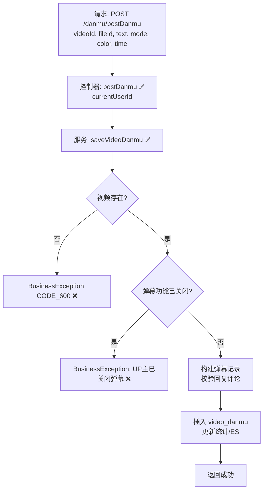

# 视频弹幕发送流程设计文档

> 基于 easylive-java 用户端需求，按照 DDD 事件驱动模式设计

## 📋 业务需求概述
登录用户在播放视频时发送弹幕，需验证视频存在、弹幕功能未关闭，并校验弹幕内容（文本长度、颜色、时间点等），最终写入弹幕表并同步前台展示。

---

## 📊 完整流程图

### ASCII 流程图
```
┌──────────────────────────────────────────────────────────┐
│ 请求：POST /danmu/postDanmu                               │
│ Payload: {                                                │
│   "videoId": "V123",                                      │
│   "fileId": "F001",                                       │
│   "text": "这是弹幕",                                      │
│   "mode": 1,                                              │
│   "color": "#FFFFFF",                                     │
│   "time": 12                                              │
│ }                                                         │
└────────────────────────────┬─────────────────────────────┘
                             ↓
┌──────────────────────────────────────────────────────────┐
│ 控制器：VideoDanmuController#postDanmu ✅                  │
│ 1. Token → currentUserId                                  │
│ 2. 构建 VideoDanmu 实体（纪录用户、时间、颜色等）          │
│ 3. 调用 videoDanmuService.saveVideoDanmu                  │
└────────────────────────────┬─────────────────────────────┘
                             ↓
┌──────────────────────────────────────────────────────────┐
│ 服务：VideoDanmuServiceImpl#saveVideoDanmu ✅             │
│ 1. 查询视频 videoInfo                                     │
│    └─ 不存在 → CODE_600                                   │
│ 2. 判断视频互动配置（interaction 包含 "0" → 禁止弹幕）     │
│ 3. 若 replyCommentId 不为空 → 校验评论存在及归属          │
│ 4. 设置视频作者信息、发布时间等                           │
│ 5. 插入 video_danmu 记录                                  │
│ 6. 更新视频弹幕统计、同步 ES                              │
└──────────────────────────────────────────────────────────┘
```

### 场景
1. **正常发送**：视频存在且未关闭弹幕 → 弹幕后端记录成功。
2. **视频关闭弹幕**：`interaction` 包含 `0` → 抛出 “UP主已关闭弹幕”。
3. **视频不存在 / 评论不存在**：抛 `CODE_600`。

### Mermaid 流程图


---

## 📦 设计元素清单

### ✅ 已存在的设计
- Controller：`VideoDanmuController#postDanmu`（`easylive-java/.../VideoDanmuController.java:61`）
- Service 逻辑：`VideoDanmuServiceImpl#saveVideoDanmu`（`easylive-java/.../VideoDanmuServiceImpl.java:200`）
- 校验点：视频存在、互动设置、回复评论有效性、视频作者信息填充。

### ❌ DDD 需补充的能力

| 类型 | 缺失项 | 描述 | 建议位置 | 优先级 |
|------|--------|------|----------|-------|
| 命令 | `PostDanmukuCmd` | 处理弹幕发送、权限校验、统计更新 | `design/aggregate/video_danmuku/_gen.json` | P0 |
| 验证器 | `@VideoExists` | 校验视频存在 | `only-danmuku-application/.../validator/` | P0 |
| 验证器 | `@DanmukuInteractionAllowed` | 校验视频互动设置 | 同上 | P0 |
| 验证器 | `@DanmukuTextFormat` | 校验弹幕文本/颜色/模式 | 同上 | P1 |
| 查询 | `GetVideoInfo` | 复用视频查询；需确保命令使用 | `design/aggregate/video/_gen.json` | P0 |
| 事件 | `VideoDanmukuPostedDomainEvent` | 弹幕发送后触发通知/缓存刷新 | `design/aggregate/video_danmuku/_gen.json` | P1 |
| 事件处理器 | `VideoDanmukuPostedEventHandler` | 刷新弹幕缓存、推送 WebSocket | `only-danmuku-adapter/.../events/VideoDanmukuPostedEventHandler.kt` | P1 |

---

## 🔑 关键业务规则
- **互动设置校验**：视频 `interaction` 包含 `0` 表示弹幕关闭；须阻止发送。
- **文本与参数限制**：文本长度 ≤ 200，颜色为合法 hex 格式；需在接口或命令层校验。
- **回复评论处理**：若是回复弹幕，需校验目标评论存在且属于当前视频，补充回复对象昵称/头像。
- **统计同步**：发送弹幕时更新视频弹幕数、ES 索引等；DDD 中需通过事件或命令完成。
- **异常处理**：若视频/评论不存在，统一抛 `CODE_600`。
- **防刷机制**：可考虑增加频率限制、敏感词过滤等（当前实现未覆盖，建议扩展）。

---

## 🧾 控制器与命令示例
```java
@RequestMapping("/postDanmu")
@GlobalInterceptor(checkLogin = true)
public ResponseVO postDanmu(@NotEmpty String videoId,
                            @NotEmpty String fileId,
                            @NotEmpty @Size(max = 200) String text,
                            @NotNull Integer mode,
                            @NotEmpty String color,
                            @NotNull Integer time) {
    VideoDanmu videoDanmu = new VideoDanmu();
    videoDanmu.setVideoId(videoId);
    videoDanmu.setFileId(fileId);
    videoDanmu.setText(text);
    videoDanmu.setMode(mode);
    videoDanmu.setColor(color);
    videoDanmu.setTime(time);
    TokenUserInfoDto userInfo = getTokenUserInfoDto();
    if (userInfo == null) {
        return getServerErrorResponseVO("用户未登录");
    }
    videoDanmu.setUserId(userInfo.getUserId());
    videoDanmu.setPostTime(new Date());
    videoDanmuService.saveVideoDanmu(videoDanmu);
    return getSuccessResponseVO(null);
}
```
> 参考：`easylive-java/easylive-web/src/main/java/com/easylive/web/controller/VideoDanmuController.java:61`

```kotlin
// DDD 命令建议实现
val video = Mediator.repositories.findFirst(
    SVideo.predicateById(request.videoId),
    persist = false
).getOrNull() ?: throw KnownException("视频不存在：${request.videoId}")
if (video.interaction.contains("0")) {
    throw KnownException("UP主已关闭弹幕")
}
val danmuku = Mediator.factories.create(VideoDanmukuFactory.Payload(
    videoId = request.videoId,
    userId = request.userId,
    text = request.text,
    mode = request.mode,
    color = request.color,
    time = request.time
))
Mediator.uow.save()
```

---

## 📂 传统架构参考
- 控制器：`easylive-java/easylive-web/src/main/java/com/easylive/web/controller/VideoDanmuController.java:61`
- 服务实现：`easylive-java/easylive-common/src/main/java/com/easylive/service/impl/VideoDanmuServiceImpl.java:200`
- 弹幕表定义：`video_danmuku`

---

**文档版本**：v1.0  
**创建时间**：2025-10-22  
**维护者**：开发团队

