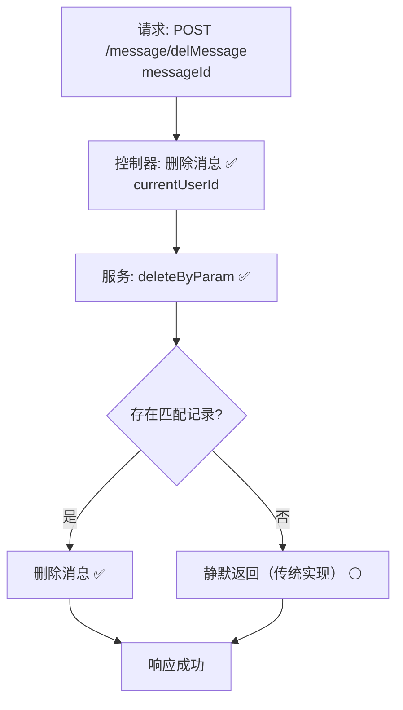

# 用户消息删除流程设计文档

> 基于 easylive-java 用户中心需求，按照 DDD 事件驱动模式设计

## 📋 业务需求概述
已登录用户在消息中心删除指定消息，系统需校验消息归属，仅允许删除属于当前用户的消息，并确保删除结果能及时反馈给前端（未读数、列表刷新）。

---

## 📊 完整流程图

### ASCII 流程图
```
┌──────────────────────────────────────────────────────────┐
│ 请求：POST /message/delMessage                           │
│ Payload: { "messageId": 802001 }                         │
└────────────────────────────┬─────────────────────────────┘
                             ↓
┌──────────────────────────────────────────────────────────┐
│ 控制器：UserMessageContrller#delMessage ✅                 │
│ 1. Token → currentUserId                                  │
│ 2. 构造 UserMessageQuery(userId=currentUserId, messageId) │
│ 3. 调用 userMessageService.deleteByParam(query)           │
└────────────────────────────┬─────────────────────────────┘
                             ↓
┌──────────────────────────────────────────────────────────┐
│ 服务：UserMessageServiceImpl#deleteByParam ✅             │
│ 1. Mapper deleteByParam → 删除匹配记录                    │
│ 2. 未返回影响行数，调用方无法得知是否实际删除            │
└──────────────────────────────────────────────────────────┘
```

### 场景 #1：删除成功
```
消息归属当前用户 → deleteByParam 删除 1 条 → 返回成功响应
```

### 场景 #2：消息不存在或越权
```
query 结果为 0（消息不存在或非本用户）
    └─ 传统实现静默成功；无明确提示
```

### Mermaid 流程图


---

## 📦 设计元素清单

### ✅ 已存在的设计
- 控制器：`UserMessageContrller#delMessage`（`easylive-java/easylive-web/src/main/java/com/easylive/web/controller/UserMessageContrller.java:117`）
- 服务：`UserMessageServiceImpl#deleteByParam`（`easylive-java/easylive-common/src/main/java/com/easylive/service/impl/UserMessageServiceImpl.java:155`）
- Mapper：`UserMessageMapper.xml#deleteByParam`（`easylive-java/easylive-common/src/main/resources/com/easylive/mappers/UserMessageMapper.xml:333`）
- DDD 命令骨架：`DeleteMessageCmd`、`BatchDeleteMessageCmd` 已生成但未实现（`only-danmuku/.../customer_message/DeleteMessageCmd.kt`）

---

## ❌ 缺失的设计清单

| 类型 | 缺失项 | 描述 | 建议位置 | 优先级 |
|------|--------|------|----------|-------|
| 命令 | `DeleteMessageCmd` 实现 | 校验归属后执行删除，返回影响行数 | `design/aggregate/customer_message/_gen.json` | P0 |
| 验证器 | `@MessageOwner` | 校验消息所属用户 | `only-danmuku-application/.../validator/` | P0 |
| 查询 | `GetMessageByIdQry` 扩展 | 返回消息详细信息，便于权限验证 | `design/aggregate/customer_message/_gen.json` | P0 |
| 事件 | `CustomerMessageDeletedDomainEvent` | 删除后触发未读数/缓存刷新 | `design/aggregate/customer_message/_gen.json` | P1 |
| 事件处理器 | `CustomerMessageDeletedEventHandler` | 刷新未读统计、推送通知 | `only-danmuku-adapter/.../events/CustomerMessageDeletedEventHandler.kt` | P1 |
| 命令 | `BatchDeleteMessageCmd` 完善 | 支持多选批量删除 | 同上 | P1 |

---

## 🔑 关键业务规则
- **消息归属**：仅允许删除当前用户的消息；后台不支持越权删除。
- **未读统计同步**：删除消息后，需要刷新前端未读计数；应通过事件或命令返回影响行数实现。
- **幂等性**：重复删除相同消息应安全返回（无记录可删时不应抛异常）。
- **批量操作**：用户界面常见批量删除需求，需补齐批量命令与验证。
- **审计记录**：可选地记录删除行为，便于问题追踪或合规审计。

---

## 🧾 控制器与命令示例
```java
// 传统控制器
@RequestMapping("/delMessage")
@GlobalInterceptor(checkLogin = true)
public ResponseVO delMessage(@NotNull Integer messageId) {
    TokenUserInfoDto tokenUserInfoDto = getTokenUserInfoDto();
    UserMessageQuery messageQuery = new UserMessageQuery();
    messageQuery.setUserId(tokenUserInfoDto.getUserId());
    messageQuery.setMessageId(messageId);
    userMessageService.deleteByParam(messageQuery);
    return getSuccessResponseVO(null);
}
```
> 参考：`easylive-java/easylive-web/src/main/java/com/easylive/web/controller/UserMessageContrller.java:117`

```kotlin
// DDD 命令建议实现
val message = Mediator.repositories.findFirst(
    SCustomerMessage.predicateById(request.messageId),
    persist = false
).getOrNull() ?: return Response(deleted = false)
if (message.userId != request.userId) {
    throw KnownException("无权删除该消息")
}
Mediator.repositories.remove(SCustomerMessage.predicateById(message.id))
Mediator.uow.save()
return Response(deleted = true)
```

---

## 📂 传统架构参考
- 控制器：`easylive-java/easylive-web/src/main/java/com/easylive/web/controller/UserMessageContrller.java:117`
- 服务实现：`easylive-java/easylive-common/src/main/java/com/easylive/service/impl/UserMessageServiceImpl.java:155`
- Mapper：`easylive-java/easylive-common/src/main/resources/com/easylive/mappers/UserMessageMapper.xml:333`

---

**文档版本**：v1.0  
**创建时间**：2025-10-22  
**维护者**：开发团队

