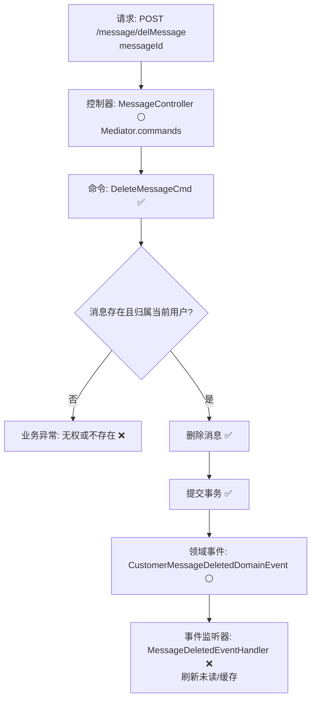

# 用户消息删除流程设计文档

> 基于 easylive 用户中心需求，按照 DDD “请求 → 命令 → 事件 → 命令” 模式梳理

## 📋 业务需求概述

登录用户在消息中心删除指定站内消息，系统需要校验消息归属，仅允许删除属于当前用户的消息，并在删除后刷新未读统计或列表缓存（后续通过事件补齐）。

---

## 📊 完整流程图

### ASCII 流程图
```
┌──────────────────────────────────────────────────────────┐
│ 请求：POST /message/delMessage                           │
│ Payload: { "messageId": 802001 }                         │
└────────────────────────────┬─────────────────────────────┘
                             ↓
┌──────────────────────────────────────────────────────────┐
│ 控制器：MessageController#messageDel ⚪                    │
│ 1. Token → currentUserId                                  │
│ 2. Mediator.commands.send(DeleteMessageCmd.Request)       │
└────────────────────────────┬─────────────────────────────┘
                             ↓
┌──────────────────────────────────────────────────────────┐
│ 命令：DeleteMessageCmd ✅                                   │
│ - 验证：@MessageExists、@MessageOwner ⚪                    │
│ - 仓储加载并删除消息                                       │
│ - Mediator.uow.save()                                      │
└────────────────────────────┬─────────────────────────────┘
                             ↓
┌──────────────────────────────────────────────────────────┐
│ 领域事件：CustomerMessageDeletedDomainEvent ⚪             │
│ → 触发 RefreshMessageStatsCmd ❌、审计记录                 │
└──────────────────────────────────────────────────────────┘
```

### Mermaid 流程图


---

## 📦 设计元素清单

### ✅ 已存在的设计

- 控制器：`MessageController#messageDel`（实现时通过 Mediator 调用命令）
- 命令骨架：`DeleteMessageCmd`、`BatchDeleteMessageCmd`（
  `only-danmuku-application/.../customer_message/DeleteMessageCmd.kt`）
- 聚合：`CustomerMessage` 及其仓储元数据

### ❌ 待补能力

| 类型    | 能力                                   | 描述           | 位置                                                                      | 状态 |
|-------|--------------------------------------|--------------|-------------------------------------------------------------------------|----|
| 验证器   | `@MessageExists`                     | 校验消息存在       | `only-danmuku-application/.../validater/`                               | P0 |
| 验证器   | `@MessageOwner`                      | 校验消息归属当前用户   | 同上                                                                      | P0 |
| 事件    | `CustomerMessageDeletedDomainEvent`  | 删除后驱动统计/缓存刷新 | `design/aggregate/customer_message/_gen.json`                           | P1 |
| 事件处理器 | `CustomerMessageDeletedEventHandler` | 刷新未读统计、推送通知  | `only-danmuku-adapter/.../events/CustomerMessageDeletedEventHandler.kt` | P1 |
| 命令    | `BatchDeleteMessageCmd`              | 支持批量删除       | `design/aggregate/customer_message/_gen.json`                           | P1 |

---

## 🔑 关键业务规则

- **消息归属**：仅允许删除当前用户的消息，越权请求应返回业务异常。
- **幂等处理**：重复删除同一消息需安全返回，可通过返回 `deleted=false` 表示无记录。
- **未读同步**：删除后需刷新前端未读数、消息列表（建议由领域事件触发刷新命令）。
- **批量操作**：UI 常见多选删除场景，推荐复用同一验证逻辑。
- **审计留痕**：可选记录删除操作，为风控或合规提供依据。

---

## 🧾 控制器与命令示例
```kotlin
@PostMapping("/delMessage")
fun messageDel(@RequestBody @Validated request: MessageDel.Request): MessageDel.Response {
    Mediator.commands.send(
        DeleteMessageCmd.Request(
            messageId = request.messageId!!.toLong(),
            operatorId = LoginHelper.getUserId()!!
        )
    )
    return MessageDel.Response()
}
```

> `only-danmuku-adapter/src/main/kotlin/edu/only4/danmuku/adapter/portal/api/MessageController.kt`

```kotlin
val message = Mediator.repositories.findFirst(
    SCustomerMessage.predicateById(request.messageId),
    persist = false
).getOrNull() ?: return Response(deleted = false)
if (request.operatorId != message.userId) {
    throw KnownException("无权删除该消息")
}
Mediator.repositories.remove(SCustomerMessage.predicateById(message.id))
Mediator.uow.save()
return Response(deleted = true)
```

> `only-danmuku-application/src/main/kotlin/edu/only4/danmuku/application/commands/customer_message/DeleteMessageCmd.kt`

---

## 📂 传统架构参考
- 控制器：`easylive-java/easylive-web/src/main/java/com/easylive/web/controller/UserMessageContrller.java:117`
- 服务实现：`easylive-java/easylive-common/src/main/java/com/easylive/service/impl/UserMessageServiceImpl.java:155`
- Mapper：`easylive-java/easylive-common/src/main/resources/com/easylive/mappers/UserMessageMapper.xml:333`

---

**文档版本**：v1.1  
**创建时间**：2025-10-22  
**维护者**：开发团队  
**近期变更**：流程改为请求→命令→事件模式，补充现有命令与待补能力说明。
