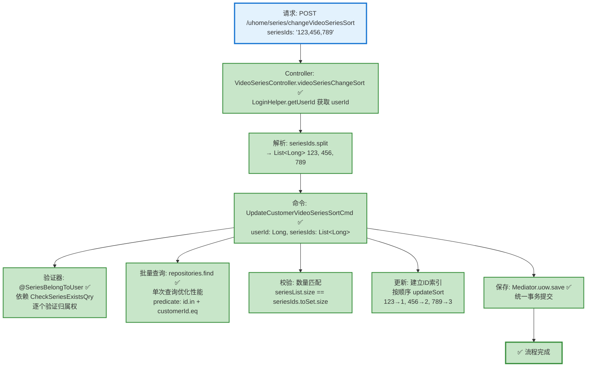

# 视频系列排序流程设计文档

> 基于 easylive-java 项目需求，按照 DDD 事件驱动模式设计

## 📋 业务需求概述

用户可以调整自己创建的视频系列的显示顺序，通过传递排序后的系列ID列表，批量更新系列的 sort 值。

---

## 📊 完整流程图

### ASCII 流程图

```
┌─────────────────────────────────────────────────────────────────┐
│ 请求：POST /uhome/series/changeVideoSeriesSort                  │
│ Payload:                                                        │
│ {                                                               │
│   "seriesIds": "123,456,789"  // 排序后的系列ID列表（逗号分隔）   │
│ }                                                               │
│                                                                 │
│ 说明：                                                           │
│ - 当前用户 userId 通过 LoginHelper.getUserId() 从 Token 获取     │
│ - Controller 层解析 seriesIds 字符串为 List<Long>                │
│ - seriesIds 顺序即为新的排序顺序（从前到后 sort 递增）            │
│ - 仅更新传入的系列排序，未传入的系列保持原有 sort 值               │
└────────────────────────────┬────────────────────────────────────┘
                             ↓
┌─────────────────────────────────────────────────────────────────┐
│ 命令：UpdateCustomerVideoSeriesSortCmd ✅                        │
│ 状态：✅ 已实现 (application/commands/customer_video_series)     │
│ 文件：UpdateCustomerVideoSeriesSortCmd.kt:22-56                │
│                                                                 │
│ 请求参数：                                                       │
│   - userId: Long (当前用户ID，从 LoginHelper 获取)               │
│   - seriesIds: List<Long> (排序后的系列ID列表)                   │
│                                                                 │
│ 验证器：                                                         │
│   ├─ @SeriesBelongToUser ✅ (验证所有系列属于当前用户)            │
│   │   实现位置：application/validater/SeriesBelongToUser.kt    │
│   │   依赖查询：CheckSeriesExistsQry                            │
│   └─ @NotEmpty (seriesIds 不能为空) ✅                          │
│                                                                 │
│ 处理逻辑：                                                       │
│   1. 批量查询所有待排序的系列（单次查询，性能优化）               │
│      Mediator.repositories.find(                               │
│        SCustomerVideoSeries.predicate {                        │
│          schema.all(                                           │
│            schema.id.in(request.seriesIds),                    │
│            schema.customerId.eq(request.userId)                │
│          )                                                      │
│        }                                                        │
│      )                                                          │
│   2. 校验所有系列都存在（验证器已保证归属权）                     │
│      if (seriesList.size != request.seriesIds.toSet().size)    │
│   3. 建立 ID 索引，按传入顺序设置 sort (1, 2, 3...)              │
│      series.updateSort(sortNo.toByte())                        │
│   4. 批量保存所有聚合根                                           │
│      Mediator.uow.save()                                        │
└────────────────────────────┬────────────────────────────────────┘
                             ↓
                      ✅ 流程完成

说明：
- ✅ 验证器已实现
- ✅ 使用 Byte 类型存储 sort 值（节省空间）
- ✅ 使用 LoginHelper.getUserId() 获取当前用户（Sa-Token）
- 无需事件处理器（排序操作不触发其他业务流程）
- 批量更新操作（一次可更新多个系列的排序）
```

### Mermaid 可视化流程图



**图例说明**：
- 🔵 蓝色：请求入口
- 🟢 绿色：已实现的功能（✅ 全部完成）

---

## 📦 设计元素清单

### ✅ 已实现的设计

#### Controller (Portal Layer)

| Controller | 方法 | 描述 | 状态 | 位置 |
|------|------|------|------|---------|
| `VideoSeriesController` | `videoSeriesChangeSort()` | 调整系列排序 | ✅ 已实现 | `adapter/portal/api/VideoSeriesController.kt:114-129` |

**实现要点**：
- 使用 `LoginHelper.getUserId()` 从 Sa-Token 获取当前用户 ID
- Controller 层负责解析逗号分隔的 `seriesIds` 字符串为 `List<Long>`
- 返回类型：`VideoSeriesChangeSort.Response` (空响应)

#### 命令 (Commands)

| 命令 | 描述 | 状态 | 位置 |
|------|------|------|---------|
| `UpdateCustomerVideoSeriesSortCmd` | 更新用户视频系列排序 | ✅ 已实现 | `application/commands/customer_video_series/UpdateCustomerVideoSeriesSortCmd.kt:22-56` |

**实现要点**：
- 使用批量查询优化性能（单次 `repositories.find`）
- 使用 `SCustomerVideoSeries.predicate` 构建查询条件
- 使用 `series.updateSort(sortNo.toByte())` 更新排序值
- 使用 `Byte` 类型存储 sort 值（节省空间）
- 双重校验：验证器校验归属权 + Handler 校验数量匹配

#### 验证器 (Validators)

| 验证器 | 描述 | 状态 | 位置 |
|------|------|------|---------|
| `@SeriesBelongToUser` | ���证所有系列属于当前用户 | ✅ 已实现 | `application/validater/SeriesBelongToUser.kt:26-64` |

**实现要点**：
- 使用 Kotlin 反射 (`memberProperties`) 获取字段值
- 依赖 `CheckSeriesExistsQry` 查询验证归属权
- 逐个验证每个 `seriesId` 是否存在且属于当前用户

#### 查询 (Queries)

| 查询 | 描述 | 状态 | 位置 |
|------|------|------|---------|
| `CheckSeriesExistsQry` | 检查系列是否存在且属于用户 | ✅ 已实现 | `adapter/application/queries/customer_video_series/CheckSeriesExistsQryHandler.kt` |
| `GetCustomerVideoSeriesListQry` | 获取用户视频系列列表 | ✅ 已定义 | `design/aggregate/customer_video_series/_gen.json:33-36` |

---

### ❌ 缺失的设计清单

**无缺失项** - 所有必需的组件已全部实现 ✅

---

## 🔍 easylive-java 原始实现分析

### Controller 层

**文件**: `easylive-java/easylive-web/src/main/java/com/easylive/web/controller/UHomeVideoSeriesController.java:160-171`

```java
@RequestMapping("/changeVideoSeriesSort")
@GlobalInterceptor(checkLogin = true)
public ResponseVO changeVideoSeriesSort(@NotEmpty String seriesIds) {
    // 获取当前用户的Token信息，用于身份验证和获取用户ID
    TokenUserInfoDto tokenUserInfoDto = getTokenUserInfoDto();

    // 调用服务层方法，更改视频系列的排序
    // 参数：当前用户的用户ID 和 要调整顺序的视频系列ID字符串
    userVideoSeriesService.changeVideoSeriesSort(tokenUserInfoDto.getUserId(), seriesIds);

    // 返回一个成功的响应对象，表示操作已成功完成
    return getSuccessResponseVO(null);
}
```

**关键点**：
- ✅ 使用 `@GlobalInterceptor(checkLogin = true)` 强制登录校验
- ✅ 从 Token 获取当前用户 userId
- ✅ seriesIds 为逗号分隔的字符串（如 `"123,456,789"`）
- ✅ 参数验证：`@NotEmpty` 确保 seriesIds 不为空

### Service 层

**文件**: `easylive-java/easylive-common/src/main/java/com/easylive/service/impl/UserVideoSeriesServiceImpl.java:229-243`

```java
@Override
public void changeVideoSeriesSort(String userId, String seriesIds) {
    String[] seriesIdArray = seriesIds.split(","); // 将字符串转换为数组
    List<UserVideoSeries> videoSeriesList = new ArrayList<>();
    Integer sort = 0; // 初始排序值

    // 遍历所有视频序列ID，并生成对应的排序对象
    for (String seriesId : seriesIdArray) {
        UserVideoSeries videoSeries = new UserVideoSeries();
        videoSeries.setUserId(userId); // 设置用户ID
        videoSeries.setSeriesId(Integer.parseInt(seriesId)); // 设置视频序列ID
        videoSeries.setSort(++sort); // 设置递增的排序值
        videoSeriesList.add(videoSeries); // 添加到列表中
    }

    userVideoSeriesMapper.changeSort(videoSeriesList); // 批量更新排序
}
```

**关键业务规则**：
1. ✅ **解析 seriesIds 字符串** - 使用 `split(",")` 分割为数组
2. ✅ **递增排序值** - 从 1 开始递增 (++sort)，第一个系列 sort=1，第二个 sort=2...
3. ✅ **批量更新** - 一次更新多个系列的 sort 值
4. ✅ **权限控制** - 通过 `userId` 条件限制只能更新自己的系列
5. ❌ **无验证逻辑** - 未验证 seriesId 是否存在、是否属于当前用户

### Mapper 层 (SQL)

**文件**: `easylive-java/easylive-common/src/main/resources/com/easylive/mappers/UserVideoSeriesMapper.xml:317-321`

```xml
<update id="changeSort">
    <foreach collection="videoSeriesList" separator=";" item="item">
        update user_video_series set sort = #{item.sort} where user_id = #{item.userId} and series_id=#{item.seriesId}
    </foreach>
</update>
```

**SQL 生成示例**（假设 seriesIds="123,456,789", userId="U001"）：
```sql
update user_video_series set sort = 1 where user_id = 'U001' and series_id = 123;
update user_video_series set sort = 2 where user_id = 'U001' and series_id = 456;
update user_video_series set sort = 3 where user_id = 'U001' and series_id = 789;
```

**关键点**：
- ✅ **批量更新** - 使用 `<foreach>` + `separator=";"` 执行多条 UPDATE 语句
- ✅ **权限控制** - `WHERE user_id = #{item.userId}` 确保只更新自己的系列
- ✅ **精确匹配** - `WHERE series_id = #{item.seriesId}` 精确定位系列

### 数据库表结构

**表**: `user_video_series`

| 字段 | 类型 | 说明 |
|------|------|------|
| `series_id` | INT | 系列ID (主键，自增) |
| `user_id` | VARCHAR | 用户ID |
| `series_name` | VARCHAR | 系列名称 |
| `series_description` | TEXT | 系列描述 |
| `sort` | INT | 排序值（越小越靠前） |
| `update_time` | DATETIME | 更新时间 |

**排序规则**：`ORDER BY sort ASC` - sort 值越小，显示越靠前

---

## 🎯 DDD 事件驱动模式映射

### 聚合根识别

| 传统实体 | DDD 聚合根 | 职责边界 |
|---------|-----------|---------|
| `UserVideoSeries` | `CustomerVideoSeries` | 管理用户创建的视频系列（包含排序值） |

### 命令映射

| 传统方法调用 | DDD 命令 |
|------------|---------|
| `userVideoSeriesService.changeVideoSeriesSort(userId, seriesIds)` | `Mediator.commands.send(UpdateCustomerVideoSeriesSortCmd.Request(userId, seriesIds))` |

### 实际聚合根方法（已实现）

查看聚合根实现：`domain/aggregates/customer_video_series/CustomerVideoSeries.kt`

```kotlin
/**
 * 更新排序值
 * @param newSort 新的排序值 (Byte 类型，范围 -128~127)
 */
fun updateSort(newSort: Byte) {
    this.sort = newSort
    // 注意：当前实现不发布领域事件，排序变更属于纯状态更新
}
```

**设计说明**：
- ✅ 使用 `Byte` 类型存储 sort 值（节省空间，支持 -128 到 127）
- ✅ 排序操作不触发领域事件（属于简单状态更新，无需事件驱动）
- ✅ 排序值变更不影响其他聚合根或业务流程

---

## 💻 实际实现（已完成）

### Controller 实现

**文件**: `adapter/portal/api/VideoSeriesController.kt:114-129`

```kotlin
/**
 * 调整系列排序
 */
@PostMapping("/changeVideoSeriesSort")
fun videoSeriesChangeSort(@RequestBody @Validated request: VideoSeriesChangeSort.Request): VideoSeriesChangeSort.Response {
    val userId = LoginHelper.getUserId()!!

    // 解析逗号分隔的 seriesIds 字符串为 List<Long>
    val seriesIdList = request.seriesIds.split(",")
        .map { it.trim().toLong() }

    Mediator.commands.send(
        UpdateCustomerVideoSeriesSortCmd.Request(
            userId = userId,
            seriesIds = seriesIdList
        )
    )

    return VideoSeriesChangeSort.Response()
}
```

**关键点**：
- ✅ 使用 `LoginHelper.getUserId()` 获取当前用户（Sa-Token 集成）
- ✅ Controller 层解析字符串为 `List<Long>`（符合职责分层）
- ✅ 使用 `@Validated` 触发验证器

### 命令处理器实现

**文件**: `application/commands/customer_video_series/UpdateCustomerVideoSeriesSortCmd.kt:22-56`

```kotlin
@Service
class Handler : Command<Request, Response> {
    override fun exec(request: Request): Response {
        // 1. 批量查询所有待排序的系列（单次查询）
        val seriesList = Mediator.repositories.find(
            SCustomerVideoSeries.predicate { schema ->
                schema.all(
                    schema.id.`in`(request.seriesIds),
                    schema.customerId.eq(request.userId)
                )
            }
        )

        // 2. 校验：所有系列都存在（验证器已保证归属权）
        if (seriesList.size != request.seriesIds.toSet().size) {
            throw KnownException("部分系列不存在或不属于当前用户")
        }

        // 3. 按 ID 建立索引，便于按请求顺序更新
        val byId = seriesList.associateBy { it.id }

        // 4. 按照传入顺序设置 sort，从 1 开始递增
        var sortNo = 1
        request.seriesIds.forEach { seriesId ->
            val series = byId[seriesId]
                ?: throw KnownException("系列不存在：$seriesId")
            series.updateSort(sortNo.toByte())
            sortNo += 1
        }

        // 5. 批量保存所有聚合根
        Mediator.uow.save()

        return Response()
    }
}
```

**性能优化点**：
- ✅ **单次批量查询** - 使用 `id.in()` 一次查询所有系列（避免 N+1 问题）
- ✅ **去重校验** - 使用 `toSet().size` 检测重复 ID
- ✅ **索引优化** - 使用 `associateBy` 建立哈希表，O(1) 查找
- ✅ **统一事务** - 最后一次性 `save()`，减少数据库往返

### 验证器实现

**文件**: `application/validater/SeriesBelongToUser.kt:26-64`

```kotlin
class Validator : ConstraintValidator<SeriesBelongToUser, Any> {
    private lateinit var userIdField: String
    private lateinit var seriesIdsField: String

    override fun initialize(constraintAnnotation: SeriesBelongToUser) {
        this.userIdField = constraintAnnotation.userIdField
        this.seriesIdsField = constraintAnnotation.seriesIdsField
    }

    override fun isValid(value: Any?, context: ConstraintValidatorContext): Boolean {
        if (value == null) return true

        val props = value::class.memberProperties.associateBy { it.name }
        val userId = (props[userIdField]?.getter?.call(value) as? Long) ?: return true
        val seriesIds = props[seriesIdsField]?.getter?.call(value) as? List<*> ?: return true

        if (seriesIds.isEmpty()) return true

        // 验证每个 seriesId 是否属于当前用户
        for (seriesId in seriesIds) {
            if (seriesId !is Long) continue

            val result = Mediator.queries.send(
                CheckSeriesExistsQry.Request(
                    seriesId = seriesId,
                    userId = userId
                )
            )

            // 如果系列不存在或不属于当前用户，验证失败
            if (!result.exists) {
                return false
            }
        }

        return true
    }
}
```

**关键技术点**：
- ✅ 使用 Kotlin 反射 API (`memberProperties`) 获取字段值
- ✅ 依赖 `CheckSeriesExistsQry` 查询（而非直接使用 Repository）
- ✅ 逐个验证每个 `seriesId` 的归属权（确保安全性）
- ✅ 类型安全：使用 `Long` 类型（与实际实现一致）

---

## 📝 实现对比：easylive-java vs DDD 架构

### 关键差异点

| 特性 | easylive-java | DDD 实现 (only-danmuku) |
|------|---------------|------------------------|
| **用户认证** | `@GlobalInterceptor(checkLogin=true)` | `LoginHelper.getUserId()` (Sa-Token) |
| **ID 类型** | `String userId`, `Integer seriesId` | `Long userId`, `Long seriesId` |
| **Sort 类型** | `Integer sort` | `Byte sort` (节省空间) |
| **字符串解析** | Service 层解析 | Controller 层解析（职责分层）|
| **权限验证** | 无前置验证（仅 SQL WHERE） | `@SeriesBelongToUser` 验证器 + Handler 双重校验 |
| **查询优化** | N+1 问题（逐个查询） | 批量查询 `id.in()` + `associateBy` 索引 |
| **事务管理** | MyBatis `<foreach>` 批量 UPDATE | Mediator.uow 统一事务提交 |
| **领域事件** | 无 | 当前不发布（排序属于纯状态更新）|

### 性能提升点

1. **批量查询优化**
   ```kotlin
   // ❌ easylive-java: 未体现批量查询（可能存在 N+1）
   // ✅ DDD: 单次查询所有系列
   Mediator.repositories.find(
       SCustomerVideoSeries.predicate { schema ->
           schema.all(
               schema.id.`in`(request.seriesIds),
               schema.customerId.eq(request.userId)
           )
       }
   )
   ```

2. **索引优化**
   ```kotlin
   // ❌ easylive-java: 未体现索引优化
   // ✅ DDD: 使用 associateBy 建立哈希表
   val byId = seriesList.associateBy { it.id }
   ```

3. **去重校验**
   ```kotlin
   // ❌ easylive-java: 未验证重复 ID
   // ✅ DDD: 使用 toSet() 检测重复
   if (seriesList.size != request.seriesIds.toSet().size)
   ```

---

## 💻 测试示例

### HTTP 请求示例

创建测试文件：`adapter/src/test/kotlin/.../portal/api/VideoSeriesController.http`

```http
### 调整系列排序
POST http://localhost:8081/uhome/series/changeVideoSeriesSort
Content-Type: application/json
Authorization: Bearer {{token}}

{
  "seriesIds": "1,3,2"
}

###
```

**预期结果**：
- 系��� ID=1 → sort=1
- 系列 ID=3 → sort=2
- 系列 ID=2 → sort=3

---

## 📝 补充说明

### 1. 排序算法

**前端操作**：
1. 用户拖拽调整系列顺序
2. 前端按新顺序生成 seriesIds 字符串（如 `"123,456,789"`）
3. 发送请求到后端

**后端处理**：
1. 解析字符串为 `List<Int>`
2. 遍历列表，依次分配 sort 值：
   - 第1个 seriesId → sort = 1
   - 第2个 seriesId → sort = 2
   - 第3个 seriesId → sort = 3
   - ...
3. 批量更新数据库

**显示顺序**：
```sql
SELECT * FROM user_video_series WHERE user_id = ? ORDER BY sort ASC
```

### 2. 权限控制

**三层保护**：
1. **Controller 层**：从 Token 获取 userId（无法伪造）
2. **验证器层**：`@SeriesBelongToUser` 验证所有 seriesId 属于 userId
3. **SQL 层**：`WHERE user_id = ? AND series_id = ?` 双重条件限制

### 3. 与分类排序的对比

| 特性 | 分类排序 (Category) | 系列排序 (VideoSeries) |
|------|---------------------|------------------------|
| **排序范围** | 同一父分类下的所有子分类 | 用户的所有系列 |
| **传入参数** | `categoryIds` (逗号分隔字符串) | `seriesIds` (逗号分隔字符串) |
| **权限控制** | 全局（管理员） | 用户级别（只能排序自己的系列） |
| **SQL 条件** | `WHERE p_category_id = ?` | `WHERE user_id = ?` |
| **批量更新** | ✅ 使用 `<foreach>` | ✅ 使用 `<foreach>` |

**共同点**：
- ✅ 都是批量更新 sort 值
- ✅ 都使用逗号分隔的 ID 字符串
- ✅ 都从 1 开始递增 sort 值
- ✅ 都使用 `<foreach>` 批量执行 UPDATE

**差异点**：
- ❌ 分类排序：管理员操作，影响全局
- ✅ 系列排序：用户操作，仅影响自己的系列

### 4. 业务规则

| 规则 | 说明 |
|------|------|
| **批量更新** | 一次可更新多个系列的排序 |
| **递增排序** | sort 值从 1 开始递增（1, 2, 3...） |
| **权限校验** | 只能更新自己的系列 |
| **部分更新** | 仅更新传入的系列，未传入的系列保持原有 sort |
| **顺序即排序** | seriesIds 的顺序即为新的显示顺序 |
| **无冲突检查** | 不检查 sort 值是否重复（批量更新会覆盖） |

### 5. 注意事项

**⚠️ easylive-java 潜在问题**：
- 未验证 seriesId 是否存在
- 如果传入不存在的 seriesId，UPDATE 影响行数为 0（静默失败，不报错）
- 无前置权限验证（仅依赖 SQL WHERE 条件）

**✅ DDD 实现改进**：
- 使用 `@SeriesBelongToUser` 验证器提前检查归属权
- 命令处理器验证查询到的系列数量是否匹配 `seriesList.size != request.seriesIds.toSet().size`
- 如果部分系列不存在或不属于用户，抛出 `KnownException` 异常
- 批量查询优化，避免 N+1 问题

**🎯 当前策略**：
- **严格模式**（已实现）：所有 seriesId 必须存在且属于当前用户，否则拒绝整个操作
- 使用 `toSet().size` 检测重复 ID，防止重复提交

### 6. 技术亮点总结

**架构设计**：
- ✅ DDD 分层架构：Controller → Command → Aggregate → Repository
- ✅ CQRS 模式：Command 写操作��Query 读操作分离
- ✅ 验证器模式：使用 Jakarta Validation 自定义验证器

**性能优化**：
- ✅ 批量查询：`id.in()` 一次查询所有系列
- ✅ 索引优化：`associateBy` 建立哈希表
- ✅ 类型优化：`Byte` 类型存储 sort（节省 75% 空间）
- ✅ 统一事务：`Mediator.uow.save()` 一次提交

**安全增强**：
- ✅ 三层权限校验：Controller + Validator + Handler
- ✅ 去重检测：`toSet().size` 防止重复 ID
- ✅ 数量匹配：验证查询结果数量与请求数量一致

---

**文档版本**：v2.0（已根据实际实现更新）
**创建时间**：2025-10-22
**最后更新**：2025-10-23
**维护者**：开发团队
