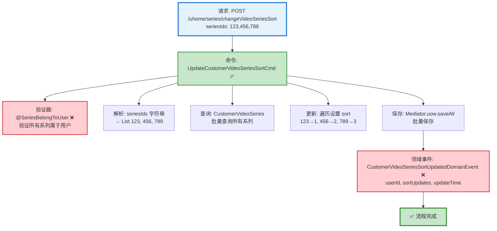

# 视频系列排序流程设计文档

> 基于 easylive-java 项目需求，按照 DDD 事件驱动模式设计

## 📋 业务需求概述

用户可以调整自己创建的视频系列的显示顺序，通过传递排序后的系列ID列表，批量更新系列的 sort 值。

---

## 📊 完整流程图

### ASCII 流程图

```
┌─────────────────────────────────────────────────────────────────┐
│ 请求：POST /uhome/series/changeVideoSeriesSort                  │
│ Payload:                                                        │
│ {                                                               │
│   "seriesIds": "123,456,789"  // 排序后的系列ID列表（逗号分隔）   │
│ }                                                               │
│                                                                 │
│ 说明：                                                           │
│ - 当前用户 userId 通过 @GlobalInterceptor(checkLogin=true)      │
│   从 Token 中获取                                                │
│ - seriesIds 顺序即为新的排序顺序（从前到后 sort 递增）            │
│ - 仅更新传入的系列排序，未传入的系列保持原有 sort 值               │
└────────────────────────────┬────────────────────────────────────┘
                             ↓
┌─────────────────────────────────────────────────────────────────┐
│ 命令：UpdateCustomerVideoSeriesSortCmd ✅                        │
│ 状态：✅ 已定义 (design/aggregate/customer_video_series)         │
│                                                                 │
│ 请求参数：                                                       │
│   - userId: String (当前用户ID，从 Token 获取)                   │
│   - seriesIds: List<Int> (排序后的系列ID列表)                    │
│                                                                 │
│ 验证器：                                                         │
│   ├─ @SeriesBelongToUser ❌ (验证所有系列属于当前用户)            │
│   └─ @NotEmpty (seriesIds 不能为空) ✅                          │
│                                                                 │
│ 处理逻辑：                                                       │
│   1. 解析 seriesIds 字符串为 List<Int>                          │
│   2. 查询所有相关 CustomerVideoSeries 聚合根                    │
│      Mediator.repositories.find(seriesIds, userId)             │
│   3. 遍历系列ID列表，依次设置 sort 值 (1, 2, 3...)               │
│      customerVideoSeries.updateSort(newSortValue)              │
│   4. 批量保存所有聚合根                                           │
│      Mediator.uow.saveAll(customerVideoSeriesList)             │
└────────────────────────────┬────────────────────────────────────┘
                             ↓
┌─────────────────────────────────────────────────────────────────┐
│ 领域事件：CustomerVideoSeriesSortUpdatedDomainEvent ❌           │
│ 状态：❌ 缺失 (需新增到 design/extra/)                            │
│                                                                 │
│ 事件载荷：                                                       │
│ {                                                               │
│   "userId": "U001",             // 用户ID                       │
│   "sortUpdates": [              // 排序更新列表                  │
│     { "seriesId": 123, "oldSort": 3, "newSort": 1 },          │
│     { "seriesId": 456, "oldSort": 1, "newSort": 2 },          │
│     { "seriesId": 789, "oldSort": 2, "newSort": 3 }           │
│   ],                                                            │
│   "updateTime": 1729267200      // 更新时间 (秒级时间戳)         │
│ }                                                               │
└────────────────────────────┬────────────────────────────────────┘
                             ↓
                      ✅ 流程完成

说明：
- ✅ 主命令已存在，但缺少领域事件
- ❌ 需补充验证器和领域事件
- 无需事件处理器（排序操作不触发其他业务流程）
- 批量更新操作（一次可更新多个系列的排序）
```

### Mermaid 可视化流程图



**图例说明**：
- 🔵 蓝色：请求入口
- 🟢 绿色：已存在的设计（✅ 可直接使用）
- 🔴 红色：缺失的设计（❌ 需实现）

---

## 📦 设计元素清单

### ✅ 已存在的设计

#### 命令 (Commands)

| 命令 | 描述 | 状态 | 位置 |
|------|------|------|------|
| `UpdateCustomerVideoSeriesSortCmd` | 更新用户视频系列排序 | ✅ 已定义 | `design/aggregate/customer_video_series/_gen.json:10-12` |

#### 查询 (Queries)

| 查询 | 描述 | 状态 | 位置 |
|------|------|------|------|
| `GetCustomerVideoSeriesListQry` | 获取用户视频系列列表 | ✅ 已定义 | `design/aggregate/customer_video_series/_gen.json:33-36` |
| `GetCustomerVideoSeriesInfoQry` | 获取用户视频系列信息 | ✅ 已定义 | `design/aggregate/customer_video_series/_gen.json:37-40` |

---

### ❌ 缺失的设计清单

#### 需要补充的领域事件

| 序号 | 事件名称 | 描述 | 触发时机 | 建议位置 | 优先级 |
|-----|---------|------|----------|----------|-------|
| 1 | `CustomerVideoSeriesSortUpdatedDomainEvent` | 视频系列排序已更新 | 批量更新系列 sort 后 | `design/aggregate/customer_video_series/_gen.json` | P0 |

**JSON 定义**（需补充到 `design/aggregate/customer_video_series/_gen.json`）：
```json
{
  "de": [
    {
      "package": "customer_video_series",
      "name": "CustomerVideoSeriesSortUpdated",
      "desc": "视频系列排序已更新",
      "aggregates": ["CustomerVideoSeries"],
      "entity": "CustomerVideoSeries",
      "persist": true
    }
  ]
}
```

#### 需要补充的验证器

| 序号 | 验证器名称 | 描述 | 依赖查询 | 实现路径 | 优先级 |
|-----|-----------|------|----------|----------|-------|
| 1 | `@SeriesBelongToUser` | 验证所有系列属于当前用户 | `GetCustomerVideoSeriesInfoQry` | `application/commands/customer_video_series/validater/SeriesBelongToUserValidator.kt` | P0 |

**说明**：
- **@SeriesBelongToUser**: 批量验证所有 seriesId 都属于 userId，防止用户篡改他人系列的排序

**优先级说明**：
- **P0**：核心功能，必须实现
- **P1**：重要功能，建议实现
- **P2**：可选功能，后续扩展

---

## 🔍 easylive-java 原始实现分析

### Controller 层

**文件**: `easylive-java/easylive-web/src/main/java/com/easylive/web/controller/UHomeVideoSeriesController.java:160-171`

```java
@RequestMapping("/changeVideoSeriesSort")
@GlobalInterceptor(checkLogin = true)
public ResponseVO changeVideoSeriesSort(@NotEmpty String seriesIds) {
    // 获取当前用户的Token信息，用于身份验证和获取用户ID
    TokenUserInfoDto tokenUserInfoDto = getTokenUserInfoDto();

    // 调用服务层方法，更改视频系列的排序
    // 参数：当前用户的用户ID 和 要调整顺序的视频系列ID字符串
    userVideoSeriesService.changeVideoSeriesSort(tokenUserInfoDto.getUserId(), seriesIds);

    // 返回一个成功的响应对象，表示操作已成功完成
    return getSuccessResponseVO(null);
}
```

**关键点**：
- ✅ 使用 `@GlobalInterceptor(checkLogin = true)` 强制登录校验
- ✅ 从 Token 获取当前用户 userId
- ✅ seriesIds 为逗号分隔的字符串（如 `"123,456,789"`）
- ✅ 参数验证：`@NotEmpty` 确保 seriesIds 不为空

### Service 层

**文件**: `easylive-java/easylive-common/src/main/java/com/easylive/service/impl/UserVideoSeriesServiceImpl.java:229-243`

```java
@Override
public void changeVideoSeriesSort(String userId, String seriesIds) {
    String[] seriesIdArray = seriesIds.split(","); // 将字符串转换为数组
    List<UserVideoSeries> videoSeriesList = new ArrayList<>();
    Integer sort = 0; // 初始排序值

    // 遍历所有视频序列ID，并生成对应的排序对象
    for (String seriesId : seriesIdArray) {
        UserVideoSeries videoSeries = new UserVideoSeries();
        videoSeries.setUserId(userId); // 设置用户ID
        videoSeries.setSeriesId(Integer.parseInt(seriesId)); // 设置视频序列ID
        videoSeries.setSort(++sort); // 设置递增的排序值
        videoSeriesList.add(videoSeries); // 添加到列表中
    }

    userVideoSeriesMapper.changeSort(videoSeriesList); // 批量更新排序
}
```

**关键业务规则**：
1. ✅ **解析 seriesIds 字符串** - 使用 `split(",")` 分割为数组
2. ✅ **递增排序值** - 从 1 开始递增 (++sort)，第一个系列 sort=1，第二个 sort=2...
3. ✅ **批量更新** - 一次更新多个系列的 sort 值
4. ✅ **权限控制** - 通过 `userId` 条件限制只能更新自己的系列
5. ❌ **无验证逻辑** - 未验证 seriesId 是否存在、是否属于当前用户

### Mapper 层 (SQL)

**文件**: `easylive-java/easylive-common/src/main/resources/com/easylive/mappers/UserVideoSeriesMapper.xml:317-321`

```xml
<update id="changeSort">
    <foreach collection="videoSeriesList" separator=";" item="item">
        update user_video_series set sort = #{item.sort} where user_id = #{item.userId} and series_id=#{item.seriesId}
    </foreach>
</update>
```

**SQL 生成示例**（假设 seriesIds="123,456,789", userId="U001"）：
```sql
update user_video_series set sort = 1 where user_id = 'U001' and series_id = 123;
update user_video_series set sort = 2 where user_id = 'U001' and series_id = 456;
update user_video_series set sort = 3 where user_id = 'U001' and series_id = 789;
```

**关键点**：
- ✅ **批量更新** - 使用 `<foreach>` + `separator=";"` 执行多条 UPDATE 语句
- ✅ **权限控制** - `WHERE user_id = #{item.userId}` 确保只更新自己的系列
- ✅ **精确匹配** - `WHERE series_id = #{item.seriesId}` 精确定位系列

### 数据库表结构

**表**: `user_video_series`

| 字段 | 类型 | 说明 |
|------|------|------|
| `series_id` | INT | 系列ID (主键，自增) |
| `user_id` | VARCHAR | 用户ID |
| `series_name` | VARCHAR | 系列名称 |
| `series_description` | TEXT | 系列描述 |
| `sort` | INT | 排序值（越小越靠前） |
| `update_time` | DATETIME | 更新时间 |

**排序规则**：`ORDER BY sort ASC` - sort 值越小，显示越靠前

---

## 🎯 DDD 事件驱动模式映射

### 聚合根识别

| 传统实体 | DDD 聚合根 | 职责边界 |
|---------|-----------|---------|
| `UserVideoSeries` | `CustomerVideoSeries` | 管理用户创建的视频系列（包含排序值） |

### 命令映射

| 传统方法调用 | DDD 命令 |
|------------|---------|
| `userVideoSeriesService.changeVideoSeriesSort(userId, seriesIds)` | `Mediator.commands.send(UpdateCustomerVideoSeriesSortCmd.Request(userId, seriesIds))` |

### 聚合根方法

```kotlin
// CustomerVideoSeries 聚合根方法
class CustomerVideoSeries : Aggregate {
    var seriesId: Int = 0
    var userId: String = ""
    var seriesName: String = ""
    var sort: Int = 0

    /**
     * 更新排序值
     */
    fun updateSort(newSort: Int) {
        val oldSort = this.sort
        this.sort = newSort

        // 发布领域事件
        this.publishDomainEvent(
            CustomerVideoSeriesSortUpdatedDomainEvent(
                userId = this.userId,
                seriesId = this.seriesId,
                oldSort = oldSort,
                newSort = newSort,
                updateTime = System.currentTimeMillis() / 1000
            )
        )
    }
}
```

---

## 💻 实现示例

### 验证器实现

#### @SeriesBelongToUser 验证器

```kotlin
package edu.only4.danmuku.application.commands.customer_video_series.validater

import edu.only4.common.cap4k.ddd.Mediator
import edu.only4.danmuku.application.queries.customer_video_series.GetCustomerVideoSeriesInfoQry
import jakarta.validation.Constraint
import jakarta.validation.ConstraintValidator
import jakarta.validation.ConstraintValidatorContext
import jakarta.validation.Payload
import kotlin.reflect.KClass

/**
 * 验证所有系列属于当前用户
 */
@Target(AnnotationTarget.CLASS)
@Retention(AnnotationRetention.RUNTIME)
@Constraint(validatedBy = [SeriesBelongToUser.Validator::class])
annotation class SeriesBelongToUser(
    val message: String = "存在不属于当前用户的系列",
    val groups: Array<KClass<*>> = [],
    val payload: Array<KClass<out Payload>> = [],
    val userIdField: String = "userId",
    val seriesIdsField: String = "seriesIds"
) {
    class Validator : ConstraintValidator<SeriesBelongToUser, Any> {
        private lateinit var userIdField: String
        private lateinit var seriesIdsField: String

        override fun initialize(constraintAnnotation: SeriesBelongToUser) {
            this.userIdField = constraintAnnotation.userIdField
            this.seriesIdsField = constraintAnnotation.seriesIdsField
        }

        override fun isValid(value: Any?, context: ConstraintValidatorContext): Boolean {
            if (value == null) return true

            val clazz = value::class.java
            val userId = clazz.getDeclaredField(userIdField).apply { isAccessible = true }.get(value) as? String
            val seriesIds = clazz.getDeclaredField(seriesIdsField).apply { isAccessible = true }.get(value) as? List<*>

            if (userId == null || seriesIds.isNullOrEmpty()) return true

            // 验证每个 seriesId 是否属于当前用户
            for (seriesId in seriesIds) {
                if (seriesId !is Int) continue

                val result = Mediator.queries.send(
                    GetCustomerVideoSeriesInfoQry.Request(seriesId = seriesId)
                )

                // 如果系列不存在或不属于当前用户，验证失败
                if (result.series == null || result.series.userId != userId) {
                    return false
                }
            }

            return true
        }
    }
}
```

### 命令处理器实现

```kotlin
package edu.only4.danmuku.application.commands.customer_video_series

import edu.only4.common.cap4k.ddd.Mediator
import edu.only4.common.cap4k.ddd.application.Command
import edu.only4.common.cap4k.ddd.application.RequestParam
import edu.only4.danmuku.application.commands.customer_video_series.validater.SeriesBelongToUser
import edu.only4.danmuku.domain.aggregates.customer_video_series.CustomerVideoSeries
import jakarta.validation.constraints.NotBlank
import jakarta.validation.constraints.NotEmpty
import org.springframework.stereotype.Service

object UpdateCustomerVideoSeriesSortCmd {
    @Service
    class Handler : Command<Request, Response> {
        override fun exec(request: Request): Response {
            // 1. 查询所有相关的 CustomerVideoSeries 聚合根
            val seriesList = request.seriesIds.mapNotNull { seriesId ->
                Mediator.repositories.findFirst(
                    CustomerVideoSeries::class
                ) {
                    it.seriesId == seriesId && it.userId == request.userId
                }.getOrNull()
            }

            // 2. 检查是否所有系列都查询到了（验证器已保证归属权）
            if (seriesList.size != request.seriesIds.size) {
                throw IllegalArgumentException("部分系列不存在")
            }

            // 3. 遍历系列ID列表，依次设置 sort 值
            var sortValue = 0
            request.seriesIds.forEach { seriesId ->
                val series = seriesList.find { it.seriesId == seriesId }
                series?.updateSort(++sortValue)
            }

            // 4. 批量保存所有聚合根（会自动发布领域事件）
            seriesList.forEach { Mediator.uow.save(it) }

            return Response(success = true, message = "排序已更新")
        }
    }

    @SeriesBelongToUser(userIdField = "userId", seriesIdsField = "seriesIds")
    data class Request(
        @field:NotBlank(message = "用户ID不能为空")
        val userId: String,

        @field:NotEmpty(message = "系列ID列表不能为空")
        val seriesIds: List<Int>
    ) : RequestParam<Response>

    data class Response(
        val success: Boolean,
        val message: String? = null
    )
}
```

### Controller 实现

```kotlin
package edu.only4.danmuku.adapter.portal.api

import edu.only4.common.cap4k.ddd.Mediator
import edu.only4.danmuku.application.commands.customer_video_series.UpdateCustomerVideoSeriesSortCmd
import org.springframework.web.bind.annotation.*

/**
 * 用户视频系列 API
 */
@RestController
@RequestMapping("/uhome/series")
class UHomeVideoSeriesController {

    /**
     * 更新视频系列排序
     */
    @PostMapping("/changeVideoSeriesSort")
    fun changeVideoSeriesSort(@RequestBody request: ChangeVideoSeriesSortRequest): ChangeVideoSeriesSortResponse {
        val userId = getCurrentUserId() // 从认证上下文获取

        // 解析逗号分隔的 seriesIds 字符串为 List<Int>
        val seriesIds = request.seriesIds.split(",").map { it.trim().toInt() }

        val result = Mediator.commands.send(
            UpdateCustomerVideoSeriesSortCmd.Request(
                userId = userId,
                seriesIds = seriesIds
            )
        )

        return ChangeVideoSeriesSortResponse(success = result.success, message = result.message)
    }

    private fun getCurrentUserId(): String {
        // TODO: 从 Spring Security Context 或 Token 中获取
        throw NotImplementedError("需要实现认证机制")
    }
}

data class ChangeVideoSeriesSortRequest(
    val seriesIds: String  // 逗号分隔的系列ID字符串，如 "123,456,789"
)

data class ChangeVideoSeriesSortResponse(
    val success: Boolean,
    val message: String?
)
```

---

## 📝 补充说明

### 1. 排序算法

**前端操作**：
1. 用户拖拽调整系列顺序
2. 前端按新顺序生成 seriesIds 字符串（如 `"123,456,789"`）
3. 发送请求到后端

**后端处理**：
1. 解析字符串为 `List<Int>`
2. 遍历列表，依次分配 sort 值：
   - 第1个 seriesId → sort = 1
   - 第2个 seriesId → sort = 2
   - 第3个 seriesId → sort = 3
   - ...
3. 批量更新数据库

**显示顺序**：
```sql
SELECT * FROM user_video_series WHERE user_id = ? ORDER BY sort ASC
```

### 2. 权限控制

**三层保护**：
1. **Controller 层**：从 Token 获取 userId（无法伪造）
2. **验证器层**：`@SeriesBelongToUser` 验证所有 seriesId 属于 userId
3. **SQL 层**：`WHERE user_id = ? AND series_id = ?` 双重条件限制

### 3. 与分类排序的对比

| 特性 | 分类排序 (Category) | 系列排序 (VideoSeries) |
|------|---------------------|------------------------|
| **排序范围** | 同一父分类下的所有子分类 | 用户的所有系列 |
| **传入参数** | `categoryIds` (逗号分隔字符串) | `seriesIds` (逗号分隔字符串) |
| **权限控制** | 全局（管理员） | 用户级别（只能排序自己的系列） |
| **SQL 条件** | `WHERE p_category_id = ?` | `WHERE user_id = ?` |
| **批量更新** | ✅ 使用 `<foreach>` | ✅ 使用 `<foreach>` |

**共同点**：
- ✅ 都是批量更新 sort 值
- ✅ 都使用逗号分隔的 ID 字符串
- ✅ 都从 1 开始递增 sort 值
- ✅ 都使用 `<foreach>` 批量执行 UPDATE

**差异点**：
- ❌ 分类排序：管理员操作，影响全局
- ✅ 系列排序：用户操作，仅影响自己的系列

### 4. 业务规则

| 规则 | 说明 |
|------|------|
| **批量更新** | 一次可更新多个系列的排序 |
| **递增排序** | sort 值从 1 开始递增（1, 2, 3...） |
| **权限校验** | 只能更新自己的系列 |
| **部分更新** | 仅更新传入的系列，未传入的系列保持原有 sort |
| **顺序即排序** | seriesIds 的顺序即为新的显示顺序 |
| **无冲突检查** | 不检查 sort 值是否重复（批量更新会覆盖） |

### 5. 注意事项

**⚠️ 潜在问题**：
- easylive-java 未验证 seriesId 是否存在
- 如果传入不存在的 seriesId，UPDATE 影响行数为 0（不报错）

**✅ DDD 实现改进**：
- 使用 `@SeriesBelongToUser` 验证器提前检查
- 命令处理器验证查询到的系列数量是否匹配
- 如果部分系列不存在，抛出异常

**🎯 推荐策略**：
- **严格模式**（推荐）：所有 seriesId 必须存在且属于当前用户，否则拒绝整个操作
- **宽松模式**：忽略不存在的 seriesId，仅更新存在的系列

### 6. 性能优化

**批量查询**：
```kotlin
// ❌ 低效：N次查询
request.seriesIds.forEach { seriesId ->
    val series = Mediator.repositories.findFirst { it.seriesId == seriesId }
}

// ✅ 高效：1次批量查询
val seriesList = Mediator.repositories.find(CustomerVideoSeries::class) {
    it.seriesId.`in`(request.seriesIds) && it.userId == request.userId
}
```

**批量更新**：
```kotlin
// ✅ 使用 <foreach> 批量执行 UPDATE
userVideoSeriesMapper.changeSort(videoSeriesList)
```

---

**文档版本**：v1.0
**创建时间**：2025-10-22
**维护者**：开发团队
