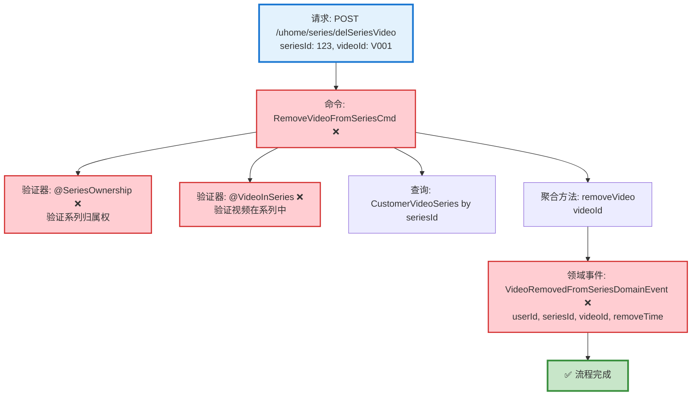

# 视频系列删除视频流程设计文档

> 基于 easylive-java 项目需求，按照 DDD 事件驱动模式设计

## 📋 业务需求概述

用户可以从自己创建的视频系列中移除某个视频，删除操作仅解除视频与系列的关联关系，不会删除视频本身。

---

## 📊 完整流程图

### ASCII 流程图

```
┌─────────────────────────────────────────────────────────────────┐
│ 请求：POST /uhome/series/delSeriesVideo                          │
│ Payload:                                                        │
│ {                                                               │
│   "seriesId": 123,      // 视频系列ID                            │
│   "videoId": "V001"     // 要移除的视频ID                         │
│ }                                                               │
│                                                                 │
│ 说明：                                                           │
│ - 当前用户 userId 通过 @GlobalInterceptor(checkLogin=true)      │
│   从 Token 中获取                                                │
│ - 仅解除关联关系，不删除视频本身                                   │
└────────────────────────────┬────────────────────────────────────┘
                             ↓
┌─────────────────────────────────────────────────────────────────┐
│ 命令：RemoveVideoFromSeriesCmd ❌                                │
│ 状态：❌ 缺失 (需新增到 design/extra/)                            │
│                                                                 │
│ 请求参数：                                                       │
│   - userId: String (当前用户ID，从 Token 获取)                   │
│   - seriesId: Int (视频系列ID)                                  │
│   - videoId: String (要移除的视频ID)                            │
│                                                                 │
│ 验证器：                                                         │
│   ├─ @SeriesOwnership ❌ (验证系列归属权)                        │
│   └─ @VideoInSeries ❌ (验证视频是否在系列中)                    │
│                                                                 │
│ 处理逻辑：                                                       │
│   1. 查询 CustomerVideoSeries 聚合根                            │
│      Mediator.repositories.findFirst(seriesId, userId)         │
│   2. 验证权限 (系列必须属于当前用户)                              │
│   3. 调用聚合根方法移除视频                                       │
│      customerVideoSeries.removeVideo(videoId)                  │
│   4. Mediator.uow.save(customerVideoSeries)                    │
└────────────────────────────┬────────────────────────────────────┘
                             ↓
┌─────────────────────────────────────────────────────────────────┐
│ 领域事件：VideoRemovedFromSeriesDomainEvent ❌                   │
│ 状态：❌ 缺失 (需新增到 design/extra/)                            │
│                                                                 │
│ 事件载荷：                                                       │
│ {                                                               │
│   "userId": "U001",          // 用户ID                          │
│   "seriesId": 123,           // 系列ID                          │
│   "videoId": "V001",         // 被移除的视频ID                   │
│   "removeTime": 1729267200   // 移除时间 (秒级时间戳)            │
│ }                                                               │
└────────────────────────────┬────────────────────────────────────┘
                             ↓
                      ✅ 流程完成

说明：
- ❌ 主流程所需命令和事件需要补充
- 简单的单聚合根操作（删除关联关系）
- 无需级联操作（仅删除关联，不删除视频）
- 无需统计更新（视频系列无视频计数字段）
```

### Mermaid 可视化流程图



**图例说明**：
- 🔵 蓝色：请求入口
- 🟢 绿色：已存在的设计（✅ 可直接使用）
- 🔴 红色：缺失的设计（❌ 需实现）

---

## 📦 设计元素清单

### ✅ 已存在的设计

#### 命令 (Commands)

| 命令 | 描述 | 状态 | 位置 |
|------|------|------|------|
| `UpdateCustomerVideoSeriesVideosCmd` | 更新用户视频系列视频 | ✅ 已定义 | `design/aggregate/customer_video_series/_gen.json:20-22` |
| `DeleteCustomerVideoSeriesCmd` | 删除用户视频系列 | ✅ 已定义 | `design/aggregate/customer_video_series/_gen.json:15-17` |

**说明**：
- `UpdateCustomerVideoSeriesVideosCmd` 是批量更新系列视频的命令，可用于添加/删除多个视频
- 但本需求是**单个视频移除**操作，建议新增专门的 `RemoveVideoFromSeriesCmd` 以提高语义清晰度

#### 查询 (Queries)

| 查询 | 描述 | 状态 | 位置 |
|------|------|------|------|
| `GetCustomerVideoSeriesInfoQry` | 获取用户视频系列信息 | ✅ 已定义 | `design/aggregate/customer_video_series/_gen.json:37-40` |
| `GetCustomerVideoSeriesVideoQry` | 获取用户视频系列视频 | ✅ 已定义 | `design/aggregate/customer_video_series/_gen.json:42-45` |

---

### ❌ 缺失的设计清单

#### 需要补充的命令

| 序号 | 命令名称 | 描述 | 建议位置 | 优先级 |
|-----|---------|------|----------|-------|
| 1 | `RemoveVideoFromSeriesCmd` | 从系列中移除视频 | `design/extra/customer_video_series_extra_gen.json` | P0 |

**JSON 定义**（需新增到 `design/extra/customer_video_series_extra_gen.json`）：
```json
{
  "cmd": [
    {
      "package": "customer_video_series",
      "name": "RemoveVideoFromSeries",
      "desc": "从系列中移除视频"
    }
  ]
}
```

**说明**：虽然可以复用 `UpdateCustomerVideoSeriesVideosCmd`，但新增专门命令的优势：
- ✅ **语义清晰**：明确表达"移除单个视频"的意图
- ✅ **参数简洁**：只需 `seriesId` + `videoId`，而不是完整视频列表
- ✅ **业务解耦**：移除操作与批量更新操作分离

#### 需要补充的领域事件

| 序号 | 事件名称 | 描述 | 触发时机 | 建议位置 | 优先级 |
|-----|---------|------|----------|----------|-------|
| 1 | `VideoRemovedFromSeriesDomainEvent` | 视频已从系列移除 | CustomerVideoSeries 移除视频后 | `design/extra/customer_video_series_extra_gen.json` | P0 |

**JSON 定义**（需新增到 `design/extra/customer_video_series_extra_gen.json`）：
```json
{
  "de": [
    {
      "package": "customer_video_series",
      "name": "VideoRemovedFromSeries",
      "desc": "视频已从系列移除",
      "aggregates": ["CustomerVideoSeries"],
      "entity": "CustomerVideoSeries",
      "persist": true
    }
  ]
}
```

#### 需要补充的验证器

| 序号 | 验证器名称 | 描述 | 依赖查询 | 实现路径 | 优先级 |
|-----|-----------|------|----------|----------|-------|
| 1 | `@SeriesOwnership` | 验证系列归属权 | `GetCustomerVideoSeriesInfoQry` | `application/commands/customer_video_series/validater/SeriesOwnershipValidator.kt` | P0 |
| 2 | `@VideoInSeries` | 验证视频是否在系列中 | `GetCustomerVideoSeriesVideoQry` | `application/commands/customer_video_series/validater/VideoInSeriesValidator.kt` | P1 |

**说明**：
- **@SeriesOwnership**: 必须验证（P0），防止用户操作他人的系列
- **@VideoInSeries**: 建议验证（P1），提前发现不存在的关联关系（若不验证，删除操作幂等返回成功）

#### 需要补充的查询（可选）

| 序号 | 查询名称 | 描述 | 返回值 | 建议位置 | 优先级 |
|-----|---------|------|--------|----------|-------|
| 1 | `CheckVideoInSeriesQry` | 检查视频是否在系列中 | Boolean | `design/extra/customer_video_series_extra_gen.json` | P2 |

**说明**：如果使用 `@VideoInSeries` 验证器，可新增此查询提高性能（无需查询完整视频列表）。

**优先级说明**：
- **P0**：核心功能，必须实现
- **P1**：重要功能，建议实现
- **P2**：可选功能，后续扩展

---

## 🔍 easylive-java 原始实现分析

### Controller 层

**文件**: `easylive-java/easylive-web/src/main/java/com/easylive/web/controller/UHomeVideoSeriesController.java:131-137`

```java
@RequestMapping("/delSeriesVideo")
@GlobalInterceptor(checkLogin = true)
public ResponseVO delSeriesVideo(@NotNull Integer seriesId, @NotEmpty String videoId) {
    TokenUserInfoDto tokenUserInfoDto = getTokenUserInfoDto();
    userVideoSeriesService.delSeriesVideo(tokenUserInfoDto.getUserId(), seriesId, videoId);
    return getSuccessResponseVO(null);
}
```

**关键点**：
- ✅ 使用 `@GlobalInterceptor(checkLogin = true)` 强制登录校验
- ✅ 从 Token 获取当前用户 userId
- ✅ 必填参数：`seriesId` (Integer) + `videoId` (String)

### Service 层

**文件**: `easylive-java/easylive-common/src/main/java/com/easylive/service/impl/UserVideoSeriesServiceImpl.java:286-292`

```java
@Override
public void delSeriesVideo(String userId, Integer seriesId, String videoId) {
    UserVideoSeriesVideoQuery videoSeriesVideoQuery = new UserVideoSeriesVideoQuery();
    videoSeriesVideoQuery.setUserId(userId); // 设置用户ID
    videoSeriesVideoQuery.setSeriesId(seriesId); // 设置视频序列ID
    videoSeriesVideoQuery.setVideoId(videoId); // 设置视频ID
    this.userVideoSeriesVideoMapper.deleteByParam(videoSeriesVideoQuery); // 执行删除操作
}
```

**关键业务规则**：
1. ✅ **直接删除关联记录** - 通过三个条件（userId, seriesId, videoId）精确定位
2. ✅ **幂等性** - 如果关联关系不存在，DELETE 不会报错（影响行数为 0）
3. ✅ **权限控制** - 通过 `userId` 条件限制，只能删除自己系列的视频
4. ❌ **无额外验证** - 未验证系列是否存在、视频是否存在、系列是否属于用户

### 数据库层分析

**主表**：`user_video_series` (用户视频系列)

| 字段 | 类型 | 说明 |
|------|------|------|
| `series_id` | INT | 系列ID (主键，自增) |
| `user_id` | VARCHAR | 用户ID |
| `series_name` | VARCHAR | 系列名称 |
| `series_description` | TEXT | 系列描述 |
| `sort` | INT | 排序值 |
| `update_time` | DATETIME | 更新时间 |

**关联表**：`user_video_series_video` (系列-视频关联)

| 字段 | 类型 | 说明 |
|------|------|------|
| `series_id` | INT | 系列ID (联合主键之一) |
| `video_id` | VARCHAR | 视频ID (联合主键之一) |
| `user_id` | VARCHAR | 用户ID |
| `sort` | INT | 排序值 |

**联合主键**：`(series_id, video_id)` - 保证同一视频在同一系列中只能添加一次

**删除操作 SQL**（推测）：
```sql
DELETE FROM user_video_series_video
WHERE user_id = ? AND series_id = ? AND video_id = ?
```

**权限控制**：通过 `user_id` 条件确保只能删除自己系列的视频

---

## 🎯 DDD 事件驱动模式映射

### 聚合根识别

| 传统实体 | DDD 聚合根 | 职责边界 |
|---------|-----------|---------|
| `UserVideoSeries` + `UserVideoSeriesVideo` | `CustomerVideoSeries` | 管理用户创建的视频系列及其包含的视频列表 |

**说明**：
- `CustomerVideoSeries` 聚合根包含视频列表（一对多关系）
- 移除视频操作由聚合根封装，保证业务规则一致性

### 命令映射

| 传统方法调用 | DDD 命令 |
|------------|---------|
| `userVideoSeriesService.delSeriesVideo(userId, seriesId, videoId)` | `Mediator.commands.send(RemoveVideoFromSeriesCmd.Request(userId, seriesId, videoId))` |

### 聚合根方法

```kotlin
// CustomerVideoSeries 聚合根方法
class CustomerVideoSeries : Aggregate {
    var seriesId: Int = 0
    var userId: String = ""
    var seriesName: String = ""
    private val videos: MutableList<SeriesVideo> = mutableListOf()

    /**
     * 从系列中移除视频
     */
    fun removeVideo(videoId: String) {
        // 1. 查找视频是否在系列中
        val video = videos.find { it.videoId == videoId }
        if (video == null) {
            // 幂等性：如果视频不在系列中，直接返回
            return
        }

        // 2. 移除视频
        videos.remove(video)

        // 3. 发布领域事件
        this.publishDomainEvent(
            VideoRemovedFromSeriesDomainEvent(
                userId = this.userId,
                seriesId = this.seriesId,
                videoId = videoId,
                removeTime = System.currentTimeMillis() / 1000
            )
        )
    }
}

data class SeriesVideo(
    val videoId: String,
    val sort: Int
)
```

---

## 💻 实现示例

### 验证器实现

#### @SeriesOwnership 验证器

```kotlin
package edu.only4.danmuku.application.commands.customer_video_series.validater

import edu.only4.common.cap4k.ddd.Mediator
import edu.only4.danmuku.application.queries.customer_video_series.GetCustomerVideoSeriesInfoQry
import jakarta.validation.Constraint
import jakarta.validation.ConstraintValidator
import jakarta.validation.ConstraintValidatorContext
import jakarta.validation.Payload
import kotlin.reflect.KClass

/**
 * 验证系列归属权
 */
@Target(AnnotationTarget.CLASS)
@Retention(AnnotationRetention.RUNTIME)
@Constraint(validatedBy = [SeriesOwnership.Validator::class])
annotation class SeriesOwnership(
    val message: String = "无权操作此系列",
    val groups: Array<KClass<*>> = [],
    val payload: Array<KClass<out Payload>> = [],
    val userIdField: String = "userId",
    val seriesIdField: String = "seriesId"
) {
    class Validator : ConstraintValidator<SeriesOwnership, Any> {
        private lateinit var userIdField: String
        private lateinit var seriesIdField: String

        override fun initialize(constraintAnnotation: SeriesOwnership) {
            this.userIdField = constraintAnnotation.userIdField
            this.seriesIdField = constraintAnnotation.seriesIdField
        }

        override fun isValid(value: Any?, context: ConstraintValidatorContext): Boolean {
            if (value == null) return true

            val clazz = value::class.java
            val userId = clazz.getDeclaredField(userIdField).apply { isAccessible = true }.get(value) as? String
            val seriesId = clazz.getDeclaredField(seriesIdField).apply { isAccessible = true }.get(value) as? Int

            if (userId == null || seriesId == null) return true

            // 查询系列信息并验证归属权
            val result = Mediator.queries.send(
                GetCustomerVideoSeriesInfoQry.Request(seriesId = seriesId)
            )

            return result.series?.userId == userId
        }
    }
}
```

#### @VideoInSeries 验证器

```kotlin
package edu.only4.danmuku.application.commands.customer_video_series.validater

import edu.only4.common.cap4k.ddd.Mediator
import edu.only4.danmuku.application.queries.customer_video_series.GetCustomerVideoSeriesVideoQry
import jakarta.validation.Constraint
import jakarta.validation.ConstraintValidator
import jakarta.validation.ConstraintValidatorContext
import jakarta.validation.Payload
import kotlin.reflect.KClass

/**
 * 验证视频是否在系列中
 */
@Target(AnnotationTarget.CLASS)
@Retention(AnnotationRetention.RUNTIME)
@Constraint(validatedBy = [VideoInSeries.Validator::class])
annotation class VideoInSeries(
    val message: String = "视频不在系列中",
    val groups: Array<KClass<*>> = [],
    val payload: Array<KClass<out Payload>> = [],
    val seriesIdField: String = "seriesId",
    val videoIdField: String = "videoId"
) {
    class Validator : ConstraintValidator<VideoInSeries, Any> {
        private lateinit var seriesIdField: String
        private lateinit var videoIdField: String

        override fun initialize(constraintAnnotation: VideoInSeries) {
            this.seriesIdField = constraintAnnotation.seriesIdField
            this.videoIdField = constraintAnnotation.videoIdField
        }

        override fun isValid(value: Any?, context: ConstraintValidatorContext): Boolean {
            if (value == null) return true

            val clazz = value::class.java
            val seriesId = clazz.getDeclaredField(seriesIdField).apply { isAccessible = true }.get(value) as? Int
            val videoId = clazz.getDeclaredField(videoIdField).apply { isAccessible = true }.get(value) as? String

            if (seriesId == null || videoId == null) return true

            // 查询系列视频列表并检查视频是否存在
            val result = Mediator.queries.send(
                GetCustomerVideoSeriesVideoQry.Request(seriesId = seriesId)
            )

            return result.videos.any { it.videoId == videoId }
        }
    }
}
```

### 命令处理器实现

```kotlin
package edu.only4.danmuku.application.commands.customer_video_series

import edu.only4.common.cap4k.ddd.Mediator
import edu.only4.common.cap4k.ddd.application.Command
import edu.only4.common.cap4k.ddd.application.RequestParam
import edu.only4.danmuku.application.commands.customer_video_series.validater.SeriesOwnership
import edu.only4.danmuku.application.commands.customer_video_series.validater.VideoInSeries
import edu.only4.danmuku.domain.aggregates.customer_video_series.CustomerVideoSeries
import jakarta.validation.constraints.NotBlank
import jakarta.validation.constraints.NotNull
import org.springframework.stereotype.Service

object RemoveVideoFromSeriesCmd {
    @Service
    class Handler : Command<Request, Response> {
        override fun exec(request: Request): Response {
            // 1. 查询 CustomerVideoSeries 聚合根
            val customerVideoSeries = Mediator.repositories.findFirst(
                CustomerVideoSeries::class
            ) {
                it.seriesId == request.seriesId && it.userId == request.userId
            }.getOrNull()

            // 2. 如果系列不存在，直接返回成功（幂等性）
            if (customerVideoSeries == null) {
                return Response(success = true, message = "系列不存在")
            }

            // 3. 调用聚合根方法移除视频
            customerVideoSeries.removeVideo(request.videoId)

            // 4. 保存聚合根（会自动发布 VideoRemovedFromSeriesDomainEvent）
            Mediator.uow.save(customerVideoSeries)

            return Response(success = true, message = "已移除视频")
        }
    }

    @SeriesOwnership(userIdField = "userId", seriesIdField = "seriesId")
    @VideoInSeries(seriesIdField = "seriesId", videoIdField = "videoId")
    data class Request(
        @field:NotBlank(message = "用户ID不能为空")
        val userId: String,

        @field:NotNull(message = "系列ID不能为空")
        val seriesId: Int,

        @field:NotBlank(message = "视频ID不能为空")
        val videoId: String
    ) : RequestParam<Response>

    data class Response(
        val success: Boolean,
        val message: String? = null
    )
}
```

### Controller 实现

```kotlin
package edu.only4.danmuku.adapter.portal.api

import edu.only4.common.cap4k.ddd.Mediator
import edu.only4.danmuku.application.commands.customer_video_series.RemoveVideoFromSeriesCmd
import org.springframework.web.bind.annotation.*

/**
 * 用户视频系列 API
 */
@RestController
@RequestMapping("/uhome/series")
class UHomeVideoSeriesController {

    /**
     * 从系列中移除视频
     */
    @PostMapping("/delSeriesVideo")
    fun delSeriesVideo(@RequestBody request: DelSeriesVideoRequest): DelSeriesVideoResponse {
        val userId = getCurrentUserId() // 从认证上下文获取

        val result = Mediator.commands.send(
            RemoveVideoFromSeriesCmd.Request(
                userId = userId,
                seriesId = request.seriesId,
                videoId = request.videoId
            )
        )

        return DelSeriesVideoResponse(success = result.success, message = result.message)
    }

    private fun getCurrentUserId(): String {
        // TODO: 从 Spring Security Context 或 Token 中获取
        throw NotImplementedError("需要实现认证机制")
    }
}

data class DelSeriesVideoRequest(
    val seriesId: Int,
    val videoId: String
)

data class DelSeriesVideoResponse(
    val success: Boolean,
    val message: String?
)
```

---

## 📝 补充说明

### 1. 为什么需要新增 RemoveVideoFromSeriesCmd？

虽然 `UpdateCustomerVideoSeriesVideosCmd` 已存在，但：

**新增专门命令的优势**：
- ✅ **语义清晰**：`RemoveVideoFromSeries` 明确表达单个视频移除意图
- ✅ **参数简洁**：只需 `seriesId` + `videoId`，不需要完整视频列表
- ✅ **业务解耦**：移除操作与批量更新操作分离，降低耦合
- ✅ **事件粒度**：`VideoRemovedFromSeries` 比 `SeriesVideosUpdated` 更精确

**复用 UpdateCustomerVideoSeriesVideosCmd 的劣势**：
- ❌ 需要查询完整视频列表
- ❌ 需要在应用层过滤掉目标视频
- ❌ 需要传递完整视频列表（参数冗余）
- ❌ 领域事件不够精确（无法区分是添加还是删除）

### 2. 幂等性设计

**场景**：重复移除同一视频

**实现**：
```kotlin
fun removeVideo(videoId: String) {
    val video = videos.find { it.videoId == videoId }
    if (video == null) {
        // 幂等性：视频不在系列中，直接返回
        return
    }
    videos.remove(video)
    // 发布事件...
}
```

**结果**：重复调用不会报错，直接返回成功

### 3. 权限控制

**三层保护**：
1. **查询层**：`WHERE series_id = ? AND user_id = ?` (SQL 条件)
2. **验证器层**：`@SeriesOwnership` 验证系列归属权
3. **聚合根层**：聚合根内部验证 `userId` 匹配

### 4. 业务规则

| 规则 | 说明 |
|------|------|
| **仅删除关联** | 不删除视频本身，仅删除系列-视频关联记录 |
| **权限校验** | 只能移除自己系列的视频 |
| **幂等性** | 重复移除返回成功，不报错 |
| **无统计更新** | 视频系列无 `videoCount` 字段，无需更新统计 |
| **排序不调整** | 移除视频后，其他视频的 `sort` 值保持不变 |

### 5. 与删除整个系列的区别

| 操作 | 命令 | 删除范围 | 级联操作 |
|------|------|----------|----------|
| **移除单个视频** | `RemoveVideoFromSeriesCmd` | 删除单条关联记录 | 无 |
| **删除整个系列** | `DeleteCustomerVideoSeriesCmd` | 删除系列 + 所有关联记录 | 级联删除所有视频关联 |

---

**文档版本**：v1.0
**创建时间**：2025-10-22
**维护者**：开发团队
