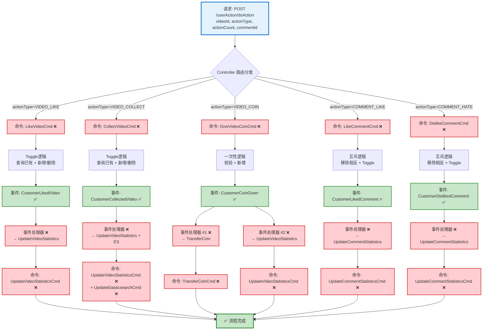

# 用户行为(点赞/收藏/投币)流程设计文档

> 基于 easylive-java 项目需求，按照 DDD 事件驱动模式设计

## 📋 业务需求概述

用户对视频或评论进行互动操作（点赞、收藏、投币、评论点赞/点踩），系统需要记录用户行为、更新统计数据、处理硬币转账，并支持取消操作。

---

## 📊 完整流程图

### ASCII 流程图

```
┌─────────────────────────────────────────────────────────────────┐
│ 请求：POST /userAction/doAction                                  │
│ Payload:                                                        │
│ {                                                               │
│   "videoId": "V123456789",                                      │
│   "actionType": 2,  // 0-7: 评论点赞/踩/视频点赞/收藏/投币/...  │
│   "actionCount": 1, // 投币数量(1-2), 其他默认1                  │
│   "commentId": 0    // 评论ID, 0表示针对视频                     │
│ }                                                               │
└────────────────────────────┬────────────────────────────────────┘
                             ↓
┌─────────────────────────────────────────────────────────────────┐
│ Controller 层：路由分发                                          │
│                                                                 │
│ when (actionType) {                                             │
│   VIDEO_LIKE    → LikeVideoCmd         ❌                       │
│   VIDEO_COLLECT → CollectVideoCmd      ❌                       │
│   VIDEO_COIN    → GiveVideoCoinCmd     ❌                       │
│   COMMENT_LIKE  → LikeCommentCmd       ❌                       │
│   COMMENT_HATE  → DislikeCommentCmd    ❌                       │
│ }                                                               │
└────────────────────────────┬────────────────────────────────────┘
                             ↓
        ┌────────────────────┴─────────────────────────────────────┐
        ↓                    ↓                    ↓                ↓
┌──────────────────┐ ┌──────────────────┐ ┌──────────────────┐ ┌──────────────────┐
│ 流程分支 #1:     │ │ 流程分支 #2:     │ │ 流程分支 #3:     │ │ 流程分支 #4:     │
│ 点赞视频         │ │ 收藏视频         │ │ 投币视频         │ │ 点赞/踩评论      │
└──────┬───────────┘ └──────┬───────────┘ └──────┬───────────┘ └──────┬───────────┘
       ↓                    ↓                    ↓                    ↓
```

---

### 流程分支 #1: 点赞视频

```
┌─────────────────────────────────────────────────────────────────┐
│ 命令：LikeVideoCmd ❌                                            │
│ 状态：缺失 (需新增到 design/aggregate/customer_action/)          │
│                                                                 │
│ 命令参数：                                                       │
│   - videoId: String                                             │
│                                                                 │
│ 验证器：                                                         │
│   └─ @VideoExists ❌ (验证视频存在)                              │
│                                                                 │
│ 处理逻辑：                                                       │
│   1. 查询视频信息 GetVideoInfoQry ✅                             │
│   2. 查询已有点赞记录 (幂等性检查)                               │
│   3. Toggle 逻辑:                                               │
│      - 已点赞 → 删除记录 (取消点赞)                              │
│      - 未点赞 → 创建记录 (新增点赞)                              │
│   4. CustomerActionFactory.create()                             │
│   5. Mediator.uow.save()                                        │
└────────────────────────────┬────────────────────────────────────┘
                             ↓
┌─────────────────────────────────────────────────────────────────┐
│ 领域事件：CustomerLikedVideoDomainEvent ✅                       │
│ 状态：已定义 (design/aggregate/customer_action/_gen.json:32)    │
│                                                                 │
│ 事件载荷：                                                       │
│ {                                                               │
│   "customerId": "U001",                                         │
│   "videoId": "V123456789",                                      │
│   "isCancel": false  // true=取消点赞, false=新增点赞            │
│ }                                                               │
└────────────────────────────┬────────────────────────────────────┘
                             ↓
┌─────────────────────────────────────────────────────────────────┐
│ 事件处理器：CustomerLikedVideoEventHandler ❌                    │
│ 监听事件：CustomerLikedVideoDomainEvent                          │
│ 触发命令：UpdateVideoStatisticsCmd                              │
│ 实现路径：adapter/.../events/CustomerLikedVideoEventHandler.kt  │
└────────────────────────────┬────────────────────────────────────┘
                             ↓
┌─────────────────────────────────────────────────────────────────┐
│ 命令：UpdateVideoStatisticsCmd ❌                                │
│ 命令参数：{ videoId, field: "like_count", changeCount: ±1 }    │
└────────────────────────────┬────────────────────────────────────┘
                             ↓
┌─────────────────────────────────────────────────────────────────┐
│ 领域事件：VideoStatisticsUpdatedDomainEvent ❌                   │
│ 事件载荷：{ videoId, likeCount, collectCount, coinCount }       │
└─────────────────────────────────────────────────────────────────┘
```

---

### 流程分支 #2: 收藏视频

```
┌─────────────────────────────────────────────────────────────────┐
│ 命令：CollectVideoCmd ❌                                         │
│ 状态：缺失 (需新增到 design/aggregate/customer_action/)          │
│                                                                 │
│ 命令参数：                                                       │
│   - videoId: String                                             │
│                                                                 │
│ 验证器：                                                         │
│   └─ @VideoExists ❌                                            │
│                                                                 │
│ 处理逻辑：                                                       │
│   1. 查询视频信息 GetVideoInfoQry ✅                             │
│   2. 查询已有收藏记录                                            │
│   3. Toggle 逻辑 (同点赞)                                       │
│   4. CustomerActionFactory.create()                             │
│   5. Mediator.uow.save()                                        │
└────────────────────────────┬────────────────────────────────────┘
                             ↓
┌─────────────────────────────────────────────────────────────────┐
│ 领域事件：CustomerCollectedVideoDomainEvent ✅                   │
│ 状态：已定义 (design/aggregate/customer_action/_gen.json:40)    │
│ 事件载荷：{ customerId, videoId, isCancel }                      │
└────────────────────────────┬────────────────────────────────────┘
                             ↓
┌─────────────────────────────────────────────────────────────────┐
│ 事件处理器：CustomerCollectedVideoEventHandler ❌                │
│ 触发命令：UpdateVideoStatisticsCmd                              │
│ 参数：{ videoId, field: "collect_count", changeCount: ±1 }     │
└────────────────────────────┬────────────────────────────────────┘
                             ↓
┌─────────────────────────────────────────────────────────────────┐
│ 命令：UpdateVideoStatisticsCmd ❌                                │
│ + 额外触发：UpdateElasticsearchCmd ❌ (更新ES收藏数)             │
└────────────────────────────┬────────────────────────────────────┘
                             ↓
┌─────────────────────────────────────────────────────────────────┐
│ 领域事件：VideoStatisticsUpdatedDomainEvent ��                   │
└─────────────────────────────────────────────────────────────────┘
```

---

### 流程分支 #3: 投币视频

```
┌─────────────────────────────────────────────────────────────────┐
│ 命令：GiveVideoCoinCmd ❌                                        │
│ 状态：缺失 (需新增到 design/aggregate/customer_action/)          │
│                                                                 │
│ 命令参数：                                                       │
│   - videoId: String                                             │
│   - coinCount: Int (范围: 1-2)                                  │
│                                                                 │
│ 验证器：                                                         │
│   ├─ @VideoExists ❌                                            │
│   ├─ @NotSelfCoin ❌ (UP主不能给自己投币)                        │
│   ├─ @SufficientCoinBalance ❌ (硬币余额充足)                    │
│   ├─ @NotDuplicateCoin ❌ (同一视频只能投币一次)                 │
│   └─ @Range(1, 2) coinCount ✅                                  │
│                                                                 │
│ 处理逻辑：                                                       │
│   1. 查询视频信息 GetVideoInfoQry ✅                             │
│   2. 查询已有投币记录 (幂等性检查)                               │
│   3. 业务规则校验:                                               │
│      - videoUserId != currentUserId                             │
│      - 未投过币                                                 │
│   4. CustomerActionFactory.create()                             │
│   5. Mediator.uow.save()                                        │
└────────────────────────────┬────────────────────────────────────┘
                             ↓
┌─────────────────────────────────────────────────────────────────┐
│ 领域事件：CustomerCoinGivenDomainEvent ✅                        │
│ 状态：已定义 (design/aggregate/customer_action/_gen.json:52)    │
│                                                                 │
│ 事件载荷：                                                       │
│ {                                                               │
│   "customerId": "U001",                                         │
│   "videoId": "V123456789",                                      │
│   "videoUserId": "U999",  // UP主ID                             │
│   "coinCount": 2                                                │
│ }                                                               │
└────────────────────────────┬────────────────────────────────────┘
                             ↓
        ┌────────────────────┴────────────────────┐
        ↓                                         ↓
┌──────────────────────────┐          ┌──────────────────────────┐
│ 事件处理器 #1 ❌         │          │ 事件处理器 #2 ❌         │
│ 硬币转账                 │          │ 更新视频统计              │
└──────┬───────────────────┘          └──────┬───────────────────┘
       ↓                                     ↓
┌─────────────────────────────────────────────────────────────────┐
│ 命令：TransferCoinCmd ❌                                         │
│ 状态：缺失 (需新增到 design/extra/coin_transfer_gen.json)        │
│                                                                 │
│ 命令参数：                                                       │
│   - fromCustomerId: "U001"                                      │
│   - toCustomerId: "U999"                                        │
│   - amount: 2                                                   │
│   - reason: "VIDEO_COIN"                                        │
│   - relatedVideoId: "V123456789"                                │
│                                                                 │
│ 处理逻辑：                                                       │
│   1. 查询发送方 CustomerProfile ✅                               │
│   2. 查询接收方 CustomerProfile ✅                               │
│   3. 扣除发送方硬币 (乐观锁: currentCoinCount - amount >= 0)    │
│   4. 增加接收方硬币                                              │
│   5. Mediator.uow.save()                                        │
└────────────────────────────┬────────────────────────────────────┘
                             ↓
┌─────────────────────────────────────────────────────────────────┐
│ 领域事件：CoinTransferredDomainEvent ❌                          │
│ 状态：缺失 (需新增)                                              │
│ 事件载荷：{ fromId, toId, amount, reason, relatedVideoId }      │
└─────────────────────────────────────────────────────────────────┘

┌─────────────────────────────────────────────────────────────────┐
│ 命令：UpdateVideoStatisticsCmd ❌                                │
│ 参数：{ videoId, field: "coin_count", changeCount: +coinCount }│
└─────────────────────────────────────────────────────────────────┘
```

---

### 流程分支 #4: 点赞/点踩评论

```
┌─────────────────────────────────────────────────────────────────┐
│ 命令：LikeCommentCmd ❌ / DislikeCommentCmd ❌                   │
│ 状态：缺失 (需新增到 design/aggregate/customer_action/)          │
│                                                                 │
│ 命令参数：                                                       │
│   - videoId: String                                             │
│   - commentId: Long                                             │
│                                                                 │
│ 验证器：                                                         │
│   ├─ @VideoExists ❌                                            │
│   └─ @CommentExists ❌                                          │
│                                                                 │
│ 处理逻辑：                                                       │
│   1. 查询视频信息 GetVideoInfoQry ✅                             │
│   2. 查询评论信息 GetCommentByIdQry ✅                           │
│   3. 查询已有行为 (点赞/点踩)                                    │
│   4. 互斥逻辑:                                                  │
│      - 已点赞 → 点赞 → 取消点赞                                 │
│      - 已点赞 → 点踩 → 移除点赞 + 新增点踩                       │
│      - 已点踩 → 点赞 → 移除点踩 + 新增点赞                       │
│      - 已点踩 → 点踩 → 取消点踩                                 │
│   5. CustomerActionFactory.create()                             │
│   6. Mediator.uow.save()                                        │
└────────────────────────────┬────────────────────────────────────┘
                             ↓
        ┌────────────────────┴────────────────────┐
        ↓                                         ↓
┌─────────────────────────────────────────────────────────────────┐
│ 领域事件：CustomerLikedCommentDomainEvent ✅                     │
│ 状态：已定义 (design/aggregate/customer_action/_gen.json:12)    │
│ 事件载荷：{ customerId, videoId, commentId, isCancel,           │
│            hadOpposite }  // hadOpposite=是否移除了相反操作      │
└────────────────────────────┬────────────────────────────────────┘
                             ↓
┌─────────────────────────────────────────────────────────────────┐
│ 事件处理器：CustomerLikedCommentEventHandler ❌                  │
│ 触发命令：UpdateCommentStatisticsCmd ❌                          │
│                                                                 │
│ 参数：                                                          │
│   - commentId                                                   │
│   - likeCountChange: ±1                                         │
│   - hateCountChange: ±1 或 0 (如果移除了相反操作)                │
└────────────────────────────┬────────────────────────────────────┘
                             ↓
┌─────────────────────────────────────────────────────────────────┐
│ 命令：UpdateCommentStatisticsCmd ❌                              │
│ 状态：缺失 (需新增, 或复用已有的 UpdateLikeCountCmd ✅)          │
│                                                                 │
│ 说明：已有命令可复用，但需要增强为同时更新两个字段                │
│   - UpdateLikeCountCmd ✅ (只更新点赞数)                         │
│   - UpdateHateCountCmd ✅ (只更新点踩数)                         │
│   建议：新增 UpdateCommentStatisticsCmd 同时更新两个字段          │
└────────────────────────────┬────────────────────────────────────┘
                             ↓
┌─────────────────────────────────────────────────────────────────┐
│ 领域事件：CommentStatisticsUpdatedDomainEvent ❌                 │
│ 状态：缺失 (需新增, 或复用已有事件)                              │
│   - CommentLikeCountUpdatedDomainEvent ✅                       │
│   - CommentHateCountUpdatedDomainEvent ✅                       │
└─────────────────────────────────────────────────────────────────┘
```

---

### Mermaid 可视化流程图



**图例说明**：
- 🔵 蓝色：请求入口
- 🟢 绿色：已存在的设计（✅ 可直接使用）
- 🔴 红色：缺失的设计（❌ 需实现）

---

## 📦 设计元素清单

### ✅ 已存在的设计

#### 领域事件 (Domain Events)

| 事件 | 描述 | 触发时机 | 状态 | 位置 |
|------|------|----------|------|------|
| `CustomerLikedVideoDomainEvent` | 用户已点赞视频 | 点赞/取消点赞视频 | ✅ 已定义 | `design/aggregate/customer_action/_gen.json:32` |
| `CustomerCollectedVideoDomainEvent` | 用户已收藏视频 | 收藏/取消收藏视频 | ✅ 已定义 | `design/aggregate/customer_action/_gen.json:40` |
| `CustomerCoinGivenDomainEvent` | 用户已投币视频 | 投币成功 | ✅ 已定义 | `design/aggregate/customer_action/_gen.json:52` |
| `CustomerLikedCommentDomainEvent` | 用户已点赞评论 | 点赞/取消点赞评论 | ✅ 已定义 | `design/aggregate/customer_action/_gen.json:12` |
| `CustomerDislikedCommentDomainEvent` | 用户已点踩评论 | 点踩/取消点踩评论 | ✅ 已定义 | `design/aggregate/customer_action/_gen.json:20` |
| `CommentLikeCountUpdatedDomainEvent` | 评论点赞数已更新 | 评论点赞数变化 | ✅ 已定义 | `design/aggregate/video_comment/_gen.json:82` |
| `CommentHateCountUpdatedDomainEvent` | 评论点踩数已更新 | 评论点踩数变化 | ✅ 已定义 | `design/aggregate/video_comment/_gen.json:92` |

#### 查询 (Queries)

| 查询 | 描述 | 状态 | 位置 |
|------|------|------|------|
| `GetVideoInfoQry` | 获取视频信息 | ✅ 已定义 | `design/aggregate/video/_gen.json:94` |
| `GetCustomerProfileQry` | 获取用户档案 | ✅ 已定义 | `design/aggregate/customer_profile/_gen.json:84` |
| `GetCommentByIdQry` | 根据ID获取评论 | ✅ 已定义 | `design/aggregate/video_comment/_gen.json:119` |

---

### ❌ 缺失的设计清单

#### 需要补充的命令（核心）

| 序号 | 命令名称 | 描述 | 参数 | 建议位置 | 优先级 |
|-----|---------|------|------|----------|-------|
| 1 | `LikeVideoCmd` | 点赞视频（toggle） | `videoId` | `design/aggregate/customer_action/` | P0 |
| 2 | `CollectVideoCmd` | 收藏视频（toggle） | `videoId` | `design/aggregate/customer_action/` | P0 |
| 3 | `GiveVideoCoinCmd` | 投币视频（一次性） | `videoId, coinCount` | `design/aggregate/customer_action/` | P0 |
| 4 | `LikeCommentCmd` | 点赞评论（toggle + 互斥） | `videoId, commentId` | `design/aggregate/customer_action/` | P0 |
| 5 | `DislikeCommentCmd` | 点踩评论（toggle + 互斥） | `videoId, commentId` | `design/aggregate/customer_action/` | P0 |

**说明**：这 5 个命令需要在后续迭代中更新 `design/aggregate/customer_action/_gen.json`，替换现有的 `DoActionCmd`。

---

#### 需要补充的命令（辅助）

| 序号 | 命令名称 | 描述 | 建议位置 | 优先级 |
|-----|---------|------|----------|-------|
| 6 | `UpdateVideoStatisticsCmd` | 更新视频统计信息（点赞/收藏/投币数） | `design/extra/video_statistics_gen.json` | P0 |
| 7 | `TransferCoinCmd` | 硬币转账（投币场景） | `design/extra/coin_transfer_gen.json` | P0 |
| 8 | `UpdateCommentStatisticsCmd` | 更新评论统计信息（点赞/点踩数） | `design/extra/comment_statistics_gen.json` | P0 |
| 9 | `UpdateElasticsearchCmd` | 更新ES索引（收藏数） | `design/extra/elasticsearch_gen.json` | P1 |

**JSON 定义**（需新增到 `design/extra/video_statistics_gen.json`）：
```json
{
  "cmd": [
    {
      "package": "video",
      "name": "UpdateVideoStatistics",
      "desc": "更新视频统计信息"
    }
  ]
}
```

**JSON 定义**（需新增到 `design/extra/coin_transfer_gen.json`）：
```json
{
  "cmd": [
    {
      "package": "customer_profile",
      "name": "TransferCoin",
      "desc": "硬币转账"
    }
  ]
}
```

**JSON 定义**（需新增到 `design/extra/comment_statistics_gen.json`）：
```json
{
  "cmd": [
    {
      "package": "video_comment",
      "name": "UpdateCommentStatistics",
      "desc": "更新评论统计信息（同时更新点赞和点踩数）"
    }
  ]
}
```

---

#### 需要补充的领域事件

| 序号 | 事件名称 | 描述 | 触发时机 | 建议位置 | 优先级 |
|-----|---------|------|----------|----------|-------|
| 1 | `VideoStatisticsUpdatedDomainEvent` | 视频统计信息已更新 | 视频点赞/收藏/投币数变化 | `design/extra/video_statistics_gen.json` | P0 |
| 2 | `CoinTransferredDomainEvent` | 硬币已转账 | 投币转账完成 | `design/extra/coin_transfer_gen.json` | P0 |
| 3 | `CommentStatisticsUpdatedDomainEvent` | 评论统计信息已更新 | 评论点赞/点踩数变化 | `design/extra/comment_statistics_gen.json` | P1 |

**JSON 定义**（需新增到 `design/extra/video_statistics_gen.json`）：
```json
{
  "de": [
    {
      "package": "video",
      "name": "VideoStatisticsUpdated",
      "desc": "视频统计信息已更新",
      "aggregates": ["Video"],
      "entity": "Video",
      "persist": true
    }
  ]
}
```

**JSON 定义**（需新增到 `design/extra/coin_transfer_gen.json`）：
```json
{
  "de": [
    {
      "package": "customer_profile",
      "name": "CoinTransferred",
      "desc": "硬币已转账",
      "aggregates": ["CustomerProfile"],
      "entity": "CustomerProfile",
      "persist": true
    }
  ]
}
```

---

#### 需要补充的查询

| 序号 | 查询名称 | 描述 | 返回值 | 建议位置 | 优先级 |
|-----|---------|------|--------|----------|-------|
| 1 | `GetUserActionByVideoQry` | 查询用户对视频的已有行为 | `{ actionType, actionCount, actionTime }` | `design/extra/user_action_query_gen.json` | P0 |
| 2 | `CheckUserCoinBalanceQry` | 检查用户硬币余额是否充足 | `{ sufficient: Boolean, current: Int }` | `design/extra/coin_balance_gen.json` | P0 |

**JSON 定义**（需新增到 `design/extra/user_action_query_gen.json`）：
```json
{
  "qry": [
    {
      "package": "customer_action",
      "name": "GetUserActionByVideo",
      "desc": "查询用户对视频的已有行为"
    }
  ]
}
```

**JSON 定义**（需新增到 `design/extra/coin_balance_gen.json`）：
```json
{
  "qry": [
    {
      "package": "customer_profile",
      "name": "CheckUserCoinBalance",
      "desc": "检查用户硬币余额是否充足"
    }
  ]
}
```

---

#### 需要补充的验证器

| 序号 | 验证器名称 | 描述 | 依赖查询 | 实现路径 | 优先级 |
|-----|-----------|------|----------|----------|-------|
| 1 | `@VideoExists` | 验证视频存在 | `GetVideoInfoQry` | `application/.../validater/VideoExists.kt` | P0 |
| 2 | `@CommentExists` | 验证评论存在 | `GetCommentByIdQry` | `application/.../validater/CommentExists.kt` | P0 |
| 3 | `@NotSelfCoin` | 验证UP主不能给自己投币 | `GetVideoInfoQry` | `application/.../validater/NotSelfCoin.kt` | P0 |
| 4 | `@SufficientCoinBalance` | 验证用户硬币余额充足 | `CheckUserCoinBalanceQry` | `application/.../validater/SufficientCoinBalance.kt` | P0 |
| 5 | `@NotDuplicateCoin` | 验证同一视频只能投币一次 | `GetUserActionByVideoQry` | `application/.../validater/NotDuplicateCoin.kt` | P0 |

---

#### 需要补充的事件处理器

| 序号 | 处理器名称 | 监听事件 | 触发命令 | 实现路径 | 优先级 |
|-----|-----------|----------|----------|----------|-------|
| 1 | `CustomerLikedVideoEventHandler` | `CustomerLikedVideoDomainEvent` | `UpdateVideoStatisticsCmd` | `adapter/.../events/` | P0 |
| 2 | `CustomerCollectedVideoEventHandler` | `CustomerCollectedVideoDomainEvent` | `UpdateVideoStatisticsCmd`<br/>`UpdateElasticsearchCmd` | `adapter/.../events/` | P0 |
| 3 | `CustomerCoinGivenEventHandler` | `CustomerCoinGivenDomainEvent` | `TransferCoinCmd`<br/>`UpdateVideoStatisticsCmd` | `adapter/.../events/` | P0 |
| 4 | `CustomerLikedCommentEventHandler` | `CustomerLikedCommentDomainEvent` | `UpdateCommentStatisticsCmd` | `adapter/.../events/` | P0 |
| 5 | `CustomerDislikedCommentEventHandler` | `CustomerDislikedCommentDomainEvent` | `UpdateCommentStatisticsCmd` | `adapter/.../events/` | P0 |

**优先级说明**：
- **P0**：核心功能，必须实现
- **P1**：重要功能，建议实现
- **P2**：可选功能，后续扩展

---

## 🔑 关键业务规则

### 1. 点赞/收藏 - Toggle 逻辑
- 已点赞 → 再次点击 → 取消点赞（删除记录，统计 -1）
- 未点赞 → 点击 → 点赞（新增记录，统计 +1）
- **幂等性**：查询已有记录 → 存在则删除，不存在则新增

### 2. 投币 - 一次性逻辑
- 同一视频只能投币一次（**幂等性**）
- UP主不能给自己投币（**业务规则**）
- 用户余额必须充足（**前置校验**）
- 投币数量范围：1-2 个（**参数校验**）
- **硬币转账流程**：
  1. 扣除投币者硬币（乐观锁）
  2. 增加UP主硬币
  3. 更新视频投币数统计

### 3. 评论点赞/点踩 - 互斥逻辑
- 点赞和点踩**互斥**（只能选一个）
- **互斥切换逻辑**：
  - 已点赞 → 点踩 → 移除点赞（like -1） + 新增点踩（hate +1）
  - 已点赞 → 再次点赞 → 取消点赞（like -1）
  - 已点踩 → 点赞 → 移除点踩（hate -1） + 新增点赞（like +1）
  - 已点踩 → 再次点踩 → 取消点踩（hate -1）
- **同时更新两个统计字段**：likeCount 和 hateCount

### 4. 幂等性保证
- **查询已有行为记录**：`GetUserActionByVideoQry`
- **根据是否存在决定操作**：新增 or 删除
- **乐观锁保证硬币扣减安全**：`WHERE currentCoinCount - amount >= 0`

---

## 🏗️ Controller 层路由分发示例

```kotlin
@PostMapping("/doAction")
fun doAction(
    @RequestBody @Validated request: DoActionRequest
): Response {
    val customerId = LoginHelper.getUserId()!!

    when (request.actionType) {
        UserActionType.VIDEO_LIKE ->
            Mediator.commands.send(
                LikeVideoCmd.Request(
                    customerId = customerId,
                    videoId = request.videoId
                )
            )

        UserActionType.VIDEO_COLLECT ->
            Mediator.commands.send(
                CollectVideoCmd.Request(
                    customerId = customerId,
                    videoId = request.videoId
                )
            )

        UserActionType.VIDEO_COIN ->
            Mediator.commands.send(
                GiveVideoCoinCmd.Request(
                    customerId = customerId,
                    videoId = request.videoId,
                    coinCount = request.actionCount ?: 1
                )
            )

        UserActionType.COMMENT_LIKE ->
            Mediator.commands.send(
                LikeCommentCmd.Request(
                    customerId = customerId,
                    videoId = request.videoId,
                    commentId = request.commentId!!
                )
            )

        UserActionType.COMMENT_HATE ->
            Mediator.commands.send(
                DislikeCommentCmd.Request(
                    customerId = customerId,
                    videoId = request.videoId,
                    commentId = request.commentId!!
                )
            )
    }

    return Response()
}
```

---

## 📌 设计优势

### **多命���模式的优势**

相比单一 `DoActionCmd` 的设计：

1. **意图明确**：
   - `LikeVideoCmd` vs `DoActionCmd(actionType=2)`
   - 命令名称即业务含义，无需查文档

2. **类型安全**：
   - `GiveVideoCoinCmd(videoId, coinCount)` - 明确需要 coinCount
   - `LikeVideoCmd(videoId)` - 不需要 coinCount，避免参数冗余

3. **单一职责**：
   - 每个 CommandHandler 只处理一种行为
   - 业务规则独立，易于维护和测试

4. **易于扩展**：
   - 新增行为类型 → 新增命令 + Handler
   - 不影响已有代码，符合开闭原则

5. **符合 DDD**：
   - 命令即领��语言（Ubiquitous Language）
   - 业务专家一眼能看懂系统在做什么

---

**文档版本**：v1.0
**创建时间**：2025-10-22
**维护者**：开发团队
