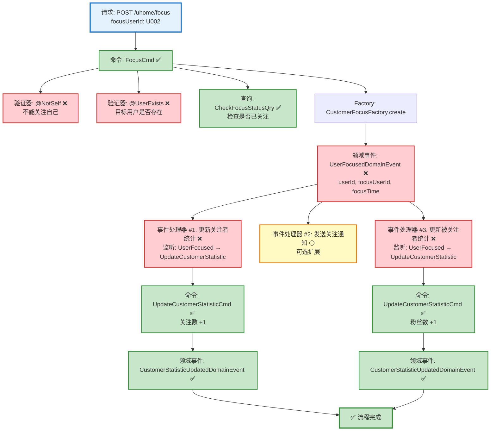
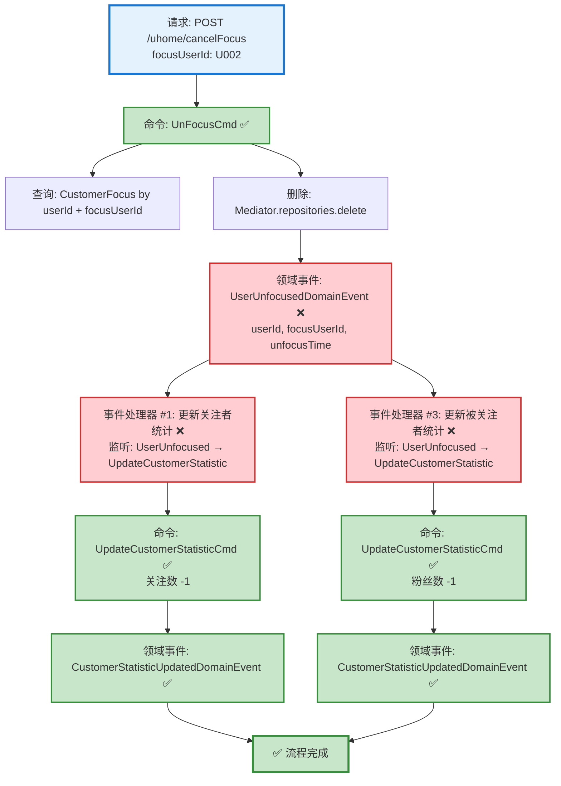

# 用户关注/取消关注流程设计文档

> 基于 easylive-java 项目需求，按照 DDD 事件驱动模式设计

## 📋 业务需求概述

用户可以关注其他用户（建立关注关系），也可以取消已有的关注关系。关注操作需要验证目标用户是否存在，不能关注自己，避免重复关注。

---

## 📊 完整流程图

### ASCII 流程图 - 关注用户

```
┌─────────────────────────────────────────────────────────────────┐
│ 请求：POST /uhome/focus                                          │
│ Payload:                                                        │
│ {                                                               │
│   "focusUserId": "U002"  // 被关注的目标用户ID                   │
│ }                                                               │
│                                                                 │
│ 说明：                                                           │
│ - 当前用户 userId 通过 @GlobalInterceptor(checkLogin=true)      │
│   从 Token 中获取                                                │
└────────────────────────────┬────────────────────────────────────┘
                             ↓
┌─────────────────────────────────────────────────────────────────┐
│ 命令：FocusCmd ✅                                                 │
│ 状态：✅ 已定义 (design/aggregate/customer_focus/_gen.json)      │
│                                                                 │
│ 请求参数：                                                       │
│   - userId: String (当前用户ID，从 Token 获取)                   │
│   - focusUserId: String (被关注用户ID)                          │
│                                                                 │
│ 验证器：                                                         │
│   ├─ @NotSelf ❌ (验证不能关注自己)                              │
│   └─ @UserExists(field="focusUserId") ❌ (验证目标用户存在)      │
│                                                                 │
│ 处理逻辑：                                                       │
│   1. 检查是否已存在关注关系 (CheckFocusStatusQry) ✅             │
│      - 如已存在，直接返回成功（幂等性）                            │
│   2. 如不存在，创建 CustomerFocus 聚合根                          │
│      CustomerFocusFactory.create(userId, focusUserId)          │
│   3. Mediator.uow.save(customerFocus)                          │
└────────────────────────────┬────────────────────────────────────┘
                             ↓
┌─────────────────────────────────────────────────────────────────┐
│ 领域事件：UserFocusedDomainEvent ❌                               │
│ 状态：❌ 缺失 (需新增到 design/extra/)                            │
│                                                                 │
│ 事件载荷：                                                       │
│ {                                                               │
│   "userId": "U001",         // 关注者ID                         │
│   "focusUserId": "U002",    // 被关注者ID                       │
│   "focusTime": 1729267200   // 关注时间 (秒级时间戳)              │
│ }                                                               │
└────────────────────────────┬────────────────────────────────────┘
                             ↓
        ┌────────────────────┴────────────────────┐
        ↓                                         ↓
┌──────────────────────────┐          ┌──────────────────────────┐
│ 事件处理器 #1 ❌          │          │ 事件处理器 #2 ⚪          │
│ 监听: UserFocusedEvent   │          │ 监听: UserFocusedEvent   │
│ 触发: 更新关注者统计       │          │ 触发: 发送关注通知        │
│                          │          │                          │
│ UpdateCustomerStatistic  │          │ SendFocusNotification    │
│ Cmd (关注数 +1)           │          │ Cmd (可选)               │
└──────┬───────────────────┘          └──────────────────────────┘
       ↓
┌─────────────────────────────────────────────────────────────────┐
│ 命令：UpdateCustomerStatisticCmd ✅                              │
│ 状态：✅ 已定义 (design/aggregate/customer_profile/_gen.json)    │
│                                                                 │
│ 请求参数：                                                       │
│   - userId: String (关注者ID)                                   │
│   - focusCount: +1 (关注数增量)                                  │
│                                                                 │
│ 处理逻辑：                                                       │
│   1. 查询 CustomerProfile (关注者档案)                           │
│   2. customerProfile.updateStatistic(focusCount = +1)          │
│   3. Mediator.uow.save(customerProfile)                        │
└────────────────────────────┬────────────────────────────────────┘
                             ↓
┌─────────────────────────────────────────────────────────────────┐
│ 领域事件：CustomerStatisticUpdatedDomainEvent ✅                 │
│ 状态：✅ 已定义 (design/aggregate/customer_profile/_gen.json)    │
└─────────────────────────────────────────────────────────────────┘
                             ↓
        ┌────────────────────┴────────────────────┐
        ↓                                         ↓
┌──────────────────────────┐          ┌──────────────────────────┐
│ 事件处理器 #3 ❌          │          │                          │
│ 监听: UserFocusedEvent   │          │                          │
│ 触发: 更新被关注者统计     │          │                          │
│                          │          │                          │
│ UpdateCustomerStatistic  │          │                          │
│ Cmd (粉丝数 +1)           │          │                          │
└──────┬───────────────────┘          └──────────────────────────┘
       ↓
┌─────────────────────────────────────────────────────────────────┐
│ 命令：UpdateCustomerStatisticCmd ✅                              │
│ 状态：✅ 已定义 (design/aggregate/customer_profile/_gen.json)    │
│                                                                 │
│ 请求参数：                                                       │
│   - userId: String (被关注者ID)                                  │
│   - fansCount: +1 (粉丝数增量)                                   │
│                                                                 │
│ 处理逻辑：                                                       │
│   1. 查询 CustomerProfile (被关注者档案)                         │
│   2. customerProfile.updateStatistic(fansCount = +1)           │
│   3. Mediator.uow.save(customerProfile)                        │
└────────────────────────────┬────────────────────────────────────┘
                             ↓
┌─────────────────────────────────────────────────────────────────┐
│ 领域事件：CustomerStatisticUpdatedDomainEvent ✅                 │
│ 状态：✅ 已定义 (design/aggregate/customer_profile/_gen.json)    │
└─────────────────────────────────────────────────────────────────┘
                             ↓
                      ✅ 流程完成
```

### ASCII 流程图 - 取消关注

```
┌─────────────────────────────────────────────────────────────────┐
│ 请求：POST /uhome/cancelFocus                                    │
│ Payload:                                                        │
│ {                                                               │
│   "focusUserId": "U002"  // 被取消关注的目标用户ID                │
│ }                                                               │
│                                                                 │
│ 说明：                                                           │
│ - 当前用户 userId 通过 @GlobalInterceptor(checkLogin=true)      │
│   从 Token 中获取                                                │
└────────────────────────────┬────────────────────────────────────┘
                             ↓
┌─────────────────────────────────────────────────────────────────┐
│ 命令：UnFocusCmd ✅                                               │
│ 状态：✅ 已定义 (design/aggregate/customer_focus/_gen.json)      │
│                                                                 │
│ 请求参数：                                                       │
│   - userId: String (当前用户ID，从 Token 获取)                   │
│   - focusUserId: String (被取消关注用户ID)                       │
│                                                                 │
│ 处理逻辑：                                                       │
│   1. 查询 CustomerFocus 聚合根                                   │
│      Mediator.repositories.findFirst(                           │
│        userId == userId && focusUserId == focusUserId           │
│      ).getOrNull()                                              │
│   2. 如果关注关系不存在，直接返回成功（幂等性）                     │
│   3. 如果存在，调用聚合根方法删除                                  │
│      Mediator.repositories.delete(customerFocus)                │
└────────────────────────────┬────────────────────────────────────┘
                             ↓
┌─────────────────────────────────────────────────────────────────┐
│ 领域事件：UserUnfocusedDomainEvent ❌                             │
│ 状态：❌ 缺失 (需新增到 design/extra/)                            │
│                                                                 │
│ 事件载荷：                                                       │
│ {                                                               │
│   "userId": "U001",         // 取消关注者ID                      │
│   "focusUserId": "U002",    // 被取消关注者ID                    │
│   "unfocusTime": 1729267200 // 取消关注时间 (秒级时间戳)          │
│ }                                                               │
└────────────────────────────┬────────────────────────────────────┘
                             ↓
        ┌────────────────────┴────────────────────┐
        ↓                                         ↓
┌──────────────────────────┐          ┌──────────────────────────┐
│ 事件处理器 #1 ❌          │          │ 事件处理器 #2 ⚪          │
│ 监听: UserUnfocusedEvent │          │ 监听: UserUnfocusedEvent │
│ 触发: 更新关注者统计       │          │ 触发: 通知 (可选)         ���
│                          │          │                          │
│ UpdateCustomerStatistic  │          │ ...                      │
│ Cmd (关注数 -1)           │          │                          │
└──────┬───────────────────┘          └──────────────────────────┘
       ↓
┌─────────────────────────────────────────────────────────────────┐
│ 命令：UpdateCustomerStatisticCmd ✅                              │
│ 状态：✅ 已定义 (design/aggregate/customer_profile/_gen.json)    │
│                                                                 │
│ 请求参数：                                                       │
│   - userId: String (关注者ID)                                   │
│   - focusCount: -1 (关注数减量)                                  │
└────────────────────────────┬────────────────────────────────────┘
                             ↓
┌───────────────────────────────────────────���─────────────────────┐
│ 事件处理器 #3 ❌                                                  │
│ 监听: UserUnfocusedEvent                                        │
│ 触发: 更新被关注者统计                                            │
│                                                                 │
│ UpdateCustomerStatisticCmd (粉丝数 -1)                           │
└────────────────────────────┬────────────────────────────────────┘
                             ↓
┌─────────────────────────────────────────────────────────────────┐
│ 命令：UpdateCustomerStatisticCmd ✅                              │
│ 状态：✅ 已定义 (design/aggregate/customer_profile/_gen.json)    │
│                                                                 │
│ 请求参数：                                                       │
│   - userId: String (被关注者ID)                                  │
│   - fansCount: -1 (粉丝数减量)                                   │
└────────────────────────────┬────────────────────────────────────┘
                             ↓
                      ✅ 流程完成
```

### Mermaid 可视化流程图 - 关注用户



### Mermaid 可视化流程图 - 取消关注



**图例说明**：
- 🔵 蓝色：请求入口
- 🟢 绿色：已存在的设计（✅ 可直接使用）
- 🔴 红色：缺失的设计（❌ 需实现）
- 🟡 黄色：可选扩展（⚪）

---

## 📦 设计元素清单

### ✅ 已存在的设计

#### 命令 (Commands)

| 命令 | 描述 | 状态 | 位置 |
|------|------|------|------|
| `FocusCmd` | 关注用户 | ✅ 已定义 | `design/aggregate/customer_focus/_gen.json:5-7` |
| `UnFocusCmd` | 取消关注 | ✅ 已定义 | `design/aggregate/customer_focus/_gen.json:9-12` |
| `UpdateCustomerStatisticCmd` | 更新用户统计信息 | ✅ 已定义 | `design/aggregate/customer_profile/_gen.json:10-12` |

#### 领域事件 (Domain Events)

| 事件 | 描述 | 触发时机 | 状态 | 位置 |
|------|------|----------|------|------|
| `CustomerStatisticUpdatedDomainEvent` | 用户统计信息已更新 | 统计信息变更后 | ✅ 已定义 | `design/aggregate/customer_profile/_gen.json:51-58` |

#### 查询 (Queries)

| 查询 | 描述 | 状态 | 位置 |
|------|------|------|------|
| `CheckFocusStatusQry` | 检查关注状态 | ✅ 已定义 | `design/aggregate/customer_focus/_gen.json:37-40` |
| `GetCustomerProfileQry` | 获取用户信息 | ✅ 已定义 | `design/aggregate/customer_profile/_gen.json:83-86` |

---

### ❌ 缺失的设计清单

#### 需要补充的领域事件

| 序号 | 事件名称 | 描述 | 触发时机 | 建议位置 | 优先级 |
|-----|---------|------|----------|----------|-------|
| 1 | `UserFocusedDomainEvent` | 用户已关注 | CustomerFocus 创建后 | `design/aggregate/customer_focus/_gen.json` | P0 |
| 2 | `UserUnfocusedDomainEvent` | 用户已取消关注 | CustomerFocus 删除后 | `design/aggregate/customer_focus/_gen.json` | P0 |

**JSON 定义**（需补充到 `design/aggregate/customer_focus/_gen.json`）：
```json
{
  "de": [
    {
      "package": "customer_focus",
      "name": "UserFocused",
      "desc": "用户已关注",
      "aggregates": ["CustomerFocus"],
      "entity": "CustomerFocus",
      "persist": true
    },
    {
      "package": "customer_focus",
      "name": "UserUnfocused",
      "desc": "用户已取消关注",
      "aggregates": ["CustomerFocus"],
      "entity": "CustomerFocus",
      "persist": true
    }
  ]
}
```

#### 需要补充的验证器

| 序号 | 验证器名称 | 描述 | 依赖查询 | 实现路径 | 优先级 |
|-----|-----------|------|----------|----------|-------|
| 1 | `@NotSelf` | 验证不能关注自己 | 无 (比较 userId 和 focusUserId) | `application/commands/customer_focus/validater/NotSelfValidator.kt` | P0 |
| 2 | `@UserExists` | 验证用户是否存在 | `GetCustomerProfileQry` | `application/commands/customer_focus/validater/UserExistsValidator.kt` | P0 |

#### 需要补充的事件处理器

| 序号 | 处理器名称 | 监听事件 | 触发命令 | 实现路径 | 优先级 |
|-----|-----------|----------|----------|----------|-------|
| 1 | `UserFocusedToUpdateFollowerStatisticHandler` | `UserFocusedDomainEvent` | `UpdateCustomerStatisticCmd` (关注数 +1) | `adapter/application/events/customer_focus/UserFocusedToUpdateFollowerStatisticHandler.kt` | P0 |
| 2 | `UserFocusedToUpdateFolloweeStatisticHandler` | `UserFocusedDomainEvent` | `UpdateCustomerStatisticCmd` (粉丝数 +1) | `adapter/application/events/customer_focus/UserFocusedToUpdateFolloweeStatisticHandler.kt` | P0 |
| 3 | `UserUnfocusedToUpdateFollowerStatisticHandler` | `UserUnfocusedDomainEvent` | `UpdateCustomerStatisticCmd` (关注数 -1) | `adapter/application/events/customer_focus/UserUnfocusedToUpdateFollowerStatisticHandler.kt` | P0 |
| 4 | `UserUnfocusedToUpdateFolloweeStatisticHandler` | `UserUnfocusedDomainEvent` | `UpdateCustomerStatisticCmd` (粉丝数 -1) | `adapter/application/events/customer_focus/UserUnfocusedToUpdateFolloweeStatisticHandler.kt` | P0 |
| 5 | `UserFocusedToNotifyHandler` | `UserFocusedDomainEvent` | `SendFocusNotificationCmd` (可选) | `adapter/application/events/customer_focus/UserFocusedToNotifyHandler.kt` | P2 |

**优先级说明**：
- **P0**：核心功能，必须实现
- **P1**：重要功能，建议实现
- **P2**：可选功能，后续扩展

---

## 🔍 easylive-java 原始实现分析

### Controller 层

**文件**: `easylive-java/easylive-web/src/main/java/com/easylive/web/controller/UHomeController.java`

#### 关注用户 (lines 148-163)

```java
@RequestMapping("/focus")
@GlobalInterceptor(checkLogin = true)
public ResponseVO focus(@NotEmpty String focusUserId) {
    // 获取当前登录用户的Token信息，并从中提取用户ID
    TokenUserInfoDto tokenUserInfoDto = getTokenUserInfoDto();
    String currentUserId = tokenUserInfoDto.getUserId(); // 获取当前用户的ID

    // 调用userFocusService的focusUser方法，实现关注指定用户的功能
    // 参数1: 当前用户的ID，用于标识谁在执行关注操作
    // 参数2: focusUserId，表示要关注的目标用户的ID
    userFocusService.focusUser(currentUserId, focusUserId);

    // 返回成功响应对象，表示关注操作已成功完成
    // 由于没有需要返回的具体数据，因此传入null作为参数
    return getSuccessResponseVO(null);
}
```

#### 取消关注 (lines 171-186)

```java
@RequestMapping("/cancelFocus")
@GlobalInterceptor(checkLogin = true)
public ResponseVO cancelFocus(@NotEmpty String focusUserId) {
    // 获取当前登录用户的Token信息，并从中提取用户ID
    TokenUserInfoDto tokenUserInfoDto = getTokenUserInfoDto();
    String currentUserId = tokenUserInfoDto.getUserId();

    // 调用userFocusService的cancelFocus方法，取消对指定用户的关注
    // 参数1: 当前用户的ID，用于标识执行取消关注操作的用户
    // 参数2: focusUserId，表示要取消关注的目标用户的ID
    userFocusService.cancelFocus(currentUserId, focusUserId);

    // 返回成功响应对象，表示取消关注操作已成功完成
    // 由于没有需要返回的具体数据，因此传入null作为参数
    return getSuccessResponseVO(null);
}
```

**关键点**：
- ✅ 使用 `@GlobalInterceptor(checkLogin = true)` 强制登录校验
- ✅ 从 Token 获取当前用户 userId
- ✅ focusUserId 通过请求参数传入，需验证 `@NotEmpty`

### Service 层

**文件**: `easylive-java/easylive-common/src/main/java/com/easylive/service/impl/UserFocusServiceImpl.java`

#### 关注用户 (lines 192-220)

```java
@Override
public void focusUser(String userId, String focusUserId) {
    // 校验：不能关注自己
    if (userId.equals(focusUserId)) {
        throw new BusinessException("不能对自己进行此操作");
    }

    // 查询是否已存在该关注关系
    UserFocus dbInfo = this.userFocusMapper.selectByUserIdAndFocusUserId(userId, focusUserId);
    if (dbInfo != null) {
        // 如果已存在，直接返回，避免重复关注
        return;
    }

    // 查询被关注用户是否存在
    UserInfo userInfo = userInfoMapper.selectByUserId(focusUserId);
    if (userInfo == null) {
        // 如果被关注用户不存在，抛出异常
        throw new BusinessException(ResponseCodeEnum.CODE_600);
    }

    // 创建新的关注记录
    UserFocus focus = new UserFocus();
    focus.setUserId(userId);
    focus.setFocusUserId(focusUserId);
    focus.setFocusTime(new Date());

    // 插入关注记录到数据库
    this.userFocusMapper.insert(focus);
}
```

**关键业务规则**：
1. ✅ **不能关注自己** (line 194-196)
2. ✅ **幂等性检查** - 如果已关注，直接返回成功 (line 199-203)
3. ✅ **目标用户存在性验证** (line 206-210)
4. ✅ **记录关注时间** - `focusTime` 设为当前时间 (line 216)

#### 取消关注 (lines 230-233)

```java
@Override
public void cancelFocus(String userId, String focusUserId) {
    // 调用UserFocusMapper的deleteByUserIdAndFocusUserId方法，根据用户ID和被关注用户ID删除对应的粉丝记录
    userFocusMapper.deleteByUserIdAndFocusUserId(userId, focusUserId);
}
```

**关键点**：
- ✅ 直接删除关注记录（无额外业务逻辑）
- ✅ **幂等性** - 如果关注关系不存在，SQL DELETE 不会报错，返回影响行数为 0

### 数据库层分析

**表结构**：`user_focus`

| 字段 | 类型 | 说明 |
|------|------|------|
| `user_id` | VARCHAR | 关注者用户ID (主键之一) |
| `focus_user_id` | VARCHAR | 被关注者用户ID (主键之一) |
| `focus_time` | DATETIME | 关注时间 |

**联合主键**：`(user_id, focus_user_id)` - 保证不会重复关注

**关联表**：`user_info`

| 字段 | 类型 | 说明 |
|------|------|------|
| `focus_count` | INT | 关注数（关注了多少人） |
| `fans_count` | INT | 粉丝数（被多少人关注） |

**注意**：easylive-java 的实现中 **没有自动更新统计字段**（focusCount, fansCount），统计数据可能是通过：
1. 后台定时任务批量更新
2. 查询时实时统计
3. 触发器更新（未在代码中体现）

在 DDD 设计中，我们通过 **领域事件 + 事件处理器** 实现统计数据的实时更新。

---

## 🎯 DDD 事件驱动模式映射

### 聚合根识别

| 传统实体 | DDD 聚合根 | 职责边界 |
|---------|-----------|---------|
| `UserFocus` | `CustomerFocus` | 管理用户之间的关注关系 |
| `UserInfo` (统计字段) | `CustomerProfile` | 管理用户档案和统计信息 (focusCount, fansCount) |

### 命令映射

| 传统方法调用 | DDD 命令 |
|------------|---------|
| `userFocusService.focusUser(userId, focusUserId)` | `Mediator.commands.send(FocusCmd.Request(userId, focusUserId))` |
| `userFocusService.cancelFocus(userId, focusUserId)` | `Mediator.commands.send(UnFocusCmd.Request(userId, focusUserId))` |

### 事件流

#### 关注用户事件流

```
FocusCmd.Handler
  → CustomerFocusFactory.create(userId, focusUserId)
    → CustomerFocus.onCreate() 发布 UserFocusedDomainEvent
      → UserFocusedToUpdateFollowerStatisticHandler 监听
        → UpdateCustomerStatisticCmd (关注者: focusCount +1)
      → UserFocusedToUpdateFolloweeStatisticHandler 监听
        → UpdateCustomerStatisticCmd (被关注者: fansCount +1)
      → UserFocusedToNotifyHandler 监听 (可选)
        → SendFocusNotificationCmd
```

#### 取消关注事件流

```
UnFocusCmd.Handler
  → Mediator.repositories.delete(customerFocus)
    → CustomerFocus.onDelete() 发布 UserUnfocusedDomainEvent
      → UserUnfocusedToUpdateFollowerStatisticHandler 监听
        → UpdateCustomerStatisticCmd (关注者: focusCount -1)
      → UserUnfocusedToUpdateFolloweeStatisticHandler 监听
        → UpdateCustomerStatisticCmd (被关注者: fansCount -1)
```

---

## 💻 实现示例

### 验证器实现

#### @NotSelf 验证器

```kotlin
package edu.only4.danmuku.application.commands.customer_focus.validater

import jakarta.validation.Constraint
import jakarta.validation.ConstraintValidator
import jakarta.validation.ConstraintValidatorContext
import jakarta.validation.Payload
import kotlin.reflect.KClass

/**
 * 验证不能关注自己
 */
@Target(AnnotationTarget.CLASS)
@Retention(AnnotationRetention.RUNTIME)
@Constraint(validatedBy = [NotSelf.Validator::class])
annotation class NotSelf(
    val message: String = "不能对自己进行此操作",
    val groups: Array<KClass<*>> = [],
    val payload: Array<KClass<out Payload>> = [],
    val userIdField: String = "userId",
    val focusUserIdField: String = "focusUserId"
) {
    class Validator : ConstraintValidator<NotSelf, Any> {
        private lateinit var userIdField: String
        private lateinit var focusUserIdField: String

        override fun initialize(constraintAnnotation: NotSelf) {
            this.userIdField = constraintAnnotation.userIdField
            this.focusUserIdField = constraintAnnotation.focusUserIdField
        }

        override fun isValid(value: Any?, context: ConstraintValidatorContext): Boolean {
            if (value == null) return true

            val clazz = value::class.java
            val userIdValue = clazz.getDeclaredField(userIdField).apply { isAccessible = true }.get(value) as? String
            val focusUserIdValue = clazz.getDeclaredField(focusUserIdField).apply { isAccessible = true }.get(value) as? String

            return userIdValue != focusUserIdValue
        }
    }
}
```

#### @UserExists 验证器

```kotlin
package edu.only4.danmuku.application.commands.customer_focus.validater

import edu.only4.common.cap4k.ddd.Mediator
import edu.only4.danmuku.application.queries.customer_profile.GetCustomerProfileQry
import jakarta.validation.Constraint
import jakarta.validation.ConstraintValidator
import jakarta.validation.ConstraintValidatorContext
import jakarta.validation.Payload
import kotlin.reflect.KClass

/**
 * 验证用户是否存在
 */
@Target(AnnotationTarget.FIELD)
@Retention(AnnotationRetention.RUNTIME)
@Constraint(validatedBy = [UserExists.Validator::class])
annotation class UserExists(
    val message: String = "用户不存在",
    val groups: Array<KClass<*>> = [],
    val payload: Array<KClass<out Payload>> = []
) {
    class Validator : ConstraintValidator<UserExists, String> {
        override fun isValid(value: String?, context: ConstraintValidatorContext): Boolean {
            if (value.isNullOrBlank()) return true

            // 使用查询检查用户是否存在
            val result = Mediator.queries.send(
                GetCustomerProfileQry.Request(userId = value)
            )
            return result.profile != null
        }
    }
}
```

### 命令处理器实现

#### FocusCmd.Handler

```kotlin
package edu.only4.danmuku.application.commands.customer_focus

import edu.only4.common.cap4k.ddd.Mediator
import edu.only4.common.cap4k.ddd.application.Command
import edu.only4.common.cap4k.ddd.application.RequestParam
import edu.only4.danmuku.application.commands.customer_focus.validater.NotSelf
import edu.only4.danmuku.application.commands.customer_focus.validater.UserExists
import edu.only4.danmuku.application.queries.customer_focus.CheckFocusStatusQry
import edu.only4.danmuku.domain.aggregates.customer_focus.CustomerFocus
import jakarta.validation.constraints.NotBlank
import org.springframework.stereotype.Service

object FocusCmd {
    @Service
    class Handler : Command<Request, Response> {
        override fun exec(request: Request): Response {
            // 1. 检查是否已存在关注关系（幂等性）
            val focusStatus = Mediator.queries.send(
                CheckFocusStatusQry.Request(
                    userId = request.userId,
                    focusUserId = request.focusUserId
                )
            )
            if (focusStatus.isFocused) {
                return Response(success = true, message = "已关注")
            }

            // 2. 创建 CustomerFocus 聚合根
            val customerFocus = Mediator.factories.create(
                CustomerFocus.Factory.Payload(
                    userId = request.userId,
                    focusUserId = request.focusUserId
                )
            )

            // 3. 保存聚合根（会自动发布 UserFocusedDomainEvent）
            Mediator.uow.save(customerFocus)

            return Response(success = true, message = "关注成功")
        }
    }

    @NotSelf(userIdField = "userId", focusUserIdField = "focusUserId")
    data class Request(
        @field:NotBlank(message = "用户ID不能为空")
        val userId: String,

        @field:NotBlank(message = "目标用户ID不能为空")
        @field:UserExists
        val focusUserId: String
    ) : RequestParam<Response>

    data class Response(
        val success: Boolean,
        val message: String? = null
    )
}
```

#### UnFocusCmd.Handler

```kotlin
package edu.only4.danmuku.application.commands.customer_focus

import edu.only4.common.cap4k.ddd.Mediator
import edu.only4.common.cap4k.ddd.application.Command
import edu.only4.common.cap4k.ddd.application.RequestParam
import edu.only4.danmuku.domain.aggregates.customer_focus.CustomerFocus
import jakarta.validation.constraints.NotBlank
import org.springframework.stereotype.Service

object UnFocusCmd {
    @Service
    class Handler : Command<Request, Response> {
        override fun exec(request: Request): Response {
            // 1. 查询关注关系
            val customerFocus = Mediator.repositories.findFirst(
                CustomerFocus::class,
                persist = false
            ) {
                it.userId == request.userId && it.focusUserId == request.focusUserId
            }.getOrNull()

            // 2. 如果不存在，直接返回成功（幂等性）
            if (customerFocus == null) {
                return Response(success = true, message = "未关注")
            }

            // 3. 删除关注关系（会自动发布 UserUnfocusedDomainEvent）
            Mediator.repositories.delete(customerFocus)

            return Response(success = true, message = "已取消关注")
        }
    }

    data class Request(
        @field:NotBlank(message = "用户ID不能为空")
        val userId: String,

        @field:NotBlank(message = "目标用户ID不能为空")
        val focusUserId: String
    ) : RequestParam<Response>

    data class Response(
        val success: Boolean,
        val message: String? = null
    )
}
```

### 事件处理器实现示例

```kotlin
package edu.only4.danmuku.adapter.application.events.customer_focus

import edu.only4.common.cap4k.ddd.Mediator
import edu.only4.common.cap4k.ddd.domain.DomainEvent
import edu.only4.common.cap4k.ddd.domain.DomainEventHandler
import edu.only4.danmuku.application.commands.customer_profile.UpdateCustomerStatisticCmd
import edu.only4.danmuku.domain.aggregates.customer_focus.UserFocusedDomainEvent
import org.springframework.stereotype.Component

/**
 * 用户关注事件处理器 - 更新关注者统计
 */
@Component
class UserFocusedToUpdateFollowerStatisticHandler : DomainEventHandler<UserFocusedDomainEvent> {
    override fun handle(event: UserFocusedDomainEvent) {
        // 更新关注者的关注数 (+1)
        Mediator.commands.send(
            UpdateCustomerStatisticCmd.Request(
                userId = event.userId,
                focusCountDelta = 1
            )
        )
    }

    override fun listenTo(): List<Class<out DomainEvent>> {
        return listOf(UserFocusedDomainEvent::class.java)
    }
}

/**
 * 用户关注事件处理器 - 更新被关注者统计
 */
@Component
class UserFocusedToUpdateFolloweeStatisticHandler : DomainEventHandler<UserFocusedDomainEvent> {
    override fun handle(event: UserFocusedDomainEvent) {
        // 更新被关注者的粉丝数 (+1)
        Mediator.commands.send(
            UpdateCustomerStatisticCmd.Request(
                userId = event.focusUserId,
                fansCountDelta = 1
            )
        )
    }

    override fun listenTo(): List<Class<out DomainEvent>> {
        return listOf(UserFocusedDomainEvent::class.java)
    }
}
```

### Controller 实现

```kotlin
package edu.only4.danmuku.adapter.portal.api

import edu.only4.common.cap4k.ddd.Mediator
import edu.only4.danmuku.application.commands.customer_focus.FocusCmd
import edu.only4.danmuku.application.commands.customer_focus.UnFocusCmd
import org.springframework.web.bind.annotation.*

/**
 * 用户空间 API - 关注相关
 */
@RestController
@RequestMapping("/uhome")
class UHomeFocusController {

    /**
     * 关注用户
     */
    @PostMapping("/focus")
    fun focus(@RequestBody request: FocusRequest): FocusResponse {
        val userId = getCurrentUserId() // 从认证上下文获取

        val result = Mediator.commands.send(
            FocusCmd.Request(
                userId = userId,
                focusUserId = request.focusUserId
            )
        )

        return FocusResponse(success = result.success, message = result.message)
    }

    /**
     * 取消关注
     */
    @PostMapping("/cancelFocus")
    fun cancelFocus(@RequestBody request: CancelFocusRequest): CancelFocusResponse {
        val userId = getCurrentUserId() // 从认证上下文获取

        val result = Mediator.commands.send(
            UnFocusCmd.Request(
                userId = userId,
                focusUserId = request.focusUserId
            )
        )

        return CancelFocusResponse(success = result.success, message = result.message)
    }

    private fun getCurrentUserId(): String {
        // TODO: 从 Spring Security Context 或 Token 中获取
        throw NotImplementedError("需要实现认证机制")
    }
}

data class FocusRequest(val focusUserId: String)
data class FocusResponse(val success: Boolean, val message: String?)

data class CancelFocusRequest(val focusUserId: String)
data class CancelFocusResponse(val success: Boolean, val message: String?)
```

---

## 📝 补充说明

### 1. 幂等性设计

**关注操作**：
- 如果已存在关注关系，直接返回成功，不重复创建
- 使用 `CheckFocusStatusQry` 查询关注状态

**取消关注操作**：
- 如果关注关系不存在，直接返回成功
- SQL DELETE 不会因为记录不存在而报错

### 2. 统计数据更新策略

**easylive-java 实现**：
- 未在关注/取消关注操作中同步更新统计字段
- 可能通过定时任务或触发器更新

**DDD 实现**：
- 通过领域事件 + 事件处理器实现实时更新
- 保证数据一致性（事务内完成）

### 3. 业务规则

| 规则 | 说明 |
|------|------|
| **不能关注自己** | 通过 `@NotSelf` 验证器实现 |
| **目标用户必须存在** | 通过 `@UserExists` 验证器实现 |
| **防止重复关注** | 通过幂等性检查实现 |
| **关注时间记录** | CustomerFocus 创建时自动记录 |
| **统计数据实时更新** | 通过事件处理器异步更新 |

### 4. 数据一致性保证

**聚合根边界**：
- `CustomerFocus` 聚合根：管理关注关系
- `CustomerProfile` 聚合根：管理用户统计信息

**事务边界**：
- 关注/取消关注操作：在一个事务内完成
- 统计数据更新：通过领域事件在同一事务内触发

**最终一致性**：
- 如果事件处理器执行失败，统计数据可能短暂不一致
- 可通过重试机制或补偿任务保证最终一致性

---

**文档版本**：v1.0
**创建时间**：2025-10-22
**维护者**：开发团队
