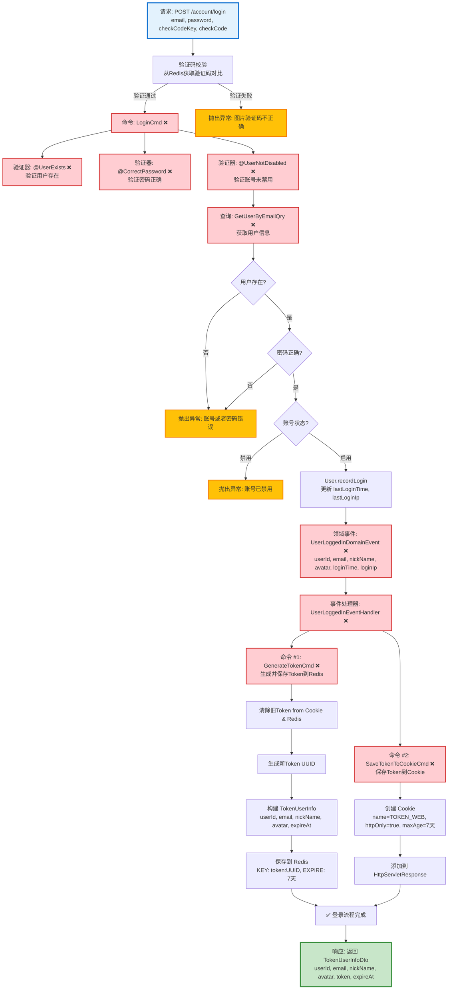

# 用户登录流程设计文档

> 基于 easylive-java 项目需求，按照 DDD 事件驱动模式设计

## 📋 业务需求概述

用户通过邮箱和密码登录系统，系统验证验证码、邮箱密码、账号状态，生成Token保存到Redis和Cookie，更新最后登录时间和IP，返回用户信息。

---

## 📊 完整流程图

### ASCII 流程图

```
┌─────────────────────────────────────────────────────────────────┐
│ 请求：POST /account/login                                        │
│ Payload:                                                        │
│ {                                                               │
│   "email": "user@example.com",                                  │
│   "password": "password123",                                    │
│   "checkCodeKey": "uuid-xxxx",                                  │
│   "checkCode": "1234"                                           │
│ }                                                               │
└────────────────────────────┬────────────────────────────────────┘
                             ↓
┌─────────────────────────────────────────────────────────────────┐
│ 前置验证：验证码校验                                              │
│                                                                 │
│ 处理逻辑：                                                       │
│   1. 从 Redis 获取验证码                                         │
│      - KEY: check_code:{checkCodeKey}                          │
│   2. 对比用户输入的 checkCode（忽略大小写）                      │
│   3. 如果不匹配 → 抛出异常 "图片验证码不正确"                     │
└────────────────────────────┬────────────────────────────────────┘
                             ↓
┌─────────────────────────────────────────────────────────────────┐
│ 命令：LoginCmd                                                   │
│ 状态：❌ 缺失 (需新增到 design/aggregate/user/)                  │
│                                                                 │
│ 命令参数：                                                       │
│   - email: String                                               │
│   - password: String                                            │
│   - loginIp: String                                             │
│                                                                 │
│ 验证器：                                                         │
│   ├─ @ValidEmail ✅ (邮箱格式验证)                               │
│   ├─ @NotEmpty ✅ (密码非空验证)                                 │
│   ├─ @UserExists ❌ (验证用户存在)                               │
│   ├─ @CorrectPassword ❌ (验证密码正确)                          │
│   └─ @UserNotDisabled ❌ (验证账号未被禁用)                      │
│                                                                 │
│ 处理逻辑：                                                       │
│   1. 查询用户信息 GetUserByEmailQry ❌                           │
│      - 如果不存在 → 抛出异常 "账号或者密码错误"                   │
│   2. 验证密码:                                                  │
│      - password == user.password (MD5/BCrypt)                  │
│      - 如果不匹配 → 抛出异常 "账号或者密码错误"                   │
│   3. 验证账号状态:                                               │
│      - user.status == ENABLED                                  │
│      - 如果禁用 → 抛出异常 "账号已禁用"                          │
│   4. User.recordLogin(loginTime, loginIp)                       │
│      - 更新 lastLoginTime = 当前时间                             │
│      - 更新 lastLoginIp = 登录IP                                │
│   5. Mediator.uow.save()                                        │
└────────────────────────────┬────────────────────────────────────┘
                             ↓
┌─────────────────────────────────────────────────────────────────┐
│ 领域事件：UserLoggedInDomainEvent                                │
│ 状态：❌ 缺失 (需新增到 design/aggregate/user/)                  │
│                                                                 │
│ 事件载荷：                                                       │
│ {                                                               │
│   "userId": "U001",                                             │
│   "email": "user@example.com",                                  │
│   "nickName": "张三",                                            │
│   "avatar": "/avatar/default.png",                              │
│   "loginTime": 1729267200,                                      │
│   "loginIp": "192.168.1.100"                                    │
│ }                                                               │
└────────────────────────────┬────────────────────────────────────┘
                             ↓
┌─────────────────────────────────────────────────────────────────┐
│ 事件处理器：UserLoggedInEventHandler ❌                          │
│ 监听事件：UserLoggedInDomainEvent                                │
│ 触发命令：                                                       │
│   1. GenerateTokenCmd ❌ (生成并保存Token)                       │
│   2. SaveTokenToCookieCmd ❌ (保存Token到Cookie)                │
│ 实现路径：adapter/.../events/UserLoggedInEventHandler.kt       │
└────────────────────────────┬────────────────────────────────────┘
                             ↓
        ┌────────────────────┴────────────────────┐
        ↓                                         ↓
┌─────────────────────────────────────────────────────────────────┐
│ 命令 #1: GenerateTokenCmd ❌                                     │
│ 状态：缺失 (需新增到 design/extra/token_gen.json)                │
│                                                                 │
│ 命令参数：                                                       │
│   - userId: String                                              │
│   - email: String                                               │
│   - nickName: String                                            │
│   - avatar: String                                              │
│                                                                 │
│ 处理逻辑：                                                       │
│   1. 清除旧Token (如果存在)                                      │
│      - 从 Cookie 中读取旧 token                                 │
│      - 从 Redis 删除旧 token: DEL token:{oldToken}             │
│   2. 生成新Token                                                │
│      - token = UUID.randomUUID().toString()                    │
│   3. 构建 TokenUserInfo 对象                                    │
│      - userId, email, nickName, avatar                         │
│      - expireAt = 当前时间 + 7天                                 │
│   4. 保存到 Redis                                               │
│      - KEY: token:{token}                                      │
│      - VALUE: TokenUserInfo (JSON)                             │
│      - EXPIRE: 7天                                              │
│   5. 返回 token                                                 │
└─────────────────────────────────────────────────────────────────┘

┌─────────────────────────────────────────────────────────────────┐
│ 命令 #2: SaveTokenToCookieCmd ❌                                 │
│ 状态：缺失 (需新增到 design/extra/token_gen.json)                │
│                                                                 │
│ 命令参数：                                                       │
│   - token: String                                               │
│   - response: HttpServletResponse                               │
│                                                                 │
│ 处理逻辑：                                                       │
│   1. 创建 Cookie                                                │
│      - name: TOKEN_WEB                                          │
│      - value: token                                             │
│      - maxAge: 7天（秒）                                         │
│      - path: /                                                  │
│      - httpOnly: true                                           │
│      - secure: false (本地开发)                                 │
│   2. 添加到 HttpServletResponse                                 │
│   3. 无需保存到数据库                                            │
└─────────────────────────────────────────────────────────────────┘
                             ↓
                      ✅ 登录流程完成
                             ↓
┌─────────────────────────────────────────────────────────────────┐
│ 响应：返回用户信息                                                │
│                                                                 │
│ {                                                               │
│   "userId": "U001",                                             │
│   "email": "user@example.com",                                  │
│   "nickName": "张三",                                            │
│   "avatar": "/avatar/default.png",                              │
│   "token": "xxxxxxxx-xxxx-xxxx-xxxx-xxxxxxxxxxxx",              │
│   "expireAt": 1729871600000                                     │
│ }                                                               │
└─────────────────────────────────────────────────────────────────┘
```

---

### Mermaid 可视化流程图



**图例说明**：
- 🔵 蓝色：请求入口
- 🟢 绿色：成功流程
- 🔴 红色：缺失的设计（❌ 需实现）
- 🟡 黄色：异常分支

---

## 📦 设计元素清单

### ✅ 已存在的设计

#### 验证器 (Validators)

| 验证器 | 描述 | 状态 | Spring Validation |
|--------|------|------|-------------------|
| `@Email` | 邮箱格式验证 | ✅ 已支持 | `javax.validation.constraints.Email` |
| `@NotEmpty` | 非空验证 | ✅ 已支持 | `javax.validation.constraints.NotEmpty` |

---

### ❌ 缺失的设计清单

#### 需要补充的命令

| 序号 | 命令名称 | 描述 | 建议位置 | 优先级 |
|-----|---------|------|----------|-------|
| 1 | `LoginCmd` | 用户登录 | `design/aggregate/user/` | P0 |
| 2 | `GenerateTokenCmd` | 生成并保存Token到Redis | `design/extra/token_gen.json` | P0 |
| 3 | `SaveTokenToCookieCmd` | 保存Token到Cookie | `design/extra/token_gen.json` | P0 |

**JSON 定义**（需新增到 `design/aggregate/user/_gen.json`）：
```json
{
  "cmd": [
    {
      "package": "user",
      "name": "Login",
      "desc": "用户登录"
    }
  ]
}
```

**JSON 定义**（需新增到 `design/extra/token_gen.json`）：
```json
{
  "cmd": [
    {
      "package": "user",
      "name": "GenerateToken",
      "desc": "生成并保存Token"
    },
    {
      "package": "user",
      "name": "SaveTokenToCookie",
      "desc": "保存Token到Cookie"
    }
  ]
}
```

#### 需要补充的领域事件

| 序号 | 事件名称 | 描述 | 触发时机 | 建议位置 | 优先级 |
|-----|---------|------|----------|----------|-------|
| 1 | `UserLoggedInDomainEvent` | 用户已登录 | 登录成功后 | `design/aggregate/user/` | P0 |
| 2 | `TokenGeneratedDomainEvent` | Token已生成 | Token保存到Redis后 | `design/extra/token_gen.json` | P1 |

**JSON 定义**（需新增到 `design/aggregate/user/_gen.json`）：
```json
{
  "de": [
    {
      "package": "user",
      "name": "UserLoggedIn",
      "desc": "用户已登录",
      "aggregates": ["User"],
      "entity": "User",
      "persist": true
    }
  ]
}
```

#### 需要补充的查询

| 序号 | 查询名称 | 描述 | 返回值 | 建议位置 | 优先级 |
|-----|---------|------|--------|----------|-------|
| 1 | `GetUserByEmailQry` | 根据邮箱获取用户 | `{ userId, email, password, nickName, avatar, status, ... }` | `design/aggregate/user/` | P0 |
| 2 | `GetCheckCodeQry` | 从Redis获取验证码 | `{ checkCode: String }` | `design/extra/checkcode_gen.json` | P0 |

**JSON 定义**（需新增到 `design/aggregate/user/_gen.json`）：
```json
{
  "qry": [
    {
      "package": "user",
      "name": "GetUserByEmail",
      "desc": "根据邮箱获取用户"
    }
  ]
}
```

#### 需要补充的验证器

| 序号 | 验证器名称 | 描述 | 依赖查询 | 实现路径 | 优先级 |
|-----|-----------|------|----------|----------|-------|
| 1 | `@UserExists` | 验证用户存在（根据邮箱） | `GetUserByEmailQry` | `application/.../validater/UserExists.kt` | P0 |
| 2 | `@CorrectPassword` | 验证密码正确 | `GetUserByEmailQry` | `application/.../validater/CorrectPassword.kt` | P0 |
| 3 | `@UserNotDisabled` | 验证账号未被禁用 | `GetUserByEmailQry` | `application/.../validater/UserNotDisabled.kt` | P0 |

#### 需要补充的事件处理器

| 序号 | 处理器名称 | 监听事件 | 触发命令 | 实现路径 | 优先级 |
|-----|-----------|----------|----------|----------|-------|
| 1 | `UserLoggedInEventHandler` | `UserLoggedInDomainEvent` | `GenerateTokenCmd`<br/>`SaveTokenToCookieCmd` | `adapter/.../events/UserLoggedInEventHandler.kt` | P0 |

**优先级说明**：
- **P0**：核心功能，必须实现
- **P1**：重要功能，建议实现
- **P2**：可选功能，后续扩展

---

## 🔑 关键业务规则

### 1. 验证码校验（前置条件）
- **验证时机**：在命令执行前
- **校验逻辑**：
  ```kotlin
  val savedCheckCode = redisComponent.getCheckCode(checkCodeKey)
  if (!checkCode.equalsIgnoreCase(savedCheckCode)) {
      throw BusinessException("图片验证码不正确")
  }
  ```
- **清理机制**：登录成功或失败后，立即清除验证码
  ```kotlin
  finally {
      redisComponent.cleanCheckCode(checkCodeKey)
  }
  ```

### 2. 用户存在性和密码验证
- **查询用户**：根据邮箱查询用户信息
  ```kotlin
  val user = userRepository.findByEmail(email)
      ?: throw BusinessException("账号或者密码错误")
  ```
- **密码验证**：对比明文密码（easylive-java 使用 MD5）
  ```kotlin
  if (user.password != password) {
      throw BusinessException("账号或者密码错误")
  }
  ```
- **安全提示**：为了安全，用户不存在和密码错误返回相同错误信息

### 3. 账号状态验证
- **状态枚举**：
  - `ENABLED` (0) - 启用 ✅
  - `DISABLED` (1) - 禁用 ❌

**easylive-java 实现**（行 284-286）：
```java
if (UserStatusEnum.DISABLE.getStatus().equals(userInfo.getStatus())) {
    throw new BusinessException("账号已禁用");
}
```

### 4. 登录信息记录
- **更新字段**：
  - `lastLoginTime` - 最后登录时间（当前时间戳）
  - `lastLoginIp` - 最后登录IP

**easylive-java 实现**（行 289-293）：
```java
UserInfo updateInfo = new UserInfo();
updateInfo.setLastLoginTime(new Date());
updateInfo.setLastLoginIp(ip);
this.userInfoMapper.updateByUserId(updateInfo, userInfo.getUserId());
```

### 5. Token 生成和管理

#### Token 生成逻辑
1. **清除旧Token**（如果存在）
   - 从请求的 Cookie 中读取旧 token
   - 从 Redis 删除旧 token

**easylive-java 实现**（行 143-156）：
```java
Cookie[] cookies = request.getCookies();
if (cookies != null) {
    String token = null;
    for (Cookie cookie : cookies) {
        if (Constants.TOKEN_WEB.equals(cookie.getName())) {
            token = cookie.getValue();
        }
    }
    if (!StringTools.isEmpty(token)) {
        redisComponent.cleanToken(token);
    }
}
```

2. **生成新Token**
   - 使用 UUID 生成唯一标识
   - 构建 `TokenUserInfoDto` 对象
   - 保存到 Redis，设置过期时间（7天）

**TokenUserInfoDto 结构**：
```kotlin
data class TokenUserInfoDto(
    val userId: String,
    val email: String,
    val nickName: String,
    val avatar: String,
    val token: String,  // UUID
    val expireAt: Long  // 当前时间 + 7天（毫秒）
)
```

**Redis 存储**：
- **KEY**: `token:{token}`
- **VALUE**: `TokenUserInfoDto` (JSON序列化)
- **EXPIRE**: 7天

**easylive-java 实现**（行 296-298）：
```java
TokenUserInfoDto tokenUserInfoDto = CopyTools.copy(userInfo, TokenUserInfoDto.class);
redisComponent.saveTokenInfo(tokenUserInfoDto);
```

#### Token 保存到 Cookie
- **Cookie 名称**: `TOKEN_WEB`
- **Cookie 值**: token (UUID)
- **Cookie 属性**:
  - `maxAge`: 7天（秒）
  - `path`: `/`
  - `httpOnly`: `true` (防止XSS攻击)
  - `secure`: `false` (本地开发) / `true` (生产环境HTTPS)

**easylive-java 实现**（行 136）：
```java
saveToken2Cookie(response, tokenUserInfoDto.getToken());
```

### 6. 自动登录机制（扩展）

**检查Token过期时间**：
- 如果 Token 有效期 < 1天，自动刷新 Token
- 更新 Redis 中的 Token 信息
- 更新 Cookie 中的 Token

**easylive-java 实现**（行 177-182）：
```java
if (tokenUserInfoDto.getExpireAt() - System.currentTimeMillis() < Constants.REDIS_KEY_EXPIRES_DAY) {
    redisComponent.saveTokenInfo(tokenUserInfoDto);
    saveToken2Cookie(response, tokenUserInfoDto.getToken());
}
```

---

## 📊 Controller 层实现示例

```kotlin
@RestController
@RequestMapping("/account")
class AccountController {

    @PostMapping("/login")
    @GlobalInterceptor
    fun login(
        request: HttpServletRequest,
        response: HttpServletResponse,
        @RequestParam @NotEmpty @Email email: String,
        @RequestParam @NotEmpty password: String,
        @RequestParam @NotEmpty checkCodeKey: String,
        @RequestParam @NotEmpty checkCode: String
    ): Response<TokenUserInfoDto> {
        try {
            // 1. 验证验证码
            val savedCheckCode = redisComponent.getCheckCode(checkCodeKey)
            if (!checkCode.equals(savedCheckCode, ignoreCase = true)) {
                throw BusinessException("图片验证码不正确")
            }

            // 2. 获取登录IP
            val loginIp = getIpAddr()

            // 3. 调用登录命令
            val tokenUserInfo = Mediator.commands.send(
                LoginCmd.Request(
                    email = email,
                    password = password,
                    loginIp = loginIp,
                    request = request,
                    response = response
                )
            )

            // 4. 返回用户信息（包含Token）
            return Response(data = tokenUserInfo)
        } finally {
            // 5. 清除验证码
            redisComponent.cleanCheckCode(checkCodeKey)
        }
    }
}
```

---

## 📌 设计优势

### **事件驱动的登录流程**

1. **职责分离**：
   - `LoginCmd` - 负责用户认证和登录信息记录
   - `GenerateTokenCmd` - 负责Token生成和Redis存储
   - `SaveTokenToCookieCmd` - 负责Cookie操作

2. **安全性设计**：
   - 验证码防止暴力破解
   - httpOnly Cookie 防止XSS攻击
   - Token存储在Redis，支持主动失效
   - 清除旧Token机制，防止Token泄露

3. **用户友好**：
   - 自动登录机制（Token自动续期）
   - 统一的错误提示（账号或密码错误）
   - 记录登录时间和IP，支持安全审计

4. **扩展性**：
   - 易于添加多因素认证（MFA）
   - 支持OAuth第三方登录（通过新增命令）
   - 支持登录日志记录（通过事件处理器）

---

## 🔄 登录流程状态图

```
┌────────────┐
│ 未登录      │
└──────┬─────┘
       ↓
┌────────────┐     ┌────────────┐
│ 输入登录    │ --> │ 验证验证码  │
│ 信息        │     └──────┬─────┘
└────────────┘            ↓
                   ┌──────┴──────┐
                   │ 验证码正确?  │
                   └──┬───────┬──┘
                      ↓       ↓
               ┌────────────┐ ┌────────────┐
               │ 验证用户    │ │ 抛出异常   │
               │ 和密码      │ │ (验证码错误)│
               └──────┬─────┘ └────────────┘
                      ↓
               ┌──────┴──────┐
               │ 用户存在且   │
               │ 密码正确?    │
               └──┬───────┬──┘
                  ↓       ↓
          ┌────────────┐ ┌────────────┐
          │ 检查账号   │ │ 抛出异常   │
          │ 状态       │ │ (账号或密码)│
          └──────┬─────┘ └────────────┘
                 ↓
          ┌──────┴──────┐
          │ 账号启用?    │
          └──┬───────┬──┘
             ↓       ↓
     ┌────────────┐ ┌────────────┐
     │ 生成Token  │ │ 抛出异常   │
     │ 保存Cookie │ │ (账号禁用) │
     └──────┬─────┘ └────────────┘
            ↓
     ┌────────────┐
     │ 登录成功   │
     │ (已认证)   │
     └────────────┘
```

---

## 🧩 扩展设计：多因素认证（MFA）

如果需要支持短信验证码或邮箱验证码作为第二因素认证，可以新增：

```kotlin
@PostMapping("/loginWithMfa")
fun loginWithMfa(
    @RequestParam email: String,
    @RequestParam password: String,
    @RequestParam mfaCode: String,  // 短信/邮箱验证码
    @RequestParam checkCode: String
): Response<TokenUserInfoDto> {
    Mediator.commands.send(
        LoginWithMfaCmd.Request(
            email = email,
            password = password,
            mfaCode = mfaCode,
            checkCode = checkCode
        )
    )
}
```

**新增命令**：
- `SendMfaCodeCmd` - 发送短信/邮箱验证码
- `VerifyMfaCodeCmd` - 验证MFA验证码
- `LoginWithMfaCmd` - 带MFA的登录

---

**文档版本**：v1.0
**创建时间**：2025-10-22
**维护者**：开发团队
