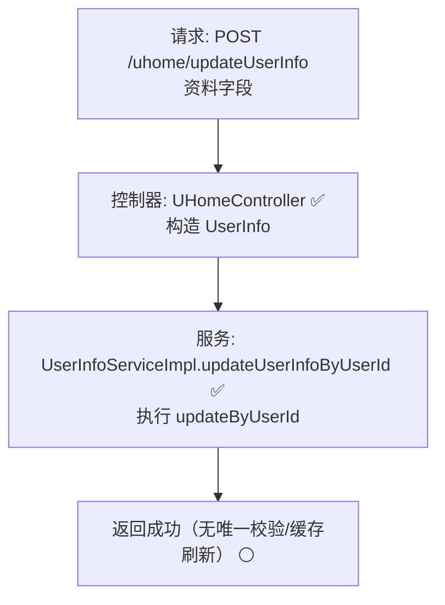

# 用户资料更新流程设计文档

> 基于 easylive-java 用户中心需求，按照 DDD 事件驱动模式设计

## 📋 业务需求概述
已登录用户在个人主页更新昵称、头像、性别、生日、学校等资料。系统需校验输入、验证用户身份、更新资料存储，并保证展示层与搜索索引使用的新数据一致。

---

## 📊 完整流程图

### ASCII 流程图
```
┌──────────────────────────────────────────────────────────┐
│ 请求：POST /uhome/updateUserInfo                          │
│ Payload: {                                                │
│   "nickName": "新昵称",                                    │
│   "avatar": "https://...png",                             │
│   "sex": 1,                                               │
│   "birthday": "2000-01-01",                              │
│   "school": "only4 university",                          │
│   "personIntroduction": "一句签名",                       │
│   "noticeInfo": "主页公告"                                │
│ }                                                         │
└────────────────────────────┬─────────────────────────────┘
                             ↓
┌──────────────────────────────────────────────────────────┐
│ 控制器：UHomeController#updateUserInfo ✅                  │
│ 1. Token → currentUserId                                  │
│ 2. 组装 UserInfo 对象                                     │
│ 3. 调用 userInfoService.updateUserInfoByUserId            │
└────────────────────────────┬─────────────────────────────┘
                             ↓
┌──────────────────────────────────────────────────────────┐
│ 服务：UserInfoServiceImpl#updateUserInfoByUserId ✅       │
│ 1. Mapper updateByUserId（user_info 表）                  │
│ 2. 无昵称唯一校验、无缓存刷新                             │
│ 3. 返回成功                                               │
└──────────────────────────────────────────────────────────┘
```

### 场景 #1：正常更新
```
currentUserId = userId
    ├─ 更新 user_info 表昵称/头像等字段
    └─ 返回成功
```

### 场景 #2：越权调用
```
controller 强制使用当前登录用户 → 无法更新他人资料
```

### 场景 #3：昵称重复
```
传统实现不会验证；存在潜在重复昵称风险
```

### Mermaid 流程图


---

## 📦 设计元素清单

### ✅ 已存在的设计

#### 命令 / 服务
| 名称 | 描述 | 状态 | 位置 |
|------|------|------|------|
| `userInfoService.updateUserInfoByUserId` | 更新 user_info 表资料 | ✅ | `easylive-java/easylive-common/src/main/java/com/easylive/service/impl/UserInfoServiceImpl.java:175` |
| `UpdateCustomerProfileCmd` | DDD 更新用户档案（CustomerProfile 聚合） | ✅ | `only-danmuku/only-danmuku-application/src/main/kotlin/edu/only4/danmuku/application/commands/customer_profile/UpdateCustomerProfileCmd.kt:16` |

#### 聚合 / 查询
| 名称 | 描述 | 状态 |
|------|------|------|
| `CustomerProfile` 聚合 | 存储昵称、头像、公告等资料字段 | ✅ |
| `GetCustomerProfileQry` | 查询用户档案详情（加载个人主页） | ✅ |

---

## ❌ 缺失的设计清单

| 类型 | 缺失项 | 描述 | 建议位置 | 优先级 |
|------|--------|------|----------|-------|
| 命令 | `UpdateCustomerProfileCmd` 参数扩展 | 支持强制校验昵称唯一、限制字段长度 | `design/aggregate/customer_profile/_gen.json` | P0 |
| 命令 | `SyncUserInfoProjectionCmd` | 同步 user_info / 搜索索引 / 缓存 | `design/extra/user_profile_gen.json` | P0 |
| 验证器 | `@UniqueNickname` | 校验昵称唯一性，排除当前用户 | `only-danmuku-application/.../validator/` | P0 |
| 验证器 | `@ProfileFieldFormat` | 校验头像 URL、公告长度、字符安全 | 同上 | P1 |
| 领域事件 | `CustomerProfileUpdatedDomainEvent` | 档案更新后发布事件 | `design/aggregate/customer_profile/_gen.json` | P0 |
| 事件处理器 | `CustomerProfileUpdatedEventHandler` | 同步缓存、通知站内信、刷新搜索索引 | `only-danmuku-adapter/.../events/CustomerProfileUpdatedEventHandler.kt` | P0 |
| 查询 | `CheckNicknameExistsQry` | 昵称唯一性查询 | `design/aggregate/customer_profile/_gen.json` | P0 |

**优先级说明**：P0 表示保障数据一致性与安全性的必备能力；P1 为增强体验与校验质量。

---

## 🔑 关键业务规则
- **资料字段覆盖**：传统系统直接更新 `user_info` 表；DDD 侧将资料存储在 `CustomerProfile` 聚合，实现时需同步两个数据源或完成数据迁移。
- **昵称唯一**：旧实现缺乏唯一校验，可能允许重名。设计需补充查询与验证器，避免冲突。
- **输入安全**：头像 URL、公告、签名需限制长度并做敏感字符过滤（尤其是 HTML/脚本），当前实现未处理。
- **缓存/索引更新**：资料变更后需刷新用户主页缓存、搜索建议等；现实现无事件驱动，需通过 `CustomerProfileUpdatedDomainEvent` + 事件处理器完成。
- **审计记录**：建议记录操作日志（旧值、新值、操作者），便于追踪用户资料变更历史。

---

## 🧾 控制器与命令示例
```java
// 传统控制器
@RequestMapping("/updateUserInfo")
@GlobalInterceptor(checkLogin = true)
public ResponseVO updateUserInfo(@NotEmpty @Size(max = 20) String nickName,
                                 @NotEmpty @Size(max = 100) String avatar,
                                 @NotNull Integer sex, String birthday,
                                 @Size(max = 150) String school,
                                 @Size(max = 80) String personIntroduction,
                                 @Size(max = 300) String noticeInfo) {
    TokenUserInfoDto tokenUserInfoDto = getTokenUserInfoDto();
    UserInfo userInfo = new UserInfo();
    userInfo.setNickName(nickName);
    userInfo.setAvatar(avatar);
    userInfo.setSex(sex);
    userInfo.setBirthday(birthday);
    userInfo.setSchool(school);
    userInfo.setPersonIntroduction(personIntroduction);
    userInfo.setNoticeInfo(noticeInfo);
    userInfoService.updateUserInfoByUserId(userInfo, tokenUserInfoDto.getUserId());
    return getSuccessResponseVO(null);
}
```
> 参考：`easylive-java/easylive-web/src/main/java/com/easylive/web/controller/UHomeController.java:92`

```kotlin
// DDD 控制器
@PostMapping("/updateUserInfo")
fun uHomeUpdateUserInfo(@RequestBody @Validated request: UHomeUpdateUserInfo.Request): UHomeUpdateUserInfo.Response {
    val userId = LoginHelper.getUserId()!!
    Mediator.commands.send(
        UpdateCustomerProfileCmd.Request(
            customerId = userId,
            nickName = request.nickName,
            avatar = request.avatar,
            sex = request.sex,
            birthday = request.birthday,
            school = request.school,
            personIntroduction = request.personIntroduction,
            noticeInfo = request.noticeInfo
        )
    )
    return UHomeUpdateUserInfo.Response()
}
```
> 参考：`only-danmuku/only-danmuku-adapter/src/main/kotlin/edu/only4/danmuku/adapter/portal/api/UHomeController.kt:66`

```kotlin
// 命令处理器（缺少唯一校验与同步逻辑）
val profile = Mediator.repositories.findFirst(
    SCustomerProfile.predicate { it.userId eq request.customerId },
    persist = false
).getOrNull() ?: throw KnownException("用户档案不存在：${request.customerId}")

request.nickName?.let { profile.nickName = it }
request.avatar?.let { profile.avatar = it }
request.sex?.let { profile.sex = SexType.valueOf(it) }
profile.noticeInfo = request.noticeInfo ?: profile.noticeInfo
Mediator.uow.save()
```
> 参考：`only-danmuku/only-danmuku-application/src/main/kotlin/edu/only4/danmuku/application/commands/customer_profile/UpdateCustomerProfileCmd.kt:19`

---

## 📂 传统架构参考
- 控制器：`easylive-java/easylive-web/src/main/java/com/easylive/web/controller/UHomeController.java:92`
- 服务实现：`easylive-java/easylive-common/src/main/java/com/easylive/service/impl/UserInfoServiceImpl.java:175`
- Mapper 更新：`easylive-java/easylive-common/src/main/resources/com/easylive/mappers/UserInfoMapper.xml:630`

---

**文档版本**：v1.0  
**创建时间**：2025-10-22  
**维护者**：开发团队

