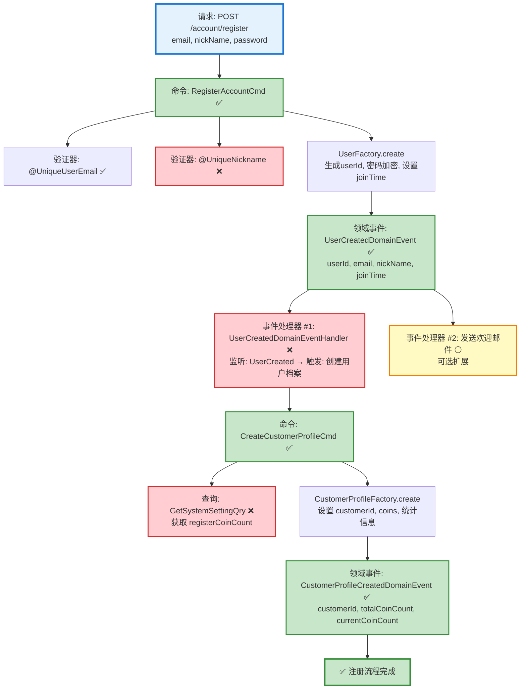

# 用户注册流程设计文档

> 基于 easylive-java 项目需求，按照 DDD 事件驱动模式设计

## 📋 业务需求概述

用户通过邮箱注册账号，系统验证验证码、邮箱唯一性、昵称唯一性后创建用户，并自动赠送注册硬币。

---

## 📊 完整流程图（请求 → 命令 → 事件 → 命令）

```
┌─────────────────────────────────────────────────────────────────┐
│ 请求：POST /account/register                                     │
│ Payload:                                                        │
│ {                                                               │
│   "email": "user@example.com",                                  │
│   "nickName": "张三",                                            │
│   "registerPassword": "password123",                            │
│   "checkCodeKey": "uuid-xxxx",                                  │
│   "checkCode": "1234"                                           │
│ }                                                               │
└────────────────────────────┬────────────────────────────────────┘
                             ↓
┌─────────────────────────────────────────────────────────────────┐
│ 命令：RegisterAccountCmd                                         │
│ 状态：✅ 已定义 (design/aggregate/user/_gen.json:5)              │
│                                                                 │
│ 验证器：                                                         │
│   ├─ @UniqueUserEmail ✅ (已实现)                                │
│   └─ @UniqueNickname  ❌ (缺失，需新增)                          │
│                                                                 │
│ 处理逻辑：                                                       │
│   1. 验证邮箱和昵称唯一性                                        │
│   2. 调用 UserFactory.create()                                  │
│      ├─ 生成 userId (雪花ID)                                    │
│      ├─ 密码加密 (BCrypt/MD5)                                   │
│      ├─ 设置 joinTime = 当前时间戳                               │
│      └─ status = ENABLED                                        │
│   3. 触发 User.onCreate()                                       │
│   4. Mediator.uow.save()                                        │
└────────────────────────────┬────────────────────────────────────┘
                             ↓
┌─────────────────────────────────────────────────────────────────┐
│ 领域事件：UserCreatedDomainEvent                                 │
│ 状态：✅ 已定义 (design/aggregate/user/_gen.json:47)             │
│                                                                 │
│ 事件载荷：                                                       │
│ {                                                               │
│   "userId": 1729267200001,                                      │
│   "email": "user@example.com",                                  │
│   "nickName": "张三",                                            │
│   "joinTime": 1729267200                                        │
│ }                                                               │
└────────────────────────────┬────────────────────────────────────┘
                             ↓
        ┌────────────────────┴────────────────────┐
        ↓                                         ↓
┌──────────────────────────┐          ┌──────────────────────────┐
│ 事件处理器 #1            │          │ 事件处理器 #2 (可选)     │
│ 监听: UserCreated        │          │ 监听: UserCreated        │
│ 触发: 创建用户档案        │          │ 触发: 发送欢迎邮件        │
│ 状态: ❌ 需实现           │          │ 状态: ⚪ 可选扩展        │
└──────┬───────────────────┘          └──────────────────────────┘
       ↓
┌─────────────────────────────────────────────────────────────────┐
│ 命令：CreateCustomerProfileCmd                                  │
│ 状态：✅ 已定义 (design/aggregate/customer_profile/_gen.json:15) │
│                                                                 │
│ 命令参数：                                                       │
│   - customerId: userId (从事件中获取)                            │
│   - nickName: 从事件中获取                                       │
│   - email: 从事件中获取                                          │
│   - totalCoinCount: 系统配置值 (registerCoinCount = 10)         │
│   - currentCoinCount: 系统配置值 (registerCoinCount = 10)       │
│                                                                 │
│ 处理逻辑：                                                       │
│   1. 查询系统设置 GetSystemSettingQry ❌ (缺失)                  │
│   2. 调用 CustomerProfileFactory.create()                       │
│      ├─ 设置 customerId = userId                                │
│      ├─ 设置 nickName, email                                    │
│      ├─ 初始化硬币: totalCoinCount = 10                          │
│      ├─ 初始化硬币: currentCoinCount = 10                        │
│      ├─ 初始化统计: fansCount = 0                                │
│      └─ 初始化统计: focusCount = 0                               │
│   3. 触发 CustomerProfile.onCreate()                            │
│   4. Mediator.uow.save()                                        │
└────────────────────────────┬────────────────────────────────────┘
                             ↓
┌─────────────────────────────────────────────────────────────────┐
│ 领域事件：CustomerProfileCreatedDomainEvent                      │
│ 状态：✅ 已定义 (design/aggregate/customer_profile/_gen.json:31) │
│                                                                 │
│ 事件载荷：                                                       │
│ {                                                               │
│   "customerId": 1729267200001,                                  │
│   "nickName": "张三",                                            │
│   "totalCoinCount": 10,                                         │
│   "currentCoinCount": 10,                                       │
│   "fansCount": 0,                                               │
│   "focusCount": 0                                               │
│ }                                                               │
└─────────────────────────────────────────────────────────────────┘
                             ↓
                      ✅ 注册流程完成
```

### Mermaid 可视化流程图



**图例说明**：
- 🔵 蓝色：请求入口
- 🟢 绿色：已存在的设计（✅ 可直接使用）
- 🔴 红色：缺失的设计（❌ 需实现）
- 🟡 黄色：可选扩展（⚪）

---

## 📦 设计元素清单

### ✅ 已存在的设计（可直接使用）

#### 命令 (Commands)

| 命令 | 描述 | 状态 | 位置 |
|------|------|------|------|
| `RegisterAccountCmd` | 注册账号 | ✅ 已定义 | `design/aggregate/user/_gen.json:5` |
| `CreateCustomerProfileCmd` | 创建用户档案 | ✅ 已定义 | `design/aggregate/customer_profile/_gen.json:15` |

#### 领域事件 (Domain Events)

| 事件 | 描述 | 触发时机 | 状态 | 位置 |
|------|------|----------|------|------|
| `UserCreatedDomainEvent` | 用户已创建 | User 聚合根创建后 | ✅ 已定义 | `design/aggregate/user/_gen.json:47` |
| `CustomerProfileCreatedDomainEvent` | 用户档案已创建 | CustomerProfile 聚合根创建后 | ✅ 已定义 | `design/aggregate/customer_profile/_gen.json:31` |

#### 查询 (Queries)

| 查询 | 描述 | 状态 | 位置 |
|------|------|------|------|
| `CheckEmailExistsQry` | 检查邮箱是否存在 | ✅ 已定义 | `design/aggregate/user/_gen.json:148` |
| `GetUserCountInfoQry` | 获取用户统计信息 | ✅ 已定义 | `design/extra/account_user_count_gen.json:5` |

---

### ❌ 缺失的设计（需要补充）

#### 查询 (Queries)

需要新增到 `design/extra/`：

**文件：`design/extra/user_validation_gen.json`**
```json
{
  "qry": [
    {
      "package": "user",
      "name": "CheckNicknameExists",
      "desc": "检查昵称是否存在"
    }
  ]
}
```

**文件：`design/extra/system_setting_gen.json`**
```json
{
  "qry": [
    {
      "package": "system",
      "name": "GetSystemSetting",
      "desc": "获取系统设置（包含注册赠送硬币等配置）"
    }
  ]
}
```

#### 验证器 (Validators)

需要在代码层面实现：

| 验证器 | 描述 | 依赖查询 | 实现路径 |
|--------|------|----------|----------|
| `@UniqueNickname` | 昵称唯一性校验 | `CheckNicknameExistsQry` | `only-danmuku-application/.../validater/UniqueNickname.kt` |

#### 事件处理器 (Event Handlers)

需要在代码层面实现：

| 处理器 | 监听事件 | 触发命令 | 实现路径 |
|--------|----------|----------|----------|
| `UserCreatedDomainEventHandler` | `UserCreatedDomainEvent` | `CreateCustomerProfileCmd` | `only-danmuku-adapter/.../events/UserCreatedDomainEventHandler.kt` |

---

## 🔧 实现步骤

### 步骤 1：补充缺失的查询定义

在 `design/extra/` 新增以下文件：

1. **`user_validation_gen.json`** - 昵称唯一性查询
2. **`system_setting_gen.json`** - 系统设置查询

### 步骤 2：运行代码生成

```bash
cd only-danmuku
./gradlew codegen
./gradlew :only-danmuku-application:kspKotlin
```

### 步骤 3：实现核心逻辑

#### 3.1 实现昵称唯一性验证器

**位置：** `only-danmuku-application/src/main/kotlin/.../application/validater/UniqueNickname.kt`

```kotlin
@Target(AnnotationTarget.FIELD)
@Constraint(validatedBy = [UniqueNickname.Validator::class])
annotation class UniqueNickname(
    val message: String = "昵称已被使用",
    val groups: Array<KClass<*>> = [],
    val payload: Array<KClass<out Payload>> = []
) {
    class Validator : ConstraintValidator<UniqueNickname, String> {
        override fun isValid(value: String?, context: ConstraintValidatorContext): Boolean {
            if (value.isNullOrBlank()) return true
            val exists = Mediator.queries.send(
                CheckNicknameExistsQry.Request(nickName = value)
            ).exists
            return !exists
        }
    }
}
```

#### 3.2 实现查询处理器

**CheckNicknameExistsQryHandler**

```kotlin
@Service
class CheckNicknameExistsQryHandler(
    private val sqlClient: KSqlClient
) : Query<CheckNicknameExistsQry.Request, CheckNicknameExistsQry.Response> {
    override fun exec(request: CheckNicknameExistsQry.Request): CheckNicknameExistsQry.Response {
        val exists = sqlClient.exists(JUser::class) {
            where(table.nickName eq request.nickName)
        }
        return CheckNicknameExistsQry.Response(exists)
    }
}
```

**GetSystemSettingQryHandler**

```kotlin
@Service
class GetSystemSettingQryHandler(
    private val redisComponent: RedisComponent
) : Query<GetSystemSettingQry.Request, GetSystemSettingQry.Response> {
    override fun exec(request: GetSystemSettingQry.Request): GetSystemSettingQry.Response {
        val setting = redisComponent.getSysSettingDto()
        return GetSystemSettingQry.Response(
            registerCoinCount = setting.registerCoinCount,
            postVideoCoinCount = setting.postVideoCoinCount,
            videoSize = setting.videoSize,
            videoPCount = setting.videoPCount,
            videoCount = setting.videoCount,
            commentCount = setting.commentCount,
            danmuCount = setting.danmuCount
        )
    }
}
```

#### 3.3 实现事件处理器

**UserCreatedDomainEventHandler**

```kotlin
@Service
class UserCreatedDomainEventHandler : DomainEventHandler<UserCreatedDomainEvent> {

    override fun handle(event: UserCreatedDomainEvent) {
        // 获取系统设置
        val systemSetting = Mediator.queries.send(
            GetSystemSettingQry.Request()
        )

        // 创建用户档案
        Mediator.commands.send(
            CreateCustomerProfileCmd.Request(
                customerId = event.entity.id,
                nickName = event.entity.nickName,
                email = event.entity.email,
                totalCoinCount = systemSetting.registerCoinCount,
                currentCoinCount = systemSetting.registerCoinCount
            )
        )
    }
}
```

#### 3.4 更新 RegisterAccountCmd.Request

在 `RegisterAccountCmd.Request` 中添加昵称唯一性验证：

```kotlin
class Request(
    @field:UniqueUserEmail
    val email: String,

    @field:UniqueNickname  // 新增
    val nickName: String,

    val registerPassword: String,
) : RequestParam<Response>
```

---

## 🧪 测试用例

### 测试文件：`AccountController.http`

```http
### 1. 获取验证码
POST {{baseUrl}}/account/checkCode
Content-Type: application/json

### 2. 用户注册（成功）
POST {{baseUrl}}/account/register
Content-Type: application/json

{
  "email": "test@example.com",
  "nickName": "测试用户",
  "registerPassword": "Password123!",
  "checkCodeKey": "{{checkCodeKey}}",
  "checkCode": "1234"
}

### 3. 重复邮箱注册（失败）
POST {{baseUrl}}/account/register
Content-Type: application/json

{
  "email": "test@example.com",
  "nickName": "新用户",
  "registerPassword": "Password123!",
  "checkCodeKey": "{{checkCodeKey}}",
  "checkCode": "1234"
}

### 4. 重复昵称注册（失败）
POST {{baseUrl}}/account/register
Content-Type: application/json

{
  "email": "newuser@example.com",
  "nickName": "测试用户",
  "registerPassword": "Password123!",
  "checkCodeKey": "{{checkCodeKey}}",
  "checkCode": "1234"
}

### 5. 验证用户档案已创建
POST {{baseUrl}}/account/getUserCountInfo
Authorization: Bearer {{token}}
```

---

## 📌 关键技术点

### 1. 事件驱动架构

- **同步事件处理**：`UserCreatedDomainEvent` 在同一事务中触发 `CreateCustomerProfileCmd`
- **保证一致性**：User 和 CustomerProfile 在同一工作单元中创建

### 2. 聚合根边界

- **User 聚合根**：负责账号认证信息（email, password, status）
- **CustomerProfile 聚合根**：负责用户档案和统计信息（nickName, coins, fans, focus）

### 3. 验证策略

- **声明式验证**：使用 `@UniqueUserEmail` 和 `@UniqueNickname` 注解
- **查询分离**：验证器通过 CQRS 查询层实现，不直接访问仓储

### 4. 系统配置

- **注册赠送硬币**：从 Redis 中的系统设置获取（默认 10 个）
- **配置热更新**：支持运行时修改系统配置

---

## 🎯 验收标准

1. ✅ 用户注册成功后，User 表新增一条记录
2. ✅ 用户注册成功后，CustomerProfile 表新增一条记录
3. ✅ 新用户的 currentCoinCount = 系统配置的 registerCoinCount
4. ✅ 邮箱重复注册返回 "邮箱已被注册" 错误
5. ✅ 昵称重复注册返回 "昵称已被使用" 错误
6. ✅ 验证码错误返回 "验证码错误" 错误
7. ✅ 注册成功后触发 `UserCreatedDomainEvent` 和 `CustomerProfileCreatedDomainEvent`

---

## 📚 参考资料

- **easylive-java 原实现**：`easylive-web/src/main/java/com/easylive/web/controller/AccountController.java:85`
- **only-danmuku 设计文件**：`design/aggregate/user/_gen.json`, `design/aggregate/customer_profile/_gen.json`
- **DDD 最佳实践**：《领域驱动设计》- Eric Evans

---

**文档版本**：v1.0
**创建时间**：2025-10-22
**维护者**：开发团队
