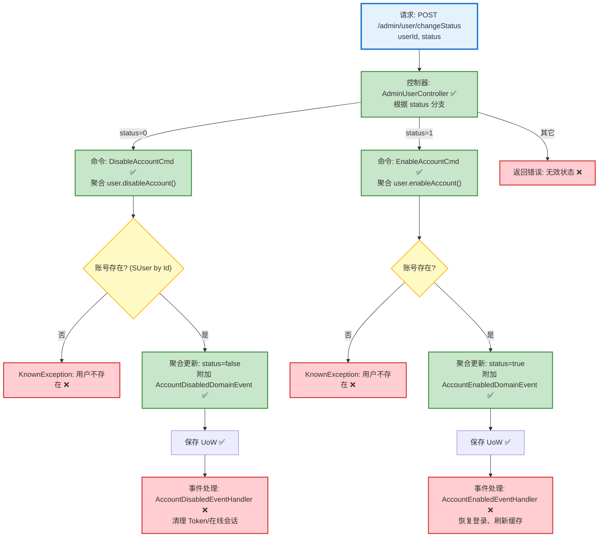

# 用户状态变更流程设计文档

> 基于 easylive-java 项目需求，按照 DDD 事件驱动模式设计

## 📋 业务需求概述
管理员需要在后台启用或禁用用户账号，确保禁用后用户无法继续登录并及时失效已签发的会话凭证；重新启用时需恢复正常访问。

---

## 📊 完整流程图

### ASCII 流程图
```
┌──────────────────────────────────────────────────────────┐
│ 请求：POST /admin/user/changeStatus                       │
│ Payload: {                                                │
│   "userId": "1008611",                                    │
│   "status": 0 | 1    // 0:禁用 1:启用                     │
│ }                                                         │
└────────────────────────────┬─────────────────────────────┘
                             ↓
┌──────────────────────────────────────────────────────────┐
│ 控制器：AdminUserController#changeStatus ✅                │
│ 1. userId(String) → Long                                  │
│ 2. 根据 status 决定调用命令                               │
│    ├─ status = 0 → DisableAccountCmd ✅                    │
│    ├─ status = 1 → EnableAccountCmd ✅                     │
│    └─ 其它值 → KnownException("无效的状态值") ❌         │
└────────────────────────────┬─────────────────────────────┘
                             ↓
┌──────────────────────────────────────────────────────────┐
│ 分支一：禁用账号（status = 0）                             │
│ 命令：DisableAccountCmd ✅                                 │
│ 1. 读取用户聚合 SUser.predicateById                       │
│    └─ 不存在 → KnownException("用户不存在")               │
│ 2. 调用用户聚合 user.disableAccount()                     │
│    └─ status=true → false，并附加 AccountDisabled 事件    │
│ 3. Mediator.uow.save()                                    │
│ 4. ✅（缺失）事件处理：清理 Token、下线会话、记录审计      │
└────────────────────────────┬─────────────────────────────┘
                             ↓
┌──────────────────────────────────────────────────────────┐
│ 分支二：启用账号（status = 1）                             │
│ 命令：EnableAccountCmd ✅                                  │
│ 1. 读取用户聚合                                           │
│ 2. user.enableAccount()                                   │
│    └─ status=false → true，附加 AccountEnabled 事件       │
│ 3. Mediator.uow.save()                                    │
│ 4. ✅（缺失）事件处理：恢复可登录状态、刷新缓存            │
└──────────────────────────────────────────────────────────┘
```

### 场景 #1：禁用成功
```
管理员 → DisableAccountCmd
    ├─ 用户存在且当前为启用
    ├─ status 切换为 false
    └─ 发布 AccountDisabledDomainEvent ✅
        → 事件处理器应清理 Token、踢出在线用户 ❌
```

### 场景 #2：启用成功
```
管理员 → EnableAccountCmd
    ├─ 用户存在且当前为禁用
    ├─ status 切换为 true
    └─ 发布 AccountEnabledDomainEvent ✅
        → 事件处理器应恢复登录能力（例如解锁风控标记）❌
```

### 场景 #3：参数异常
```
管理员 → changeStatus
    ├─ status 不是 0/1 → KnownException("无效的状态值")
    ├─ userId 无法转换为 Long → 400（校验失败）
    └─ 用户不存在 → KnownException("用户不存在")
```

### Mermaid 流程图


**图例说明**：
- 🔵 蓝色：请求入口
- 🟢 绿色：已存在的设计（✅ 可直接使用）
- 🔴 红色：缺失的设计（❌ 需实现）
- 🟡 黄色：条件判断 / 可选分支（⚪）

---

## 📦 设计元素清单

### ✅ 已存在的设计

#### 命令 (Commands)
| 命令 | 描述 | 状态 | 位置 |
|------|------|------|------|
| `DisableAccountCmd` | 禁用账号（status=false） | ✅ 已定义 | `only-danmuku/only-danmuku-application/src/main/kotlin/edu/only4/danmuku/application/commands/user/DisableAccountCmd.kt:18` |
| `EnableAccountCmd` | 启用账号（status=true） | ✅ 已定义 | `only-danmuku/only-danmuku-application/src/main/kotlin/edu/only4/danmuku/application/commands/user/EnableAccountCmd.kt:18` |

#### 领域事件 (Domain Events)
| 事件 | 描述 | 触发时机 | 状态 | 位置 |
|------|------|----------|------|------|
| `AccountDisabledDomainEvent` | 账号被禁用 | ✅ 已定义 | `only-danmuku/only-danmuku-domain/src/main/kotlin/edu/only4/danmuku/domain/aggregates/user/events/AccountDisabledDomainEvent.kt:19` |
| `AccountEnabledDomainEvent` | 账号被启用 | ✅ 已定义 | `only-danmuku/only-danmuku-domain/src/main/kotlin/edu/only4/danmuku/domain/aggregates/user/events/AccountEnabledDomainEvent.kt:19` |

#### 查询 (Queries)
| 查询 | 描述 | 状态 | 位置 |
|------|------|------|------|
| `GetUsersByStatusQry` | 按状态分页查询用户信息 | ✅ 已定义 | `only-danmuku/only-danmuku-application/src/main/kotlin/edu/only4/danmuku/application/queries/user/GetUsersByStatusQry.kt:12` |

---

### ❌ 缺失的设计清单

#### 需要补充的命令 (Commands)
| 序号 | 命令名称 | 描述 | 建议位置 | 优先级 |
|-----|---------|------|----------|-------|
| 1 | `InvalidateUserSessionsCmd` | 清理被禁用用户的 Token/会话（踢下线） | `design/extra/user_session_gen.json` | P0 |

#### 需要补充的领域事件 (Domain Events)
| 序号 | 事件名称 | 描述 | 触发时机 | 建议位置 | 优先级 |
|-----|---------|------|----------|----------|-------|
| 1 | `UserStatusChangedDomainEvent` | 聚合层统一发布状态变化（禁用/启用） | `design/aggregate/user/_gen.json` | P1 |

#### 需要补充的查询 (Queries)
| 序号 | 查询名称 | 描述 | 返回值 | 建议位置 | 优先级 |
|-----|---------|------|--------|----------|-------|
| 1 | `GetActiveSessionsByUserIdQry` | 查询用户当前活跃 Token 列表 | `List<String>` | `design/extra/user_session_gen.json` | P0 |

#### 需要补充的验证器 (Validators)
| 序号 | 验证器名称 | 描述 | 依赖查询 | 实现路径 | 优先级 |
|-----|-----------|------|----------|----------|-------|
| 1 | `@ValidUserId` | 校验 userId 存在且类型正确 | `GetAccountInfo` | `only-danmuku-application/.../validator/` | P0 |
| 2 | `@ValidUserStatus` | 校验状态值仅允许 0/1 并与枚举匹配 | `n/a` | `only-danmuku-application/.../validator/` | P1 |

#### 需要补充的事件处理器 (Event Handlers)
| 序号 | 处理器名称 | 监听事件 | 触发命令 | 实现路径 | 优先级 |
|-----|-----------|----------|----------|----------|-------|
| 1 | `AccountDisabledEventHandler` | `AccountDisabledDomainEvent` | `InvalidateUserSessionsCmd` | `only-danmuku-adapter/.../events/AccountDisabledEventHandler.kt` | P0 |
| 2 | `AccountEnabledEventHandler` | `AccountEnabledDomainEvent` | （可选）触发通知/审计 | `only-danmuku-adapter/.../events/AccountEnabledEventHandler.kt` | P1 |

**优先级说明**：
- **P0**：核心能力，必须补齐
- **P1**：重要功能，建议跟进
- **P2**：可选增强，后续迭代

---

## 🔑 关键业务规则
- **状态枚举统一**：旧系统使用 `UserStatusEnum`（0=禁用，1=启用），DDD 聚合以 `Boolean status` 表示，需要在接口层做好转换以避免状态错乱。
- **禁用后立即失效会话**：旧系统在禁用时并未清理 Redis Token；DDD 事件流需补充 `InvalidateUserSessionsCmd`，确保被禁用账号无法继续访问。
- **启用/禁用幂等性**：聚合方法内部已按当前状态判断，重复请求不会产生额外修改，但仍需返回明确提示。
- **操作审计**：建议在事件处理阶段记录管理员操作来源（操作者、IP、原因），便于安全审计。
- **并发修改**：多个管理员同时操作同一账号时需依赖领域层版本控制或数据库乐观锁，当前实现未显式处理。

---

## 🛠️ 控制器与命令示例
```kotlin
@PostMapping("/changeStatus")
fun adminUserChangeStatus(@RequestBody @Validated request: AdminUserChangeStatus.Request): AdminUserChangeStatus.Response {
    val userId = request.userId!!.toLong()
    when (request.status) {
        0 -> Mediator.commands.send(DisableAccountCmd.Request(userId = userId))
        1 -> Mediator.commands.send(EnableAccountCmd.Request(userId = userId))
        else -> throw KnownException("无效的状态值: ${request.status}")
    }
    return AdminUserChangeStatus.Response()
}
```
> 控制器入口：`only-danmuku/only-danmuku-adapter/src/main/kotlin/edu/only4/danmuku/adapter/portal/api/AdminUserController.kt:66`

```kotlin
val user = Mediator.repositories.findFirst(
    SUser.predicateById(request.userId)
).getOrNull() ?: throw KnownException("用户不存在：${request.userId}")

user.disableAccount()
Mediator.uow.save()
// ❌ 缺少：触发会话失效命令
```
> 禁用命令：`only-danmuku/only-danmuku-application/src/main/kotlin/edu/only4/danmuku/application/commands/user/DisableAccountCmd.kt:22`

---

## 📂 传统架构参考
- 控制器：`easylive-java/easylive-admin/src/main/java/com/easylive/admin/controller/UserController.java:47`
- Service：`easylive-java/easylive-common/src/main/java/com/easylive/service/impl/UserInfoServiceImpl.java:182`
- Mapper：`easylive-java/easylive-common/src/main/resources/com/easylive/mappers/UserInfoMapper.xml:630`
- 状态枚举：`easylive-java/easylive-common/src/main/java/com/easylive/entity/enums/UserStatusEnum.java:7`

---

**文档版本**：v1.0  
**创建时间**：2025-10-22  
**维护者**：开发团队

