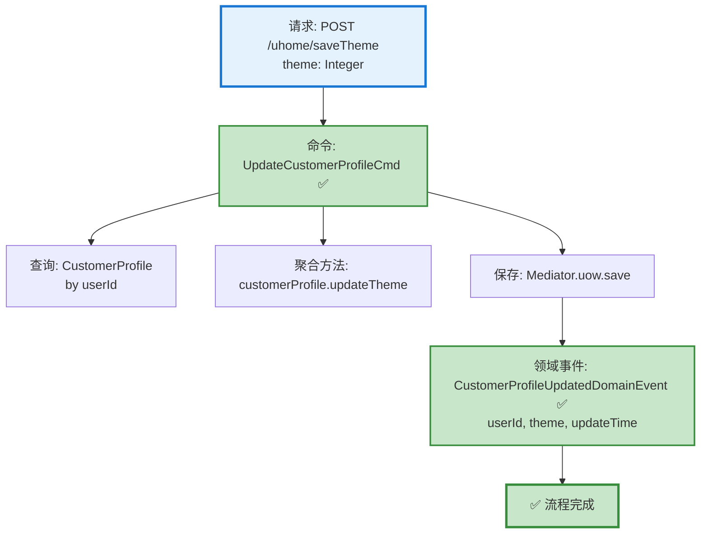

# 用户主题保存流程设计文档

> 基于 easylive-java 项目需求，按照 DDD 事件驱动模式设计

## 📋 业务需求概述

用户可以自定义个人空间的主题样式（theme 为整数类型），系统更新用户档案中的主题设置。

---

## 📊 完整流程图

### ASCII 流程图

```
┌─────────────────────────────────────────────────────────────────┐
│ 请求：POST /uhome/saveTheme                                      │
│ Payload:                                                        │
│ {                                                               │
│   "theme": 1  // 主题编号                                        │
│ }                                                               │
│                                                                 │
│ 说明：                                                           │
│ - 当前用户通过 @GlobalInterceptor 从 Token 中获取 userId          │
│ - theme 参数可选 (Integer 可为 null)                             │
└────────────────────────────┬────────────────────────────────────┘
                             ↓
┌─────────────────────────────────────────────────────────────────┐
│ 命令：UpdateCustomerProfileCmd ✅                                │
│ 状态：✅ 已定义 (design/aggregate/customer_profile/_gen.json)    │
│                                                                 │
│ 请求参数：                                                       │
│   - userId: String (从 Token 获取)                              │
│   - theme: Integer? (用户选择的主题)                             │
│                                                                 │
│ 处理逻辑：                                                       │
│   1. 查询 CustomerProfile 聚合根                                │
│   2. 调用 customerProfile.updateTheme(theme)                   │
│   3. Mediator.uow.save(customerProfile)                        │
└────────────────────────────┬────────────────────────────────────┘
                             ↓
┌─────────────────────────────────────────────────────────────────┐
│ 领域事件：CustomerProfileUpdatedDomainEvent ✅                   │
│ 状态：✅ 已定义 (design/aggregate/customer_profile/_gen.json)    │
│                                                                 │
│ 事件载荷：                                                       │
│ {                                                               │
│   "userId": "U001",                                             │
│   "theme": 1,                                                   │
│   "updateTime": 1729267200                                      │
│ }                                                               │
└────────────────────────────┬────────────────────────────────────┘
                             ↓
                      ✅ 流程完成

说明：
- ✅ 主流程所需命令和事件均已存在
- 这是一个简单的单聚合根更新操作
- 无需验证器（theme 无唯一性约束）
- 无需级联操作（仅更新单字段）
```

### Mermaid 可视化流程图



**图例说明**：
- 🔵 蓝色：请求入口
- 🟢 绿色：已存在的设计（✅ 可直接使用）

---

## 📦 设计元素清单

### ✅ 已存在的设计

#### 命令 (Commands)

| 命令 | 描述 | 状态 | 位置 |
|------|------|------|------|
| `UpdateCustomerProfileCmd` | 更新用户信息 | ✅ 已定义 | `design/aggregate/customer_profile/_gen.json:5-7` |

#### 领域事件 (Domain Events)

| 事件 | 描述 | 触发时机 | 状态 | 位置 |
|------|------|----------|------|------|
| `CustomerProfileUpdatedDomainEvent` | 用户信息已更新 | CustomerProfile 更新后 | ✅ 已定义 | `design/aggregate/customer_profile/_gen.json:42-48` |

#### 查询 (Queries)

| 查询 | 描述 | 状态 | 位置 |
|------|------|------|------|
| `GetCustomerProfileQry` | 获取用户信息 | ✅ 已定义 | `design/aggregate/customer_profile/_gen.json:83-86` |

---

### ❌ 缺失的设计清单

**🎉 无缺失设计！**

此功能所需的全部命令、事件、查询均已存在：

✅ **命令**：`UpdateCustomerProfileCmd` 已支持更新用户档案的各类字段
✅ **事件**：`CustomerProfileUpdatedDomainEvent` 已定义用户信息更新事件
✅ **查询**：`GetCustomerProfileQry` 已支持根据 userId 查询用户档案

无需补充任何设计元素。

---

## 🔍 easylive-java 原始实现分析

### Controller 层

**文件**: `easylive-java/easylive-web/src/main/java/com/easylive/web/controller/UHomeController.java:126-140`

```java
@RequestMapping("/saveTheme")
@GlobalInterceptor
public ResponseVO saveTheme(Integer theme) {
    // 获取当前登录用户的Token信息，用于身份验证和获取用户ID
    TokenUserInfoDto tokenUserInfoDto = getTokenUserInfoDto();

    // 创建UserInfo对象，并设置需要更新的主题字段
    UserInfo userInfo = new UserInfo();
    userInfo.setTheme(theme); // 设置用户选择的主题

    // 调用UserInfoService的updateUserInfoByUserId方法更新用户主题信息
    userInfoService.updateUserInfoByUserId(userInfo, tokenUserInfoDto.getUserId());

    // 返回成功响应对象，表示主题更新操作已完成
    return getSuccessResponseVO(null);
}
```

**关键点**：
- ✅ 使用 `@GlobalInterceptor` 拦截器，但未强制登录检查（checkLogin = false）
- ✅ 从 Token 获取当前用户 userId
- ✅ theme 参数为 `Integer`（可为 null）
- ✅ 仅更新 theme 字段，不涉及其他字段

### Service 层

**文件**: `easylive-java/easylive-common/src/main/java/com/easylive/service/impl/UserInfoServiceImpl.java:182-184`

```java
@Override
public Integer updateUserInfoByUserId(UserInfo bean, String userId) {
    return this.userInfoMapper.updateByUserId(bean, userId);
}
```

**关键点**：
- ✅ 直接调用 Mapper 进行字段更新（MyBatis 动态 SQL，仅更新非 null 字段）
- ✅ 无额外业务逻辑（无验证、无级联操作）
- ✅ 无事务注解（默认使用数据库连接的自动提交）

---

## 🎯 DDD 事件驱动模式映射

### 聚合根识别

| 传统实体 | DDD 聚合根 | 职责边界 |
|---------|-----------|---------|
| `UserInfo` | `User` + `CustomerProfile` | User: 认证信息（email, password）<br>CustomerProfile: 档案信息（theme, avatar, nickName, etc.） |

**说明**：
- `theme` 属于用户档案信息，应由 `CustomerProfile` 聚合根管理
- `User` 聚合根仅负责认证和授权相关字段

### 命令映射

| 传统方法调用 | DDD 命令 |
|------------|---------|
| `userInfoService.updateUserInfoByUserId(userInfo, userId)` | `Mediator.commands.send(UpdateCustomerProfileCmd.Request(userId, theme = theme))` |

### 聚合根方法

```kotlin
// CustomerProfile 聚合根方法
class CustomerProfile : Aggregate {
    var theme: Int? = null  // 主题编号

    fun updateTheme(theme: Int?) {
        this.theme = theme
        this.lastUpdateTime = System.currentTimeMillis() / 1000  // 使用秒级时间戳

        // 发布领域事件
        this.publishDomainEvent(
            CustomerProfileUpdatedDomainEvent(
                userId = this.userId,
                theme = theme,
                updateTime = this.lastUpdateTime
            )
        )
    }
}
```

---

## 💻 Controller 实现示例

**文件**: `only-danmuku-adapter/src/main/kotlin/.../adapter/portal/api/UHomeController.kt`

```kotlin
package edu.only4.danmuku.adapter.portal.api

import edu.only4.common.cap4k.ddd.Mediator
import edu.only4.danmuku.application.commands.customer_profile.UpdateCustomerProfileCmd
import org.springframework.web.bind.annotation.*

/**
 * 用户空间 API
 */
@RestController
@RequestMapping("/uhome")
class UHomeController {

    /**
     * 保存用户主题
     *
     * @param request 主题保存请求
     * @return 成功响应
     */
    @PostMapping("/saveTheme")
    fun saveTheme(
        @RequestBody request: SaveThemeRequest
    ): SaveThemeResponse {
        // 从当前认证上下文获取 userId (通过拦截器或 Security Context)
        val userId = getCurrentUserId()

        // 发送命令更新用户主题
        Mediator.commands.send(
            UpdateCustomerProfileCmd.Request(
                userId = userId,
                theme = request.theme
            )
        )

        return SaveThemeResponse(success = true)
    }

    // 辅助方法：从认证上下文获取当前用户 ID
    private fun getCurrentUserId(): String {
        // TODO: 从 Spring Security Context 或 Token 中获取
        // 示例实现（需根据实际认证机制调整）:
        // return SecurityContextHolder.getContext().authentication.name
        throw NotImplementedError("需要实现认证机制")
    }
}

/**
 * 保存主题请求
 */
data class SaveThemeRequest(
    val theme: Int?  // 主题编号
)

/**
 * 保存主题响应
 */
data class SaveThemeResponse(
    val success: Boolean
)
```

---

## 📝 补充说明

### 1. 为什么不需要验证器？

- `theme` 字段无唯一性约束（多个用户可使用相同主题）
- `theme` 字段无格式要求（Integer 类型，任意整数均有效）
- 无需检查主题编号是否存在于系统主题库（easylive-java 也未实现此检查）

### 2. 为什么不需要事件处理器？

- 主题更新是**纯本地操作**，无需触发其他聚合根的变更
- 无需发送通知、更新缓存等后续操作
- 领域事件 `CustomerProfileUpdatedDomainEvent` 已记录变更，可用于审计和事件溯源

### 3. 业务规则

| 规则 | 说明 |
|------|------|
| **字段类型** | `Integer?`（可为 null） |
| **默认值** | 未指定（系统可根据业务需求设定默认主题） |
| **更新范围** | 仅更新 theme 字段，不影响其他用户档案信息 |
| **权限控制** | 仅允许用户更新自己的主题（通过 userId 限制） |

---

**文档版本**：v1.0
**创建时间**：2025-10-22
**维护者**：开发团队
