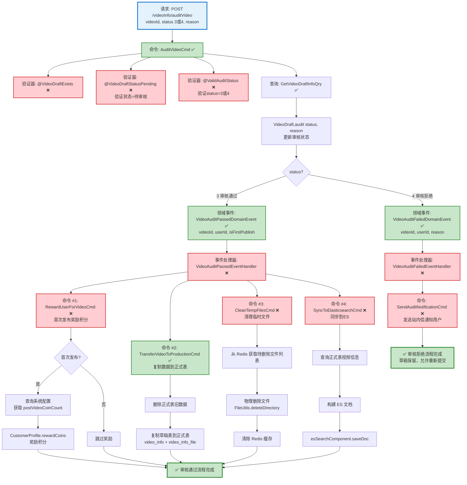

# 视频审核流程设计文档

> 基于 easylive-java 项目需求，按照 DDD 事件驱动模式设计

## 📋 业务需求概述

管理员审核用户上传的视频，系统验证视频状态、更新审核结果、处理积分奖励、同步数据到正式表、清理临时文件、更新ES索引，支持审核通过和审核拒绝两种结果。

---

## 📊 完整流程图

### ASCII 流程图

```
┌─────────────────────────────────────────────────────────────────┐
│ 请求：POST /videoInfo/auditVideo                                 │
│ Payload:                                                        │
│ {                                                               │
│   "videoId": "V123456789",                                      │
│   "status": 3,           // 3=审核通过, 4=审核拒绝               │
│   "reason": "内容违规"   // 拒绝原因（可选）                      │
│ }                                                               │
│                                                                 │
│ 前置条件：视频状态必须是"待审核"(STATUS2)                         │
└────────────────────────────┬────────────────────────────────────┘
                             ↓
┌─────────────────────────────────────────────────────────────────┐
│ 命令：AuditVideoCmd                                              │
│ 状态：✅ 已定义 (design/aggregate/video_draft/_gen.json:30)     │
│                                                                 │
│ 命令参数：                                                       │
│   - videoId: String                                             │
│   - status: Int (3=通过, 4=拒绝)                                │
│   - reason: String? (拒绝原因，可选)                             │
│                                                                 │
│ 验证器：                                                         │
│   ├─ @VideoDraftExists ❌ (验证视频草稿存在)                     │
│   ├─ @VideoDraftStatusPending ❌ (验证状态为待审核)              │
│   └─ @ValidAuditStatus ❌ (验证审核状态有效: 3或4)               │
│                                                                 │
│ 处理逻辑：                                                       │
│   1. 查询视频草稿信息 GetVideoDraftInfoQry ✅                    │
│      - 验证视频存在且状态为 STATUS2 (待审核)                     │
│      - 如果状态不符 → 抛出异常 "审核失败，请稍后重试"             │
│   2. VideoDraft.audit(status, reason)                           │
│      - 更新 status = 3 或 4                                     │
│      - 更新所有关联文件的 updateType = NO_UPDATE                 │
│   3. Mediator.uow.save()                                        │
└────────────────────────────┬────────────────────────────────────┘
                             ↓
                    ┌────────┴────────┐
                    │ status?         │
                    └────┬───────┬────┘
                         ↓       ↓
              3 (审核通过)        4 (审核拒绝)
                         ↓                  ↓
┌─────────────────────────────────────────────────────────────────┐
│ 分支 #1: 审核通过                                                │
└─────────────────────────────────────────────────────────────────┘
┌─────────────────────────────────────────────────────────────────┐
│ 领域事件：VideoAuditPassedDomainEvent                            │
│ 状态：✅ 已定义 (design/aggregate/video_draft/_gen.json:62)     │
│                                                                 │
│ 事件载荷：                                                       │
│ {                                                               │
│   "videoId": "V123456789",                                      │
│   "userId": "U001",                                             │
│   "videoName": "精彩视频",                                       │
│   "duration": 3600,       // 总时长（秒）                        │
│   "auditTime": 1729267200,                                      │
│   "isFirstPublish": true  // 是否首次发布                        │
│ }                                                               │
└────────────────────────────┬────────────────────────────────────┘
                             ↓
┌─────────────────────────────────────────────────────────────────┐
│ 事件处理器：VideoAuditPassedEventHandler ❌                      │
│ 监听事件：VideoAuditPassedDomainEvent                            │
│ 触发命令：                                                       │
│   1. RewardUserForVideoCmd ❌ (首次发布奖励积分)                 │
│   2. TransferVideoToProductionCmd ✅ (转移到正式表)              │
│   3. CleanTempFilesCmd ❌ (清理临时文件)                         │
│   4. SyncToElasticsearchCmd ❌ (同步到ES)                        │
│ 实现路径：adapter/.../events/VideoAuditPassedEventHandler.kt   │
└────────────────────────────┬────────────────────────────────────┘
                             ↓
        ┌────────────────────┴────────────────────────────────────┐
        ↓                    ↓                    ↓                ↓
┌──────────────────┐ ┌──────────────────┐ ┌──────────────────┐ ┌──────────────────┐
│ 命令 #1          │ │ 命令 #2          │ │ 命令 #3          │ │ 命令 #4          │
│ 积分奖励          │ │ 数据转移          │ │ 文件清理          │ │ ES同步           │
└──────┬───────────┘ └──────┬───────────┘ └──────┬───────────┘ └──────┬───────────┘
       ↓                    ↓                    ↓                    ↓

┌─────────────────────────────────────────────────────────────────┐
│ 命令 #1: RewardUserForVideoCmd ❌                                │
│ 状态：缺失 (需新增到 design/extra/user_reward_gen.json)          │
│                                                                 │
│ 命令参数：                                                       │
│   - userId: String                                              │
│   - videoId: String                                             │
│   - rewardType: "FIRST_PUBLISH" | "VIDEO_AUDIT"                │
│                                                                 │
│ 前置条件：                                                       │
│   - 检查视频是否首次发布 (正式表中不存在此videoId)               │
│   - 如果是首次发布，奖励 postVideoCoinCount 积分                 │
│                                                                 │
│ 处理逻辑：                                                       │
│   1. 查询正式表 GetVideoInfoQry ✅                               │
│   2. 如果 videoInfo == null → 首次发布                          │
│   3. 查询系统配置 GetSystemSettingQry ❌                         │
│      - 获取 postVideoCoinCount (默认10)                         │
│   4. CustomerProfile.rewardCoins(amount)                        │
│   5. Mediator.uow.save()                                        │
└─────────────────────────────────────────────────────────────────┘

┌─────────────────────────────────────────────────────────────────┐
│ 命令 #2: TransferVideoToProductionCmd ✅                         │
│ 状态：已定义 (design/aggregate/video_draft/_gen.json:35)        │
│                                                                 │
│ 处理逻辑：                                                       │
│   1. 查询草稿表视频信息 GetVideoDraftInfoQry ✅                  │
│   2. 删除正式表中的旧视频文件记录 (如果存在)                      │
│   3. 查询草稿表所有关联文件                                      │
│   4. 复制数据:                                                  │
│      - video_info_post → video_info                            │
│      - video_info_file_post → video_info_file                  │
│   5. Mediator.uow.save()                                        │
└─────────────────────────────────────────────────────────────────┘

┌─────────────────────────────────────────────────────────────────┐
│ 命令 #3: CleanTempFilesCmd ❌                                    │
│ 状态：缺失 (需新增到 design/extra/file_cleanup_gen.json)        │
│                                                                 │
│ 命令参数：                                                       │
│   - videoId: String                                             │
│                                                                 │
│ 处理逻辑：                                                       │
│   1. 查询 Redis 中的待删除文件列表                               │
│      - KEY: del_file_list:{videoId}                            │
│   2. 遍历文件路径列表，物理删除文件                               │
│      - 使用 FileUtils.deleteDirectory()                        │
│   3. 清除 Redis 中的文件列表缓存                                 │
│   4. 无需保存到数据库                                            │
└─────────────────────────────────────────────────────────────────┘

┌─────────────────────────────────────────────────────────────────┐
│ 命令 #4: SyncToElasticsearchCmd ❌                               │
│ 状态：缺失 (需新增到 design/extra/elasticsearch_sync_gen.json)  │
│                                                                 │
│ 命令参数：                                                       │
│   - videoId: String                                             │
│                                                                 │
│ 处理逻辑：                                                       │
│   1. 查询正式表视频信息 GetVideoInfoQry ✅                       │
│   2. 构建 ES 文档数据                                            │
│   3. 调用 esSearchComponent.saveDoc(videoInfo)                  │
│   4. 无需保存到数据库                                            │
└─────────────────────────────────────────────────────────────────┘
                             ↓
                      ✅ 审核通过流程完成

┌─────────────────────────────────────────────────────────────────┐
│ 分支 #2: 审核拒绝                                                │
└─────────────────────────────────────────────────────────────────┘
┌─────────────────────────────────────────────────────────────────┐
│ 领域事件：VideoAuditFailedDomainEvent                            │
│ 状态：✅ 已定义 (design/aggregate/video_draft/_gen.json:70)     │
│                                                                 │
│ 事件载荷：                                                       │
│ {                                                               │
│   "videoId": "V123456789",                                      │
│   "userId": "U001",                                             │
│   "videoName": "违规视频",                                       │
│   "reason": "内容违规",  // 拒绝原因                             │
│   "auditTime": 1729267200                                       │
│ }                                                               │
└────────────────────────────────────────────────────────────────��┘
                             ↓
┌─────────────────────────────────────────────────────────────────┐
│ 事件处理器：VideoAuditFailedEventHandler ❌                      │
│ 监听事件：VideoAuditFailedDomainEvent                            │
│ 触发命令：                                                       │
│   1. SendAuditNotificationCmd ❌ (通知用户审核未通过)             │
│ 实现路径：adapter/.../events/VideoAuditFailedEventHandler.kt   │
│                                                                 │
│ 处理逻辑：                                                       │
│   - 发送站内信通知用户审核未通过                                  │
│   - 包含拒绝原因                                                 │
│   - 不删除草稿，允许用户修改后重新提交                            │
└─────────────────────────────────────────────────────────────────┘
                             ↓
                      ✅ 审核拒绝流程完成
```

---

### Mermaid 可视化流程图



**图例说明**：
- 🔵 蓝色：请求入口
- 🟢 绿色：已存在的设计（✅ 可直接使用）
- 🔴 红色：缺失的设计（❌ 需实现）

---

## 📦 设计元素清单

### ✅ 已存在的设计

#### 命令 (Commands)

| 命令 | 描述 | 状态 | 位置 |
|------|------|------|------|
| `AuditVideoCmd` | 审核视频 | ✅ 已定义 | `design/aggregate/video_draft/_gen.json:30` |
| `TransferVideoToProductionCmd` | 转移视频到正式环境 | ✅ 已定义 | `design/aggregate/video_draft/_gen.json:35` |
| `SaveVideoInfoCmd` | 保存视频信息和文件 | ✅ 已定义 | `design/aggregate/video_draft/_gen.json:20` |

#### 领域事件 (Domain Events)

| 事件 | 描述 | 触发时机 | 状态 | 位置 |
|------|------|----------|------|------|
| `VideoAuditPassedDomainEvent` | 视频审核通过 | 审核状态=通过 | ✅ 已定义 | `design/aggregate/video_draft/_gen.json:62` |
| `VideoAuditFailedDomainEvent` | 视频审核失败 | 审核状态=拒绝 | ✅ 已定义 | `design/aggregate/video_draft/_gen.json:70` |
| `VideoTransferredToProductionDomainEvent` | 视频已转移到正式环境 | 数据复制完成 | ✅ 已定义 | `design/aggregate/video_draft/_gen.json:82` |

#### 查询 (Queries)

| 查询 | 描述 | 状态 | 位置 |
|------|------|------|------|
| `GetVideoDraftInfoQry` | 获取视频草稿信息 | ✅ 已定义 | `design/aggregate/video_draft/_gen.json:94` |
| `GetVideoInfoQry` | 获取视频信息（正式表） | ✅ 已定义 | `design/aggregate/video/_gen.json:94` |

---

### ❌ 缺失的设计清单

#### 需要补充的命令

| 序号 | 命令名称 | 描述 | 建议位置 | 优先级 |
|-----|---------|------|----------|-------|
| 1 | `RewardUserForVideoCmd` | 首次发布视频奖励积分 | `design/extra/user_reward_gen.json` | P0 |
| 2 | `CleanTempFilesCmd` | 清理临时文件 | `design/extra/file_cleanup_gen.json` | P0 |
| 3 | `SyncToElasticsearchCmd` | 同步视频到ES索引 | `design/extra/elasticsearch_sync_gen.json` | P0 |
| 4 | `SendAuditNotificationCmd` | 发送审核通知（站内信） | `design/extra/user_notification_gen.json` | P1 |

**JSON 定义**（需新增到 `design/extra/user_reward_gen.json`）：
```json
{
  "cmd": [
    {
      "package": "customer_profile",
      "name": "RewardUserForVideo",
      "desc": "视频首次发布奖励积分"
    }
  ]
}
```

**JSON 定义**（需新增到 `design/extra/file_cleanup_gen.json`）：
```json
{
  "cmd": [
    {
      "package": "video_draft",
      "name": "CleanTempFiles",
      "desc": "清理临时文件"
    }
  ]
}
```

**JSON 定义**（需新增到 `design/extra/elasticsearch_sync_gen.json`）：
```json
{
  "cmd": [
    {
      "package": "video",
      "name": "SyncToElasticsearch",
      "desc": "同步视频到Elasticsearch"
    }
  ]
}
```

**JSON 定义**（需新增到 `design/extra/user_notification_gen.json`）：
```json
{
  "cmd": [
    {
      "package": "customer_message",
      "name": "SendAuditNotification",
      "desc": "发送审核通知"
    }
  ]
}
```

#### 需要补充的领域事件

| 序号 | 事件名称 | 描述 | 触发时机 | 建议位置 | 优先级 |
|-----|---------|------|----------|----------|-------|
| 1 | `UserRewardedDomainEvent` | 用户已获得奖励 | 积分奖励完成 | `design/extra/user_reward_gen.json` | P1 |
| 2 | `TempFilesCleanedDomainEvent` | 临时文件已清理 | 文件清理完成 | `design/extra/file_cleanup_gen.json` | P2 |
| 3 | `VideoSyncedToESDomainEvent` | 视频已同步到ES | ES同步完成 | `design/extra/elasticsearch_sync_gen.json` | P2 |

#### 需要补充的查询

| 序号 | 查询名称 | 描述 | 返回值 | 建议位置 | 优先级 |
|-----|---------|------|--------|----------|-------|
| 1 | `GetSystemSettingQry` | 获取系统配置（包含积分奖励设置） | `{ postVideoCoinCount, registerCoinCount, ... }` | `design/extra/system_setting_gen.json` | P0 |
| 2 | `CheckVideoExistsInProductionQry` | 检查视频是否已在正式表中 | `{ exists: Boolean }` | `design/extra/video_check_gen.json` | P0 |

**JSON 定义**（需新增到 `design/extra/system_setting_gen.json`）：
```json
{
  "qry": [
    {
      "package": "system",
      "name": "GetSystemSetting",
      "desc": "获取系统配置"
    }
  ]
}
```

**JSON 定义**（需新增到 `design/extra/video_check_gen.json`）：
```json
{
  "qry": [
    {
      "package": "video",
      "name": "CheckVideoExistsInProduction",
      "desc": "检查视频是否已在正式表中"
    }
  ]
}
```

#### 需要补充的验证器

| 序号 | 验证器名称 | 描述 | 依赖查询 | 实现路径 | 优先级 |
|-----|-----------|------|----------|----------|-------|
| 1 | `@VideoDraftExists` | 验证视频草稿存在 | `GetVideoDraftInfoQry` | `application/.../validater/VideoDraftExists.kt` | P0 |
| 2 | `@VideoDraftStatusPending` | 验证视频状态为待审核 | `GetVideoDraftInfoQry` | `application/.../validater/VideoDraftStatusPending.kt` | P0 |
| 3 | `@ValidAuditStatus` | 验证审核状态有效（3或4） | 无 | `application/.../validater/ValidAuditStatus.kt` | P0 |

#### 需要补充的事件处理器

| 序号 | 处理器名称 | 监听事件 | 触发命令 | 实现路径 | 优先级 |
|-----|-----------|----------|----------|----------|-------|
| 1 | `VideoAuditPassedEventHandler` | `VideoAuditPassedDomainEvent` | `RewardUserForVideoCmd`<br/>`TransferVideoToProductionCmd`<br/>`CleanTempFilesCmd`<br/>`SyncToElasticsearchCmd` | `adapter/.../events/VideoAuditPassedEventHandler.kt` | P0 |
| 2 | `VideoAuditFailedEventHandler` | `VideoAuditFailedDomainEvent` | `SendAuditNotificationCmd` | `adapter/.../events/VideoAuditFailedEventHandler.kt` | P1 |

**优先级说明**：
- **P0**：核心功能，必须实现
- **P1**：重要功能，建议实现
- **P2**：可选功能，后续扩展

---

## 🔑 关键业务规则

### 1. 审核前置条件
- **状态校验**：视频必须处于"待审核"状态（`STATUS2`）
  - `STATUS0` (转码中) → 不可审核
  - `STATUS1` (转码失败) → 不可审核
  - `STATUS2` (待审核) → 可审核 ✅
  - `STATUS3` (审核通过) → 不可重复审核
  - `STATUS4` (审核拒绝) → 不可重复审核

**校验逻辑**（easylive-java 实现）：
```java
VideoInfoPostQuery videoInfoPostQuery = new VideoInfoPostQuery();
videoInfoPostQuery.setStatus(VideoStatusEnum.STATUS2.getStatus());
videoInfoPostQuery.setVideoId(videoId);
Integer audioCount = this.videoInfoPostMapper.updateByParam(videoInfoPost, videoInfoPostQuery);
if (audioCount == 0) {
    throw new BusinessException("审核失败，请稍后重试");
}
```

### 2. 审核通过后的4个核心操作

#### 操作 #1: 积分奖励（首次发布）
- **判断逻辑**：检查正式表 `video_info` 中是否存在该 `videoId`
- **首次发布**：`videoInfo == null` → 奖励积分
- **再次发布**：`videoInfo != null` → 跳过奖励
- **奖励金额**：从系统配置获取 `postVideoCoinCount`（默认10）

**easylive-java 实现**（行 664-668）：
```java
VideoInfo dbVideoInfo = this.videoInfoMapper.selectByVideoId(videoId);
if (dbVideoInfo == null) {
    SysSettingDto sysSettingDto = redisComponent.getSysSettingDto();
    userInfoMapper.updateCoinCountInfo(infoPost.getUserId(), sysSettingDto.getPostVideoCoinCount());
}
```

#### 操作 #2: 数据转移到正式表
**转移步骤**：
1. 删除正式表旧数据（如果存在）
   - `DELETE FROM video_info_file WHERE video_id = ?`
2. 复制视频信息
   - `video_info_post` → `video_info`（使用 INSERT OR UPDATE）
3. 复制视频文件信息
   - `video_info_file_post` → `video_info_file`（批量插入）

**easylive-java 实现**（行 673-692）：
```java
// 复制视频信息到正式表
VideoInfo videoInfo = CopyTools.copy(infoPost, VideoInfo.class);
this.videoInfoMapper.insertOrUpdate(videoInfo);

// 删除正式表旧文件记录
VideoInfoFileQuery videoInfoFileQuery = new VideoInfoFileQuery();
videoInfoFileQuery.setVideoId(videoId);
this.videoInfoFileMapper.deleteByParam(videoInfoFileQuery);

// 批量插入新文件记录
List<VideoInfoFilePost> videoInfoFilePostList = this.videoInfoFilePostMapper.selectList(...);
List<VideoInfoFile> videoInfoFileList = CopyTools.copyList(videoInfoFilePostList, VideoInfoFile.class);
this.videoInfoFileMapper.insertBatch(videoInfoFileList);
```

#### 操作 #3: 清理临时文件
**清理逻辑**：
1. 从 Redis 获取待删除文件列表
   - KEY: `del_file_list:{videoId}`
2. 遍历文件路径，物理删除文件
   - 使用 `FileUtils.deleteDirectory(file)`
3. 清除 Redis 缓存

**easylive-java 实现**（行 697-710）：
```java
List<String> filePathList = redisComponent.getDelFileList(videoId);
if (filePathList != null) {
    for (String path : filePathList) {
        File file = new File(appConfig.getProjectFolder() + Constants.FILE_FOLDER + path);
        if (file.exists()) {
            try {
                FileUtils.deleteDirectory(file);
            } catch (IOException e) {
                log.error("删除文件失败", e);
            }
        }
    }
}
redisComponent.cleanDelFileList(videoId);
```

#### 操作 #4: 同步到Elasticsearch
**同步目的**：
- 支持视频搜索
- 更新视频排序字段（播放量、点赞数等）

**easylive-java 实现**（行 714-715）：
```java
esSearchComponent.saveDoc(videoInfo);
```

### 3. 审核拒绝后的处理

**处理逻辑**：
- ✅ 更新视频状态为 `STATUS4`（审核拒绝）
- ✅ 发送站内信通知用户（包含拒绝原因）
- ✅ 保留草稿数据，允许用户修改后重新提交
- ❌ **不删除**草稿表数据
- ❌ **不清理**临时文件
- ❌ **不同步**到正式表

**easylive-java 实现**（行 657-659）：
```java
if (VideoStatusEnum.STATUS4 == videoStatusEnum) {
    return;  // 审核拒绝时直接返回，不执行后续操作
}
```

### 4. 文件状态更新

**所有关联文件的更新类型**：
- 审核通过/拒绝后，将所有文件的 `updateType` 设置为 `NO_UPDATE`
- 表示这些文件已经过审核，不再属于"待审核"状态

**easylive-java 实现**（行 650-655）：
```java
VideoInfoFilePost videoInfoFilePost = new VideoInfoFilePost();
videoInfoFilePost.setUpdateType(VideoFileUpdateTypeEnum.NO_UPDATE.getStatus());

VideoInfoFilePostQuery filePostQuery = new VideoInfoFilePostQuery();
filePostQuery.setVideoId(videoId);
this.videoInfoFilePostMapper.updateByParam(videoInfoFilePost, filePostQuery);
```

---

## 📊 Controller 层实现示例

```kotlin
@RestController
@RequestMapping("/admin/videoInfo")
class AdminVideoInfoController {

    @PostMapping("/auditVideo")
    @RecordUserMessage(messageType = MessageTypeEnum.SYS)
    fun auditVideo(
        @RequestParam @NotEmpty videoId: String,
        @RequestParam @NotNull status: Int,
        @RequestParam reason: String?
    ): Response {
        // 调用审核命令
        Mediator.commands.send(
            AuditVideoCmd.Request(
                videoId = videoId,
                status = status,  // 3=通过, 4=拒绝
                reason = reason   // 拒绝原因（可选）
            )
        )
        return Response()
    }
}
```

**@RecordUserMessage 注解**：
- 自动记录管理员操作日志
- 类型：系统消息（`MessageTypeEnum.SYS`）
- 用于审计追溯

---

## 📌 设计优势

### **事件驱动的审核流程**

1. **解耦复杂业务逻辑**：
   - 审核通过 → 触发4个独立命令
   - 每个命令专注单一职责（积分、转移、清理、同步）
   - 易于测试和维护

2. **灵活的扩展性**：
   - 新增操作（如通知UP主）→ 添加新的事件处理器
   - 不影响现有代码

3. **审核拒绝的友好设计**：
   - 保留草稿数据
   - 允许用户修改后重新提交
   - 通过站内信告知拒绝原因

4. **首次发布检测**：
   - 通过查询正式表判断是否首次发布
   - 只在首次发布时奖励积分
   - 避免重复奖励

---

## 🔄 审核流程状态机

```
┌────────────┐
│ STATUS0    │  转码中
│ 转码中      │
└──────┬─────┘
       ↓
┌────────────┐     ┌────────────┐
│ STATUS1    │     │ STATUS2    │  待审核
│ 转码失败    │     │ 待审核      │ ←──────── 提交审核
└────────────┘     └──────┬─────┘
                          ↓
                   ┌──────┴──────┐
                   │   审核?     │
                   └──┬───────┬──┘
                      ↓       ↓
             ┌────────────┐ ┌────────────┐
             │ STATUS3    │ │ STATUS4    │
             │ 审核通过    │ │ 审核拒绝    │
             └────────────┘ └────────────┘
                   ↓              ↓
           发布到正式表      保留草稿可修改
```

---

## 🧩 扩展设计：批量审核

如果需要批量审核视频（例如一次性审核多个待审核视频），可以新增 `BatchAuditVideosCmd`：

```kotlin
@PostMapping("/batchAuditVideos")
fun batchAuditVideos(
    @RequestBody request: BatchAuditRequest
): Response {
    Mediator.commands.send(
        BatchAuditVideosCmd.Request(
            videoIds = request.videoIds,  // List<String>
            status = request.status,      // 3 或 4
            reason = request.reason       // 拒绝原因（可选）
        )
    )
    return Response()
}
```

**批量审核注意事项**：
- 需要事务保证原子性
- 可能涉及大量积分奖励和数据转移操作
- 建议异步处理，避免超时

---

**文档版本**：v1.0
**创建时间**：2025-10-22
**维护者**：开发团队
