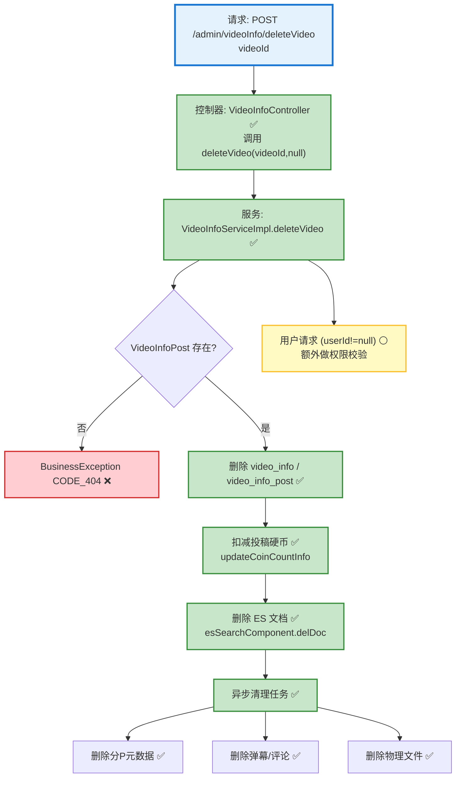

# 视频删除流程设计文档

> 基于 easylive-java 项目需求，按照 DDD 事件驱动模式设计

## 📋 业务需求概述
管理员或作者删除视频时，需要同时移除视频主数据、投稿记录、分P文件、弹幕与评论，更新搜索索引并回收投稿奖励的硬币，确保系统中不再出现残留数据或失效链接。

---

## 📊 完整流程图

### ASCII 流程图
```
┌──────────────────────────────────────────────────────────┐
│ 请求：POST /admin/videoInfo/deleteVideo                   │
│ Payload: { "videoId": "V202410211234" }                   │
└────────────────────────────┬─────────────────────────────┘
                             ↓
┌──────────────────────────────────────────────────────────┐
│ 控制器：VideoInfoController#deleteVideo ✅                 │
│ 1. 调用 videoInfoService.deleteVideo(videoId, null)       │
└────────────────────────────┬─────────────────────────────┘
                             ↓
┌──────────────────────────────────────────────────────────┐
│ 服务：VideoInfoServiceImpl#deleteVideo ✅                 │
│ 1. 查询 VideoInfoPost 校验存在/权限                       │
│ 2. 删除 video_info、video_info_post 记录                  │
│ 3. 扣减投稿奖励硬币 userInfoService.updateCoinCountInfo   │
│ 4. 删除 ES 文档 esSearchComponent.delDoc                 │
│ 5. 异步任务（executorService）                            │
│    ├─ 删除分P元数据（video_info_file / post）             │
│    ├─ 删除弹幕（video_danmu）                             │
│    ├─ 删除评论（video_comment）                           │
│    └─ 删除物理文件 FileUtils.deleteDirectory             │
└──────────────────────────────────────────────────────────┘

┌──────────────────────────────────────────────────────────┐
│ 用户侧：/ucenter/deleteVideo (传入 userId)                 │
│ 1. reuse deleteVideo(videoId, userId)                      │
│ 2. 额外执行权限校验                                        │
└──────────────────────────────────────────────────────────┘
```

### 场景 #1：管理员删除视频
```
Admin 请求 → deleteVideo(videoId, null)
    ├─ VideoInfoPost 存在
    ├─ 删除主表/投稿表记录
    ├─ 回收硬币 → updateCoinCountInfo(userId, -postCoin)
    ├─ 删除 ES 文档
    └─ 异步清理分P/弹幕/评论/物理文件
```

### 场景 #2：作者删除自己的视频
```
作者请求 → deleteVideo(videoId, userId)
    ├─ 校验 videoInfoPost.userId == userId
    ├─ 成功执行同管理员流程
    └─ 权限校验失败 → BusinessException CODE_404
```

### 场景 #3：视频不存在
```
deleteVideo(videoId, userId)
    ├─ videoInfoPost == null → BusinessException CODE_404
    └─ 中断后续删除任务
```

### Mermaid 流程图


---

## 📦 设计元素清单

### ✅ 已存在的设计（传统系统）
- **权限校验**：`VideoInfoServiceImpl.deleteVideo` 检查 `videoInfoPost` 是否存在，并验证 `userId` 权限（`easylive-java/easylive-common/src/main/java/com/easylive/service/impl/VideoInfoServiceImpl.java:304`）。
- **主数据删除**：删除 `video_info` 与 `video_info_post` 记录（同文件 `:314-317`）。
- **财务处理**：扣减投稿奖励硬币 `userInfoService.updateCoinCountInfo`（同文件 `:322-323`）。
- **搜索同步**：删除 ES 索引 `esSearchComponent.delDoc`（同文件 `:326-328`）。
- **异步清理**：删除分 P 元数据、弹幕、评论并清理物理文件（同文件 `:330-367`）。

### ✅ 已存在的设计（DDD 实现）
- `DeleteVideoCmd`：根据视频 ID 执行软删除（`only-danmuku/only-danmuku-application/src/main/kotlin/edu/only4/danmuku/application/commands/video/DeleteVideoCmd.kt:18`）。
- `VideoDeletedDomainEvent`：定义但尚未在聚合中触发（`only-danmuku/only-danmuku-domain/src/main/kotlin/edu/only4/danmuku/domain/aggregates/video/events/VideoDeletedDomainEvent.kt:19`）。
- `VideoDeletedDomainEventSubscriber`：事件订阅器为空实现（`only-danmuku/only-danmuku-application/src/main/kotlin/edu/only4/danmuku/application/subscribers/domain/video/VideoDeletedDomainEventSubscriber.kt:19`）。
- 相关删除命令骨架：`DeleteVideoFileCmd`、`DeleteVideoFileDraftCmd` 等（但未与视频删除流程关联）。

---

## ❌ 缺失的设计清单

### 需要补充的命令 (Commands)
| 序号 | 命令名称 | 描述 | 建议位置 | 优先级 |
|-----|---------|------|----------|-------|
| 1 | `CascadeDeleteVideoAssetsCmd` | 删除视频文件、弹幕、评论、播放历史等衍生数据 | `design/extra/video_delete_gen.json` | P0 |
| 2 | `RemoveVideoSearchIndexCmd` | 删除 ES/搜索索引文档 | `design/extra/video_delete_gen.json` | P0 |
| 3 | `AdjustAuthorCoinAfterDeleteCmd` | 回收投稿奖励硬币并记录流水 | `design/extra/video_finance_gen.json` | P0 |
| 4 | `PhysicalFileCleanupCmd` | 清理对象存储/本地文件（支持异步） | `design/extra/video_storage_gen.json` | P1 |

### 需要补充的领域事件 (Domain Events)
| 序号 | 事件名称 | 描述 | 触发时机 | 建议位置 | 优先级 |
|-----|---------|------|----------|----------|-------|
| 1 | `VideoDeletedDomainEvent` | 视频删除完成（聚合需触发） | `design/aggregate/video/_gen.json` | P0 |
| 2 | `VideoAssetsCleanupFailedDomainEvent` | 资源清理失败报警（可选） | `design/extra/video_delete_gen.json` | P2 |

### 需要补充的查询 (Queries)
| 序号 | 查询名称 | 描述 | 返回值 | 建议位置 | 优先级 |
|-----|---------|------|--------|----------|-------|
| 1 | `GetVideoAssetRefsQry` | 获取关联资源（文件、弹幕、评论、播放历史）统计 | `VideoAssetRefs` DTO | `design/extra/video_delete_gen.json` | P0 |

### 需要补充的验证器 (Validators)
| 序号 | 验证器名称 | 描述 | 依赖查询 | 实现路径 | 优先级 |
|-----|-----------|------|----------|----------|-------|
| 1 | `@VideoExists` | 校验视频存在 | `GetVideoInfo` | `only-danmuku-application/.../validator/` | P0 |
| 2 | `@VideoOwner` | 校验当前用户为视频作者（用户端删除） | `GetVideoInfo` | `only-danmuku-application/.../validator/` | P0 |

### 需要补充的事件处理器 (Event Handlers)
| 序号 | 处理器名称 | 监听事件 | 触发命令 | 实现路径 | 优先级 |
|-----|-----------|----------|----------|----------|-------|
| 1 | `VideoDeletedEventHandler` | `VideoDeletedDomainEvent` | `CascadeDeleteVideoAssetsCmd`、`RemoveVideoSearchIndexCmd`、`AdjustAuthorCoinAfterDeleteCmd` | `only-danmuku-adapter/.../events/VideoDeletedEventHandler.kt` | P0 |
| 2 | `VideoAssetsCleanupFailedEventHandler` | `VideoAssetsCleanupFailedDomainEvent` | 报警/补偿逻辑 | `only-danmuku-adapter/.../events/VideoAssetsCleanupFailedEventHandler.kt` | P2 |

**优先级说明**：
- **P0**：删除流程必备，确保数据一致性
- **P1**：建议补齐的增强能力（如物理文件删除作业）
- **P2**：扩展/告警类能力

---

## 🔑 关键业务规则
- **权限校验**：管理员可直接删除；作者删除需校验 `videoInfoPost.userId`。DDD `DeleteVideoCmd` 当前缺少用户侧校验，需在命令或调用方补齐。
- **财务处理**：删除视频需回收投稿奖励硬币，避免积分被滥用。DDD 侧尚未实现。
- **副作用清理**：需同步移除 ES 索引、分P元数据、弹幕、评论、播放历史，并删除对象存储文件。DDD 当前仅软删除视频记录，造成大量残留。
- **异步处理**：大批量文件删除需异步执行，并提供失败告警/重试机制。
- **幂等性**：重复删除应安全返回，可以通过软删除 + 状态检查实现。
- **审计日志**：建议记录删除操作的来源、操作者、时间及原因，便于追踪。

---

## 🛠️ 控制器与命令示例
```kotlin
@PostMapping("/deleteVideo")
fun adminVideoDelete(@RequestBody @Validated request: AdminVideoDelete.Request): AdminVideoDelete.Response {
    Mediator.commands.send(
        DeleteVideoCmd.Request(
            videoId = request.videoId!!.toLong()
        )
    )
    return AdminVideoDelete.Response()
}
```
> 控制器入口：`only-danmuku/only-danmuku-adapter/src/main/kotlin/edu/only4/danmuku/adapter/portal/api/AdminVideoController.kt:112`

```kotlin
val video = Mediator.repositories.findFirst(
    SVideo.predicateById(request.videoId),
    persist = false
).getOrNull() ?: throw KnownException("视频不存在：${request.videoId}")

Mediator.repositories.remove(SVideo.predicateById(video.id))
Mediator.uow.save()
// ❌ 缺少：触发 VideoDeletedDomainEvent、清理资源、回收硬币
```
> 删除命令：`only-danmuku/only-danmuku-application/src/main/kotlin/edu/only4/danmuku/application/commands/video/DeleteVideoCmd.kt:18`

---

## 📂 传统架构参考
- 控制器：`easylive-java/easylive-admin/src/main/java/com/easylive/admin/controller/VideoInfoController.java:64`
- 服务实现：`easylive-java/easylive-common/src/main/java/com/easylive/service/impl/VideoInfoServiceImpl.java:304`
- ES 删除：`easylive-java/easylive-common/src/main/java/com/easylive/component/EsSearchComponent.java:278`
- 分P/弹幕/评论清理：`easylive-java/easylive-common/src/main/java/com/easylive/service/impl/VideoInfoServiceImpl.java:330-367`
- 硬币回收：`easylive-java/easylive-common/src/main/java/com/easylive/service/impl/VideoInfoServiceImpl.java:322-323`

---

**文档版本**：v1.0  
**创建时间**：2025-10-22  
**维护者**：开发团队

