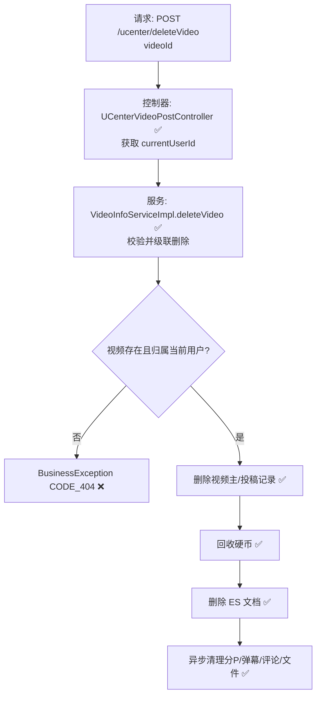

# 视频删除流程（用户侧）设计文档

> 基于 easylive-java 用户中心需求，按照 DDD 事件驱动模式设计

## 📋 业务需求概述
视频作者在个人中心删除自己发布的视频，平台需校验视频归属与存在性，随后级联删除主数据、投稿记录、分P文件、弹幕/评论等关联资源，并回收投稿奖励的硬币。

---

## 📊 完整流程图

### ASCII 流程图
```
┌──────────────────────────────────────────────────────────┐
│ 请求：POST /ucenter/deleteVideo                           │
│ Payload: { "videoId": "V20241021001" }                    │
└────────────────────────────┬─────────────────────────────┘
                             ↓
┌──────────────────────────────────────────────────────────┐
│ 控制器：UCenterVideoPostController#deleteVideo ✅          │
│ 1. Token → currentUserId                                  │
│ 2. 调用 videoInfoService.deleteVideo(videoId, userId)     │
└────────────────────────────┬─────────────────────────────┘
                             ↓
┌──────────────────────────────────────────────────────────┐
│ 服务：VideoInfoServiceImpl#deleteVideo ✅                 │
│ 1. 读取 VideoInfoPost 校验存在 & 权限                     │
│ 2. 删除 video_info + video_info_post                      │
│ 3. 回收投稿硬币 updateCoinCountInfo(...)                  │
│ 4. 删除 ES 文档 esSearchComponent.delDoc                  │
│ 5. 异步清理分P、弹幕、评论、物理文件                      │
└──────────────────────────────────────────────────────────┘
```

### 场景 #1：作者删除自己的视频
```
currentUserId == videoInfoPost.userId
    ├─ 删除主表/投稿表记录
    ├─ 回收硬币（-postVideoCoinCount）
    ├─ 删除 ES 文档
    └─ 异步清理资源
```

### 场景 #2：越权删除
```
videoInfoPost.userId != currentUserId
    └─ 抛 BusinessException CODE_404（无权限）
```

### 场景 #3：视频不存在
```
videoInfoPost == null
    └─ 抛 BusinessException CODE_404
```

### Mermaid 流程图


---

## 📦 设计元素清单

### ✅ 已存在的设计

#### 传统实现
- 控制器：校验登录，调用 `videoInfoService.deleteVideo(videoId, userId)`（`easylive-java/easylive-web/src/main/java/com/easylive/web/controller/UCenterVideoPostController.java:265`）。
- 服务实现：校验存在与归属 → 删除主/投稿记录 → 回收硬币 → 删除 ES → 异步清理资源（`easylive-java/easylive-common/src/main/java/com/easylive/service/impl/VideoInfoServiceImpl.java:304`）。

#### DDD 实现
- `DeleteVideoCmd`：软删除视频聚合（`only-danmuku/only-danmuku-application/src/main/kotlin/edu/only4/danmuku/application/commands/video/DeleteVideoCmd.kt:18`）。
- `VideoDeletedDomainEvent`：定义但未触发（`design/aggregate/video/_gen.json:52`）。

---

## ❌ 缺失的设计清单

| 类型 | 缺失项 | 描述 | 建议位置 | 优先级 |
|------|--------|------|----------|-------|
| 命令 | `DeleteVideoCmd` 参数扩展 | 增加 `operatorId`，用于权限校验（作者 vs 管理员） | `design/aggregate/video/_gen.json` | P0 |
| 命令 | `CascadeDeleteVideoAssetsCmd` | 删除弹幕、评论、播放历史、分P元数据 | `design/extra/video_delete_gen.json` | P0 |
| 命令 | `AdjustAuthorCoinAfterDeleteCmd` | 回收投稿奖励并记录流水 | `design/extra/video_finance_gen.json` | P0 |
| 命令 | `RemoveVideoSearchIndexCmd` | 删除 ES / 搜索索引文档 | `design/extra/video_delete_gen.json` | P0 |
| 事件 | `VideoDeletedDomainEvent` | 聚合删除时发布事件 | `design/aggregate/video/_gen.json` | P0 |
| 查询 | `GetVideoPostByVideoIdQry` | 获取投稿信息用于权限/回收 | `design/aggregate/video_draft/_gen.json` | P1 |
| 验证器 | `@VideoExists` / `@VideoOwner` | 校验视频存在与归属 | `only-danmuku-application/.../validator/` | P0 |
| 事件处理器 | `VideoDeletedEventHandler` | 监听删除事件 → 调用清理/同步命令 | `only-danmuku-adapter/.../events/VideoDeletedEventHandler.kt` | P0 |

**优先级说明**：P0 为删除流程的核心能力，P1 为建议补齐的辅助能力。

---

## 🔑 关键业务规则
- **权限**：仅视频作者可通过用户中心接口删除；管理员使用后台接口。命令层需区分操作者身份。
- **数据一致性**：必须删除主数据、投稿记录、分P数据、弹幕、评论、播放历史，并清理对象存储文件。
- **财务处理**：删除需回收系统发放的投稿硬币，避免重复领取奖励。
- **搜索同步**：需同时删除 ES 文档或缓存中的推荐条目。
- **异步清理**：大量文件删除需异步执行并提供失败处理/告警机制。
- **幂等性**：重复删除应安全（软删 + 冪等事件处理）。
- **审计**：建议记录删除行为（用户、时间、原因）以便追踪。

---

## 🧾 控制器与命令示例
```java
// 传统用户侧控制器
@RequestMapping("/deleteVideo")
@GlobalInterceptor(checkLogin = true)
public ResponseVO deleteVideo(@NotEmpty String videoId) {
    TokenUserInfoDto tokenUserInfoDto = getTokenUserInfoDto();
    videoInfoService.deleteVideo(videoId, tokenUserInfoDto.getUserId());
    return getSuccessResponseVO(null);
}
```
> 参考：`easylive-java/easylive-web/src/main/java/com/easylive/web/controller/UCenterVideoPostController.java:265`

```kotlin
// DDD 控制器（当前未传递 userId）
@PostMapping("/deleteVideo")
fun deleteVideo(@RequestBody @Validated request: UCenterDeleteVideo.Request): UCenterDeleteVideo.Response {
    Mediator.commands.send(
        DeleteVideoCmd.Request(
            videoId = request.videoId.toLong()
        )
    )
    return UCenterDeleteVideo.Response()
}
```
> 参考：`only-danmuku/only-danmuku-adapter/src/main/kotlin/edu/only4/danmuku/adapter/portal/api/UCenterVideoPostController.kt:215`

```kotlin
// DeleteVideoCmd（缺少权限校验、资源清理、事件触发）
val video = Mediator.repositories.findFirst(
    SVideo.predicateById(request.videoId),
    persist = false
).getOrNull() ?: throw KnownException("视频不存在：${request.videoId}")

Mediator.repositories.remove(SVideo.predicateById(video.id))
Mediator.uow.save()
```
> 参考：`only-danmuku/only-danmuku-application/src/main/kotlin/edu/only4/danmuku/application/commands/video/DeleteVideoCmd.kt:18`

---

## 📂 传统架构参考
- 控制器：`easylive-java/easylive-web/src/main/java/com/easylive/web/controller/UCenterVideoPostController.java:265`
- 服务实现：`easylive-java/easylive-common/src/main/java/com/easylive/service/impl/VideoInfoServiceImpl.java:304`
- ES 删除：`easylive-java/easylive-common/src/main/java/com/easylive/component/EsSearchComponent.java:278`
- 分P/弹幕/评论清理：`easylive-java/easylive-common/src/main/java/com/easylive/service/impl/VideoInfoServiceImpl.java:330`

---

**文档版本**：v1.0  
**创建时间**：2025-10-22  
**维护者**：开发团队

