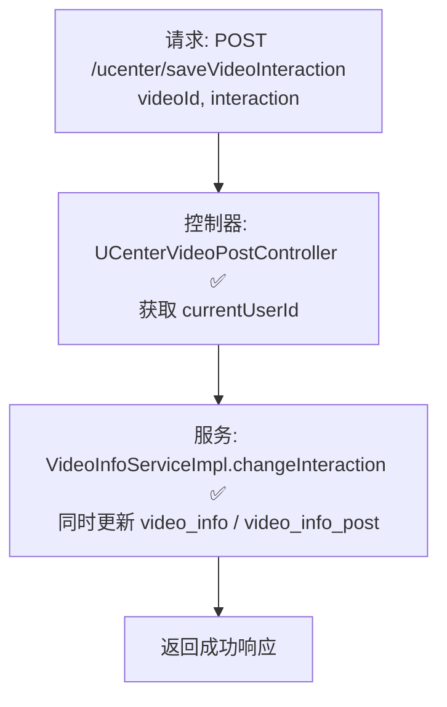

# 视频互动设置流程（用户侧）设计文档

> 基于 easylive-java 用户中心需求，按照 DDD 事件驱动模式设计

## 📋 业务需求概述
视频作者在个人中心调整视频互动开关（如评论、弹幕、投币等）。系统需要校验视频归属、更新正式发布的数据与投稿记录，并确保前台展示和后续审核使用的互动配置保持一致。

---

## 📊 完整流程图

### ASCII 流程图
```
┌──────────────────────────────────────────────────────────┐
│ 请求：POST /ucenter/saveVideoInteraction                  │
│ Payload: {                                                │
│   "videoId": "V20241021001",                              │
│   "interaction": "01"           // 交互开关字符串         │
│ }                                                         │
└────────────────────────────┬─────────────────────────────┘
                             ↓
┌──────────────────────────────────────────────────────────┐
│ 控制器：UCenterVideoPostController#saveVideoInteraction ✅ │
│ 1. Token → currentUserId                                  │
│ 2. 调用 videoInfoService.changeInteraction                │
└────────────────────────────┬─────────────────────────────┘
                             ↓
┌──────────────────────────────────────────────────────────┐
│ 服务：VideoInfoServiceImpl#changeInteraction ✅           │
│ 1. 构造 VideoInfo 对象，设置 interaction                 │
│ 2. 根据 videoId + userId 更新 video_info 表              │
│ 3. 构造 VideoInfoPost 对象，同步更新投稿表               │
│ 4. 事务提交                                               │
└──────────────────────────────────────────────────────────┘
```

### 场景 #1：UP 主调整自身视频
```
当前登录用户即视频作者 → 更新成功
    ├─ video_info.interaction 更新
    ├─ video_info_post.interaction 更新
    └─ 返回成功
```

### 场景 #2：越权操作
```
userId != videoInfo.userId → updateByParam 无匹配
    └─ 未更新任何记录（旧系统 silent fail）；DDD 命令抛出 “无权修改该视频”
```

### 场景 #3：视频不存在
```
video_info / video_info_post 无记录 → 抛 BusinessException CODE_404
```

### Mermaid 流程图


---

## 📦 设计元素清单

### ✅ 已存在的设计

#### 命令 (Commands)
| 命令 | 描述 | 状态 | 位置 |
|------|------|------|------|
| `ChangeVideoInteractionCmd` | 修改视频互动设置（仅视频聚合） | ✅ 已定义 | `only-danmuku/only-danmuku-application/src/main/kotlin/edu/only4/danmuku/application/commands/video/ChangeVideoInteractionCmd.kt:15` |

#### 领域事件 (Domain Events)
| 事件 | 描述 | 触发时机 | 状态 | 位置 |
|------|------|----------|------|------|
| `VideoInteractionChangedDomainEvent` | 互动设置已变更 | ⚪ 未触发 | `design/aggregate/video/_gen.json:76` |

#### 查询 (Queries)
| 查询 | 描述 | 状态 | 位置 |
|------|------|------|------|
| `GetVideoInfo` | 根据 ID 查询视频 | ✅ 已定义 | `design/aggregate/video/_gen.json:87` |
| `SearchVideosQry` | 用户中心加载视频列表 | ✅ 已定义 | `only-danmuku/only-danmuku-application/src/main/kotlin/edu/only4/danmuku/application/queries/video/SearchVideosQry.kt` |

---

## ❌ 缺失的设计清单

#### 需要补充的命令 (Commands)
| 序号 | 命令名称 | 描述 | 建议位置 | 优先级 |
|-----|---------|------|----------|-------|
| 1 | `ChangeVideoInteractionCmd` 参数扩展 | 增加 `operatorId` 或 `context`，支持 double-check 权限 | `design/aggregate/video/_gen.json` | P0 |
| 2 | `SyncVideoPostInteractionCmd` | 同步更新投稿/草稿记录（VideoInfoPost/VideoDraft） | `design/extra/video_interaction_gen.json` | P0 |

#### 需要补充的领域事件 (Domain Events)
| 序号 | 事件名称 | 描述 | 触发时机 | 建议位置 | 优先级 |
|-----|---------|------|----------|----------|-------|
| 1 | `VideoInteractionChangedDomainEvent` | 聚合更新后发布事件 | `design/aggregate/video/_gen.json` | P0 |

#### 需要补充的查询 (Queries)
| 序号 | 查询名称 | 描述 | 返回值 | 建议位置 | 优先级 |
|-----|---------|------|--------|----------|-------|
| 1 | `GetVideoPostByVideoIdQry` | 获取投稿记录互动设置 | `VideoPostInfo` | `design/aggregate/video_draft/_gen.json` 或 `design/extra/video_interaction_gen.json` | P1 |

#### 需要补充的验证器 (Validators)
| 序号 | 验证器名称 | 描述 | 依赖查询 | 实现路径 | 优先级 |
|-----|-----------|------|----------|----------|-------|
| 1 | `@VideoExists` | 校验视频存在 | `GetVideoInfo` | `only-danmuku-application/.../validator/` | P0 |
| 2 | `@VideoOwner` | 校验操作者即视频作者 | `GetVideoInfo` | `only-danmuku-application/.../validator/` | P0 |
| 3 | `@VideoInteractionFormat` | 校验互动配置格式（仅允许 0/1 且长度固定） | `n/a` | `only-danmuku-application/.../validator/` | P1 |

#### 需要补充的事件处理器 (Event Handlers)
| 序号 | 处理器名称 | 监听事件 | 触发命令 | 实现路径 | 优先级 |
|-----|-----------|----------|----------|----------|-------|
| 1 | `VideoInteractionChangedEventHandler` | `VideoInteractionChangedDomainEvent` | `SyncVideoPostInteractionCmd`、缓存刷新 | `only-danmuku-adapter/.../events/VideoInteractionChangedEventHandler.kt` | P0 |

**优先级说明**：
- **P0**：保证互动设置一致性与安全性所必需
- **P1**：增强数据质量与可观测性
- **P2**：后续可选优化

---

## 🔑 关键业务规则
- **互动开关格式**：传统系统约定 `interaction` 最多 3 位、仅含 0/1（例如 `"01"` 表示关闭弹幕、开启评论）；DDD 命令需校验格式并提供语义化模型，避免魔法字符串。
- **双数据源同步**：旧实现同时更新 `video_info` 与 `video_info_post`。DDD 当前仅更新视频聚合，需补齐投稿/草稿同步逻辑，确保审核端与播放端看到一致配置。
- **权限校验**：只有视频作者可调整；命令中已校验 `video.customerId == userId`，仍建议通过验证器统一处理。
- **事件驱动**：互动设置变更应触发领域事件，用于刷新缓存、通知下游或记录审计。当前缺失事件挂钩。
- **幂等性与日志**：重复设置相同值应无副作用；建议记录操作（操作者、原值、新值）以便追踪。

---

## 🧾 控制器与命令示例
```java
// 传统控制器
@RequestMapping("/saveVideoInteraction")
@GlobalInterceptor(checkLogin = true)
public ResponseVO saveVideoInteraction(@NotEmpty String videoId, String interaction) {
    TokenUserInfoDto tokenUserInfoDto = getTokenUserInfoDto();
    videoInfoService.changeInteraction(videoId, tokenUserInfoDto.getUserId(), interaction);
    return getSuccessResponseVO(null);
}
```
> 参考：`easylive-java/easylive-web/src/main/java/com/easylive/web/controller/UCenterVideoPostController.java:246`

```kotlin
// DDD 控制器
@PostMapping("/saveVideoInteraction")
fun saveVideoInteraction(@RequestBody @Validated request: UCenterSaveVideoInteraction.Request): UCenterSaveVideoInteraction.Response {
    val userId = LoginHelper.getUserId()!!
    Mediator.commands.send(
        ChangeVideoInteractionCmd.Request(
            videoId = request.videoId.toLong(),
            userId = userId,
            interaction = request.interaction
        )
    )
    return UCenterSaveVideoInteraction.Response()
}
```
> 参考：`only-danmuku/only-danmuku-adapter/src/main/kotlin/edu/only4/danmuku/adapter/portal/api/UCenterVideoPostController.kt:195`

```kotlin
// 命令处理器（缺少同步与事件）
val video = Mediator.repositories.findFirst(
    SVideo.predicateById(request.videoId),
    persist = false
).getOrNull() ?: throw KnownException("视频不存在：${request.videoId}")
if (video.customerId != request.userId) {
    throw KnownException("无权修改该视频的互动设置")
}
video.changeInteraction(request.interaction)
Mediator.uow.save()
```
> 参考：`only-danmuku/only-danmuku-application/src/main/kotlin/edu/only4/danmuku/application/commands/video/ChangeVideoInteractionCmd.kt:19`

---

## 📂 传统架构参考
- 控制器：`easylive-java/easylive-web/src/main/java/com/easylive/web/controller/UCenterVideoPostController.java:246`
- 服务实现：`easylive-java/easylive-common/src/main/java/com/easylive/service/impl/VideoInfoServiceImpl.java:271`
- Mapper 更新：`easylive-java/easylive-common/src/main/resources/com/easylive/mappers/VideoInfoMapper.xml` & `VideoInfoPostMapper.xml`
- 互动字段定义：`video_info.interaction` / `video_info_post.interaction`

---

**文档版本**：v1.0  
**创建时间**：2025-10-22  
**维护者**：开发团队

