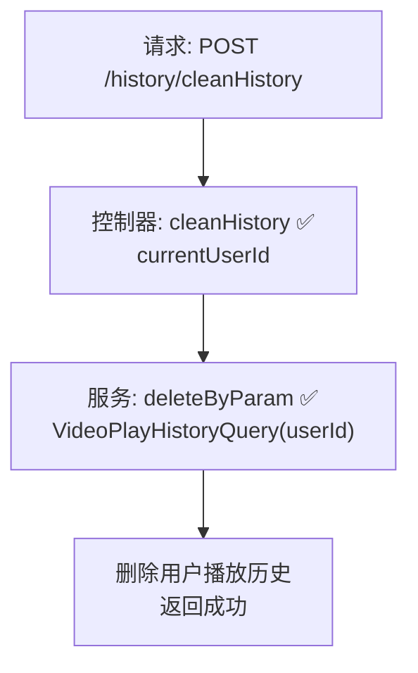

# 视频播放历史清空流程设计文档

> 基于 easylive-java 用户中心需求，按照 DDD 事件驱动模式设计

## 📋 业务需求概述
登录用户在“观看历史”页面点击“清空”，系统需删除该用户全部播放历史记录（含分 P 索引等扩展字段），并确保数据同步刷新（未读提示、缓存等）。

---

## 📊 完整流程图

### ASCII 流程图
```
┌──────────────────────────────────────────────────────────┐
│ 请求：POST /history/cleanHistory                          │
│ Payload: { }                                              │
└────────────────────────────┬─────────────────────────────┘
                             ↓
┌──────────────────────────────────────────────────────────┐
│ 控制器：VideoPlayHistoryController#cleanHistory ✅          │
│ 1. Token → currentUserId                                  │
│ 2. 构造 VideoPlayHistoryQuery(userId)                     │
│ 3. 调用 videoPlayHistoryService.deleteByParam             │
└────────────────────────────┬─────────────────────────────┘
                             ↓
┌──────────────────────────────────────────────────────────┐
│ 服务：VideoPlayHistoryServiceImpl#deleteByParam ✅         │
│ 1. 校验查询条件非空                                       │
│ 2. Mapper deleteByParam → 删除 `video_play_history` 记录   │
│ 3. 无缓存/索引同步                                         │
└──────────────────────────────────────────────────────────┘
```

### 场景
1. **正常清空**：删除当前用户全部历史记录，返回成功。
2. **越权操作**：无 seriesId 等参数→ 按 userId 限制，仅删除本人记录。
3. **数据为空**：deleteByParam 返回 0，接口仍返回成功（幂等）。

### Mermaid 流程图


---

## 📦 设计元素清单

### ✅ 已存在的设计
- 控制器：`VideoPlayHistoryController#cleanHistory`（`easylive-java/.../VideoPlayHistoryController.java:50`）
- 服务：`VideoPlayHistoryServiceImpl#deleteByParam`（`easylive-java/.../VideoPlayHistoryServiceImpl.java:124`）
- Mapper：`VideoPlayHistoryMapper.deleteByParam` 删除匹配记录

### ❌ DDD 需补充的能力

| 类型 | 缺失项 | 描述 | 建议位置 | 优先级 |
|------|--------|------|----------|-------|
| 命令 | `ClearVideoPlayHistoryCmd` | 统一处理清空逻辑、校验身份 | `design/aggregate/video_play_history/_gen.json` | P0 |
| 验证器 | `@AuthenticatedUser` | 保证命令层使用的 userId 为当前用户或授权用户 | `only-danmuku-application/.../validator/` | P0 |
| 事件 | `VideoPlayHistoryClearedDomainEvent` | 清空后触发缓存刷新、通知客户端 | `design/aggregate/video_play_history/_gen.json` | P1 |
| 事件处理器 | `VideoPlayHistoryClearedEventHandler` | 刷新前端缓存、推送 WebSocket | `only-danmuku-adapter/.../events/VideoPlayHistoryClearedEventHandler.kt` | P1 |
| 命令 | `BatchDeleteVideoPlayHistoryCmd` | 后台批量删除（可按日期、videoId） | `design/extra/video_history_gen.json` | P2 |

---

## 🔑 关键业务规则
- **身份校验**：只能删除当前账号的历史记录；管理员清空需走后台路径。
- **数据范围**：删除所有 `video_play_history` 表中匹配 userId 的记录；若后续扩展分表/缓存需同步清理。
- **幂等性**：重复执行清空操作应安全。
- **通知刷新**：前端列表/未读提示需实时刷新，建议通过事件驱动刷新缓存或推送通知。
- **扩展能力**：可考虑提供按日期、按视频的批量删除命令。

---

## 🧾 控制器与命令示例
```java
@RequestMapping("/cleanHistory")
@GlobalInterceptor(checkLogin = true)
public ResponseVO cleanHistory() {
    TokenUserInfoDto tokenUserInfoDto = getTokenUserInfoDto();
    VideoPlayHistoryQuery historyQuery = new VideoPlayHistoryQuery();
    historyQuery.setUserId(tokenUserInfoDto.getUserId());
    videoPlayHistoryService.deleteByParam(historyQuery);
    return getSuccessResponseVO(null);
}
```
> 参考：`easylive-java/easylive-web/src/main/java/com/easylive/web/controller/VideoPlayHistoryController.java:50`

```kotlin
// DDD 命令建议
object ClearVideoPlayHistoryCmd {
    data class Request(val userId: Long) : RequestParam<Response>
    class Response
    @Service
    class Handler : Command<Request, Response> {
        override fun exec(request: Request): Response {
            Mediator.repositories.remove(
                SVideoPlayHistory.predicate { schema -> schema.userId eq request.userId }
            )
            Mediator.uow.save()
            return Response()
        }
    }
}
```

---

## 📂 传统架构参考
- 控制器：`easylive-java/easylive-web/src/main/java/com/easylive/web/controller/VideoPlayHistoryController.java:50`
- 服务实现：`easylive-java/easylive-common/src/main/java/com/easylive/service/impl/VideoPlayHistoryServiceImpl.java:124`

---

**文档版本**：v1.0  
**创建时间**：2025-10-22  
**维护者**：开发团队
