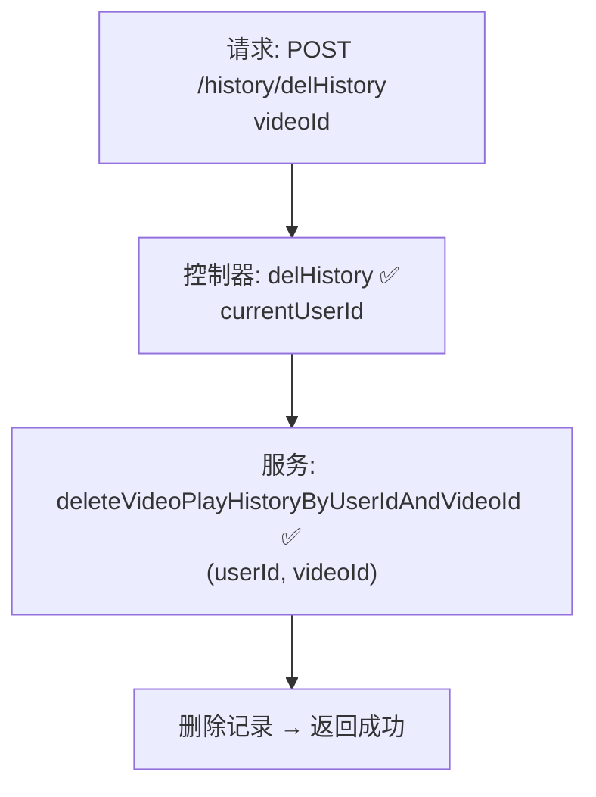

# 视频播放历史单条删除流程设计文档

> 基于 easylive-java 用户中心需求，按照 DDD 事件驱动模式设计

## 📋 业务需求概述
登录用户在“观看历史”列表中删除某条历史记录，系统需校验记录归属，仅删除该用户指定视频的观看历史（可区分分 P），并同步刷新前端列表/统计。

---

## 📊 完整流程图

### ASCII 流程图
```
┌──────────────────────────────────────────────────────────┐
│ 请求：POST /history/delHistory                            │
│ Payload: { "videoId": "V20241021001" }                    │
└────────────────────────────┬─────────────────────────────┘
                             ↓
┌──────────────────────────────────────────────────────────┐
│ 控制器：VideoPlayHistoryController#delHistory ✅            │
│ 1. Token → currentUserId                                  │
│ 2. videoPlayHistoryService.deleteVideoPlayHistoryByUserIdAndVideoId(userId, videoId) │
└────────────────────────────┬─────────────────────────────┘
                             ↓
┌──────────────────────────────────────────────────────────┐
│ 服务：VideoPlayHistoryServiceImpl#deleteVideoPlayHistoryByUserIdAndVideoId ✅ │
│ 1. Mapper deleteByUserIdAndVideoId → 删除匹配记录          │
│ 2. 未返回影响行数，无缓存/索引同步                        │
└──────────────────────────────────────────────────────────┘
```

### 场景
1. **正常删除**：记录属于当前用户 → 删除成功。
2. **越权/不存在**：记录不存在或不属于当前用户 → 删除操作无效但不报错（传统实现）。
3. **多分 P**：若同视频有多个分 P 历史记录，传统实现一次删除所有；需明确业务期望。

### Mermaid 流程图


---

## 📦 设计元素清单

### ✅ 已存在的设计
- 控制器：`VideoPlayHistoryController#delHistory`（`easylive-java/.../VideoPlayHistoryController.java:68`）
- 服务：`VideoPlayHistoryServiceImpl#deleteVideoPlayHistoryByUserIdAndVideoId`（`easylive-java/.../VideoPlayHistoryServiceImpl.java:154`）
- Mapper：`VideoPlayHistoryMapper.deleteByUserIdAndVideoId`

### ❌ DDD 需补充的能力

| 类型 | 缺失项 | 描述 | 建议位置 | 优先级 |
|------|--------|------|----------|-------|
| 命令 | `RemoveVideoPlayHistoryCmd` | 删除单条历史记录，支持 videoId/fileIndex | `design/aggregate/video_play_history/_gen.json` | P0 |
| 验证器 | `@HistoryOwnership` | 校验播放历史归属，防止越权删除 | `only-danmuku-application/.../validator/` | P0 |
| 查询 | `GetVideoPlayHistoryByUserAndVideoQry` | 返回需要删除的历史记录，含分 P 信息 | 同上 | P0 |
| 事件 | `VideoPlayHistoryDeletedDomainEvent` | 删除后通知刷新列表/统计 | `design/aggregate/video_play_history/_gen.json` | P1 |
| 事件处理器 | `VideoPlayHistoryDeletedEventHandler` | 刷新缓存、推送客户端更新 | `only-danmuku-adapter/.../events/VideoPlayHistoryDeletedEventHandler.kt` | P1 |

---

## 🔑 关键业务规则
- **归属校验**：只能删除当前用户的历史记录；命令层需校验 `userId`。
- **分 P 处理**：若历史记录以 `videoId + fileIndex` 区分，应支持删除单个分 P；传统实现按视频删除。
- **幂等性**：重复删除同一记录应返回成功，无副作用。
- **同步刷新**：前端列表与“最近观看”缓存需更新；可通过事件驱动实现。
- **扩展能力**：可提供批量删除（多视频、多分 P）的命令。

---

## 🧾 控制器与命令示例
```java
@RequestMapping("/delHistory")
@GlobalInterceptor(checkLogin = true)
public ResponseVO delHistory(@NotEmpty String videoId) {
    TokenUserInfoDto tokenUserInfoDto = getTokenUserInfoDto();
    videoPlayHistoryService.deleteVideoPlayHistoryByUserIdAndVideoId(tokenUserInfoDto.getUserId(), videoId);
    return getSuccessResponseVO(null);
}
```
> 参考：`easylive-java/easylive-web/src/main/java/com/easylive/web/controller/VideoPlayHistoryController.java:68`

```kotlin
// DDD 命令雏形
object RemoveVideoPlayHistoryCmd {
    data class Request(val userId: Long, val videoId: Long, val fileIndex: Int? = null) : RequestParam<Response>
    class Response
    @Service
    class Handler : Command<Request, Response> {
        override fun exec(request: Request): Response {
            Mediator.repositories.remove(
                SVideoPlayHistory.predicate { schema ->
                    schema.all(
                        schema.userId eq request.userId,
                        schema.videoId eq request.videoId,
                        request.fileIndex?.let { schema.fileIndex eq it } ?: schema.alwaysTrue()
                    )
                }
            )
            Mediator.uow.save()
            return Response()
        }
    }
}
```

---

## 📂 传统架构参考
- 控制器：`easylive-java/easylive-web/src/main/java/com/easylive/web/controller/VideoPlayHistoryController.java:68`
- 服务实现：`easylive-java/easylive-common/src/main/java/com/easylive/service/impl/VideoPlayHistoryServiceImpl.java:154`

---

**文档版本**：v1.0  
**创建时间**：2025-10-22  
**维护者**：开发团队
