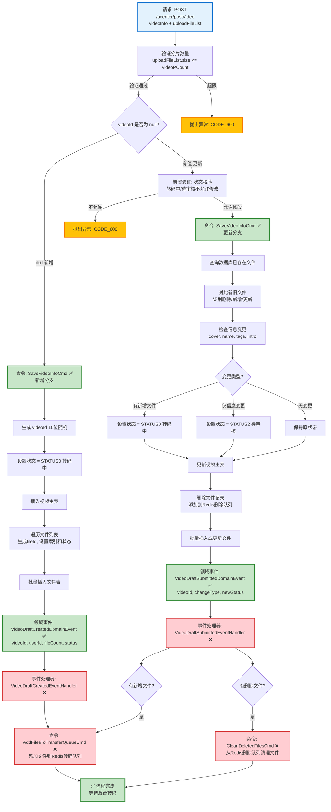

# 视频发布流程设计文档

> 基于 easylive-java 项目需求，按照 DDD 事件驱动模式设计

## 📋 业务需求概述

用户上传视频及分片文件，系统验证分片数量、处理新增/更新逻辑、管理文件状态、触发转码任务、更新视频状态（转码中/待审核），支持文件删除和替换。

---

## 📊 完整流程图

### ASCII 流程图

```
┌─────────────────────────────────────────────────────────────────┐
│ 请求：POST /ucenter/postVideo                                    │
│ Payload:                                                        │
│ {                                                               │
│   "videoId": null | "V123456789",  // null=新增, 有值=更新      │
│   "videoCover": "/cover/xxx.jpg",                               │
│   "videoName": "精彩视频",                                       │
│   "pCategoryId": 1,                // 父分类ID                   │
│   "categoryId": 10,                // 子分类ID                   │
│   "postType": 0,                   // 0=自制, 1=转载             │
│   "tags": "科技,教程,编程",                                      │
│   "introduction": "视频简介...",                                 │
│   "interaction": "01",             // 互动设置: 0=评论关闭,1=弹幕关闭 │
│   "uploadFileList": "[{\"uploadId\":\"xxx\",\"fileName\":\"P1.mp4\",...}]" │
│ }                                                               │
└────────────────────────────┬────────────────────────────────────┘
                             ↓
┌─────────────────────────────────────────────────────────────────┐
│ 前置验证：分片数量校验                                            │
│                                                                 │
│ 处理逻辑：                                                       │
│   1. 从系统配置获取最大分片数 videoPCount (默认100)              │
│   2. 校验 uploadFileList.size() <= videoPCount                  │
│   3. 如果超限 → 抛出异常 CODE_600                                │
└────────────────────────────┬────────────────────────────────────┘
                             ↓
                    ┌────────┴────────┐
                    │ videoId?        │
                    └────┬───────┬────┘
                         ↓       ↓
              null (新增视频)     有值 (更新视频)
                         ↓                  ↓

┌─────────────────────────────────────────────────────────────────┐
│ 分支 #1: 新增视频                                                │
└─────────────────────────────────────────────────────────────────┘
┌─────────────────────────────────────────────────────────────────┐
│ 命令：SaveVideoInfoCmd                                           │
│ 状态：✅ 已定义 (design/aggregate/video_draft/_gen.json:20)     │
│                                                                 │
│ 命令参数：                                                       │
│   - videoInfo: VideoInfoPost (基本信息)                          │
│   - uploadFileList: List<VideoInfoFilePost> (分片列表)          │
│                                                                 │
│ 处理逻辑（新增）：                                               │
│   1. 生成 videoId (10位随机字符串)                               │
│   2. 设置创建时间和最后更新时间                                   │
│   3. 设置初始状态 = STATUS0 (转码中)                             │
│   4. 插入视频主表记录                                            │
│   5. 遍历文件列表:                                               │
│      - 生成 fileId (20位随机字符串)                              │
│      - 设置 fileIndex (1, 2, 3...)                              │
│      - 设置 updateType = UPDATE (有更新)                        │
│      - 设置 transferResult = TRANSFER (转码中)                  │
│   6. 批量插入文件表记录                                          │
│   7. 将新文件添加到 Redis 转码队列                               │
│   8. Mediator.uow.save()                                        │
└────────────────────────────┬────────────────────────────────────┘
                             ↓
┌─────────────────────────────────────────────────────────────────┐
│ 领域事件：VideoDraftCreatedDomainEvent                           │
│ 状态：✅ 已定义 (design/aggregate/video_draft/_gen.json:42)     │
│                                                                 │
│ 事件载荷：                                                       │
│ {                                                               │
│   "videoId": "V123456789",                                      │
│   "userId": "U001",                                             │
│   "videoName": "精彩视频",                                       │
│   "fileCount": 3,           // 分片数量                          │
│   "status": 0,              // STATUS0: 转码中                  │
│   "createTime": 1729267200                                      │
│ }                                                               │
└────────────────────────────┬────────────────────────────────────┘
                             ↓
┌─────────────────────────────────────────────────────────────────┐
│ 事件处理器：VideoDraftCreatedEventHandler ❌                     │
│ 监听事件：VideoDraftCreatedDomainEvent                           │
│ 触发命令：                                                       │
│   1. AddFilesToTransferQueueCmd ❌ (添加文件到转码队列)          │
│ 实现路径：adapter/.../events/VideoDraftCreatedEventHandler.kt  │
└────────────────────────────┬────────────────────────────────────┘
                             ↓
┌─────────────────────────────────────────────────────────────────┐
│ 命令：AddFilesToTransferQueueCmd ❌                              │
│ 状态：缺失 (需新增到 design/extra/video_transfer_gen.json)      │
│                                                                 │
│ 命令参数：                                                       │
│   - fileList: List<VideoInfoFilePost>                          │
│                                                                 │
│ 处理逻辑：                                                       │
│   1. 遍历文件列表                                                │
│   2. 将每个文件添加到 Redis 队列                                 │
│      - KEY: file_transfer_queue                                │
│      - VALUE: {userId, videoId, uploadId, fileId, filePath}    │
│   3. 无需保存到数据库                                            │
└─────────────────────────────────────────────────────────────────┘
                             ↓
                      ✅ 新增流程完成

┌─────────────────────────────────────────────────────────────────┐
│ 分支 #2: 更新视频                                                │
└─────────────────────────────────────────────────────────────────┘
┌─────────────────────────────────────────────────────────────────┐
│ 前置验证：状态校验                                                │
│                                                                 │
│ 处理逻辑：                                                       │
│   1. 查询数据库中的视频信息                                       │
│   2. 如果不存在 → 抛出异常 CODE_600                              │
│   3. 检查视频状态:                                               │
│      - STATUS0 (转码中) → 不允许修改 ❌                          │
│      - STATUS1 (转码失败) → 允许修改 ✅                          │
│      - STATUS2 (待审核) → 不允许修改 ❌                          │
│      - STATUS3 (审核通过) → 允许修改 ✅                          │
│      - STATUS4 (审核拒绝) → 允许修改 ✅                          │
│   4. 如果状态不允许 → 抛出异常 CODE_600                          │
└────────────────────────────┬────────────────────────────────────┘
                             ↓
┌─────────────────────────────────────────────────────────────────┐
│ 命令：SaveVideoInfoCmd (更新分支)                                │
│                                                                 │
│ 处理逻辑（更新）：                                               │
│   1. 查询数据库中已存在的文件列表                                 │
│   2. 对比新旧文件列表:                                           │
│      - 识别删除的文件 (旧文件 NOT IN 新文件)                      │
│      - 识别新增的文件 (fileId == null)                          │
│      - 识别更新的文件 (fileId != null)                          │
│   3. 检查是否有文件名变更                                        │
│   4. 检查视频基本信息是否变更:                                   │
│      - videoCover, videoName, tags, introduction               │
│   5. 决定新状态:                                                │
│      - 有新增文件 → STATUS0 (转码中)                             │
│      - 仅信息或文件名变更 → STATUS2 (待审核)                     │
│      - 无变更 → 保持原状态                                       │
│   6. 更新视频主表                                                │
│   7. 删除需要删除的文件记录                                       │
│   8. 将删除文件路径添加到 Redis 删除队列                         │
│   9. 批量插入或更新文件记录                                       │
│   10. 将新增文件添加到 Redis 转码队列                            │
│   11. Mediator.uow.save()                                       │
└────────────────────────────┬────────────────────────────────────┘
                             ↓
┌─────────────────────────────────────────────────────────────────┐
│ 领域事件：VideoDraftSubmittedDomainEvent                         │
│ 状态：✅ 已定义 (design/aggregate/video_draft/_gen.json:52)     │
│                                                                 │
│ 事件载荷：                                                       │
│ {                                                               │
│   "videoId": "V123456789",                                      │
│   "userId": "U001",                                             │
│   "changeType": "NEW_FILES" | "INFO_CHANGE" | "NO_CHANGE",     │
│   "newStatus": 0 | 2,       // 0=转码中, 2=待审核               │
│   "updateTime": 1729267200                                      │
│ }                                                               │
└────────────────────────────┬────────────────────────────────────┘
                             ↓
┌─────────────────────────────────────────────────────────────────┐
│ 事件处理器：VideoDraftSubmittedEventHandler ❌                   │
│ 监听事件：VideoDraftSubmittedDomainEvent                         │
│ 触发命令：                                                       │
│   1. AddFilesToTransferQueueCmd ❌ (如果有新文件)                │
│   2. CleanDeletedFilesCmd ❌ (如果有删除文件)                    │
│ 实现路径：adapter/.../events/VideoDraftSubmittedEventHandler.kt│
└────────────────────────────┬────────────────────────────────────┘
                             ↓
                      ✅ 更新流程完成
```

---

### Mermaid 可视化流程图



**图例说明**：
- 🔵 蓝色：请求入口
- 🟢 绿色：已存在的设计（✅ 可直接使用）
- 🔴 红色：缺失的设计（❌ 需实现）
- 🟡 黄色：异常分支

---

## 📦 设计元素清单

### ✅ 已存在的设计

#### 命令 (Commands)

| 命令 | 描述 | 状态 | 位置 |
|------|------|------|------|
| `SaveVideoInfoCmd` | 保存视频信息和文件 | ✅ 已定义 | `design/aggregate/video_draft/_gen.json:20` |
| `UpdateVideoDraftCmd` | 更新视频草稿 | ✅ 已定义 | `design/aggregate/video_draft/_gen.json:10` |

#### 领域事件 (Domain Events)

| 事件 | 描述 | 触发时机 | 状态 | 位置 |
|------|------|----------|------|------|
| `VideoDraftCreatedDomainEvent` | 视频草稿已创建 | 新增视频后 | ✅ 已定义 | `design/aggregate/video_draft/_gen.json:42` |
| `VideoDraftSubmittedDomainEvent` | 视频草稿已提交审核 | 更新视频后 | ✅ 已定义 | `design/aggregate/video_draft/_gen.json:52` |

---

### ❌ 缺失的设计清单

#### 需要补充的命令

| 序号 | 命令名称 | 描述 | 建议位置 | 优先级 |
|-----|---------|------|----------|-------|
| 1 | `AddFilesToTransferQueueCmd` | 添加文件到转码队列 | `design/extra/video_transfer_gen.json` | P0 |
| 2 | `CleanDeletedFilesCmd` | 清理删除的文件 | `design/extra/file_cleanup_gen.json` | P0 |

**JSON 定义**（需新增到 `design/extra/video_transfer_gen.json`）：
```json
{
  "cmd": [
    {
      "package": "video_draft",
      "name": "AddFilesToTransferQueue",
      "desc": "添加文件到转码队列"
    }
  ]
}
```

**JSON 定义**（复用 `design/extra/file_cleanup_gen.json`）：
```json
{
  "cmd": [
    {
      "package": "video_draft",
      "name": "CleanDeletedFiles",
      "desc": "清理删除的文件"
    }
  ]
}
```

#### 需要补充的领域事件

| 序号 | 事件名称 | 描述 | 触发时机 | 建议位置 | 优先级 |
|-----|---------|------|----------|----------|-------|
| 1 | `FilesAddedToTransferQueueDomainEvent` | 文件已添加到转码队列 | 文件加入队列后 | `design/extra/video_transfer_gen.json` | P2 |

#### 需要补充的验证器

| 序号 | 验证器名称 | 描述 | 依赖查询 | 实现路径 | 优先级 |
|-----|-----------|------|----------|----------|-------|
| 1 | `@MaxVideoFileCount` | 验证分片数量不超限 | `GetSystemSettingQry` | `application/.../validater/MaxVideoFileCount.kt` | P0 |
| 2 | `@VideoEditableStatus` | 验证视频状态可编辑 | `GetVideoDraftInfoQry` | `application/.../validater/VideoEditableStatus.kt` | P0 |

#### 需要补充的事件处理器

| 序号 | 处理器名称 | 监听事件 | 触发命令 | 实现路径 | 优先级 |
|-----|-----------|----------|----------|----------|-------|
| 1 | `VideoDraftCreatedEventHandler` | `VideoDraftCreatedDomainEvent` | `AddFilesToTransferQueueCmd` | `adapter/.../events/VideoDraftCreatedEventHandler.kt` | P0 |
| 2 | `VideoDraftSubmittedEventHandler` | `VideoDraftSubmittedDomainEvent` | `AddFilesToTransferQueueCmd`<br/>`CleanDeletedFilesCmd` | `adapter/.../events/VideoDraftSubmittedEventHandler.kt` | P0 |

**优先级说明**：
- **P0**：核心功能，必须实现
- **P1**：重要功能，建议实现
- **P2**：可选功能，后续扩展

---

## 🔑 关键业务规则

### 1. 分片数量校验
- **校验时机**：保存视频信息前
- **最大分片数**：从系统配置获取 `videoPCount`（默认100）
- **校验逻辑**（行262-264）：
```java
if (uploadFileList.size() > redisComponent.getSysSettingDto().getVideoPCount()) {
    throw new BusinessException(ResponseCodeEnum.CODE_600);
}
```

### 2. 视频状态可编辑性校验

**允许编辑的状态**：
- ✅ `STATUS1` (转码失败) - 可重新上传
- ✅ `STATUS3` (审核通过) - 可修改已发布视频
- ✅ `STATUS4` (审核拒绝) - 可修改后重新提交

**不允许编辑的状态**：
- ❌ `STATUS0` (转码中) - 避免并发冲突
- ❌ `STATUS2` (待审核) - 避免审核期间修改

**easylive-java 实现**（行274-279）：
```java
if (ArrayUtils.contains(new Integer[]{
        VideoStatusEnum.STATUS0.getStatus(),  // 转码中
        VideoStatusEnum.STATUS2.getStatus()   // 待审核
    }, videoInfoPostDb.getStatus())) {
    throw new BusinessException(ResponseCodeEnum.CODE_600);
}
```

### 3. 新增 vs 更新判断逻辑

**判断依据**：`videoId` 是否为空
```kotlin
if (videoId == null) {
    // 新增逻辑
} else {
    // 更新逻辑
}
```

### 4. 文件对比算法（更新时）

**步骤**：
1. 查询数据库已存在文件列表
2. 构建上传文件Map（以 `uploadId` 为键）
3. 遍历数据库文件：
   - 如果不在上传列表 → 标记删除
   - 如果文件名变更 → 标记文件名变更
4. 筛选新增文件（`fileId == null`）

**easylive-java 实现**（行317-345）：
```java
Map<String, VideoInfoFilePost> uploadFileMap = uploadFileList.stream()
    .collect(Collectors.toMap(
        VideoInfoFilePost::getUploadId,
        Function.identity(),
        (data1, data2) -> data2));

Boolean updateFileName = false;
for (VideoInfoFilePost fileInfo : dbInfoFileList) {
    VideoInfoFilePost updateFile = uploadFileMap.get(fileInfo.getUploadId());
    if (updateFile == null) {
        deleteFileList.add(fileInfo);  // 需要删除
    } else {
        if (!updateFile.getFileName().equals(fileInfo.getFileName())) {
            updateFileName = true;  // 文件名变更
        }
    }
}

List<VideoInfoFilePost> addFileList = uploadFileList.stream()
    .filter(item -> item.getFileId() == null)
    .collect(Collectors.toList());
```

### 5. 状态更新规则（更新时）

**规则优先级**（行353-360）：
1. **有新增文件** → `STATUS0` (转码中)
2. **仅信息或文件名变更** → `STATUS2` (待审核)
3. **无变更** → 保持原状态

```java
if (!addFileList.isEmpty()) {
    videoInfoPost.setStatus(VideoStatusEnum.STATUS0.getStatus());
} else if (changeVideoInfo || updateFileName) {
    videoInfoPost.setStatus(VideoStatusEnum.STATUS2.getStatus());
}
```

**信息变更检测**（行444-447）：
```java
if (!videoInfoPost.getVideoCover().equals(dbInfo.getVideoCover()) ||
    !videoInfoPost.getVideoName().equals(dbInfo.getVideoName()) ||
    !videoInfoPost.getTags().equals(dbInfo.getTags()) ||
    !videoInfoPost.getIntroduction().equals(dbInfo.getIntroduction())) {
    return true;
}
```

### 6. 文件索引和ID生成

**新增视频时**（行386-403）：
```java
Integer index = 1;
for (VideoInfoFilePost videoInfoFile : uploadFileList) {
    videoInfoFile.setFileIndex(index++);  // 1, 2, 3...
    videoInfoFile.setVideoId(videoId);
    videoInfoFile.setUserId(videoInfoPost.getUserId());

    if (videoInfoFile.getFileId() == null) {
        // 新文件
        videoInfoFile.setFileId(StringTools.getRandomString(Constants.LENGTH_20));
        videoInfoFile.setUpdateType(VideoFileUpdateTypeEnum.UPDATE.getStatus());
        videoInfoFile.setTransferResult(VideoFileTransferResultEnum.TRANSFER.getStatus());
    }
}
```

### 7. 转码队列管理

**添加到转码队列**（行412-420）：
```java
if (!addFileList.isEmpty()) {
    for (VideoInfoFilePost file : addFileList) {
        file.setUserId(videoInfoPost.getUserId());
        file.setVideoId(videoId);
    }
    redisComponent.addFile2TransferQueue(addFileList);
}
```

**Redis 队列结构**：
- **KEY**: `file_transfer_queue`
- **VALUE**: `{userId, videoId, uploadId, fileId, filePath}`

### 8. 文件删除队列管理

**添加到删除队列**（行367-383）：
```java
if (!deleteFileList.isEmpty()) {
    List<String> delFileIdList = deleteFileList.stream()
        .map(item -> item.getFileId())
        .collect(Collectors.toList());

    // 删除数据库记录
    this.videoInfoFilePostMapper.deleteBatchByFileId(delFileIdList, videoInfoPost.getUserId());

    // 添加到Redis删除队列
    List<String> delFilePathList = deleteFileList.stream()
        .map(item -> item.getFilePath())
        .collect(Collectors.toList());
    redisComponent.addFile2DelQueue(videoId, delFilePathList);
}
```

---

## 📊 Controller 层实现示例

```kotlin
@RestController
@RequestMapping("/ucenter")
class UCenterVideoPostController {

    @PostMapping("/postVideo")
    @GlobalInterceptor(checkLogin = true)
    fun postVideo(
        @RequestParam videoId: String?,
        @RequestParam @NotEmpty videoCover: String,
        @RequestParam @NotEmpty @Size(max = 100) videoName: String,
        @RequestParam @NotNull pCategoryId: Int,
        @RequestParam categoryId: Int?,
        @RequestParam @NotNull postType: Int,
        @RequestParam @NotEmpty @Size(max = 300) tags: String,
        @RequestParam @Size(max = 2000) introduction: String?,
        @RequestParam @Size(max = 3) interaction: String?,
        @RequestParam @NotEmpty uploadFileList: String
    ): Response {
        val tokenUserInfo = getTokenUserInfoDto()

        // 解析文件列表JSON
        val fileList = JsonUtils.convertJsonArray2List(
            uploadFileList,
            VideoInfoFilePost::class.java
        )

        // 构建视频信息
        val videoInfo = VideoInfoPost(
            videoId = videoId,
            videoName = videoName,
            videoCover = videoCover,
            pCategoryId = pCategoryId,
            categoryId = categoryId,
            postType = postType,
            tags = tags,
            introduction = introduction,
            interaction = interaction,
            userId = tokenUserInfo.userId
        )

        // 调用保存命令
        Mediator.commands.send(
            SaveVideoInfoCmd.Request(
                videoInfo = videoInfo,
                uploadFileList = fileList
            )
        )

        return Response()
    }
}
```

---

## 📌 设计优势

### **事件驱动的视频发布流程**

1. **解耦复杂逻辑**：
   - 视频保存 → 触发事件
   - 事件处理器 → 转码队列、文件清理
   - 各模块职责清晰

2. **灵活的状态管理**：
   - 新增文件 → 转码中
   - 仅信息变更 → 待审核
   - 自动选择合适状态

3. **文件管理策略**：
   - 对比算法识别增删改
   - Redis队列异步处理转码和删除
   - 避免阻塞主流程

4. **可编辑性控制**：
   - 转码中/待审核 → 禁止编辑（避免冲突）
   - 转码失败/审核拒绝 → 允许修改（用户友好）

---

## 🔄 视频状态流转图

```
┌────────────┐
│ 新增视频    │
└──────┬─────┘
       ↓
┌────────────┐     ┌────────────┐
│ STATUS0    │     │ STATUS1    │
│ 转码中      │ --> │ 转码失败    │ ──┐
└──────┬─────┘     └────────────┘   │
       ↓                             ↓
┌────────────┐                 允许重新上传
│ STATUS2    │                       ↓
│ 待审核      │                 (回到 STATUS0)
└──────┬─────┘
       ↓
  ┌────┴────┐
  │ 审核?   │
  └──┬───┬──┘
     ↓   ↓
┌────────────┐ ┌────────────┐
│ STATUS3    │ │ STATUS4    │
│ 审核通过    │ │ 审核拒绝    │
└──────┬─────┘ └──────┬─────┘
       │              │
       ↓              ↓
    允许修改        允许修改
       │              │
       └──────┬───────┘
              ↓
       (回到 STATUS0 或 STATUS2)
```

---

**文档版本**：v1.0
**创建时间**：2025-10-22
**维护者**：开发团队
