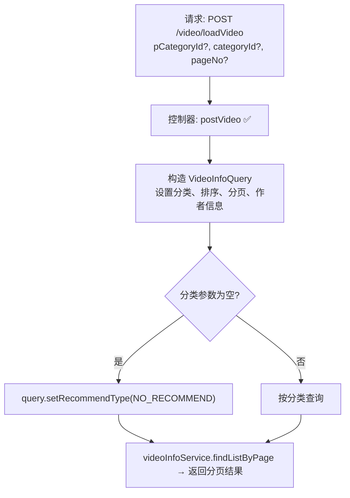

# 公共视频列表加载流程设计文档

> 基于 easylive-java 前台需求，按照 DDD 事件驱动模式设计

## 📋 业务需求概述
前台视频列表页根据父分类、子分类与分页参数加载视频数据。若未指定分类，只展示未推荐的视频。返回内容包含视频基础信息以及作者资料。

---

## 📊 完整流程图

### ASCII 流程图
```
┌──────────────────────────────────────────────────────────┐
│ 请求：POST /video/loadVideo                               │
│ Payload: {                                                │
│   "pCategoryId": null | 1,                                │
│   "categoryId":  null | 101,                              │
│   "pageNo": 1                                            │
│ }                                                         │
└────────────────────────────┬─────────────────────────────┘
                             ↓
┌──────────────────────────────────────────────────────────┐
│ 控制器：VideoController#postVideo ✅                      │
│ 1. 构建 VideoInfoQuery                                    │
│    ├─ setCategoryId / setpCategoryId                      │
│    ├─ setPageNo(pageNo)                                   │
│    ├─ setQueryUserInfo(true)                              │
│    ├─ setOrderBy("create_time desc")                      │
│    └─ 若分类均为空 → setRecommendType(NO_RECOMMEND)       │
│ 2. 调用 videoInfoService.findListByPage(query)            │
│ 3. 返回 PaginationResultVO                                │
└──────────────────────────────────────────────────────────┘
```

### 场景
1. **按子分类筛选**：传入 `categoryId`，只返回该分类视频。
2. **按父分类筛选**：仅传 `pCategoryId`，对应父分类下全部视频。
3. **首页默认列表**：`pCategoryId`、`categoryId` 均为空 → 仅展示未推荐视频。

### Mermaid 流程图


---

## 📦 设计元素清单

### ✅ 已存在的设计
- 控制器：`VideoController#postVideo`（`easylive-java/easylive-web/src/main/java/com/easylive/web/controller/VideoController.java:67`）
- 服务：`VideoInfoService.findListByPage`（分页查询视频 + 作者信息）
- 查询条件：
  - `VideoInfoQuery.setQueryUserInfo(true)` 返回作者数据
  - 分类条件与推荐类型控制

### ❌ DDD 需补充的能力

| 类型 | 缺失项 | 描述 | 建议位置 | 优先级 |
|------|--------|------|----------|-------|
| 查询 | `SearchVideosQry` 扩展 | 支持父分类/子分类筛选、推荐类型过滤 | `design/aggregate/video/_gen.json` | P0 |
| DTO | `VideoListItem` | 返回视频 + 作者信息（分页） | `only-danmuku-application/src/main/dto` | P0 |
| 验证器 | `@CategoryExists` | 校验分类是否存在（可选） | `only-danmuku-application/.../validator/` | P1 |
| 缓存策略 | 视频列表缓存/热点数据 | 结合 `RedisComponent` 优化首页加载 | `design/extra/video_cache_gen.json` | P2 |

---

## 🔑 关键业务规则
- **推荐过滤**：未选择分类时，仅展示未推荐视频；避免推荐列表与分类列表重复。
- **分页默认值**：若 `pageNo` 为空，服务层默认从第 1 页开始，每页 15 条。
- **作者信息**：需返回视频作者头像、昵称等基础信息以构建前端卡片。
- **排序规则**：按 `create_time desc` 排序，可根据需求扩展排序方式（播放量、热度等）。
- **缓存/索引**：热门分类可结合缓存或 ES 查询优化加载速度。

---

## 🧾 控制器与查询示例
```java
@RequestMapping("/loadVideo")
@GlobalInterceptor
public ResponseVO postVideo(Integer pCategoryId, Integer categoryId, Integer pageNo) {
    VideoInfoQuery videoInfoQuery = new VideoInfoQuery();
    videoInfoQuery.setCategoryId(categoryId);
    videoInfoQuery.setpCategoryId(pCategoryId);
    videoInfoQuery.setPageNo(pageNo);
    videoInfoQuery.setQueryUserInfo(true);
    videoInfoQuery.setOrderBy("create_time desc");
    if (categoryId == null && pCategoryId == null) {
        videoInfoQuery.setRecommendType(VideoRecommendTypeEnum.NO_RECOMMEND.getType());
    }
    PaginationResultVO resultVO = videoInfoService.findListByPage(videoInfoQuery);
    return getSuccessResponseVO(resultVO);
}
```

```kotlin
// DDD 查询建议
Mediator.queries.send(
    SearchVideosQry.Request(
        pCategoryId = request.pCategoryId,
        categoryId = request.categoryId,
        excludeRecommend = request.excludeRecommend,
    ).apply {
        pageNum = request.pageNo ?: 1
        pageSize = request.pageSize ?: 15
    }
)
```

---

## 📂 传统架构参考
- 控制器：`easylive-java/easylive-web/src/main/java/com/easylive/web/controller/VideoController.java:67`
- Service & Mapper：`VideoInfoServiceImpl`、`VideoInfoMapper`
- 推荐枚举：`VideoRecommendTypeEnum`

---

**文档版本**：v1.0  
**创建时间**：2025-10-22  
**维护者**：开发团队
