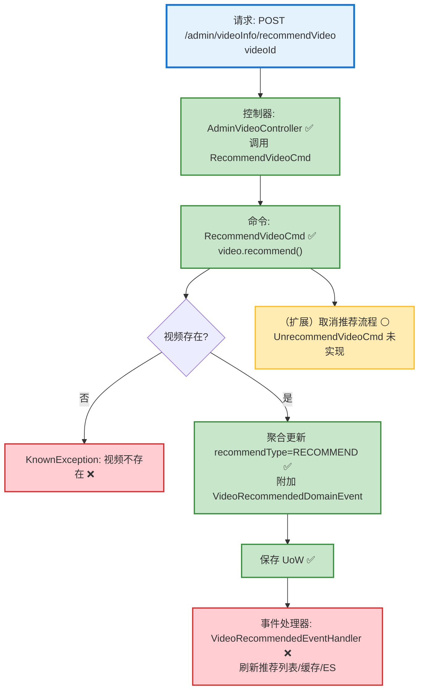

# 视频推荐切换流程设计文档

> 基于 easylive-java 项目需求，按照 DDD 事件驱动模式设计

## 📋 业务需求概述
管理员在后台对视频进行“推荐”或“取消推荐”操作，需确保推荐状态与前台推荐列表同步更新，并在 ES/缓存中反映最新结果。

---

## 📊 完整流程图

### ASCII 流程图
```
┌──────────────────────────────────────────────────────────┐
│ 请求：POST /admin/videoInfo/recommendVideo                │
│ Payload: { "videoId": "1029384756" }                      │
└────────────────────────────┬─────────────────────────────┘
                             ↓
┌──────────────────────────────────────────────────────────┐
│ 控制器：AdminVideoController#adminVideoRecommend ✅        │
│ Mediator.commands.send(RecommendVideoCmd.Request)         │
└────────────────────────────┬─────────────────────────────┘
                             ↓
┌──────────────────────────────────────────────────────────┐
│ 命令：RecommendVideoCmd ✅（仅支持置为推荐）               │
│ 1. 查询视频聚合 SVideo.predicateById                      │
│    └─ 找不到 → KnownException("视频不存在")               │
│ 2. video.recommend()                                      │
│    ├─ recommendType != RECOMMEND → 设置为 RECOMMEND       │
│    └─ 附加 VideoRecommendedDomainEvent ✅                 │
│ 3. Mediator.uow.save()                                    │
│ 4. ✅（缺失）处理：刷新推荐列表缓存/ES、记录推荐操作       │
└──────────────────────────────────────────────────────────┘

┌──────────────────────────────────────────────────────────┐
│ 取消推荐（旧系统支持，DDD 未实现）                        │
│ 命令：UnrecommendVideoCmd ⚪（生成骨架，无逻辑）           │
│ 1. 读取视频聚合 → video.unrecommend()                     │
│ 2. recommendType = NOT_RECOMMEND                          │
│ 3. ✅（缺失）发布事件、刷新推荐列表                        │
└──────────────────────────────────────────────────────────┘
```

### 场景 #1：添加推荐
```
Admin 请求 → RecommendVideoCmd
    ├─ 视频存在
    ├─ recommendType 从 NOT_RECOMMEND → RECOMMEND
    └─ 发布 VideoRecommendedDomainEvent ✅
        → 事件处理器需刷新推荐列表（缺失）
```

### 场景 #2：重复推荐
```
Admin 请求 → RecommendVideoCmd
    ├─ recommendType 已为 RECOMMEND
    └─ 聚合 recommend() 不重复写入，事件不会重复触发（幂等）
```

### 场景 #3：取消推荐
```
旧接口 recommendVideo 具备 toggle 行为（推荐/取消）
DDD 侧缺少 admin API 调用 UnrecommendVideoCmd
    ├─ 需补充控制器/命令逻辑
    └─ 同步刷新推荐列表
```

### Mermaid 流程图


**图例说明**：
- 🔵 蓝色：请求入口
- 🟢 绿色：已存在的设计（✅ 可直接使用）
- 🔴 红色：缺失的设计（❌ 需实现）
- 🟡 黄色：待扩展/可选分支（⚪）

---

## 📦 设计元素清单

### ✅ 已存在的设计

#### 命令 (Commands)
| 命令 | 描述 | 状态 | 位置 |
|------|------|------|------|
| `RecommendVideoCmd` | 将视频标记为推荐，发布事件 | ✅ 已定义 | `only-danmuku/only-danmuku-application/src/main/kotlin/edu/only4/danmuku/application/commands/video/RecommendVideoCmd.kt:18` |
| `UnrecommendVideoCmd` | 取消推荐（骨架，无实现） | ⚪ 待实现 | `only-danmuku/only-danmuku-application/src/main/kotlin/edu/only4/danmuku/application/commands/video/UnrecommendVideoCmd.kt:18` |

#### 领域事件 (Domain Events)
| 事件 | 描述 | 触发时机 | 状态 | 位置 |
|------|------|----------|------|------|
| `VideoRecommendedDomainEvent` | 视频被推荐时触发 | ✅ 已定义 | `only-danmuku/only-danmuku-domain/src/main/kotlin/edu/only4/danmuku/domain/aggregates/video/events/VideoRecommendedDomainEvent.kt:19` |

#### 查询 (Queries)
| 查询 | 描述 | 状态 | 位置 |
|------|------|------|------|
| `GetRecommendVideosQry` | 获取推荐视频列表 | ✅ 已定义 | `only-danmuku/only-danmuku-application/src/main/kotlin/edu/only4/danmuku/application/queries/video/GetRecommendVideosQry.kt:12` |

---

### ❌ 缺失的设计清单

#### 需要补充的命令 (Commands)
| 序号 | 命令名称 | 描述 | 建议位置 | 优先级 |
|-----|---------|------|----------|-------|
| 1 | `UnrecommendVideoCmd` | 根据视频 ID 取消推荐，触发事件 | `design/aggregate/video/_gen.json` | P0 |
| 2 | `RefreshRecommendVideoCacheCmd` | 重建推荐列表缓存/ES | `design/extra/video_recommend_gen.json` | P0 |

#### 需要补充的领域事件 (Domain Events)
| 序号 | 事件名称 | 描述 | 触发时机 | 建议位置 | 优先级 |
|-----|---------|------|----------|----------|-------|
| 1 | `VideoUnrecommendedDomainEvent` | 视频取消推荐 | `design/aggregate/video/_gen.json` | P1 |

#### 需要补充的查询 (Queries)
| 序号 | 查询名称 | 描述 | 返回值 | 建议位置 | 优先级 |
|-----|---------|------|--------|----------|-------|
| 1 | `CountRecommendedVideosQry` | 统计推荐视频数量（用于容量控制） | `Long` | `design/extra/video_recommend_gen.json` | P2 |

#### 需要补充的验证器 (Validators)
| 序号 | 验证器名称 | 描述 | 依赖查询 | 实现路径 | 优先级 |
|-----|-----------|------|----------|----------|-------|
| 1 | `@VideoExists` | 校验视频存在（可与其他命令复用） | `GetVideoInfo` | `only-danmuku-application/.../validator/` | P0 |
| 2 | `@RecommendQuotaAvailable` | 控制推荐视频上线（可选） | `CountRecommendedVideosQry` | `only-danmuku-application/.../validator/` | P2 |

#### 需要补充的事件处理器 (Event Handlers)
| 序号 | 处理器名称 | 监听事件 | 触发命令 | 实现路径 | 优先级 |
|-----|-----------|----------|----------|----------|-------|
| 1 | `VideoRecommendedEventHandler` | `VideoRecommendedDomainEvent` | `RefreshRecommendVideoCacheCmd` | `only-danmuku-adapter/.../events/VideoRecommendedEventHandler.kt` | P0 |
| 2 | `VideoUnrecommendedEventHandler` | `VideoUnrecommendedDomainEvent` | `RefreshRecommendVideoCacheCmd` | `only-danmuku-adapter/.../events/VideoUnrecommendedEventHandler.kt` | P1 |

**优先级说明**：
- **P0**：核心能力，必须补齐（推荐/取消推荐 & 缓存刷新）
- **P1**：重要功能，建议跟进（取消推荐事件）
- **P2**：可选增强（推荐数量限制等）

---

## 🔑 关键业务规则
- **推荐状态取值差异**：传统系统 `recommend_type` 取值 0/1；DDD 枚举 `RecommendType` 使用 1/2 表示未推荐/已推荐，接口需做好转换避免显示错误。
- **推荐列表刷新**：旧实现仅更新数据库，没有自动刷新缓存/ES。DDD 中必须在事件处理器中触发 `RefreshRecommendVideoCacheCmd`，确保前台推荐列表及时更新。
- **取消推荐功能缺失**：原接口使用 toggle 逻辑；DDD 需补齐 `UnrecommendVideoCmd` 并暴露 API，以便管理员移除推荐。
- **推荐配额**：若业务需要限制推荐数量（例如最多 10 条），应新增计数查询与验证器。
- **审计记录**：建议在事件处理器中记录管理员操作日志（操作者、时间、原因），与旧系统行为对齐。

---

## 🛠️ 控制器与命令示例
```kotlin
@PostMapping("/recommendVideo")
fun adminVideoRecommend(@RequestBody @Validated request: AdminVideoRecommend.Request): AdminVideoRecommend.Response {
    Mediator.commands.send(
        RecommendVideoCmd.Request(
            videoId = request.videoId!!.toLong()
        )
    )
    return AdminVideoRecommend.Response()
}
```
> 控制器入口：`only-danmuku/only-danmuku-adapter/src/main/kotlin/edu/only4/danmuku/adapter/portal/api/AdminVideoController.kt:83`

```kotlin
val video = Mediator.repositories.findFirst(
    SVideo.predicateById(request.videoId)
).getOrNull() ?: throw KnownException("视频不存在：${request.videoId}")

video.recommend()
Mediator.uow.save()
// ❌ 缺少：事件处理器刷新推荐列表
```
> 推荐命令实现：`only-danmuku/only-danmuku-application/src/main/kotlin/edu/only4/danmuku/application/commands/video/RecommendVideoCmd.kt:18`

---

## 📂 传统架构参考
- 控制器：`easylive-java/easylive-admin/src/main/java/com/easylive/admin/controller/VideoInfoController.java:44`
- 服务实现：`easylive-java/easylive-common/src/main/java/com/easylive/service/impl/VideoInfoPostServiceImpl.java:726`
- 推荐状态枚举：`easylive-java/easylive-common/src/main/java/com/easylive/entity/enums/VideoRecommendTypeEnum.java:7`
- 查询推荐列表：`easylive-java/easylive-common/src/main/java/com/easylive/service/impl/VideoInfoServiceImpl.java:170`

---

**文档版本**：v1.0  
**创建时间**：2025-10-22  
**维护者**：开发团队

