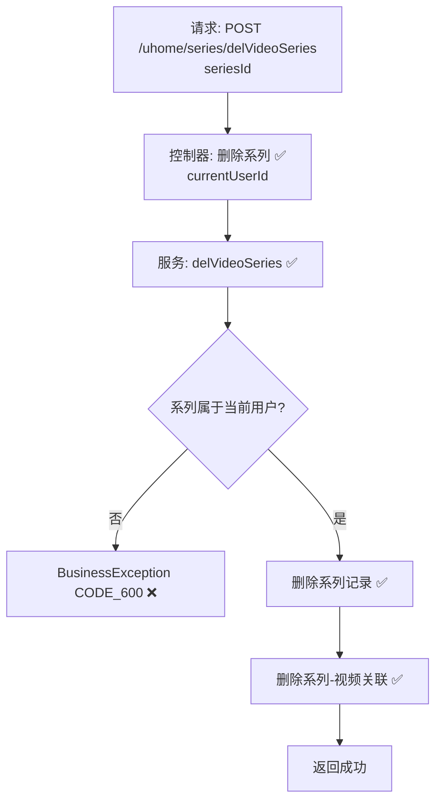

# 视频系列删除流程设计文档（用户侧）  

> 基于 easylive-java 用户中心需求，按照 DDD 事件驱动模式设计

## 📋 业务需求概述
UP 主在个人主页删除某个视频系列（合集），系统需确认系列归属为当前用户，删除系列元数据及系列内的视频关联，并保持数据一致性。

---

## 📊 完整流程图

### ASCII 流程图
```
┌──────────────────────────────────────────────────────────┐
│ 请求：POST /uhome/series/delVideoSeries                   │
│ Payload: { "seriesId": 1001 }                             │
└────────────────────────────┬─────────────────────────────┘
                             ↓
┌──────────────────────────────────────────────────────────┐
│ 控制器：UHomeVideoSeriesController#delVideoSeries ✅       │
│ 1. Token → currentUserId                                  │
│ 2. 调用 userVideoSeriesService.delVideoSeries             │
└────────────────────────────┬─────────────────────────────┘
                             ↓
┌──────────────────────────────────────────────────────────┐
│ 服务：UserVideoSeriesServiceImpl#delVideoSeries ✅         │
│ 1. 构造 UserVideoSeriesQuery(userId, seriesId)            │
│ 2. deleteByParam → 返回 0 表示不存在/无权限               │
│    └─ 抛 BusinessException CODE_600                       │
│ 3. 构造 UserVideoSeriesVideoQuery(seriesId, userId)       │
│ 4. 删除系列-视频关联记录                                  │
│ 5. 事务提交                                               │
└──────────────────────────────────────────────────────────┘
```

### 场景 #1：正常删除
```
系列存在且归属当前用户
    ├─ 删除 user_video_series 记录
    └─ 删除 user_video_series_video 关联
```

### 场景 #2：越权或不存在
```
deleteByParam 返回 0
    └─ 抛 BusinessException CODE_600
```

### Mermaid 流程图


---

## 📦 设计元素清单

### ✅ 已存在的设计

#### 传统实现
- 控制器：`UHomeVideoSeriesController#delVideoSeries`（`easylive-java/.../UHomeVideoSeriesController.java:145`）
- 服务：`UserVideoSeriesServiceImpl#delVideoSeries`，校验系列归属后级联删除关联视频（`easylive-java/.../UserVideoSeriesServiceImpl.java:304`）

#### DDD 实现
- `DeleteCustomerVideoSeriesCmd`：命令骨架存在，需完善归属校验、删除关联视频、事件驱动等（`design/aggregate/customer_video_series/_gen.json`）
- 聚合/命令 `CreateCustomerVideoSeriesCmd`、`UpdateCustomerVideoSeriesVideosCmd` 提供系列维护能力

---

## ❌ 缺失的设计清单

| 类型 | 缺失项 | 描述 | 建议位置 | 优先级 |
|------|--------|------|----------|-------|
| 命令 | `DeleteCustomerVideoSeriesCmd` 完善实现 | 校验归属、删除系列与关联视频、发布事件 | `design/aggregate/customer_video_series/_gen.json` | P0 |
| 验证器 | `@CustomerSeriesOwner` | 校验系列归属关系 | `only-danmuku-application/.../validator/` | P0 |
| 命令 | `RemoveSeriesVideoLinksCmd` | 删除关联视频，可复用于系列删除和单视频删除 | `design/extra/video_series_gen.json` | P0 |
| 事件 | `CustomerVideoSeriesDeletedDomainEvent` | 系列删除后触发缓存/搜索同步 | `design/aggregate/customer_video_series/_gen.json` | P1 |
| 事件处理器 | `CustomerVideoSeriesDeletedEventHandler` | 刷新缓存、通知客户端更新 | `only-danmuku-adapter/.../events/CustomerVideoSeriesDeletedEventHandler.kt` | P1 |
| 查询 | `GetCustomerVideoSeriesInfoQry` 扩展 | 返回系列下视频统计，用于删除前确认 | `design/aggregate/customer_video_series/_gen.json` | P2 |

---

## 🔑 关键业务规则
- **归属校验**：系列只允许由所属用户删除；命令层需明确 `userId`。
- **关联清理**：必须同时删除系列与系列-视频关联，否则会留下孤立数据。
- **幂等性**：重复删除不存在的系列需友好提示，无副作用。
- **缓存同步**：系列删除后需刷新用户主页缓存、搜索索引等；建议通过事件实现。
- **审计记录**：可记录删除原因、操作者，为运营与统计提供依据。

---

## 🧾 控制器与命令示例
```java
// 传统控制器
@RequestMapping("/delVideoSeries")
@GlobalInterceptor(checkLogin = true)
public ResponseVO delVideoSeries(@NotNull Integer seriesId) {
    TokenUserInfoDto tokenUserInfoDto = getTokenUserInfoDto();
    userVideoSeriesService.delVideoSeries(tokenUserInfoDto.getUserId(), seriesId);
    return getSuccessResponseVO(null);
}
```
> 参考：`easylive-java/easylive-web/src/main/java/com/easylive/web/controller/UHomeVideoSeriesController.java:145`

```kotlin
// DDD 控制器（需完善命令实现）
@PostMapping("/delVideoSeries")
fun videoSeriesDel(@RequestBody @Validated request: VideoSeriesDel.Request): VideoSeriesDel.Response {
    val userId = LoginHelper.getUserId()!!
    Mediator.commands.send(
        DeleteCustomerVideoSeriesCmd.Request(
            userId = userId,
            seriesId = request.seriesId.toLong()
        )
    )
    return VideoSeriesDel.Response()
}
```
> 参考：`only-danmuku/only-danmuku-adapter/src/main/kotlin/edu/only4/danmuku/adapter/portal/api/VideoSeriesController.kt:106`

---

## 📂 传统架构参考
- 控制器：`easylive-java/easylive-web/src/main/java/com/easylive/web/controller/UHomeVideoSeriesController.java:145`
- 服务实现：`easylive-java/easylive-common/src/main/java/com/easylive/service/impl/UserVideoSeriesServiceImpl.java:304`

---

**文档版本**：v1.0  
**创建时间**：2025-10-22  
**维护者**：开发团队

