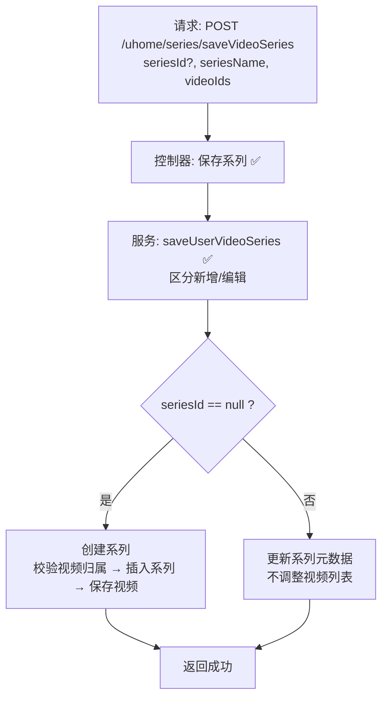

# 视频系列保存流程设计文档（用户侧）  

> 基于 easylive-java 用户中心需求，按照 DDD 事件驱动模式设计

## 📋 业务需求概述
UP 主在个人主页创建或编辑视频系列（合集），可配置系列名称、简介，并绑定自己名下的视频。系统需要校验视频归属、防止重复系列名、维护系列与视频的映射及排序。

---

## 📊 完整流程图

### ASCII 流程图
```
┌──────────────────────────────────────────────────────────┐
│ 请求：POST /uhome/series/saveVideoSeries                  │
│ Payload: {                                                │
│   "seriesId": null | 1001,                                │
│   "seriesName": "我的教学合集",                            │
│   "seriesDescription": "入门到进阶",                       │
│   "videoIds": "2001,2005,2010"                            │
│ }                                                         │
└────────────────────────────┬─────────────────────────────┘
                             ↓
┌──────────────────────────────────────────────────────────┐
│ 控制器：UHomeVideoSeriesController#saveVideoSeries ✅       │
│ 1. Token → currentUserId                                  │
│ 2. 构造 UserVideoSeries（userId, seriesName, ...）        │
│ 3. 调用 userVideoSeriesService.saveUserVideoSeries        │
└────────────────────────────┬─────────────────────────────┘
                             ↓
┌──────────────────────────────────────────────────────────┐
│ 服务：UserVideoSeriesServiceImpl#saveUserVideoSeries ✅    │
│ 1. 当 seriesId == null → 创建：                           │
│    ├─ 必须提供 videoIds（否则 CODE_600）                   │
│    ├─ checkVideoIds：校验所有视频属于当前用户             │
│    ├─ sort = 当前最大 + 1                                 │
│    ├─ 插入 user_video_series                              │
│    └─ saveSeriesVideo：写入 user_video_series_video       │
│ 2. 当 seriesId != null → 编辑：                           │
│    └─ 仅更新名称/描述，不调整视频列表                     │
└──────────────────────────────────────────────────────────┘
```

### 场景 #1：首次创建系列
```
seriesId=null 且 videoIds 非空
    ├─ 校验视频归属
    ├─ 插入系列、设置 sort = max+1
    └─ 批量关联视频（按传入顺序写入 sort）
```

### 场景 #2：编辑系列信息
```
seriesId!=null
    └─ 更新系列名称/简介（未同步更新视频列表）
```

### 场景 #3：创建时未传视频
```
seriesId=null 且 videoIds 为空
    └─ 抛 BusinessException CODE_600
```

### Mermaid 流程图


---

## 📦 设计元素清单

### ✅ 已存在的设计

#### 传统实现
- `UHomeVideoSeriesController#saveVideoSeries`：提交系列元数据与视频列表（`easylive-java/.../UHomeVideoSeriesController.java:59`）
- `UserVideoSeriesServiceImpl#saveUserVideoSeries`：区分新增/编辑、校验视频归属、维护排序（`easylive-java/.../UserVideoSeriesServiceImpl.java:182`）

#### DDD 实现
- `CreateCustomerVideoSeriesCmd`：根据是否带 `seriesId` 实现创建或更新，并支持替换视频列表（`only-danmuku/.../CreateCustomerVideoSeriesCmd.kt:22`）
- `UpdateCustomerVideoSeriesSortCmd`、`UpdateCustomerVideoSeriesVideosCmd`、`DeleteCustomerVideoSeriesCmd`：系列排序、增删视频、删除系列等（`design/aggregate/customer_video_series/_gen.json`）
- `CustomerVideoSeriesFactory`：创建系列聚合时生成 sort、初始化列表
- `SCustomerVideoSeries.replaceVideos(...)`（聚合行为，命令内部调用）

---

## ❌ 缺失的设计清单

| 类型 | 缺失项 | 描述 | 建议位置 | 优先级 |
|------|--------|------|----------|-------|
| 验证器 | `@UserSeriesExists` | 校验 seriesId 属于当前用户（命令层已校验，建议迁移到验证器统一管理） | `only-danmuku-application/.../validator/` | P0 |
| 查询 | `GetUserVideosForSeriesQry` | 根据用户拉取可选视频并排除已加入系列 | `design/extra/video_series_gen.json` | P1 |
| 命令 | `UpdateCustomerVideoSeriesVideosCmd` 的添加/删除标志 | 需落地 `isDelete` 分支，支持局部增删 | `design/aggregate/customer_video_series/_gen.json` | P0 |
| 事件 | `CustomerVideoSeriesUpdatedDomainEvent` | 系列内容变更后触发缓存刷新/搜索同步 | `design/aggregate/customer_video_series/_gen.json` | P1 |
| 事件处理器 | `CustomerVideoSeriesUpdatedEventHandler` | 刷新用户主页缓存、记录审计 | `only-danmuku-adapter/.../events/CustomerVideoSeriesUpdatedEventHandler.kt` | P1 |
| 验证器 | `@VideoOwnership` | 校验视频归属；可复用在新增、批量更新命令 | `only-danmuku-application/.../validator/` | P0 |

**优先级说明**：P0 为保证安全与正确性的必备能力；P1 为增强体验和数据一致性的能力。

---

## 🔑 关键业务规则
- **视频归属校验**：系列内的视频必须属于当前用户。传统实现通过 `checkVideoIds` 拉取视频数量对比。DDD 命令已实现 `ensureVideosBelongToUser`，仍建议抽离为验证器，便于复用及错误提示统一。
- **系列名称唯一**：当前命令会检查同一用户下是否重名；旧实现未做该校验。
- **系列排序上限**：DDD 命令将 sort 限制在 `Byte.MAX_VALUE`，超限时报错。
- **编辑视频列表**：传统系统编辑系列时不会重写视频列表；DDD 命令支持通过 `videoIds` 替换列表，应在 API 中明确区分编辑行为。
- **幂等性**：重复提交同样的视频列表将覆盖为相同顺序；需注意 `replaceVideos` 的实现对排序字段的处理。
- **后续同步**：系列变更可能影响前台缓存/搜索展示，需通过事件驱动补齐。

---

## 🧾 控制器与命令示例
```java
// 传统控制器
@RequestMapping("/saveVideoSeries")
@GlobalInterceptor(checkLogin = true)
public ResponseVO saveVideoSeries(Integer seriesId,
                                  @NotEmpty @Size(max = 100) String seriesName,
                                  @Size(max = 200) String seriesDescription,
                                  String videoIds) {
    TokenUserInfoDto tokenUserInfoDto = getTokenUserInfoDto();
    UserVideoSeries videoSeries = new UserVideoSeries();
    videoSeries.setUserId(tokenUserInfoDto.getUserId());
    videoSeries.setSeriesId(seriesId);
    videoSeries.setSeriesName(seriesName);
    videoSeries.setSeriesDescription(seriesDescription);
    userVideoSeriesService.saveUserVideoSeries(videoSeries, videoIds);
    return getSuccessResponseVO(null);
}
```
> 参考：`easylive-java/easylive-web/src/main/java/com/easylive/web/controller/UHomeVideoSeriesController.java:59`

```kotlin
// DDD 控制器
@PostMapping("/saveVideoSeries")
fun videoSeriesSave(@RequestBody @Validated request: VideoSeriesSave.Request): VideoSeriesSave.Response {
    val userId = LoginHelper.getUserId()!!
    Mediator.commands.send(
        CreateCustomerVideoSeriesCmd.Request(
            userId = userId,
            seriesId = request.seriesId?.toLong(),
            seriesName = request.seriesName,
            seriesDescription = request.seriesDescription,
            videoIds = request.videoIds
        )
    )
    return VideoSeriesSave.Response()
}
```
> 参考：`only-danmuku/only-danmuku-adapter/src/main/kotlin/edu/only4/danmuku/adapter/portal/api/VideoSeriesController.kt:44`

```kotlin
// 命令处理器要点
val duplicated = Mediator.repositories.findFirst(
    SCustomerVideoSeries.predicate { schema ->
        schema.all(
            schema.customerId eq request.userId,
            schema.seriesName eq normalizedName
        )
    },
    persist = false
).getOrNull()
if (duplicated != null && (request.seriesId == null || duplicated.id != request.seriesId)) {
    throw KnownException("系列名称已存在")
}

val targetSeries = if (request.seriesId != null) {
    // 校验归属 → 更新基本信息 → 可选替换视频列表
} else {
    // 创建系列 → 替换视频列表
}
```
> 参考：`only-danmuku/only-danmuku-application/src/main/kotlin/edu/only4/danmuku/application/commands/customer_video_series/CreateCustomerVideoSeriesCmd.kt:24`

---

## 📂 传统架构参考
- 控制器：`easylive-java/easylive-web/src/main/java/com/easylive/web/controller/UHomeVideoSeriesController.java:59`
- 服务实现：`easylive-java/easylive-common/src/main/java/com/easylive/service/impl/UserVideoSeriesServiceImpl.java:182`
- 视频归属校验：同文件 `checkVideoIds`

---

**文档版本**：v1.0  
**创建时间**：2025-10-22  
**维护者**：开发团队

