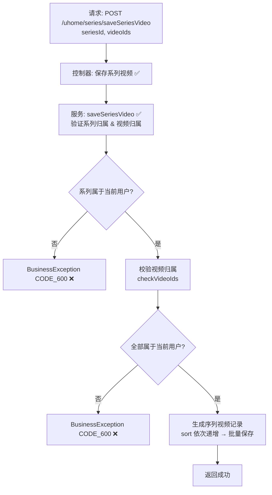

# 视频系列添加视频流程设计文档（用户侧）  

> 基于 easylive-java 用户中心需求，按照 DDD 事件驱动模式设计

## 📋 业务需求概述
已登录的 UP 主向自己的视频系列中批量添加视频，系统需验证系列归属、视频归属以及重复项，并按传入顺序维护系列内的视频排序。

---

## 📊 完整流程图

### ASCII 流程图
```
┌──────────────────────────────────────────────────────────┐
│ 请求：POST /uhome/series/saveSeriesVideo                  │
│ Payload: {                                                │
│   "seriesId": 1001,                                       │
│   "videoIds": "2001,2005,2010"                            │
│ }                                                         │
└────────────────────────────┬─────────────────────────────┘
                             ↓
┌──────────────────────────────────────────────────────────┐
│ 控制器：UHomeVideoSeriesController#saveSeriesVideo ✅       │
│ 1. Token → currentUserId                                  │
│ 2. 调用 userVideoSeriesService.saveSeriesVideo            │
└────────────────────────────┬─────────────────────────────┘
                             ↓
┌──────────────────────────────────────────────────────────┐
│ 服务：UserVideoSeriesServiceImpl#saveSeriesVideo ✅        │
│ 1. 获取系列信息，验证 series.userId == currentUserId      │
│ 2. checkVideoIds(userId, videoIds) → 校验视频归属          │
│ 3. 拆分 videoIds，去重                                     │
│ 4. 查询系列当前最大 sort                                   │
│ 5. 构造 UserVideoSeriesVideo 列表，sort 依次 ++            │
│ 6. insertOrUpdateBatch（追加或更新排序）                  │
└──────────────────────────────────────────────────────────┘
```

### 场景 #1：正常添加
```
series 属于当前用户 & 所有视频均是本人作品
    ├─ 插入 user_video_series_video 记录
    └─ sort 基于当前最大值依次递增
```

### 场景 #2：越权操作
```
series.userId != currentUserId
    └─ 抛 BusinessException CODE_600
```

### 场景 #3：视频不属于当前用户
```
checkVideoIds → videoIds 与查询数量不一致
    └─ 抛 BusinessException CODE_600
```

### Mermaid 流程图


---

## 📦 设计元素清单

### ✅ 已存在的设计

#### 传统实现
- 控制器：`UHomeVideoSeriesController#saveSeriesVideo`（`easylive-java/.../UHomeVideoSeriesController.java:116`）
- 服务：`UserVideoSeriesServiceImpl#saveSeriesVideo`，负责校验系列归属、视频归属、排序（`easylive-java/.../UserVideoSeriesServiceImpl.java:252`）
- 支撑方法：`checkVideoIds(userId, videoIds)` 校验视频是否属于当前用户

#### DDD 实现
- `CreateCustomerVideoSeriesCmd`：新增或编辑系列时可带 `videoIds`，内部完成归属校验与列表替换（`only-danmuku/.../CreateCustomerVideoSeriesCmd.kt:24`）
- `UpdateCustomerVideoSeriesVideosCmd`：设计用于增删系列视频，但当前命令骨架需完善 `isDelete` 分支
- 聚合行为 `CustomerVideoSeries.replaceVideos()`：一次性替换系列内视频（排序逻辑封装于聚合）

---

## ❌ 缺失的设计清单

| 类型 | 缺失项 | 描述 | 建议位置 | 优先级 |
|------|--------|------|----------|-------|
| 命令 | `UpdateCustomerVideoSeriesVideosCmd` 完善添加逻辑 | 支持追加视频，复用聚合行为/专用方法 | `design/aggregate/customer_video_series/_gen.json` | P0 |
| 验证器 | `@CustomerSeriesOwner` | 校验系列归属关系 | `only-danmuku-application/.../validator/` | P0 |
| 验证器 | `@VideoOwnership` | 校验视频归属，可复用于多个命令 | 同上 | P0 |
| 事件 | `CustomerVideoSeriesUpdatedDomainEvent` | 系列结构变更后发布事件 | `design/aggregate/customer_video_series/_gen.json` | P1 |
| 事件处理器 | `CustomerVideoSeriesUpdatedEventHandler` | 刷新缓存、同步前端展示、记录审计 | `only-danmuku-adapter/.../events/CustomerVideoSeriesUpdatedEventHandler.kt` | P1 |
| 查询 | `GetCustomerVideosForSeriesQry` | 查询用户可选视频并排除已加入系列 | `design/extra/video_series_gen.json` | P1 |

---

## 🔑 关键业务规则
- **归属校验**：系列与视频均需属于当前用户，否则拒绝操作。
- **排序维护**：新增视频基于现有 `sort` 最大值递增；聚合实现应保证顺序与请求中视频顺序一致。
- **重复处理**：请求中的重复 videoId 应只添加一次；聚合 `replaceVideos` 会去重。
- **容量限制**：传统实现未限制系列视频总数；DDD 可考虑在命令层增加限制（例如 200 个）。
- **同步刷新**：系列内容变更应触发事件，刷新前台缓存/搜索索引、更新客户端观看列表。
- **幂等性**：重复添加相同视频不会造成异常，应保持统计与排序一致。

---

## 🧾 控制器与命令示例
```java
// 传统控制器
@RequestMapping("/saveSeriesVideo")
@GlobalInterceptor(checkLogin = true)
public ResponseVO saveSeriesVideo(@NotNull Integer seriesId, @NotEmpty String videoIds) {
    TokenUserInfoDto tokenUserInfoDto = getTokenUserInfoDto();
    userVideoSeriesService.saveSeriesVideo(tokenUserInfoDto.getUserId(), seriesId, videoIds);
    return getSuccessResponseVO(null);
}
```
> 参考：`easylive-java/easylive-web/src/main/java/com/easylive/web/controller/UHomeVideoSeriesController.java:116`

```kotlin
// DDD 控制器（待完善 isDelete 参数）
@PostMapping("/saveSeriesVideo")
fun videoSeriesSaveVideo(@RequestBody @Validated request: VideoSeriesSaveVideo.Request): VideoSeriesSaveVideo.Response {
    val userId = LoginHelper.getUserId()!!
    Mediator.commands.send(
        UpdateCustomerVideoSeriesVideosCmd.Request(
            userId = userId,
            seriesId = request.seriesId.toLong(),
            videoIds = request.videoIds,
            isDelete = false
        )
    )
    return VideoSeriesSaveVideo.Response()
}
```
> 参考：`only-danmuku/only-danmuku-adapter/src/main/kotlin/edu/only4/danmuku/adapter/portal/api/VideoSeriesController.kt:86`

```kotlin
// 传统服务校验逻辑
if (!userVideoSeries.getUserId().equals(userId)) {
    throw new BusinessException(ResponseCodeEnum.CODE_600);
}
checkVideoIds(userId, videoIds);
// 计算 sort 并批量插入 user_video_series_video
```
> 参考：`easylive-java/easylive-common/src/main/java/com/easylive/service/impl/UserVideoSeriesServiceImpl.java:252`

```kotlin
// DDD 命令（创建/编辑系列时）
ensureVideosBelongToUser(request.userId, videoIds)
series.replaceVideos(request.userId, videoIds)
Mediator.uow.save()
```
> 参考：`only-danmuku/only-danmuku-application/src/main/kotlin/edu/only4/danmuku/application/commands/customer_video_series/CreateCustomerVideoSeriesCmd.kt:80`

---

## 📂 传统架构参考
- 控制器：`easylive-java/easylive-web/src/main/java/com/easylive/web/controller/UHomeVideoSeriesController.java:116`
- 服务实现：`easylive-java/easylive-common/src/main/java/com/easylive/service/impl/UserVideoSeriesServiceImpl.java:252`
- 视频归属校验：同文件 `checkVideoIds`

---

**文档版本**：v1.0  
**创建时间**：2025-10-22  
**维护者**：开发团队

